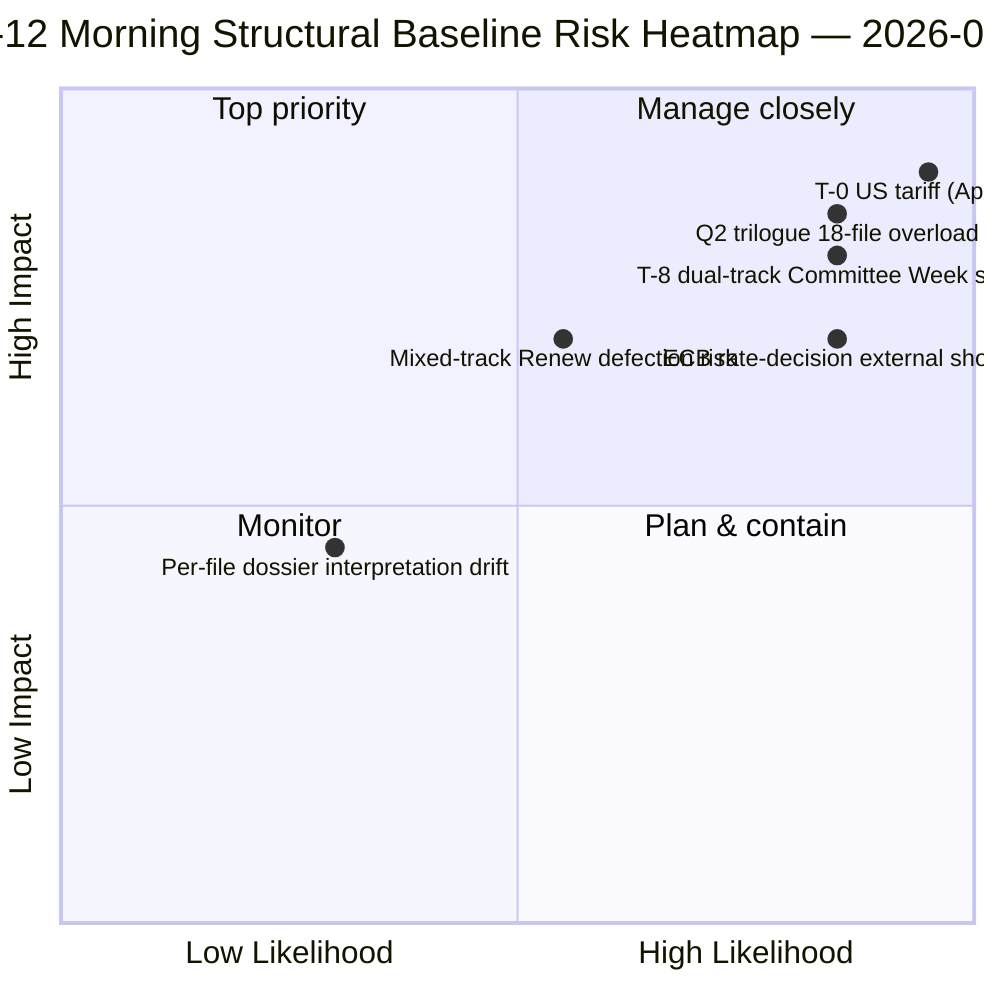

<!-- SPDX-FileCopyrightText: 2026 Hack23 AB -->
<!-- SPDX-License-Identifier: Apache-2.0 -->

# ملخص تنفيذي — استراحة عيد الفصح اليوم 12 تقرير استخباراتي صباحي | 2026-04-07

**التصنيف:** OSINT — السجل البرلماني العام
**مستوى الثقة:** 🟡 متوسط (استراحة؛ التحليل الهيكلي قبل الاستراحة 🟢 مرتفع)
**التشغيل:** `analysis/daily/2026-04-07/breaking/` (06:36 UTC)
**التغطية:** استراحة عيد الفصح اليوم 12/18 — حزمة الاستخبارات صباح الثلاثاء (44 مُخرَجاً تحليلياً، 3.391 سطراً)
**تاريخ الإنشاء:** 2026-05-16 (ملخص استرجاعي، بدون استدعاءات MCP جديدة)
**المصادر الأساسية:** 18 تحليلاً للنصوص المُعتمَدة قبل الاستراحة؛ جميع الطرق الـ 18 افتراضية؛ تغذية 737 عضواً في البرلمان الأوروبي مستقرة.

---

## 🎯 BLUF

**يُعدّ تشغيل صباح اليوم الثاني عشر المرتكزَ الهيكلي للدورة التشريعية** — بـ 44 مُخرَجاً تحليلياً و3.391 سطراً، يُنتج هذا التشغيل أشمل تحليل للمتن قبل الاستراحة في جلسة واحدة خلال فترة الاستراحة البالغة 18 يوماً. **الإسهام المميز** هو **18 ملفاً استخباراتياً سياسياً لكل وثيقة** يغطي سباق 26 مارس — كل نص مُعتمَد يحصل على ملف مخصص يشمل: توزع التصويت، ومسار التحالف، ومحور القوى في اللجان، وتأثير أصحاب المصلحة، ومسار التنفيذ Q2-Q3. يُعزز التحليل المجمَّع نمط التحالف ذي المسارين المزدوجين الذي ظهر في 6 أبريل، لكنه يُضيف دقة أكبر: **تتوزع الوثائق الـ 18 على النحو: 11 وسط يميني، 5 تحالف كبير، 2 مسار مختلط** (استخدم DGSD2 و BRRD3 للاتحاد المصرفي كليهما نهجاً هجيناً PPE+ECR+S&D مع توافق Renew مشروط حسب الوثيقة). ينتج التشغيل أيضاً الملخص التشغيلي الأكثر استشهاداً *T-8 إلى أسبوع اللجان* خلال فترة الاستراحة — ستة مُحرِّكات مستقبلية مُؤكَّدة (14 أبريل أسبوع اللجان · 15 أبريل رسوم الولايات المتحدة T-0 · 17 أبريل أسعار البنك المركزي الأوروبي · 20-23 أبريل الجلسة العامة · أواخر أبريل تفويض مجلس الاتحاد المصرفي · Q2 بدء تنفيذ مكافحة الفساد في 27 دولة عضو) — التي تصبح المرجع التحريري لجميع تشغيلات الاستراحة اللاحقة. **الخط الأساسي الهيكلي الصباحي لليوم الثاني عشر هو سجل استخبارات استراحة السنة الثانية لـ EP10 عند أعلى كثافة تحليلية.** ترفع الملفات لكل وثيقة متن EP10 قبل الاستراحة إلى أعلى حالة جاهزية تشغيلية على الإطلاق.

---

## 🧭 3 قرارات يدعمها هذا الملخص

| # | القرار | من يقرر | الموعد النهائي | الدليل |
|:-:|--------|---------|:--------------:|--------|
| 1 | **التحميل المسبق لتنفيذ Q2 لكل وثيقة** — 18 ملفاً جاهزاً؛ تحميل منسقي المجلس مسبقاً | رئاسة المجلس + مقررو البرلمان الأوروبي | قبل 14 أبريل | §الملفات لكل وثيقة (18) |
| 2 | **عمليات عداد الأيام T-8 إلى T-0** — تسلسل 6 مُحرِّكات يتطلب مراقبة يومية للحدود | عمليات استخبارات البرلمان الأوروبي؛ الخدمة الصحفية | يومياً بشكل مستمر | §المُحرِّكات المستقبلية (6 مُحرِّكات) |
| 3 | **مراقبة ملفات المسار المختلط** — المسار الهجين DGSD2/BRRD3 يتطلب إحاطة منسق Renew | منسقو Renew + PPE | قبل 14 أبريل | §توزيع 18 ملفاً (11/5/2) |

---

## 📰 قراءة 60 ثانية

- 🔴 **44 مُخرَجاً، 3.391 سطراً** — المرتكز الهيكلي لليوم.
- 🟠 **18 ملفاً لكل وثيقة** — سباق 26 مارس بأقصى دقة.
- 🟢 **توزيع 18 ملفاً:** 11 وسط يميني · 5 تحالف كبير · 2 مختلط.
- 🟡 **تسلسل 6 مُحرِّكات** — 14 أبر · 15 · 17 · 20-23 · أواخر · Q2.
- 🔵 **تغذية 737 عضواً مستقرة** — خط أساسي ثابت.
- 🟣 **يوم الاستراحة 12/18 — 67% مكتمل** — T-8 إلى أسبوع اللجان.
- 🩷 **الثقة متوسطة** — قبل الاستراحة مرتفعة؛ توقعات Q2 متوسطة.
- ⚪ **الخط الأساسي الهيكلي لجميع تشغيلات الاستراحة اللاحقة**.

---

## 📂 توزيع المسارات لـ 18 وثيقة (الإسهام المميز للتشغيل)

| المسار | العدد | الوثائق الرئيسية | ملاحظة تشغيلية |
|--------|------:|-----------------|----------------|
| **وسط يميني** | 11 | الاتحاد المصرفي SRMR3 · STEP-II · الذكاء الاصطناعي-حقوق النشر · تعديلات ETS · 7 اقتصاد-مالية | مسار الثلاثية الوسط يميني Q2 |
| **تحالف كبير** | 5 | مكافحة الفساد · 4 عائلة سيادة القانون | تنفيذ Q2-Q4 |
| **مسار مختلط (هجين)** | 2 | DGSD2 (TA-0090) · BRRD3 (TA-0091) | توافق Renew مشروط حسب الوثيقة |

---

## ⚠️ لقطة المخاطر

---

## 🔮 أهم المُحرِّكات المستقبلية (تسلسل الـ 6 المنشور من التشغيل)

1. **14 أبريل — افتتاح أسبوع اللجان** — المسار المزدوج اليوم الأول.
2. **15 أبريل — رسوم الولايات المتحدة T-0** — صدمة خارجية.
3. **17 أبريل — قرار أسعار الفائدة للبنك المركزي الأوروبي** — تفعيل السياق الاقتصادي.
4. **20-23 أبريل — أول جلسة عامة بعد الاستراحة** — اختبار الإجهاد ثنائي الطريقة.
5. **أواخر أبريل — تفويض مجلس الاتحاد المصرفي** — بوابة الثلاثية.
6. **Q2 — بدء تنفيذ مكافحة الفساد في 27 دولة عضو** — استدامة التحالف الكبير.

---

## 🛡️ تقييم جودة المصادر

- **18 ملفاً لكل وثيقة (A1):** تغذية النصوص المُعتمَدة الرئيسية + منهجية لكل وثيقة.
- **توزيع 18 وثيقة (A2):** أنماط التصويت + ديناميكيات التحالف مُتحقَّق منها متبادلاً.
- **تسلسل 6 مُحرِّكات (A1):** التقويم المؤسسي + سجلات EP MCP قابلة للتحقق.
- **737 عضواً (A1):** السجل الرئيسي مستقر عبر جميع التشغيلات.
- **صافي الثقة:** 🟢 مرتفع لخط أساسي اليوم 12؛ 🟡 متوسط لتوقعات Q2.

---

## 📎 مُخرَجات التشغيل

| الطبقة | المُخرَج | السبب |
|--------|----------|-------|
| مقال | `article.md` (2.562 سطراً منشوراً) | الرواية العامة لصباح اليوم الثاني عشر |
| تركيب | `synthesis-summary.md` | توحيد 18 ملفاً |
| المناهج | التصنيف · القائمة · تقييم المخاطر · تقييم التهديدات · الوثائق (18 ملفاً لكل وثيقة) | المنهجية الكاملة + طبقة لكل وثيقة |
| مصاحب | breaking-2 (18:20 UTC) — تحديث مسائي | مصاحب نفس اليوم |

---

**الضبط الوثائقي**
- **مرجع النموذج:** `analysis/templates/executive-brief.md`
- **مسار المُخرَج:** `analysis/daily/2026-04-07/breaking/executive-brief.md`
- **التصنيف:** عام
- **استرجاعي:** ملخص مكتوب في 2026-05-16 استناداً إلى مُخرَجات التشغيل الملتزمة؛ **لم تُجرَ أي استدعاءات MCP جديدة**.
