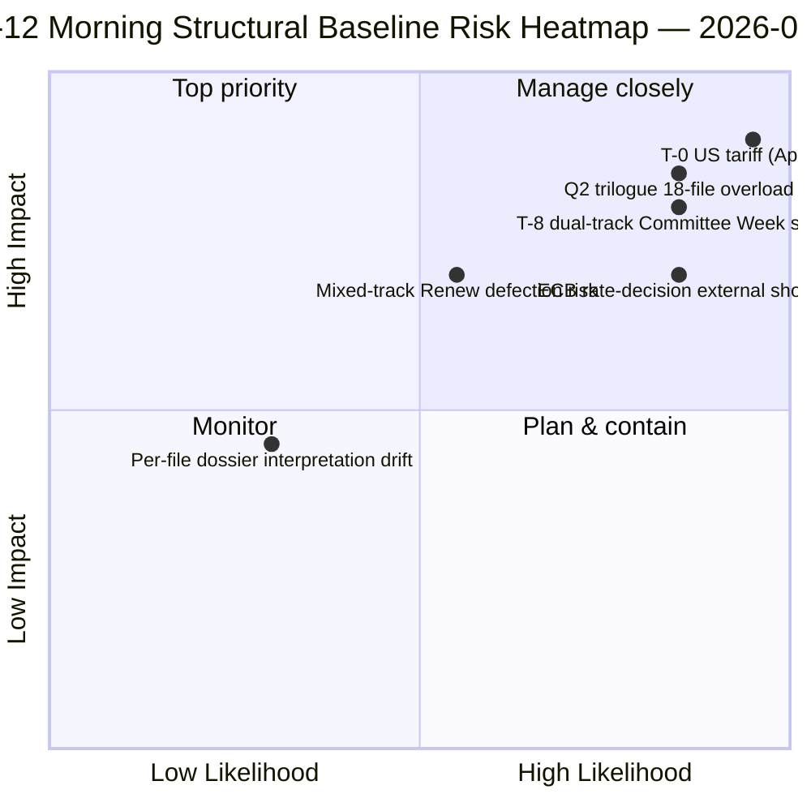

<!-- SPDX-FileCopyrightText: 2026 Hack23 AB -->
<!-- SPDX-License-Identifier: Apache-2.0 -->

# Resumé — Påskeferie Dag 12 Morgenefterretning | 2026-04-07

**Klassificering:** OSINT — Offentlig parlamentarisk protokol
**Konfidens:** 🟡 MEDIUM (ferie; strukturel analyse fra før ferien 🟢 HØJ)
**Kørsel:** `analysis/daily/2026-04-07/breaking/` (06:36 UTC)
**Dækning:** Påskeferie Dag 12/18 — tirsdag morgen efterretningsstabel (44 analyseartifakter, 3.391 linjer)
**Genereret:** 2026-05-16 (retrospektivt resumé, ingen nye MCP-kald)
**Primære kilder:** 18 analyser af vedtagne tekster fra før ferien; alle 18 standardmetoder; 737 MEP-feed stabilt.

---

## 🎯 BLUF

**Dag-12 morgengennembruddet er mandatperiodens strukturelle ankerpunkt** — med 44 analyseartifakter og 3.391 linjer producerer det den mest dækkende enkelt-kørsels analyse af det samlede corpus fra perioden før ferien i løbet af hele 18-dages ferieperioden.** Dets særlige bidrag er **18 per-fil politiske efterretningsdossiers** om spurten den 26. marts — hver vedtaget tekst får et dedikeret dossier, der dækker stemmefordeling, koalitionsspor, udvalgsmagtens fokuspunkt, interessenternes indvirkning og Q2-Q3 implementeringstrajectory. Den samlede analyse bekræfter det dobbelt-spors koalitionsmønster, der kom til syne den 6. april, men tilføjer detaljerigdom: **de 18 filer er fordelt 11 center-højre, 5 storkoalition, 2 blandede spor** (Banking Union DGSD2 og BRRD3 brugte begge hybrid PPE+ECR+S&D med filbetinget Renew-tilpasning). Kørslen producerer også ferieperiodens mest citerede *T-8 til Udvalgsugen* operative opsummering — seks bekræftede fremadrettede triggere (14. april udvalguge · 15. april USA-told T-0 · 17. april ECB-rente · 20-23. april plenum · sent april Banking Union Rådsmandat · Q2 27-MS transponering) — som bliver den redaktionelle reference for alle efterfølgende feriekørsler. **Dag-12 morgenens strukturelle baseline er EP10 År 2-feriens efterretningsrekord på sit højeste analyseniveau.** Per-fil dossiers løfter EP10's corpus fra perioden før ferien til dens mest granulerede operationelle beredskabstilstand.

---

## 🧭 3 Beslutninger dette resumé understøtter

| # | Beslutning | Beslutningstager | Deadline | Dokumentation |
|:-:|------------|------------------|:--------:|---------------|
| 1 | **Per-fil Q2-implementeringsforforberedelse** — 18 dossiers klar; forbered rådskoordinatorer | Rådsformandskabet + EP-ordførere | inden 14. april | §Per-fil dossiers (18) |
| 2 | **T-8 til T-0 dagstæller-ops** — 6-trigger-sekvensen kræver løbende daglig tærskelmonitorering | EP-efterretningsops; pressetjeneste | rullende dagligt | §Fremadrettede triggere (6-trigger) |
| 3 | **Overvågning af blandede sporsfiler** — DGSD2/BRRD3 hybridspor kræver Renew-koordinatorbriefing | Renew + PPE-koordinatorer | inden 14. april | §18-fil opdeling (11/5/2) |

---

## 📰 60-sekunders læsning

- 🔴 **44 artifakter, 3.391 linjer** — dagens strukturelle ankerpunkt.
- 🟠 **18 per-fil dossiers** — 26. marts-spurten i maksimal granularitet.
- 🟢 **18-fil opdeling:** 11 center-højre · 5 storkoalition · 2 blandet.
- 🟡 **6-trigger-sekvens** — 14. apr · 15. · 17. · 20-23. · sent · Q2.
- 🔵 **737 MEP-feed stabilt** — baseline holder.
- 🟣 **Feriedag 12/18 — 67% gennemført** — T-8 til Udvalgsugen.
- 🩷 **Konfidens MEDIUM** — før ferien HØJ; Q2-prognose MEDIUM.
- ⚪ **Strukturel baseline for alle efterfølgende feriekørsler**.

---

## 📂 18-Fil Sporopdeling (kørslens særlige bidrag)

| Spor | Antal | Flagskibsfiler | Operativ note |
|------|------:|----------------|---------------|
| **Center-højre** | 11 | Banking Union SRMR3 · STEP-II · AI-Copyright · ETS-ændringer · 7 økonomi-finans | Q2 trilogue center-højre spor |
| **Storkoalition** | 5 | Anti-Korruption · 4 retsstatsfamilie | Q2-Q4 transponering |
| **Blandet spor (hybrid)** | 2 | DGSD2 (TA-0090) · BRRD3 (TA-0091) | Renew filbetinget tilpasning |

---

## ⚠️ Risikoøjebliksbillede

---

## 🔮 Top fremadrettede triggere (kørslens publicerede 6-sekvens)

1. **14. april — Udvalgsugen åbner** — dobbelt spor Dag 1.
2. **15. april — USA-told T-0** — eksogen chok.
3. **17. april — ECB-rentebeslutning** — aktivering af økonomisk kontekst.
4. **20-23. april — første plenarsamling efter ferien** — bimodal stresstest.
5. **Sent april — Banking Union Rådsmandat** — trilogport.
6. **Q2 — 27-MS Anti-Korruption transponeringsstart** — storkoalitionens holdbarhed.

---

## 🛡️ Kildekvalitatsvurdering

- **18 per-fil dossiers (A1):** primært vedtagne tekster-feed + per-dokument metodologi.
- **18-fil opdeling (A2):** afstemnings-mønstre + koalitionsdynamik krydsverificeret.
- **6-trigger-sekvens (A1):** institutionel kalender + EP MCP-poster verificerbare.
- **737 MEP'er (A1):** primær protokol stabil på tværs af alle kørsler.
- **Nettokonfidens:** 🟢 HØJ for Dag-12-baseline; 🟡 MEDIUM for Q2-prognose.

---

## 📎 Kørslens artifakter

| Lag | Artifakt | Hvorfor |
|-----|----------|---------|
| Artikel | `article.md` (2.562 linjer publiceret) | Offentlig Dag-12 morgenfortælling |
| Syntese | `synthesis-summary.md` | 18-dossiers konsolidering |
| Metoder | klassificering · eksisterende · risikovurdering · trusselvurdering · dokumenter (18 per-fil dossiers) | Fuld metodologi + per-dokumentlag |
| Ledsager | breaking-2 (18:20 UTC) — aftensopdatering | Samedages ledsager |

---

**Dokumentkontrol**
- **Skabelonreference:** `analysis/templates/executive-brief.md`
- **Artifaktsti:** `analysis/daily/2026-04-07/breaking/executive-brief.md`
- **Klassificering:** Offentlig
- **Retrospektiv:** Resumé skrevet 2026-05-16 fra kørslens committede artifakter; **ingen nye MCP-kald blev foretaget**.
