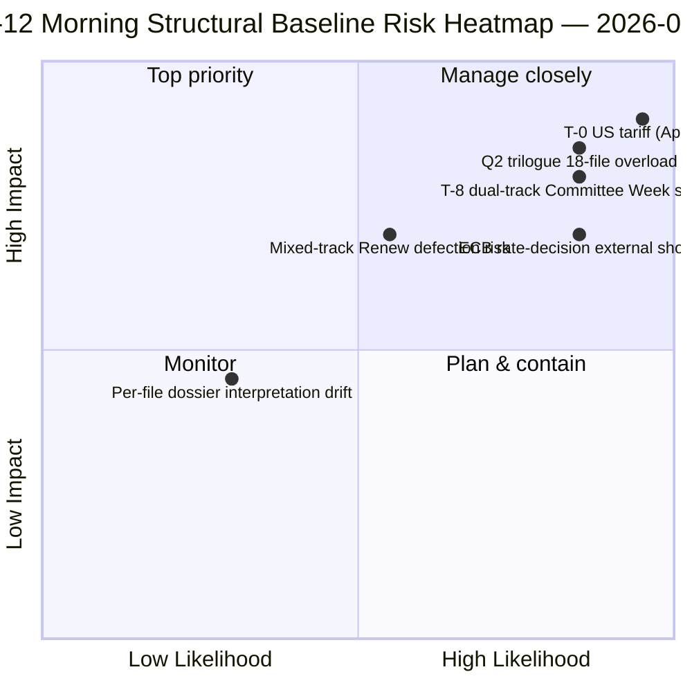

<!-- SPDX-FileCopyrightText: 2026 Hack23 AB -->
<!-- SPDX-License-Identifier: Apache-2.0 -->

# Zusammenfassung — Ostern Pause Tag 12 Morgenintelligenz | 2026-04-07

**Klassifizierung:** OSINT — Öffentliche parlamentarische Aufzeichnung
**Vertrauenswürdigkeit:** 🟡 MEDIUM (Pause; strukturelle Analyse vor der Pause 🟢 HOCH)
**Lauf:** `analysis/daily/2026-04-07/breaking/` (06:36 UTC)
**Abdeckung:** Osterpause Tag 12/18 — Dienstagmorgen Intelligenzstapel (44 Analyseartefakte, 3.391 Zeilen)
**Erstellt:** 2026-05-16 (retrospektive Zusammenfassung, keine neuen MCP-Aufrufe)
**Primärquellen:** 18 Analysen angenommener Texte vor der Pause; alle 18 Standardmethoden; 737 MdEP-Feed stabil.

---

## 🎯 BLUF

**Der Tag-12-Morgenlauf ist der strukturelle Anker der Amtszeit** — mit 44 Analyseartefakten und 3.391 Zeilen produziert er die umfassendste Einzellauf-Vorurlaubskorpusanalyse des gesamten 18-tägigen Urlaubszeitraums.** Sein charakteristischer Beitrag sind **18 pro-Datei politische Nachrichtendossiers** über den Spurt vom 26. März — jeder angenommene Text erhält ein eigenes Dossier, das Stimmendispersion, Koalitionsweg, Ausschusskraftfokus, Stakeholder-Auswirkungen und Q2-Q3-Umsetzungsplanung abdeckt. Die aggregierte Analyse bestätigt das Doppelspur-Koalitionsmuster vom 6. April, fügt aber Granularität hinzu: **die 18 Dateien teilen sich 11 rechtsmittig, 5 Große Koalition, 2 gemischte Spuren** (Banking Union DGSD2 und BRRD3 nutzten beide hybrid PPE+ECR+S&D mit dateibedingter Renew-Ausrichtung). Der Lauf produziert auch die am häufigsten zitierte *T-8 bis Ausschusswoche* operative Zusammenfassung der Urlaubsperiode — sechs bestätigte Vorwärtsauslöser (14. April Ausschusswoche · 15. April US-Zölle T-0 · 17. April EZB-Zinssatz · 20.-23. April Plenarsitzung · Ende April Banking-Union-Ratsmandat · Q2 27-MS-Transpositionsbeginn) — die zum redaktionellen Referenzpunkt für alle nachfolgenden Urlaufsläufe wird. **Die strukturelle Ausgangslage des Tag-12-Morgens ist das Nachrichtenprotokoll der EP10-Jahr-2-Pause auf dem Höhepunkt der analytischen Dichte.** Pro-Datei-Dossiers heben das EP10-Vorurlaubskorpus auf seinen am stärksten granularen operativen Bereitschaftszustand.

---

## 🧭 3 Entscheidungen, die diese Zusammenfassung unterstützt

| # | Entscheidung | Wer entscheidet | Frist | Nachweis |
|:-:|-------------|-----------------|:-----:|----------|
| 1 | **Pro-Datei Q2-Implementierungsvorladen** — 18 Dossiers fertig; Ratskoordinatoren vorladen | Ratspräsidentschaft + EP-Berichterstatter | bis 14. April | §Pro-Datei-Dossiers (18) |
| 2 | **T-8 bis T-0 Tagszähler-Ops** — 6-Auslösersequenz erfordert tägliche Schwellwertüberwachung | EP-Nachrichtenops; Pressedienst | laufend täglich | §Vorwärtsauslöser (6-Auslöser) |
| 3 | **Gemischtspurdateien beobachten** — DGSD2/BRRD3 Hybridspur erfordert Renew-Koordinatorbriefing | Renew + PPE-Koordinatoren | bis 14. April | §18-Dateiaufteilung (11/5/2) |

---

## 📰 60-Sekunden-Lektüre

- 🔴 **44 Artefakte, 3.391 Zeilen** — struktureller Anker des Tages.
- 🟠 **18 pro-Datei-Dossiers** — Spurt vom 26. März in maximaler Granularität.
- 🟢 **18-Dateiaufteilung:** 11 rechtsmittig · 5 Große Koalition · 2 gemischt.
- 🟡 **6-Auslösersequenz** — 14. Apr · 15. · 17. · 20.-23. · Ende · Q2.
- 🔵 **737 MdEP-Feed stabil** — Ausgangslage stabil.
- 🟣 **Urlaubstag 12/18 — 67% abgeschlossen** — T-8 bis Ausschusswoche.
- 🩷 **Vertrauenswürdigkeit MEDIUM** — vor Urlaub HOCH; Q2-Prognose MEDIUM.
- ⚪ **Strukturelle Ausgangslage für alle nachfolgenden Urlaufsläufe**.

---

## 📂 18-Datei-Spuraufteilung (charakteristischer Beitrag des Laufs)

| Spur | Anzahl | Flaggschiff-Dateien | Operativer Hinweis |
|------|-------:|---------------------|-------------------|
| **Rechtsmittig** | 11 | Banking Union SRMR3 · STEP-II · AI-Copyright · ETS-Änderungen · 7 Wirtschaft-Finanzen | Q2 Trilog rechtsmittige Spur |
| **Große Koalition** | 5 | Anti-Korruption · 4 Rechtsstaatlichkeitsfamilie | Q2-Q4 Transposition |
| **Gemischte Spur (hybrid)** | 2 | DGSD2 (TA-0090) · BRRD3 (TA-0091) | Renew dateibdingte Ausrichtung |

---

## ⚠️ Risikomomentaufnahme

---

## 🔮 Top Vorwärtsauslöser (veröffentlichte 6-Sequenz des Laufs)

1. **14. April — Ausschusswoche beginnt** — Doppelspur Tag 1.
2. **15. April — US-Zölle T-0** — exogener Schock.
3. **17. April — EZB-Zinsentscheidung** — wirtschaftlicher Kontext Aktivierung.
4. **20.-23. April — erste Plenarsitzung nach der Pause** — bimodaler Stresstest.
5. **Ende April — Banking-Union-Ratsmandat** — Trilogtor.
6. **Q2 — 27-MS-Anti-Korruptions-Transpositionsbeginn** — Nachhaltigkeit der Großen Koalition.

---

## 🛡️ Quellenqualitätsbeurteilung

- **18 pro-Datei-Dossiers (A1):** Primär-Feed der angenommenen Texte + Pro-Dokument-Methodik.
- **18-Dateiaufteilung (A2):** Abstimmungsmuster + Koalitionsdynamik kreuzverifiziert.
- **6-Auslösersequenz (A1):** institutioneller Kalender + EP-MCP-Einträge überprüfbar.
- **737 MdEPs (A1):** Primärprotokoll stabil über alle Läufe.
- **Nettokonfidens:** 🟢 HOCH für Tag-12-Ausgangslage; 🟡 MEDIUM für Q2-Prognose.

---

## 📎 Laufartefakte

| Schicht | Artefakt | Warum |
|---------|----------|-------|
| Artikel | `article.md` (2.562 veröffentlichte Zeilen) | Öffentliche Tag-12-Morgenerzählung |
| Synthese | `synthesis-summary.md` | 18-Dossier-Konsolidierung |
| Methoden | Klassifizierung · bestehende · Risikobewertung · Bedrohungsbewertung · Dokumente (18 pro-Datei-Dossiers) | Vollständige Methodik + Pro-Dokument-Schicht |
| Begleiter | breaking-2 (18:20 UTC) — Abendaktualisierung | Gleichtagiger Begleiter |

---

**Dokumentenkontrolle**
- **Vorlagenreferenz:** `analysis/templates/executive-brief.md`
- **Artefaktpfad:** `analysis/daily/2026-04-07/breaking/executive-brief.md`
- **Klassifizierung:** Öffentlich
- **Retrospektiv:** Zusammenfassung am 2026-05-16 aus den gespeicherten Artefakten des Laufs geschrieben; **keine neuen MCP-Aufrufe wurden gemacht**.
