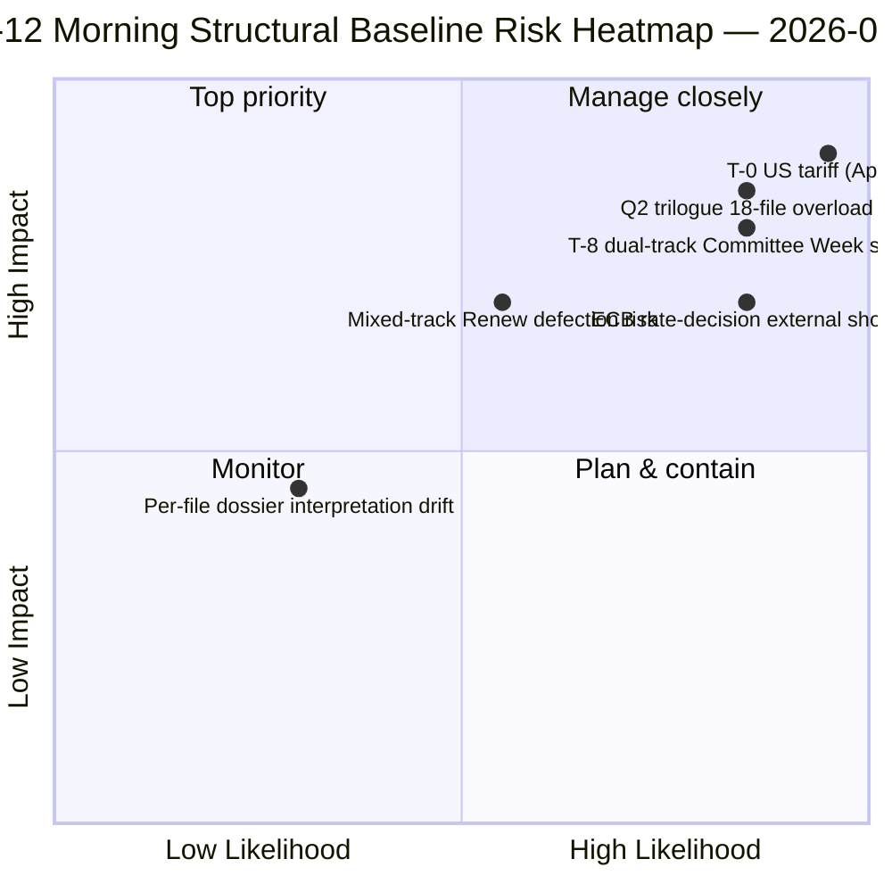

<!-- SPDX-FileCopyrightText: 2026 Hack23 AB -->
<!-- SPDX-License-Identifier: Apache-2.0 -->

# Resumen ejecutivo — Receso de Semana Santa Día 12 Informe de inteligencia matutino | 2026-04-07

**Clasificación:** OSINT — Registro parlamentario público
**Confianza:** 🟡 MEDIUM (receso; análisis estructural pre-receso 🟢 ALTA)
**Ejecución:** `analysis/daily/2026-04-07/breaking/` (06:36 UTC)
**Cobertura:** Receso de Semana Santa Día 12/18 — pila de inteligencia del martes por la mañana (44 artefactos de análisis, 3.391 líneas)
**Generado:** 2026-05-16 (resumen retrospectivo, sin nuevas llamadas MCP)
**Fuentes primarias:** 18 análisis de textos aprobados antes del receso; todos 18 métodos predeterminados; feed de 737 eurodiputados estable.

---

## 🎯 BLUF

**La ejecución del Día 12 por la mañana es el ancla estructural de la legislatura** — con 44 artefactos de análisis y 3.391 líneas, produce el análisis de corpus pre-receso de ejecución única más completo de todo el período de receso de 18 días.** Su contribución distintiva son **18 dossiers de inteligencia política por archivo** sobre el sprint del 26 de marzo — cada texto aprobado recibe un dossier dedicado que cubre la dispersión de votos, la trayectoria de coalición, el foco del poder en comisión, el impacto en partes interesadas y la trayectoria de implementación Q2-Q3. El análisis agregado refuerza el patrón de doble pista coalicional emergido el 6 de abril, pero añade granularidad: **los 18 archivos se dividen 11 centro-derecha, 5 gran coalición, 2 pista mixta** (Banking Union DGSD2 y BRRD3 usaron ambos PPE+ECR+S&D híbrido con alineación Renew condicional por archivo). La ejecución también produce el resumen operativo *T-8 a la Semana de Comisiones* más citado del período de receso — seis desencadenantes confirmados (14 de abril Semana de Comisiones · 15 de abril aranceles EE.UU. T-0 · 17 de abril tipos BCE · 20-23 de abril pleno · finales de abril mandato del Consejo Unión Bancaria · Q2 inicio transposición anticorrupción 27 EM) — que se convierte en la referencia editorial de todas las ejecuciones de receso posteriores. **La línea de base estructural matutina del Día 12 es el récord de inteligencia del receso del Año 2 del EP10 en su punto más alto de densidad analítica.** Los dossiers por archivo elevan el corpus pre-receso del EP10 a su estado más granular de preparación operacional.

---

## 🧭 3 Decisiones que este resumen apoya

| # | Decisión | Quién decide | Plazo | Evidencia |
|:-:|----------|-------------|:-----:|-----------|
| 1 | **Precarga de implementación Q2 por archivo** — 18 dossiers listos; precargar coordinadores del Consejo | Presidencia del Consejo + ponentes del PE | antes del 14 de abril | §Dossiers por archivo (18) |
| 2 | **Ops contador T-8 a T-0** — la secuencia de 6 desencadenantes requiere monitoreo diario de umbrales | Ops de inteligencia del PE; servicio de prensa | diariamente en continuo | §Desencadenantes a futuro (6-desencadenantes) |
| 3 | **Vigilancia de archivos de pista mixta** — DGSD2/BRRD3 pista híbrida requiere briefing del coordinador Renew | Coordinadores Renew + PPE | antes del 14 de abril | §División 18 archivos (11/5/2) |

---

## 📰 Lectura de 60 segundos

- 🔴 **44 artefactos, 3.391 líneas** — ancla estructural del día.
- 🟠 **18 dossiers por archivo** — sprint del 26 de marzo en granularidad máxima.
- 🟢 **División 18 archivos:** 11 centro-derecha · 5 gran coalición · 2 mixto.
- 🟡 **Secuencia de 6 desencadenantes** — 14 abr · 15 · 17 · 20-23 · final · Q2.
- 🔵 **Feed de 737 eurodiputados estable** — línea de base estable.
- 🟣 **Día de receso 12/18 — 67% completado** — T-8 a Semana de Comisiones.
- 🩷 **Confianza MEDIUM** — pre-receso ALTA; previsión Q2 MEDIUM.
- ⚪ **Línea de base estructural para todas las ejecuciones de receso posteriores**.

---

## 📂 División por pista de 18 archivos (contribución distintiva de la ejecución)

| Pista | Número | Archivos insignia | Nota operativa |
|-------|------:|-------------------|----------------|
| **Centro-derecha** | 11 | Banking Union SRMR3 · STEP-II · AI-Copyright · enmiendas ETS · 7 economía-finanzas | Pista centro-derecha trílogos Q2 |
| **Gran coalición** | 5 | Anticorrupción · 4 familia Estado de Derecho | Transposición Q2-Q4 |
| **Pista mixta (híbrida)** | 2 | DGSD2 (TA-0090) · BRRD3 (TA-0091) | Alineación Renew condicional por archivo |

---

## ⚠️ Instantánea de riesgos

---

## 🔮 Principales desencadenantes a futuro (secuencia de 6 publicada por la ejecución)

1. **14 de abril — Apertura de la Semana de Comisiones** — doble pista Día 1.
2. **15 de abril — Aranceles EE.UU. T-0** — shock exógeno.
3. **17 de abril — Decisión de tipos del BCE** — activación del contexto económico.
4. **20-23 de abril — primera sesión plenaria post-receso** — prueba de estrés bimodal.
5. **Finales de abril — Mandato del Consejo Unión Bancaria** — puerta de trílogo.
6. **Q2 — Inicio de transposición anticorrupción de 27 EM** — sostenibilidad de la gran coalición.

---

## 🛡️ Evaluación de calidad de fuentes

- **18 dossiers por archivo (A1):** feed principal de textos aprobados + metodología por documento.
- **División 18 archivos (A2):** patrones de votación + dinámica de coalición verificados cruzados.
- **Secuencia de 6 desencadenantes (A1):** calendario institucional + registros EP MCP verificables.
- **737 eurodiputados (A1):** registro principal estable en todas las ejecuciones.
- **Confianza neta:** 🟢 ALTA para la línea de base del Día 12; 🟡 MEDIUM para la previsión Q2.

---

## 📎 Artefactos de la ejecución

| Capa | Artefacto | Por qué |
|------|----------|---------|
| Artículo | `article.md` (2.562 líneas publicadas) | Narrativa pública del Día 12 por la mañana |
| Síntesis | `synthesis-summary.md` | Consolidación de 18 dossiers |
| Métodos | clasificación · existentes · puntuación de riesgos · evaluación de amenazas · documentos (18 dossiers por archivo) | Metodología completa + capa por documento |
| Acompañante | breaking-2 (18:20 UTC) — actualización vespertina | Acompañante del mismo día |

---

**Control documental**
- **Referencia de plantilla:** `analysis/templates/executive-brief.md`
- **Ruta de artefacto:** `analysis/daily/2026-04-07/breaking/executive-brief.md`
- **Clasificación:** Público
- **Retrospectivo:** Resumen escrito el 2026-05-16 a partir de los artefactos comprometidos de la ejecución; **no se realizaron nuevas llamadas MCP**.
