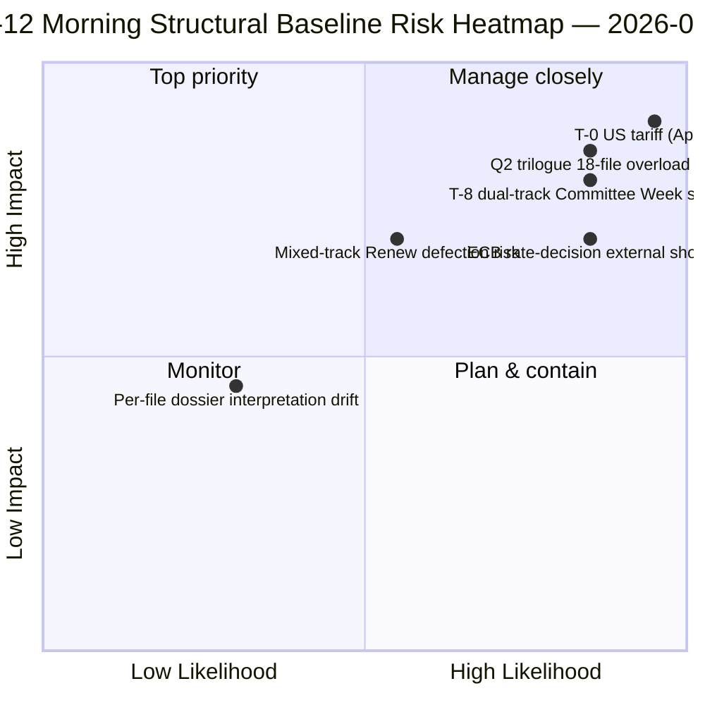

<!-- SPDX-FileCopyrightText: 2026 Hack23 AB -->
<!-- SPDX-License-Identifier: Apache-2.0 -->

# Tiivistelmä — Pääsiäistauko Päivä 12 Aamutiedustelu | 2026-04-07

**Luokitus:** OSINT — Julkinen parlamentaarinen asiakirja
**Luotettavuus:** 🟡 MEDIUM (tauko; rakenteellinen analyysi ennen taukoa 🟢 KORKEA)
**Ajo:** `analysis/daily/2026-04-07/breaking/` (06:36 UTC)
**Kattavuus:** Pääsiäistauko Päivä 12/18 — tiistai-aamu tiedustelukokonaisuus (44 analyysiartefaktia, 3 391 riviä)
**Luotu:** 2026-05-16 (retrospektiivinen yhteenveto, ei uusia MCP-kutsuja)
**Ensisijaiset lähteet:** 18 ennen taukoa hyväksyttyjen tekstien analyysia; kaikki 18 oletusmenetelmää; 737 MEP-syöte vakaa.

---

## 🎯 BLUF

**Päivä-12 aamukierros on toimikauden rakenteellinen ankkuri** — 44 analyysiartefaktilla ja 3 391 rivillä se tuottaa kattavimman yksittäisen ajoanalyysit ennen taukoa koko 18 päivän taukojakson aikana.** Sen erottuva panos on **18 tiedostokohtaista poliittista tiedustelukansaion** 26. maaliskuun sprintistä — jokainen hyväksytty teksti saa oman kansion, joka kattaa ääntenlaskun, koalition polun, valiokuntavallan fokuspiste, sidosryhmien vaikutuksen ja Q2-Q3 toimeenpanon suunnan. Aggregoitu analyysi vahvistaa 6. huhtikuuta esiin nousseen kaksoisraitakoalitiomallin, mutta lisää yksityiskohtaisuutta: **18 tiedosto jakaantuu 11 oikeakeskiseen, 5 suurkoalitioon, 2 sekaitoisille raiteille** (Banking Union DGSD2 ja BRRD3 käyttivät molemmat hybridia PPE+ECR+S&D tiedostoehtoisen Renew-linjauksen kanssa). Ajo tuottaa myös taukojakson eniten siteeratun *T-8 valiokuntaviikkoon* operatiivisen yhteenvedon — kuusi vahvistettua eteenpäin katsovaa laukaisijaa (14. huhtikuuta valiokuntaviikko · 15. huhtikuuta USA-tullit T-0 · 17. huhtikuuta EKP-korko · 20-23. huhtikuuta täysistunto · huhtikuun lopulla Banking Union neuvoston mandaatti · Q2 27-jäsenmaan siirtyminen) — josta tulee kaikkien seuraavien taukokierrosten toimituksellinen viiteaines. **Päivä-12 aamun rakenteellinen perusviiva on EP10:n vuosi 2 -taukojakson tiedusteluprotokolla analyyttisen tiheyden korkeimmillaan.** Tiedostokohtaiset kansiot nostavat EP10:n ennen taukoa olevan korpuksen sen kaikkein yksityiskohtaisimpaan operatiiviseen valmiustilaan.

---

## 🧭 3 Päätöstä, joita tämä yhteenveto tukee

| # | Päätös | Päättäjä | Määräaika | Todisteet |
|:-:|--------|----------|:---------:|-----------|
| 1 | **Tiedostokohtainen Q2-toimeenpanon esilataus** — 18 kansiota valmiina; esilataa neuvoston koordinaattorit | Neuvoston puheenjohtajuus + EP:n esittelijät | 14. huhtikuuta mennessä | §Tiedostokohtaiset kansiot (18) |
| 2 | **T-8 T-0 päivälaskin-ops** — 6-laukaisijasekvenssi vaatii jatkuvaa päivittäistä kynnysarvojen seurantaa | EP:n tiedusteluoperaatiot; tiedotuspalvelu | jatkuva päivittäin | §Eteenpäin katsovat laukaisijat (6-laukaisija) |
| 3 | **Sekaitoisien raitaisten tiedostojen seuranta** — DGSD2/BRRD3 hybridiraita vaatii Renew-koordinaattoribrieffin | Renew + PPE-koordinaattorit | 14. huhtikuuta mennessä | §18-tiedoston jako (11/5/2) |

---

## 📰 60-sekunnin lukeminen

- 🔴 **44 artefaktia, 3 391 riviä** — päivän rakenteellinen ankkuri.
- 🟠 **18 tiedostokohtaista kansiota** — 26. maaliskuun sprinti maksimigranulariteetilla.
- 🟢 **18-tiedoston jako:** 11 oikeakeskinen · 5 suurkoalitio · 2 sekaitoinen.
- 🟡 **6-laukaisijasekvenssi** — 14. huhti · 15. · 17. · 20-23. · myöhemmin · Q2.
- 🔵 **737 MEP-syöte vakaa** — perusviiva pitää.
- 🟣 **Taukopäivä 12/18 — 67% valmis** — T-8 valiokuntaviikkoon.
- 🩷 **Luotettavuus MEDIUM** — ennen taukoa KORKEA; Q2-ennuste MEDIUM.
- ⚪ **Rakenteellinen perusviiva kaikille seuraaville taukokierrokille**.

---

## 📂 18-Tiedoston Raitajako (kierroksen erottuva panos)

| Raita | Määrä | Lippulaivat | Operatiivinen huomio |
|-------|------:|------------|---------------------|
| **Oikeakeskinen** | 11 | Banking Union SRMR3 · STEP-II · AI-Copyright · ETS-muutokset · 7 talous-rahoitus | Q2 kolmikanta-oikeakeskinen raita |
| **Suurkoalitio** | 5 | Korruption vastainen · 4 oikeusvaltioperhe | Q2-Q4 siirtyminen |
| **Sekaitoinen raita (hybridi)** | 2 | DGSD2 (TA-0090) · BRRD3 (TA-0091) | Renew tiedostoehdollinen linjaus |

---

## ⚠️ Riskihetki

---

## 🔮 Tärkeimmät eteenpäin katsovat laukaisijat (kierroksen julkaistu 6-sekvenssi)

1. **14. huhtikuuta — Valiokuntaviikko alkaa** — kaksoisraita Päivä 1.
2. **15. huhtikuuta — USA-tullit T-0** — ulkoinen shokki.
3. **17. huhtikuuta — EKP:n korkopäätös** — taloudellisen kontekstin aktivointi.
4. **20-23. huhtikuuta — ensimmäinen täysistunto tauon jälkeen** — bimodaalinen stressitesti.
5. **Huhtikuun lopulla — Banking Union neuvoston mandaatti** — kolmikantaportti.
6. **Q2 — 27-jäsenmaan korruption vastaisen lain siirtymisaloitus** — suurkoalition kestävyys.

---

## 🛡️ Lähdekvaliteetin arviointi

- **18 tiedostokohtaista kansiota (A1):** ensisijainen hyväksyttyjen tekstien syöte + tiedostokohtainen metodologia.
- **18-tiedoston jako (A2):** äänestysmallit + koalition dynamiikka ristiintarkistettu.
- **6-laukaisijasekvenssi (A1):** institutionaalinen kalenteri + EP:n MCP-tietueet todennettavissa.
- **737 MEP:tä (A1):** ensisijainen tietue vakaa kaikissa kierroksissa.
- **Nettokonfidens:** 🟢 KORKEA Päivä-12-perusviivalle; 🟡 MEDIUM Q2-ennusteelle.

---

## 📎 Kierroksen artefaktit

| Taso | Artefakti | Miksi |
|------|----------|-------|
| Artikkeli | `article.md` (2 562 julkaistua riviä) | Julkinen Päivä-12 aamukertomus |
| Synteesi | `synthesis-summary.md` | 18-kansion konsolidointi |
| Menetelmät | luokittelu · olemassa olevat · riskipisteytys · uhka-arviointi · asiakirjat (18 tiedostokohtaista kansiota) | Täysi metodologia + tiedostokohtainen taso |
| Kumppani | breaking-2 (18:20 UTC) — iltapäivitys | Samana päivänä kumppani |

---

**Asiakirjanhallinta**
- **Malliviite:** `analysis/templates/executive-brief.md`
- **Artefaktpolku:** `analysis/daily/2026-04-07/breaking/executive-brief.md`
- **Luokitus:** Julkinen
- **Retrospektiivinen:** Yhteenveto kirjoitettu 2026-05-16 kierroksen tallennetuista artefakteista; **uusia MCP-kutsuja ei tehty**.
