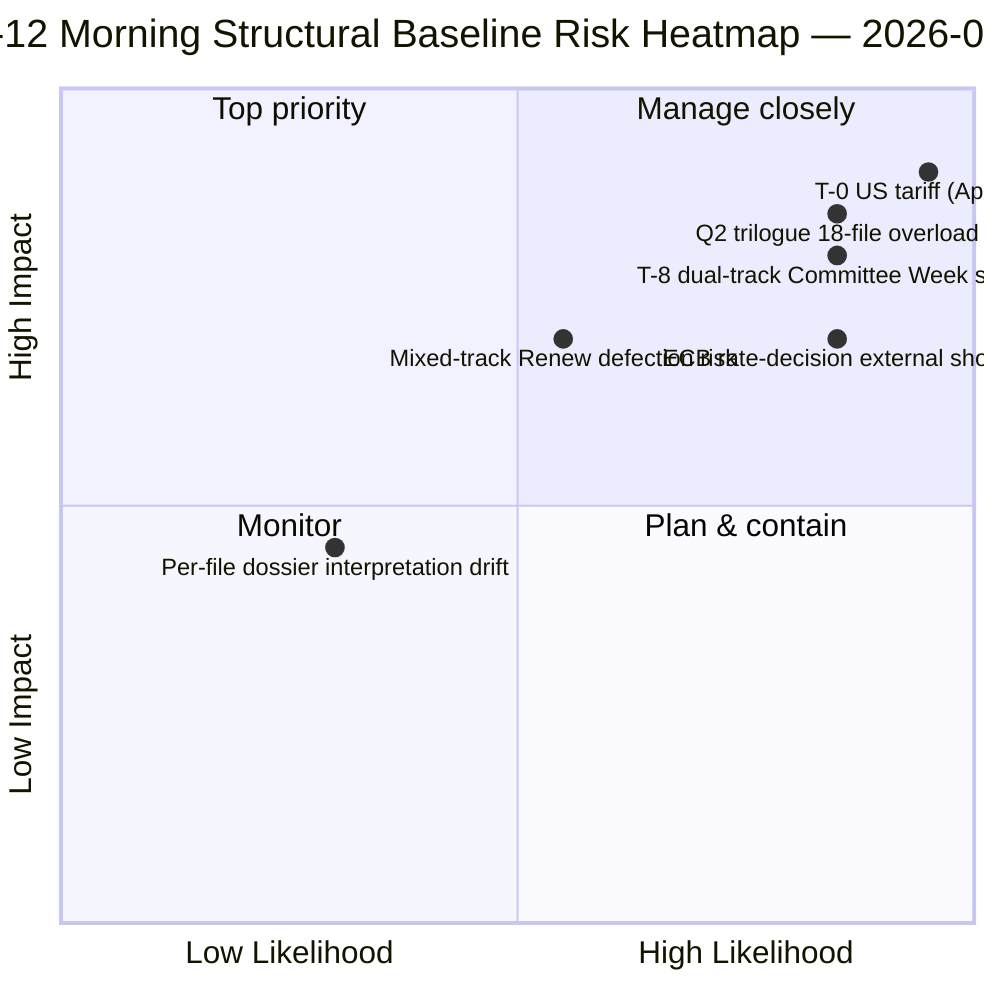

<!-- SPDX-FileCopyrightText: 2026 Hack23 AB -->
<!-- SPDX-License-Identifier: Apache-2.0 -->

# Résumé exécutif — Pause de Pâques Jour 12 Bulletin de renseignements matinal | 2026-04-07

**Classification :** OSINT — Archives parlementaires publiques
**Confiance :** 🟡 MEDIUM (pause ; analyse structurelle pré-pause 🟢 ÉLEVÉE)
**Exécution :** `analysis/daily/2026-04-07/breaking/` (06:36 UTC)
**Couverture :** Pause de Pâques Jour 12/18 — pile de renseignements du mardi matin (44 artefacts d'analyse, 3 391 lignes)
**Généré :** 2026-05-16 (résumé rétrospectif, aucun nouvel appel MCP)
**Sources primaires :** 18 analyses des textes adoptés avant la pause ; toutes 18 méthodes par défaut ; alimentation 737 eurodéputés stable.

---

## 🎯 BLUF

**L'exécution du matin du Jour 12 constitue l'ancre structurelle de la législature** — avec 44 artefacts d'analyse et 3 391 lignes, elle produit l'analyse de corpus pré-pause la plus exhaustive d'une seule exécution pour toute la période de pause de 18 jours.** Sa contribution distinctive est celle de **18 dossiers de renseignements politiques par fichier** sur le sprint du 26 mars — chaque texte adopté bénéficie d'un dossier dédié couvrant la dispersion des votes, la piste de coalition, le foyer de pouvoir en commission, l'impact sur les parties prenantes et la trajectoire de mise en œuvre Q2-Q3. L'analyse agrégée renforce le schéma de double piste coalitionnelle mis en évidence le 6 avril, mais en ajoutant de la granularité : **les 18 fichiers se divisent 11 centre-droit, 5 grande coalition, 2 piste mixte** (Banking Union DGSD2 et BRRD3 ont tous deux utilisé l'hybride PPE+ECR+S&D avec alignement conditionnel de Renew par fichier). L'exécution produit également le résumé opérationnel *T-8 à la semaine de commission* le plus cité de la période de pause — six déclencheurs confirmés (14 avril semaine de commission · 15 avril droits de douane américains T-0 · 17 avril taux BCE · 20-23 avril séance plénière · fin avril mandat du Conseil Union bancaire · Q2 démarrage transposition anti-corruption des 27 EM) — qui devient la référence éditoriale de toutes les exécutions de pause ultérieures. **La base structurelle matinale du Jour 12 est le record de renseignements de la pause de l'Année 2 de l'EP10 à son sommet de densité analytique.** Les dossiers par fichier hissent le corpus pré-pause de l'EP10 à son état de préparation opérationnelle le plus granulaire.

---

## 🧭 3 Décisions que ce résumé soutient

| # | Décision | Qui décide | Échéance | Preuves |
|:-:|----------|------------|:--------:|---------|
| 1 | **Préchargement Q2 de mise en œuvre par fichier** — 18 dossiers prêts ; précharger les coordinateurs du Conseil | Présidence du Conseil + rapporteurs du PE | avant le 14 avril | §Dossiers par fichier (18) |
| 2 | **Ops compteur T-8 à T-0** — la séquence à 6 déclencheurs requiert une surveillance quotidienne des seuils | Ops de renseignement du PE ; service de presse | quotidiennement en continu | §Déclencheurs à venir (6-déclencheurs) |
| 3 | **Surveillance des fichiers à piste mixte** — DGSD2/BRRD3 piste hybride requiert un briefing du coordinateur Renew | Coordinateurs Renew + PPE | avant le 14 avril | §Répartition 18 fichiers (11/5/2) |

---

## 📰 Lecture de 60 secondes

- 🔴 **44 artefacts, 3 391 lignes** — ancre structurelle de la journée.
- 🟠 **18 dossiers par fichier** — sprint du 26 mars à granularité maximale.
- 🟢 **Répartition 18 fichiers :** 11 centre-droit · 5 grande coalition · 2 mixte.
- 🟡 **Séquence à 6 déclencheurs** — 14 avr · 15 · 17 · 20-23 · fin · Q2.
- 🔵 **Alimentation 737 eurodéputés stable** — base stable.
- 🟣 **Jour de pause 12/18 — 67% terminé** — T-8 à la semaine de commission.
- 🩷 **Confiance MEDIUM** — pré-pause ÉLEVÉE ; prévision Q2 MEDIUM.
- ⚪ **Base structurelle pour toutes les exécutions de pause ultérieures**.

---

## 📂 Répartition par piste des 18 fichiers (contribution distinctive de l'exécution)

| Piste | Nombre | Fichiers phares | Note opérationnelle |
|-------|------:|-----------------|---------------------|
| **Centre-droit** | 11 | Banking Union SRMR3 · STEP-II · AI-Copyright · amendements ETS · 7 économie-finances | Piste centre-droit trilogues Q2 |
| **Grande coalition** | 5 | Anti-Corruption · 4 famille État de droit | Transposition Q2-Q4 |
| **Piste mixte (hybride)** | 2 | DGSD2 (TA-0090) · BRRD3 (TA-0091) | Alignement conditionnel Renew par fichier |

---

## ⚠️ Instantané des risques

---

## 🔮 Principaux déclencheurs à venir (séquence de 6 publiée par l'exécution)

1. **14 avril — Ouverture de la semaine de commission** — double piste Jour 1.
2. **15 avril — Droits de douane américains T-0** — choc exogène.
3. **17 avril — Décision de taux de la BCE** — activation du contexte économique.
4. **20-23 avril — première séance plénière post-pause** — test de stress bimodal.
5. **Fin avril — Mandat du Conseil Union bancaire** — porte de trilogue.
6. **Q2 — Début de transposition anti-corruption des 27 EM** — durabilité de la grande coalition.

---

## 🛡️ Évaluation de la qualité des sources

- **18 dossiers par fichier (A1) :** flux principal des textes adoptés + méthodologie par document.
- **Répartition 18 fichiers (A2) :** schémas de vote + dynamique de coalition cross-vérifiés.
- **Séquence à 6 déclencheurs (A1) :** calendrier institutionnel + enregistrements EP MCP vérifiables.
- **737 eurodéputés (A1) :** enregistrement principal stable sur toutes les exécutions.
- **Confiance nette :** 🟢 ÉLEVÉE pour la base du Jour 12 ; 🟡 MEDIUM pour la prévision Q2.

---

## 📎 Artefacts de l'exécution

| Couche | Artefact | Pourquoi |
|--------|----------|----------|
| Article | `article.md` (2 562 lignes publiées) | Récit public du matin du Jour 12 |
| Synthèse | `synthesis-summary.md` | Consolidation de 18 dossiers |
| Méthodes | classification · existants · notation des risques · évaluation des menaces · documents (18 dossiers par fichier) | Méthodologie complète + couche par document |
| Accompagnateur | breaking-2 (18:20 UTC) — mise à jour du soir | Accompagnateur du même jour |

---

**Contrôle documentaire**
- **Référence de modèle :** `analysis/templates/executive-brief.md`
- **Chemin d'artefact :** `analysis/daily/2026-04-07/breaking/executive-brief.md`
- **Classification :** Public
- **Rétrospectif :** Résumé rédigé le 2026-05-16 à partir des artefacts validés de l'exécution ; **aucun nouvel appel MCP n'a été effectué**.
