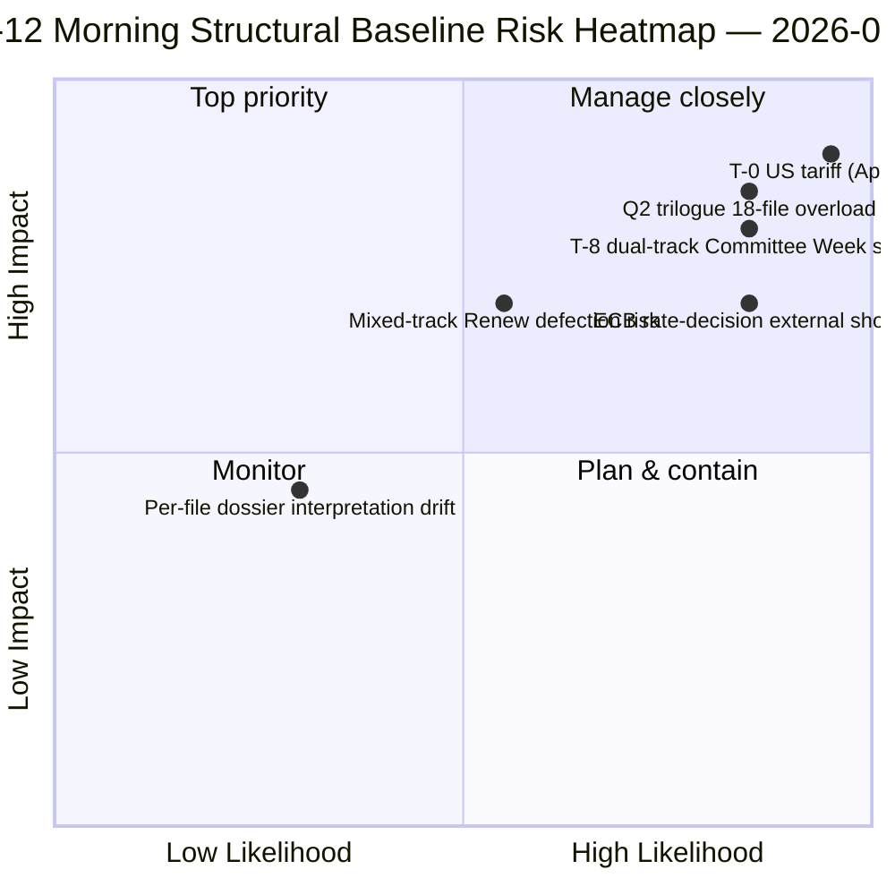

<!-- SPDX-FileCopyrightText: 2026 Hack23 AB -->
<!-- SPDX-License-Identifier: Apache-2.0 -->

# סיכום מנהלים — פגרת חג הפסחא יום 12 דוח מודיעיני בוקר | 2026-04-07

**סיווג:** OSINT — רשומה פרלמנטרית ציבורית
**מהימנות:** 🟡 בינוני (פגרה; ניתוח מבני לפני פגרה 🟢 גבוה)
**ריצה:** `analysis/daily/2026-04-07/breaking/` (06:36 UTC)
**כיסוי:** פגרת פסחא יום 12/18 — ערימת מודיעין בוקר שלישי (44 ממצאי ניתוח, 3,391 שורות)
**נוצר:** 2026-05-16 (סיכום רטרוספקטיבי, ללא קריאות MCP חדשות)
**מקורות ראשיים:** 18 ניתוחים של טקסטים שאומצו לפני הפגרה; כל 18 השיטות כברירת מחדל; עדכון 737 חברי פרלמנט יציב.

---

## 🎯 BLUF

**ריצת הבוקר של יום 12 היא עוגן המבני של קדנציית המחוקק** — עם 44 ממצאי ניתוח ו-3,391 שורות, מייצרת ריצה זו את ניתוח הקורפוס לפני הפגרה המקיף ביותר בריצה בודדת בכל תקופת הפגרה של 18 הימים.** התרומה הייחודית היא **18 תיקי מודיעין פוליטי לכל קובץ** על ספרינט 26 במרץ — כל טקסט שאומץ מקבל תיק ייעודי הכולל: פיזור הצבעות, מסלול קואליציה, מוקד כוח בוועדה, השפעה על בעלי עניין ומסלול יישום Q2-Q3. הניתוח המצטבר מחזק את דפוס הקואליציה דו-המסלולי שצץ ב-6 באפריל, אך מוסיף פירוט: **18 הקבצים מתחלקים 11 מרכז-ימין, 5 קואליציה גדולה, 2 מסלול מעורב** (Banking Union DGSD2 ו-BRRD3 השתמשו בשניהם בגישה היברידית PPE+ECR+S&D עם התאמת Renew מותנית לפי קובץ). הריצה מייצרת גם את הסיכום התפעולי *T-8 לשבוע הוועדות* הנצוט ביותר בתקופת הפגרה — שישה טריגרים מאוששים קדימה (14 באפריל שבוע ועדות · 15 באפריל מכסי ארה"ב T-0 · 17 באפריל ריביות ECB · 20-23 באפריל מליאה · סוף אפריל מנדט מועצת האיחוד הבנקאי · Q2 תחילת יישום אנטי-שחיתות 27 מדינות חברות) — שהופך לאסמכתא העריכתית לכל ריצות הפגרה הבאות. **קו הבסיס המבני הבוקרי של יום 12 הוא שיא מודיעין הפגרה של שנה 2 של EP10 בצפיפות אנליטית גבוהה ביותר.** תיקי הקבצים מרימים את קורפוס EP10 לפני הפגרה למצב המוכנות התפעולית הגרנולרי ביותר.

---

## 🧭 3 החלטות שסיכום זה תומך בהן

| # | החלטה | מי מחליט | מועד אחרון | ראיות |
|:-:|-------|---------|:-----------:|-------|
| 1 | **טעינה מוקדמת ליישום Q2 לכל קובץ** — 18 תיקים מוכנים; טעינת מתאמי המועצה מוקדם | יו"ר המועצה + מדווחי PE | לפני 14 באפריל | §תיקים לכל קובץ (18) |
| 2 | **מבצעי מד ימים T-8 עד T-0** — רצף 6 טריגרים דורש מעקב יומי אחרי סף | מבצעי מודיעין PE; שירות עיתונות | יומי ברציפות | §טריגרים קדימה (6 טריגרים) |
| 3 | **מעקב קבצי מסלול מעורב** — מסלול היברידי DGSD2/BRRD3 דורש בריפינג מתאם Renew | מתאמי Renew + PPE | לפני 14 באפריל | §חלוקת 18 קבצים (11/5/2) |

---

## 📰 קריאת 60 שניות

- 🔴 **44 ממצאים, 3,391 שורות** — עוגן מבני של היום.
- 🟠 **18 תיקים לכל קובץ** — ספרינט 26 במרץ בדקות מרבית.
- 🟢 **חלוקת 18 קבצים:** 11 מרכז-ימין · 5 קואליציה גדולה · 2 מעורב.
- 🟡 **רצף 6 טריגרים** — 14 אפר · 15 · 17 · 20-23 · סוף · Q2.
- 🔵 **עדכון 737 חברי פרלמנט יציב** — קו בסיס יציב.
- 🟣 **יום פגרה 12/18 — 67% הושלם** — T-8 לשבוע ועדות.
- 🩷 **מהימנות בינוני** — לפני פגרה גבוה; תחזית Q2 בינוני.
- ⚪ **קו בסיס מבני לכל ריצות הפגרה הבאות**.

---

## 📂 חלוקת מסלולי 18 קבצים (תרומה ייחודית של הריצה)

| מסלול | מספר | קבצי דגל | הערה תפעולית |
|-------|------:|----------|--------------|
| **מרכז-ימין** | 11 | Banking Union SRMR3 · STEP-II · AI-Copyright · תיקוני ETS · 7 כלכלה-פיננסים | מסלול טרילוג מרכז-ימין Q2 |
| **קואליציה גדולה** | 5 | אנטי-שחיתות · 4 משפחת שלטון חוק | יישום Q2-Q4 |
| **מסלול מעורב (היברידי)** | 2 | DGSD2 (TA-0090) · BRRD3 (TA-0091) | התאמת Renew מותנית לפי קובץ |

---

## ⚠️ תמונת מצב סיכון

---

## 🔮 טריגרים קדימה מובילים (רצף ה-6 שפורסם מהריצה)

1. **14 באפריל — פתיחת שבוע ועדות** — מסלול כפול יום 1.
2. **15 באפריל — מכסי ארה"ב T-0** — זעזוע אקסוגני.
3. **17 באפריל — החלטת ריביות ECB** — הפעלת הקשר כלכלי.
4. **20-23 באפריל — מליאה ראשונה לאחר הפגרה** — מבחן עקה דו-מודלי.
5. **סוף אפריל — מנדט מועצת האיחוד הבנקאי** — שער טרילוג.
6. **Q2 — תחילת יישום אנטי-שחיתות 27 מדינות חברות** — קיימות הקואליציה הגדולה.

---

## 🛡️ הערכת איכות מקורות

- **18 תיקים לכל קובץ (A1):** עדכון טקסטים שאומצו ראשי + מתודולוגיה לכל מסמך.
- **חלוקת 18 קבצים (A2):** דפוסי הצבעה + דינמיקת קואליציה בדיקה צולבת.
- **רצף 6 טריגרים (A1):** לוח שנה מוסדי + רשומות EP MCP ניתנות לאימות.
- **737 חברי פרלמנט (A1):** רשומה ראשית יציבה בכל הריצות.
- **מהימנות נטו:** 🟢 גבוה לקו בסיס יום 12; 🟡 בינוני לתחזית Q2.

---

## 📎 ממצאי ריצה

| שכבה | ממצא | סיבה |
|------|------|-------|
| מאמר | `article.md` (2,562 שורות שפורסמו) | נרטיב ציבורי בוקר יום 12 |
| סינתזה | `synthesis-summary.md` | איחוד 18 תיקים |
| שיטות | סיווג · קיים · ניקוד סיכון · הערכת איום · מסמכים (18 תיקים לכל קובץ) | מתודולוגיה מלאה + שכבה לכל מסמך |
| מלווה | breaking-2 (18:20 UTC) — עדכון ערב | מלווה אותו יום |

---

**בקרת תיעוד**
- **הפניית תבנית:** `analysis/templates/executive-brief.md`
- **נתיב ממצא:** `analysis/daily/2026-04-07/breaking/executive-brief.md`
- **סיווג:** ציבורי
- **רטרוספקטיבי:** סיכום נכתב ב-2026-05-16 מתוך ממצאי ריצה שאושרו; **לא בוצעו קריאות MCP חדשות**.
