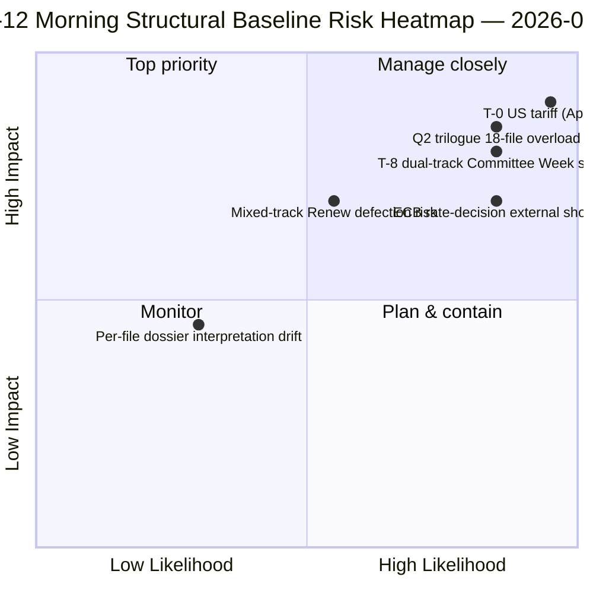

<!-- SPDX-FileCopyrightText: 2026 Hack23 AB -->
<!-- SPDX-License-Identifier: Apache-2.0 -->

# エグゼクティブブリーフ — 復活祭休会第12日 朝のインテリジェンスレポート | 2026-04-07

**分類:** OSINT — 公開議会記録
**信頼度:** 🟡 中程度（休会中；休会前の構造的分析 🟢 高）
**実行:** `analysis/daily/2026-04-07/breaking/` (06:36 UTC)
**対象範囲:** 復活祭休会第12日/18 — 火曜朝のインテリジェンスパケット（分析成果物44件、3,391行）
**生成日:** 2026-05-16（遡及サマリー、新規MCP呼び出しなし）
**主要情報源:** 休会前に採択されたテキスト18件の分析；全18手法デフォルト；EU議員737人フィード安定。

---

## 🎯 BLUF

**第12日朝の実行は会期の構造的支柱である** — 分析成果物44件・3,391行を擁し、18日間の休会全体で最も包括的な単一実行前休会コーパス分析を生み出す。**特筆すべき貢献**は3月26日スプリントに関する**ファイル単位の政治インテリジェンス・ドシエ18件**であり、採択されたテキストごとに専用ドシエ（投票分布・連立軌跡・委員会権力の焦点・利害関係者への影響・Q2-Q3実施軌跡を網羅）が付随する。集計分析は4月6日に浮上した二重路線連立パターンを裏付けると同時に、さらなる詳細を追加する：**18ファイルは中道右派11件・大連立5件・混合路線2件に分かれる**（Banking Union DGSD2・BRRD3はいずれもPPE+ECR+S&Dハイブリッドを採用し、ファイルごとに条件付きRenew整合を伴う）。実行はさらに休会期間中で最も引用された*T-8委員会週間*作戦サマリーを生み出す — 確認された6つの前方トリガー（4月14日委員会週間・4月15日米国関税T-0・4月17日ECB金利・4月20-23日本会議・4月末Banking Union理事会付託・Q2反汚職実施27加盟国開始）— これが以降のすべての休会実行の編集上の参照点となる。**第12日朝の構造的ベースラインは、EP10第2年の休会インテリジェンス記録の分析密度が最高潮に達した地点である。**ファイル単位のドシエはEP10の休会前コーパスを最も細粒度の作戦準備状態に引き上げる。

---

## 🧭 このブリーフが支える3つの意思決定

| # | 意思決定 | 決定者 | 期限 | 根拠 |
|:-:|---------|--------|:----:|------|
| 1 | **ファイル単位Q2実施の事前ロード** — 18ドシエ準備完了；理事会コーディネーターを事前ロード | 理事会議長国 + EP報告者 | 4月14日前 | §ファイル単位ドシエ（18件） |
| 2 | **T-8からT-0デーカウンター運用** — 6トリガーシーケンスは閾値の毎日監視が必要 | EPインテリジェンス運用；報道局 | 毎日継続 | §前方トリガー（6トリガー） |
| 3 | **混合路線ファイルの監視** — DGSD2/BRRD3ハイブリッド路線はRenewコーディネーターへのブリーフィングが必要 | Renew + PPEコーディネーター | 4月14日前 | §18ファイル分割（11/5/2） |

---

## 📰 60秒リーディング

- 🔴 **成果物44件、3,391行** — その日の構造的支柱。
- 🟠 **ファイル単位ドシエ18件** — 3月26日スプリントを最大粒度で分析。
- 🟢 **18ファイル分割：** 中道右派11 · 大連立5 · 混合2。
- 🟡 **6トリガーシーケンス** — 4/14 · 15 · 17 · 20-23 · 月末 · Q2。
- 🔵 **EU議員737人フィード安定** — ベースライン安定。
- 🟣 **休会第12日/18 — 67%完了** — 委員会週間まであとT-8。
- 🩷 **信頼度中程度** — 休会前は高；Q2予測は中程度。
- ⚪ **以降すべての休会実行の構造的ベースライン。**

---

## 📂 18ファイル路線別分割（実行の特筆すべき貢献）

| 路線 | 件数 | 主要ファイル | 作戦上の注記 |
|------|----:|------------|------------|
| **中道右派** | 11 | Banking Union SRMR3 · STEP-II · AI著作権 · ETS修正 · 経済財政7件 | Q2中道右派三者協議路線 |
| **大連立** | 5 | 反汚職 · 法の支配ファミリー4件 | Q2-Q4実施 |
| **混合路線（ハイブリッド）** | 2 | DGSD2 (TA-0090) · BRRD3 (TA-0091) | ファイルごと条件付きRenew整合 |

---

## ⚠️ リスクスナップショット

---

## 🔮 主要前方トリガー（実行が公表した6シーケンス）

1. **4月14日 — 委員会週間開幕** — 二重路線第1日。
2. **4月15日 — 米国関税T-0** — 外生的ショック。
3. **4月17日 — ECB金利決定** — 経済コンテキストの活性化。
4. **4月20-23日 — 休会後初の本会議** — 二峰性ストレステスト。
5. **4月末 — Banking Union理事会付託** — 三者協議の入口。
6. **Q2 — 反汚職27加盟国実施開始** — 大連立の持続可能性。

---

## 🛡️ 情報源品質評価

- **ファイル単位ドシエ18件（A1）：** 採択テキスト主要フィード ＋ 文書ごとの手法。
- **18ファイル分割（A2）：** 投票パターン ＋ 連立ダイナミクスを相互検証済み。
- **6トリガーシーケンス（A1）：** 機関カレンダー ＋ EP MCP記録で検証可能。
- **EU議員737人（A1）：** すべての実行で安定した主要記録。
- **正味信頼度：** 🟢 第12日ベースラインは高；🟡 Q2予測は中程度。

---

## 📎 実行成果物

| 層 | 成果物 | 理由 |
|----|--------|------|
| 記事 | `article.md`（公開2,562行） | 第12日朝の公開ナラティブ |
| 統合 | `synthesis-summary.md` | 18ドシエの統合 |
| 手法 | 分類 · 既存 · リスクスコアリング · 脅威評価 · ドキュメント（ファイル単位18ドシエ） | 完全手法論 ＋ 文書単位レイヤー |
| 同日版 | breaking-2（18:20 UTC） — 夕方更新 | 同日版 |

---

**文書管理**
- **テンプレート参照：** `analysis/templates/executive-brief.md`
- **成果物パス：** `analysis/daily/2026-04-07/breaking/executive-brief.md`
- **分類：** 公開
- **遡及：** 2026-05-16にコミット済み実行成果物から作成したサマリー；**新規MCP呼び出しなし**。
