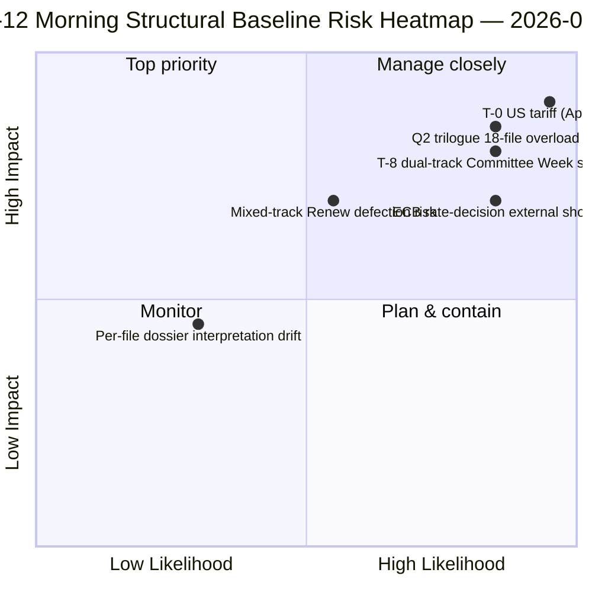

<!-- SPDX-FileCopyrightText: 2026 Hack23 AB -->
<!-- SPDX-License-Identifier: Apache-2.0 -->

# 집행 브리핑 — 부활절 휴회 12일차 아침 인텔리전스 보고서 | 2026-04-07

**분류:** OSINT — 공개 의회 기록
**신뢰도:** 🟡 보통 (휴회 중; 휴회 전 구조 분석 🟢 높음)
**실행:** `analysis/daily/2026-04-07/breaking/` (06:36 UTC)
**범위:** 부활절 휴회 12일/18 — 화요일 아침 인텔리전스 패킷 (분석 산출물 44건, 3,391줄)
**생성일:** 2026-05-16 (소급 요약, 신규 MCP 호출 없음)
**주요 출처:** 휴회 전 채택 문서 18건 분석; 18개 방법론 모두 기본 적용; EU 의원 737명 피드 안정.

---

## 🎯 BLUF

**12일차 아침 실행은 입법 회기의 구조적 기둥이다** — 분석 산출물 44건·3,391줄로 18일간의 전체 휴회 기간에서 가장 포괄적인 단일 실행 사전 휴회 코퍼스 분석을 생성한다. **특징적 기여**는 3월 26일 스프린트에 관한 **파일별 정치 인텔리전스 도시에 18건**으로, 채택된 텍스트마다 전용 도시에(투표 분산·연립 궤적·위원회 권력 집중·이해관계자 영향·Q2-Q3 이행 궤적 포함)가 배정된다. 집계 분석은 4월 6일에 부상한 이중 트랙 연립 패턴을 뒷받침하면서 세부 정보를 추가한다: **18개 파일은 중도우파 11건·대연립 5건·혼합 트랙 2건으로 분류**된다(Banking Union DGSD2·BRRD3는 모두 PPE+ECR+S&D 하이브리드를 활용하며 파일별 조건부 Renew 정렬을 동반). 이 실행은 또한 휴회 기간 중 가장 많이 인용되는 *T-8 위원회 주간* 작전 요약을 생성한다 — 6개 확인된 전향 트리거(4월 14일 위원회 주간·4월 15일 미국 관세 T-0·4월 17일 ECB 금리·4월 20-23일 본회의·4월 말 Banking Union 이사회 위임·Q2 27개 회원국 반부패 이행 시작) — 이는 이후 모든 휴회 실행의 편집 기준점이 된다. **12일차 아침의 구조적 기준선은 EP10 2년차 휴회 인텔리전스 기록 중 분석 밀도 최고점이다.** 파일별 도시에는 EP10 사전 휴회 코퍼스를 가장 세분화된 작전 준비 상태로 끌어올린다.

---

## 🧭 이 브리핑이 지원하는 3가지 결정

| # | 결정 | 결정 주체 | 마감 | 근거 |
|:-:|------|---------|:----:|------|
| 1 | **파일별 Q2 이행 사전 로드** — 도시에 18건 준비 완료; 이사회 코디네이터 사전 로드 | 이사회 의장국 + EP 보고관 | 4월 14일 전 | §파일별 도시에 (18건) |
| 2 | **T-8에서 T-0 카운터 작전** — 6 트리거 시퀀스는 일별 임계값 모니터링 필요 | EP 인텔리전스 작전; 언론 서비스 | 매일 지속 | §전향 트리거 (6 트리거) |
| 3 | **혼합 트랙 파일 모니터링** — DGSD2/BRRD3 하이브리드 트랙은 Renew 코디네이터 브리핑 필요 | Renew + PPE 코디네이터 | 4월 14일 전 | §18파일 분류 (11/5/2) |

---

## 📰 60초 리딩

- 🔴 **산출물 44건, 3,391줄** — 당일 구조적 기둥.
- 🟠 **파일별 도시에 18건** — 3월 26일 스프린트 최대 세분화 분석.
- 🟢 **18파일 분류:** 중도우파 11 · 대연립 5 · 혼합 2.
- 🟡 **6 트리거 시퀀스** — 4/14 · 15 · 17 · 20-23 · 말 · Q2.
- 🔵 **EU 의원 737명 피드 안정** — 기준선 안정.
- 🟣 **휴회 12일/18 — 67% 완료** — 위원회 주간까지 T-8.
- 🩷 **신뢰도 보통** — 휴회 전 높음; Q2 예측 보통.
- ⚪ **이후 모든 휴회 실행의 구조적 기준선.**

---

## 📂 18파일 트랙 분류 (실행의 특징적 기여)

| 트랙 | 건수 | 주요 파일 | 작전 메모 |
|------|----:|----------|---------|
| **중도우파** | 11 | Banking Union SRMR3 · STEP-II · AI 저작권 · ETS 개정 · 경제재정 7건 | Q2 중도우파 삼자 협의 트랙 |
| **대연립** | 5 | 반부패 · 법치 패밀리 4건 | Q2-Q4 이행 |
| **혼합 트랙 (하이브리드)** | 2 | DGSD2 (TA-0090) · BRRD3 (TA-0091) | 파일별 조건부 Renew 정렬 |

---

## ⚠️ 리스크 스냅샷

---

## 🔮 주요 전향 트리거 (실행이 공표한 6 시퀀스)

1. **4월 14일 — 위원회 주간 개막** — 이중 트랙 1일차.
2. **4월 15일 — 미국 관세 T-0** — 외생적 충격.
3. **4월 17일 — ECB 금리 결정** — 경제 맥락 활성화.
4. **4월 20-23일 — 휴회 후 첫 본회의** — 이중 양식 스트레스 테스트.
5. **4월 말 — Banking Union 이사회 위임** — 삼자 협의 관문.
6. **Q2 — 27개 회원국 반부패 이행 시작** — 대연립 지속가능성.

---

## 🛡️ 출처 품질 평가

- **파일별 도시에 18건 (A1):** 채택 문서 주요 피드 + 문서별 방법론.
- **18파일 분류 (A2):** 투표 패턴 + 연립 역학 교차 검증.
- **6 트리거 시퀀스 (A1):** 기관 캘린더 + EP MCP 기록 검증 가능.
- **EU 의원 737명 (A1):** 모든 실행에서 안정적인 주요 기록.
- **순 신뢰도:** 🟢 12일차 기준선 높음; 🟡 Q2 예측 보통.

---

## 📎 실행 산출물

| 계층 | 산출물 | 이유 |
|------|--------|------|
| 기사 | `article.md` (공개 2,562줄) | 12일차 아침 공개 내러티브 |
| 종합 | `synthesis-summary.md` | 18 도시에 통합 |
| 방법론 | 분류 · 기존 · 위험 점수화 · 위협 평가 · 문서 (파일별 18 도시에) | 전체 방법론 + 문서별 계층 |
| 동반 | breaking-2 (18:20 UTC) — 저녁 업데이트 | 당일 동반 |

---

**문서 관리**
- **템플릿 참조:** `analysis/templates/executive-brief.md`
- **산출물 경로:** `analysis/daily/2026-04-07/breaking/executive-brief.md`
- **분류:** 공개
- **소급:** 커밋된 실행 산출물을 바탕으로 2026-05-16에 작성한 요약; **신규 MCP 호출 없음**.
