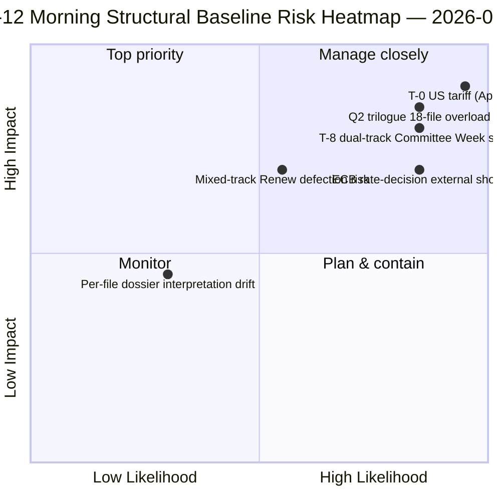

<!-- SPDX-FileCopyrightText: 2026 Hack23 AB -->
<!-- SPDX-License-Identifier: Apache-2.0 -->

# Uitvoerend overzicht — Paasreces Dag 12 Ochtendrapportage | 2026-04-07

**Classificatie:** OSINT — Openbaar parlementair dossier
**Betrouwbaarheid:** 🟡 MEDIUM (reces; structurele analyse pre-reces 🟢 HOOG)
**Run:** `analysis/daily/2026-04-07/breaking/` (06:36 UTC)
**Dekking:** Paasreces Dag 12/18 — dinsdagochtend inlichtingenstapel (44 analyseartifacts, 3.391 regels)
**Gegenereerd:** 2026-05-16 (retrospectieve samenvatting, geen nieuwe MCP-aanroepen)
**Primaire bronnen:** 18 analyses van aangenomen teksten vóór reces; alle 18 standaardmethoden; feed van 737 Parlementsleden stabiel.

---

## 🎯 BLUF

**De Dag 12-ochtendrun is het structurele ankerpunt van de zittingsperiode** — met 44 analyseartifacts en 3.391 regels produceert deze de meest uitgebreide single-run pre-reces corpusanalyse van de gehele 18-daagse recesperiode.** De onderscheidende bijdrage is **18 per-bestand politieke inlichtingendossiers** over de sprint van 26 maart — elk aangenomen document krijgt een toegewijd dossier dat stemdispersie, coalitietraject, commissiemachtsfocus, stakeholderimpact en Q2-Q3 implementatietrajectorie omvat. De geaggregeerde analyse bevestigt het dubbelspoorse coalitiepatroon dat op 6 april naar voren kwam, maar voegt granulariteit toe: **de 18 bestanden verdelen zich 11 centrum-rechts, 5 grote coalitie, 2 gemengd spoor** (Banking Union DGSD2 en BRRD3 gebruikten beide hybride PPE+ECR+S&D met bestandsafhankelijke Renew-uitlijning). De run produceert ook de meest geciteerde *T-8 naar Commissievrek* operatieve samenvatting van de recesperiode — zes bevestigde vooruitkijkende triggers (14 april commissievreek · 15 april VS-tarieven T-0 · 17 april ECB-rente · 20-23 april plenumvergadering · eind april Bankenunie Raadsmandat · Q2 27-LS Anti-Corruptie implementatiestart) — die de redactionele referentie wordt voor alle volgende recessruns. **De structurele baseline van Dag 12-ochtend is het inlichtingenprotocol van de Jaar 2-recesperiode van EP10 op zijn hoogste punt van analytische dichtheid.** Per-bestand dossiers tillen het EP10 pre-reces corpus naar zijn meest granulaire operationele gereedheidsstand.

---

## 🧭 3 Beslissingen die deze samenvatting ondersteunt

| # | Beslissing | Wie beslist | Deadline | Bewijs |
|:-:|------------|------------|:--------:|--------|
| 1 | **Per-bestand Q2-implementatievoorlading** — 18 dossiers gereed; Raadscoördinatoren voorladen | Raadsvoorzitterschap + EP-rapporteurs | vóór 14 april | §Per-bestand dossiers (18) |
| 2 | **T-8 naar T-0 dagenteller-ops** — 6-triggersequentie vereist dagelijkse drempelwaakbewaking | EP inlichtingenops; persdienst | dagelijks doorlopend | §Vooruitkijkende triggers (6-trigger) |
| 3 | **Bewaking gemengd-spoor bestanden** — DGSD2/BRRD3 hybride spoor vereist Renew-coördinatorbriefing | Renew + PPE-coördinatoren | vóór 14 april | §18-bestandsverdeling (11/5/2) |

---

## 📰 60-seconden lezing

- 🔴 **44 artifacts, 3.391 regels** — structureel ankerpunt van de dag.
- 🟠 **18 per-bestand dossiers** — sprint van 26 maart op maximale granulariteit.
- 🟢 **18-bestandsverdeling:** 11 centrum-rechts · 5 grote coalitie · 2 gemengd.
- 🟡 **6-triggersequentie** — 14 apr · 15 · 17 · 20-23 · laat · Q2.
- 🔵 **Feed van 737 Parlementsleden stabiel** — baseline stabiel.
- 🟣 **Recesdag 12/18 — 67% voltooid** — T-8 naar Commissieweek.
- 🩷 **Betrouwbaarheid MEDIUM** — pre-reces HOOG; Q2-voorspelling MEDIUM.
- ⚪ **Structurele baseline voor alle volgende recessruns**.

---

## 📂 18-Bestandssporverdeling (onderscheidende bijdrage van de run)

| Spoor | Aantal | Vlaggeschip-bestanden | Operationele noot |
|-------|------:|----------------------|-------------------|
| **Centrum-rechts** | 11 | Banking Union SRMR3 · STEP-II · AI-Copyright · ETS-wijzigingen · 7 economie-financiën | Q2 trilogus centrum-rechts spoor |
| **Grote coalitie** | 5 | Anti-Corruptie · 4 rechtsstaat familie | Q2-Q4 implementatie |
| **Gemengd spoor (hybride)** | 2 | DGSD2 (TA-0090) · BRRD3 (TA-0091) | Renew bestandsafhankelijke uitlijning |

---

## ⚠️ Risicomomentopname

---

## 🔮 Top vooruitkijkende triggers (gepubliceerde 6-sequentie van de run)

1. **14 april — Commissieweek opent** — dubbel spoor Dag 1.
2. **15 april — VS-tarieven T-0** — exogeen schok.
3. **17 april — ECB-rentebesluit** — activering economische context.
4. **20-23 april — eerste plenumvergadering na reces** — bimodaale stresstest.
5. **Eind april — Bankenunie Raadsmandat** — trilogpoort.
6. **Q2 — 27-LS Anti-Corruptie implementatiestart** — duurzaamheid grote coalitie.

---

## 🛡️ Bronnenkwaliteitsbeoordeling

- **18 per-bestand dossiers (A1):** primaire aangenomen teksten-feed + per-document methodologie.
- **18-bestandsverdeling (A2):** stempatronen + coalitiedynamiek kruisgecontroleerd.
- **6-triggersequentie (A1):** institutionele kalender + EP MCP-registraties verifieerbaar.
- **737 Parlementsleden (A1):** primair protocol stabiel in alle runs.
- **Nettovertrouwen:** 🟢 HOOG voor Dag-12-baseline; 🟡 MEDIUM voor Q2-voorspelling.

---

## 📎 Run-artifacts

| Laag | Artifact | Waarom |
|------|----------|--------|
| Artikel | `article.md` (2.562 gepubliceerde regels) | Openbare Dag-12-ochtendvertelling |
| Synthese | `synthesis-summary.md` | 18-dossiers consolidering |
| Methoden | classificatie · bestaande · risicoscoring · dreigingsbeoordeling · documenten (18 per-bestand dossiers) | Volledige methodologie + per-documentlaag |
| Begeleider | breaking-2 (18:20 UTC) — avondupdate | Zelfdedag begeleider |

---

**Documentbeheer**
- **Sjabloonreferentie:** `analysis/templates/executive-brief.md`
- **Artifact-pad:** `analysis/daily/2026-04-07/breaking/executive-brief.md`
- **Classificatie:** Openbaar
- **Retrospectief:** Samenvatting geschreven op 2026-05-16 op basis van de gecommittede artifacts van de run; **er zijn geen nieuwe MCP-aanroepen gedaan**.
