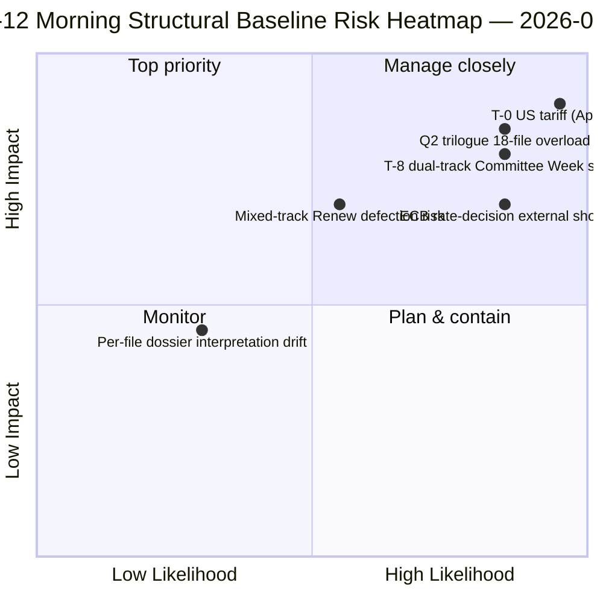

<!-- SPDX-FileCopyrightText: 2026 Hack23 AB -->
<!-- SPDX-License-Identifier: Apache-2.0 -->

# Sammendrag — Påskeopphold Dag 12 Morgenetterretning | 2026-04-07

**Klassifisering:** OSINT — Offentlig parlamentarisk protokoll
**Konfidens:** 🟡 MEDIUM (opphold; strukturell analyse fra før oppholdet 🟢 HØY)
**Kjøring:** `analysis/daily/2026-04-07/breaking/` (06:36 UTC)
**Dekning:** Påskeopphold Dag 12/18 — tirsdags morgen etterretningsstabel (44 analyseartifakter, 3 391 linjer)
**Generert:** 2026-05-16 (retrospektivt sammendrag, ingen nye MCP-kall)
**Primære kilder:** 18 analyser av vedtatte tekster fra før oppholdet; alle 18 standardmetoder; 737 MEP-feed stabilt.

---

## 🎯 BLUF

**Dag-12 morgenkjøringen er mandatperiodens strukturelle ankerpunkt** — med 44 analyseartifakter og 3 391 linjer produserer den den mest heldekkende enkelt-kjørings korpusanalyse fra perioden før oppholdet i løpet av hele 18-dagers oppholdsperioden.** Dets særegne bidrag er **18 per-fil politiske etterretningsdossier** om spurtaksjonen 26. mars — hvert vedtatt dokument får et dedikert dossier som dekker stemmefordeling, koalisjonsspor, utvalgsmagtens fokuspunkt, interessentpåvirkning og Q2-Q3 implementeringstrajectory. Den aggregerte analysen bekrefter det dobbeltsporede koalitionsmønsteret som dukket opp 6. april, men tillegger granularitet: **de 18 filene deler seg 11 høyresentrerte, 5 storkoalisjon, 2 blandede spor** (Banking Union DGSD2 og BRRD3 brukte begge hybrid PPE+ECR+S&D med filbetinget Renew-tilpasning). Kjøringen produserer også oppholdsperiodens mest siterte *T-8 til komitéuke* operative sammendrag — seks bekreftede fremadrettede triggere (14. april komitéuke · 15. april USA-toll T-0 · 17. april ECB-rente · 20-23. april plenarmøte · sent april Banking Union rådsmandat · Q2 27-MS transponering) — som blir den redaksjonelle referansen for alle etterfølgende opphold-kjøringer. **Dag-12 morgenens strukturelle baseline er EP10 År 2-oppholdsperiodens etterretningsprotokoll på sitt høyeste analytiske nivå.** Per-fil dossier løfter EP10s pre-opphold-korpus til sin mest granulerte operative beredskapstilstand.

---

## 🧭 3 Beslutninger dette sammendraget støtter

| # | Beslutning | Beslutningstaker | Frist | Dokumentasjon |
|:-:|------------|------------------|:-----:|---------------|
| 1 | **Per-fil Q2-implementeringsforberedelse** — 18 dossier klare; forhåndslast rådskoordinatorer | Rådsformannskapet + EP-ordførere | innen 14. april | §Per-fil dossier (18) |
| 2 | **T-8 til T-0 dagsteller-ops** — 6-triggersekvensen krever løpende daglig tersklovervåking | EP-etterretningsops; pressetjeneste | løpende daglig | §Fremadrettede triggere (6-trigger) |
| 3 | **Overvåking av blandede sporsfiler** — DGSD2/BRRD3 hybridspor krever Renew-koordinatorbriefing | Renew + PPE-koordinatorer | innen 14. april | §18-filsdeling (11/5/2) |

---

## 📰 60-sekunders lesning

- 🔴 **44 artifakter, 3 391 linjer** — dagens strukturelle ankerpunkt.
- 🟠 **18 per-fil dossier** — 26. mars-spurten i maksimal granularitet.
- 🟢 **18-filsdeling:** 11 høyresentrert · 5 storkoalisjon · 2 blandet.
- 🟡 **6-triggersekvens** — 14. apr · 15. · 17. · 20-23. · sent · Q2.
- 🔵 **737 MEP-feed stabilt** — baseline holder.
- 🟣 **Oppholdsdag 12/18 — 67% fullført** — T-8 til komitéuke.
- 🩷 **Konfidens MEDIUM** — før oppholdet HØY; Q2-prognose MEDIUM.
- ⚪ **Strukturell baseline for alle etterfølgende opphold-kjøringer**.

---

## 📂 18-Filsdeling (kjøringens særegne bidrag)

| Spor | Antall | Flaggskipsfiler | Operativ merknad |
|------|-------:|----------------|-----------------|
| **Høyresentrert** | 11 | Banking Union SRMR3 · STEP-II · AI-Copyright · ETS-endringer · 7 økonomi-finans | Q2 trilog høyresentrert spor |
| **Storkoalisjon** | 5 | Anti-Korrupsjon · 4 rettsstatsfamilie | Q2-Q4 transponering |
| **Blandet spor (hybrid)** | 2 | DGSD2 (TA-0090) · BRRD3 (TA-0091) | Renew filbetinget tilpasning |

---

## ⚠️ Risikoøyeblikksbilde

---

## 🔮 Topp fremadrettede triggere (kjøringens publiserte 6-sekvens)

1. **14. april — Komitéuken åpner** — dobbeltspor Dag 1.
2. **15. april — USA-toll T-0** — eksogent sjokk.
3. **17. april — ECB-rentebeslutning** — aktivering av økonomisk kontekst.
4. **20-23. april — første plenarmøte etter oppholdet** — bimodal stresstest.
5. **Sent april — Banking Union rådsmandat** — triloggport.
6. **Q2 — 27-MS Anti-Korrupsjon transponeringsstart** — storkoalisjonens holdbarhet.

---

## 🛡️ Kildekvalitetsvurdering

- **18 per-fil dossier (A1):** primært vedtatte tekster-feed + per-dokument metodologi.
- **18-filsdeling (A2):** avstemningsmønstre + koalisjonsdynamikk kryssverifisert.
- **6-triggersekvens (A1):** institusjonell kalender + EP MCP-poster verifiserbare.
- **737 MEP-er (A1):** primær protokoll stabil på tvers av alle kjøringer.
- **Netto konfidens:** 🟢 HØY for Dag-12-baseline; 🟡 MEDIUM for Q2-prognose.

---

## 📎 Kjøringsartifakter

| Lag | Artifakt | Hvorfor |
|-----|----------|---------|
| Artikkel | `article.md` (2 562 linjer publisert) | Offentlig Dag-12 morgenfortelling |
| Syntese | `synthesis-summary.md` | 18-dossier konsolidering |
| Metoder | klassifisering · eksisterende · risikovurdering · trusselvurdering · dokumenter (18 per-fil dossier) | Full metodologi + per-dokumentlag |
| Ledsager | breaking-2 (18:20 UTC) — kveldsoppdatering | Sammedags ledsager |

---

**Dokumentkontroll**
- **Malonreferanse:** `analysis/templates/executive-brief.md`
- **Artifaktsti:** `analysis/daily/2026-04-07/breaking/executive-brief.md`
- **Klassifisering:** Offentlig
- **Retrospektiv:** Sammendrag skrevet 2026-05-16 fra kjøringens lagrede artifakter; **ingen nye MCP-kall ble foretatt**.
