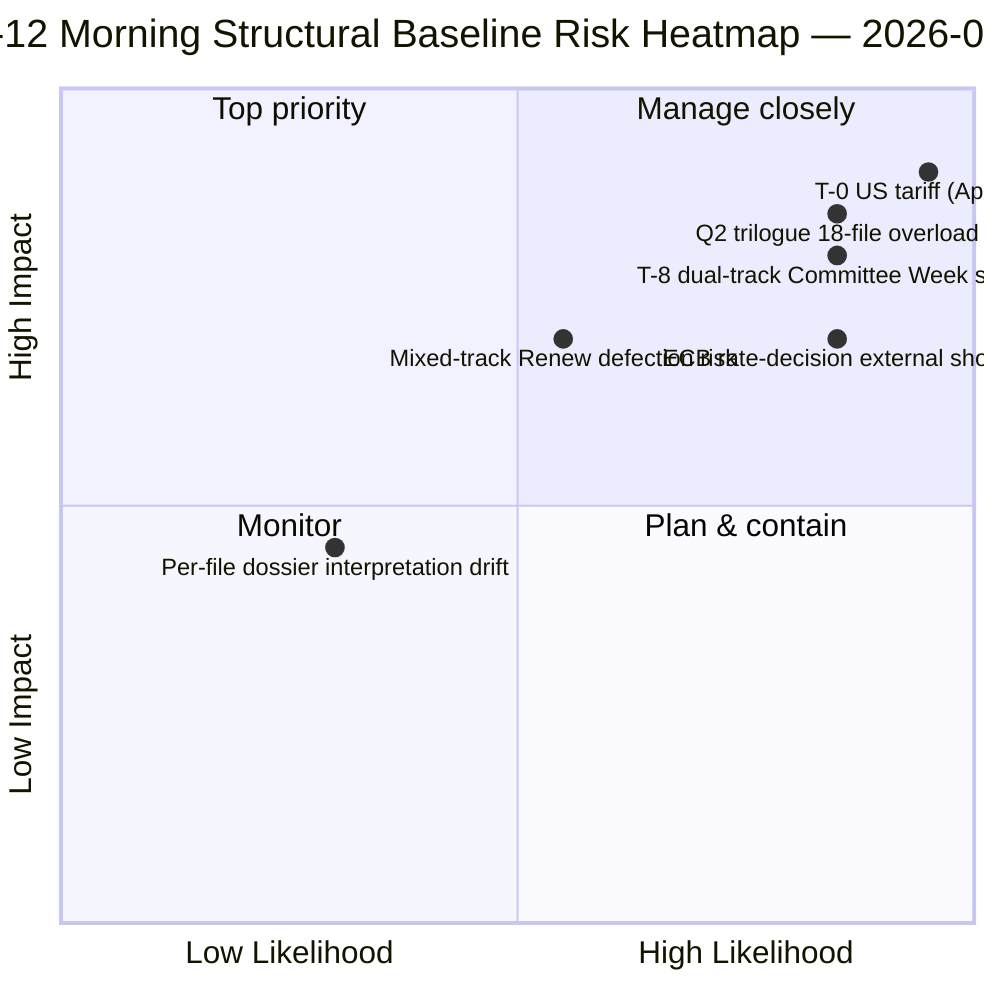

<!-- SPDX-FileCopyrightText: 2026 Hack23 AB -->
<!-- SPDX-License-Identifier: Apache-2.0 -->

# Sammanfattning — Påskuppehåll Dag 12 Morgonunderrättelse | 2026-04-07

**Klassificering:** OSINT — Offentlig parlamentarisk protokoll
**Konfidensgrad:** 🟡 MEDIUM (uppehåll; förupphållsstrukturell analys 🟢 HÖG)
**Körning:** `analysis/daily/2026-04-07/breaking/` (06:36 UTC)
**Täckning:** Påskuppehåll Dag 12/18 — tisdag morgon underrättelsestapel (44 analysartefakter, 3 391 rader)
**Genererad:** 2026-05-16 (retrospektivt sammandrag, inga nya MCP-anrop)
**Primära källors:** 18 pre-uppehålls antagna textsanalyser; alla 18 standardmetoder; 737 MEP-flöde stabilt.

---

## 🎯 BLUF

**Dag-12 morgonkörningens genombrott är mandatperiodens strukturella ankare** — med 44 analysartefakter och 3 391 rader producerar den den mest heltäckande enkla körningens förupphålls-korpusanalysen under hela 18-dagarsperioden.** Dess utmärkande bidrag är **18 per-fil politiska underrättelsedossiers** om spurtaktionen den 26 mars — varje antagen text får en dedikerad dossier som täcker röstspridning, koalitionsspår, utskottsmaktens fokuspunkt, intressenters påverkan och Q2-Q3 implementeringsstrategin. Den sammanlagda analysen bekräftar det dubbla koalitionsmönstret som framträdde den 6 april men tillför detaljrikedom: **de 18 filerna delar sig 11 högercentristiska, 5 storkoalition, 2 blandspår** (Banking Union DGSD2 och BRRD3 använde båda hybrid PPE+ECR+S&D med filberoende Renew-anpassning). Körningen producerar också uppehållsperiodens mest citerade *T-8 till utskottsveckan* operativa sammanfattning — sex bekräftade framåtutlösare (14 april utskottsvecka · 15 april USA-tullar T-0 · 17 april ECB-ränta · 20-23 april plenarmöte · slutet april Banking Union rådsmandat · Q2 27-MS-transponering) — som blir den redaktionella referensen för alla efterföljande uppehållskörningar. **Dag-12 morgonens strukturella baslinje är EP10 År 2-uppehållets underrättelseprotokoll på sin höjdpunkt av analytisk densitet.** Per-fil dossiers höjer EP10:s förupphålls-korpus till sitt mest granulerade operativa beredskapsläge.

---

## 🧭 3 Beslut som detta sammandrag stödjer

| # | Beslut | Beslutsfattare | Deadline | Bevis |
|:-:|--------|----------------|:--------:|-------|
| 1 | **Per-fil Q2-implementeringsförladdning** — 18 dossiers redo; förlasta rådskoordinatorer | Rådsordförandeskapet + EP-föredragande | senast 14 april | §Per-fil dossiers (18) |
| 2 | **T-8 till T-0 dagsräknar-ops** — 6-utlösarsekvensen kräver löpande daglig tröskelövervakning | EP-underrättelseops; pressavdelning | rullande dagligen | §Framåtutlösare (6-utlösarsekvens) |
| 3 | **Blandspårfiler bevakning** — DGSD2/BRRD3 hybridspår kräver Renew-koordinatorbriefing | Renew + PPE-koordinatorer | senast 14 april | §18-filsuppdelning (11/5/2) |

---

## 📰 60-sekunders läsning

- 🔴 **44 artefakter, 3 391 rader** — dagens strukturella ankare.
- 🟠 **18 per-fil dossiers** — 26 mars-spurten i maximal granularitet.
- 🟢 **18-filsuppdelning:** 11 högercentristisk · 5 storkoalition · 2 blandat.
- 🟡 **6-utlösarsekvens** — 14 apr · 15 · 17 · 20-23 · sen · Q2.
- 🔵 **737 MEP-flöde stabilt** — baslinje håller.
- 🟣 **Uppehållsdag 12/18 — 67% genomfört** — T-8 till utskottsveckan.
- 🩷 **Konfidensgrad MEDIUM** — förupphåll HÖG; Q2-prognos MEDIUM.
- ⚪ **Strukturell baslinje för alla efterföljande uppehållskörningar**.

---

## 📂 18-Filsuppdelning (körningens utmärkande bidrag)

| Spår | Antal | Flaggskepp-filer | Operativ notering |
|------|------:|-----------------|-------------------|
| **Högercentristisk** | 11 | Banking Union SRMR3 · STEP-II · AI-Copyright · ETS-ändringar · 7 ekonomi-finans | Q2 trilogue högercentristiskt spår |
| **Storkoalition** | 5 | Anti-korruption · 4 rättsstatsfamilj | Q2-Q4 transponering |
| **Blandat spår (hybrid)** | 2 | DGSD2 (TA-0090) · BRRD3 (TA-0091) | Renew filberoende anpassning |

---

## ⚠️ Riskögonblicksbild

---

## 🔮 Topp framåtutlösare (körningens publicerade 6-sekvens)

1. **14 april — Utskottsveckan öppnar** — dubbelt spår Dag 1.
2. **15 april — USA-tullar T-0** — exogent chock.
3. **17 april — ECB-räntebeslut** — ekonomisk kontext aktivering.
4. **20-23 april — första plenarmötet efter uppehåll** — bimodalt stresstest.
5. **Slutet april — Banking Union rådsmandat** — trialog-port.
6. **Q2 — 27-MS Anti-korruption transponeringsstart** — storkoalitionens hållbarhet.

---

## 🛡️ Källkvalitetsbedömning

- **18 per-fil dossiers (A1):** primärt antagna texter-flöde + per-dokument metodik.
- **18-filsuppdelning (A2):** röstmönster + koalitionsdynamik korsverifierat.
- **6-utlösarsekvens (A1):** institutionell kalender + EP MCP-poster verifierbara.
- **737 MEP:er (A1):** primärt protokoll stabilt i alla körningar.
- **Nettokonfidens:** 🟢 HÖG för Dag-12-baslinje; 🟡 MEDIUM för Q2-prognos.

---

## 📎 Körningsartefakter

| Lager | Artefakt | Varför |
|-------|----------|--------|
| Artikel | `article.md` (2 562 rader publicerade) | Offentlig Dag-12 morgon-berättelse |
| Syntes | `synthesis-summary.md` | 18-dossiers konsolidering |
| Metoder | klassificering · befintliga · riskbedömning · hotbedömning · dokument (18 per-fil dossiers) | Fullständig metodik + per-dokumentlager |
| Kompanjong | breaking-2 (18:20 UTC) — kvällsuppdatering | Samdagskompanjong |

---

**Dokumentkontroll**
- **Mallreferens:** `analysis/templates/executive-brief.md`
- **Artefaktsökväg:** `analysis/daily/2026-04-07/breaking/executive-brief.md`
- **Klassificering:** Offentlig
- **Retrospektiv:** Sammandrag skrivet 2026-05-16 från körningens sparade artefakter; **inga nya MCP-anrop gjordes**.
