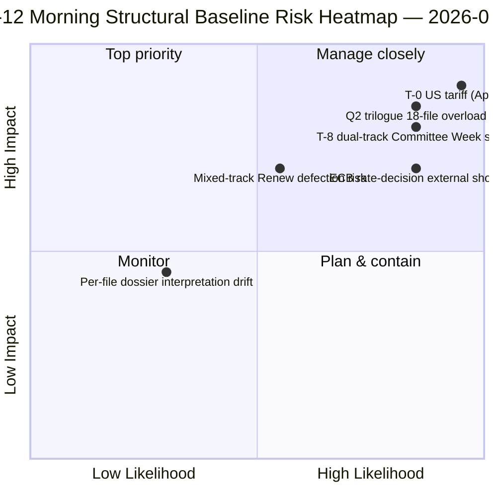

<!-- SPDX-FileCopyrightText: 2026 Hack23 AB -->
<!-- SPDX-License-Identifier: Apache-2.0 -->

# 行政简报 — 复活节休会第12天 晨间情报报告 | 2026-04-07

**分类:** OSINT — 公开议会档案
**可信度:** 🟡 中等（休会期间；休会前结构分析 🟢 高）
**运行:** `analysis/daily/2026-04-07/breaking/` (06:36 UTC)
**覆盖范围:** 复活节休会第12天/18 — 周二晨间情报包（44项分析产出，3,391行）
**生成日期:** 2026-05-16（回溯性摘要，无新MCP调用）
**主要来源:** 休会前18份已采纳文本分析；18种方法论全部默认适用；737名欧洲议会议员数据源稳定。

---

## 🎯 BLUF

**第12天晨间运行是本届立法期的结构性支柱** — 凭借44项分析产出和3,391行内容，本次运行在整个18天休会期间产出了最全面的单次运行休会前语料库分析。**突出贡献**是针对3月26日冲刺的**18份逐文件政治情报档案**——每份已采纳文本均获得专属档案，涵盖投票分布、联盟轨迹、委员会权力焦点、利益相关方影响及Q2-Q3执行轨迹。汇总分析印证了4月6日浮现的双轨联盟模式，同时增补了更多细节：**18份文件分布为中右翼11份、大联盟5份、混合轨道2份**（银行业联盟DGSD2和BRRD3均采用PPE+ECR+S&D混合路线，并按文件设有条件性Renew协同）。本次运行还产出了休会期间引用最多的*T-8委员会周*行动摘要——六项经确认的前瞻性触发因素（4月14日委员会周·4月15日美国关税T-0·4月17日欧洲央行利率·4月20-23日全体会议·4月底银行业联盟理事会授权·Q2二十七成员国反腐执行启动）——成为此后所有休会运行的编辑参考基准。**第12天晨间的结构性基线是EP10第二年休会情报记录在分析密度上的顶峰。**逐文件档案将EP10休会前语料库提升至最精细化的行动准备状态。

---

## 🧭 本简报支持的3项决策

| # | 决策 | 决策者 | 截止日期 | 依据 |
|:-:|------|--------|:--------:|------|
| 1 | **逐文件Q2执行预载入** — 18份档案就绪；预载入理事会协调员 | 理事会轮值主席国 + 欧洲议会报告员 | 4月14日前 | §逐文件档案（18份） |
| 2 | **T-8至T-0天数计数器行动** — 6触发因素序列需每日阈值监控 | 欧洲议会情报行动；新闻服务 | 每日持续 | §前瞻性触发（6触发） |
| 3 | **混合轨道文件监控** — DGSD2/BRRD3混合轨道需进行Renew协调员情况简报 | Renew + PPE协调员 | 4月14日前 | §18文件分布（11/5/2） |

---

## 📰 60秒速读

- 🔴 **44项产出，3,391行** — 当天结构性支柱。
- 🟠 **18份逐文件档案** — 3月26日冲刺最大粒度分析。
- 🟢 **18文件分布：** 中右翼11 · 大联盟5 · 混合2。
- 🟡 **6触发因素序列** — 4/14 · 15 · 17 · 20-23 · 月底 · Q2。
- 🔵 **737名欧洲议会议员数据源稳定** — 基线稳定。
- 🟣 **休会第12天/18 — 67%已完成** — 距委员会周T-8。
- 🩷 **可信度中等** — 休会前高；Q2预测中等。
- ⚪ **此后所有休会运行的结构性基线。**

---

## 📂 18文件轨道分布（运行突出贡献）

| 轨道 | 数量 | 旗舰文件 | 行动备注 |
|------|----:|----------|---------|
| **中右翼** | 11 | 银行业联盟SRMR3 · STEP-II · AI版权 · ETS修正案 · 经济财政7件 | Q2中右翼三方对话轨道 |
| **大联盟** | 5 | 反腐败 · 法治家族4件 | Q2-Q4执行 |
| **混合轨道（混合式）** | 2 | DGSD2 (TA-0090) · BRRD3 (TA-0091) | 按文件条件性Renew协同 |

---

## ⚠️ 风险快照

---

## 🔮 主要前瞻性触发因素（运行公布的6序列）

1. **4月14日 — 委员会周开幕** — 双轨第1天。
2. **4月15日 — 美国关税T-0** — 外生性冲击。
3. **4月17日 — 欧洲央行利率决定** — 经济背景激活。
4. **4月20-23日 — 休会后首次全体会议** — 双峰压力测试。
5. **4月底 — 银行业联盟理事会授权** — 三方对话门槛。
6. **Q2 — 二十七成员国反腐执行启动** — 大联盟可持续性。

---

## 🛡️ 信源质量评估

- **18份逐文件档案（A1）：** 已采纳文本主要数据源 + 逐文件方法论。
- **18文件分布（A2）：** 投票模式 + 联盟动态交叉核验。
- **6触发因素序列（A1）：** 机构日历 + 欧洲议会MCP记录可核实。
- **737名欧洲议会议员（A1）：** 所有运行中主要记录稳定。
- **综合可信度：** 🟢 第12天基线高；🟡 Q2预测中等。

---

## 📎 运行产出

| 层级 | 产出 | 原因 |
|------|------|------|
| 文章 | `article.md`（已发布2,562行） | 第12天晨间公开叙述 |
| 综合 | `synthesis-summary.md` | 18份档案整合 |
| 方法论 | 分类 · 现有 · 风险评分 · 威胁评估 · 文件（18份逐文件档案） | 完整方法论 + 逐文件层级 |
| 配套 | breaking-2（18:20 UTC）— 傍晚更新 | 当日配套运行 |

---

**文件管理**
- **模板参考：** `analysis/templates/executive-brief.md`
- **产出路径：** `analysis/daily/2026-04-07/breaking/executive-brief.md`
- **分类：** 公开
- **回溯性：** 本摘要于2026-05-16依据已提交运行产出编写；**未进行新MCP调用**。
