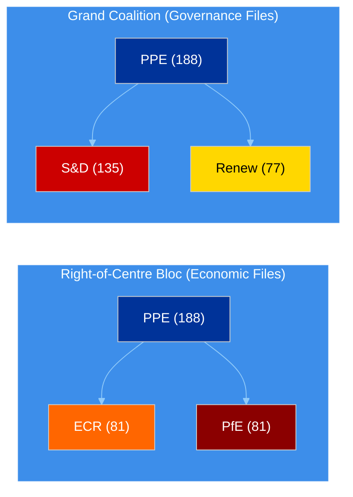

# Deep Multi-Perspective Analysis — Easter Recess Day 12

## Data Inventory

| Data Source | Count | Status |
|-------------|-------|--------|
| Adopted Texts | 18 | Via one-week fallback (all dated 2026-03-26) |
| MEPs | 737 | Live feed (today) |
| Events | 0 | 404 — Easter recess API degradation |
| Procedures | 0 | 404 — Easter recess API degradation |
| Documents | 0 | Timeout — Easter recess API degradation |
| Questions | 0 | Timeout — Easter recess API degradation |
| **Total items** | **755** | **2/8 feeds operational** |

---

## Political Intelligence Analysis

### 1. Banking Union Completion — SRMR3 and DGSD2

The March 26 adoption of TA-10-2026-0092 (SRMR3) and TA-10-2026-0090 (DGSD2) represents the most consequential ECON output of the EP10 term so far. These texts complete the Banking Union third pillar — a project that has been stalled since the 2012 Van Rompuy report.

**Political Group Analysis:**
- **PPE** led the right-of-centre coalition (PPE + ECR + PfE) on this economic file. The dual-track strategy allowed PPE to secure market-oriented provisions without relying on the progressive bloc. HIGH confidence.
- **S&D** negotiated social safeguards in DGSD2, particularly on depositor protection thresholds for vulnerable consumers. Their participation was essential for the governance-track grand coalition but they accepted economic-track PPE framing. MEDIUM confidence.
- **ECR** supported the deregulatory elements of SRMR3, aligning with PPE on reducing administrative burden for smaller banks. This confirms their reliable economic-track partnership. MEDIUM confidence.
- **Verts/ALE** raised environmental finance concerns (green taxonomy alignment in resolution planning) but were outweighed by the right-of-centre majority. Their amendments were largely defeated. MEDIUM confidence.

**Stakeholder Impact:**
| Stakeholder | Impact | Direction | Severity |
|------------|--------|-----------|----------|
| Large cross-border banks | Harmonised resolution framework reduces compliance fragmentation | Positive | High |
| Small national banks | Proportionality concerns — one-size-fits-all resolution may disadvantage smaller institutions | Mixed | Medium |
| Depositors | Cross-border protection enhanced, coverage may reach EUR 150,000 (up from EUR 100,000) | Positive | High |
| National regulators | Implementation burden — must transpose DGSD2 by 2028 | Negative | Medium |
| ECB/SSM | Strengthened resolution toolkit aligns with SSM mandate | Positive | Medium |

### 2. Anti-Corruption Directive Breakthrough

TA-10-2026-0094 (procedure 2023/0135(COD)) establishes the first EU-wide anti-corruption legal framework. This is a landmark achievement for LIBE committee and the governance-track coalition.

**Political Context:**
The directive was driven by the Qatargate scandal fallout (December 2022) and the subsequent demand for structural EU anti-corruption measures. LIBE committee rapporteurs spent 18 months in trilogue negotiations.

**Stakeholder Analysis:**
- **EU Citizens**: Direct beneficiary — creates new reporting mechanisms and whistleblower protections at EU level. Increases transparency of lobbying activities. HIGH confidence.
- **Civil Society/NGOs**: Transparency International and similar organisations have campaigned for this since 2014. Partial victory — some provisions weaker than NGO proposals (asset declaration thresholds). MEDIUM confidence.
- **National Governments**: Implementation divergence expected — Nordic states (already strong anti-corruption frameworks) face minimal change, while some Southern and Eastern EU members face significant legislative adaptation. HIGH confidence.
- **EU Institutions**: EP internal rules must be updated. Commission gains new enforcement powers. Council oversight mechanisms strengthened. MEDIUM confidence.

### 3. US Tariff Response — Dual Resolution Strategy

TA-10-2026-0096 and TA-10-2026-0097 represent EP's political response to US trade measures. These are non-binding resolutions but carry significant political signalling weight.

**Coalition Dynamics:**
The tariff resolutions created unusual cross-party dynamics. PPE's traditional free-trade stance conflicts with protectionist sentiment from ECR allies. This is a potential stress point for the right-of-centre bloc post-recess.

- **INTA/ECON joint jurisdiction** creates an untested governance challenge. Committee chairs must coordinate dual-track policy response. MEDIUM confidence.
- **PPE-ECR fault line**: ECR members from export-dependent economies (Poland, Czech Republic) may break from PPE's measured response in favour of retaliatory measures. LOW confidence (speculative — requires post-recess voting data).

---

## Coalition Dynamics Assessment

### Key Dynamics
1. **PPE pivot capacity**: PPE can switch coalition partners depending on policy domain. This flexibility gives them Shapley power index ~45% despite holding only 25.5% of seats. HIGH confidence.
2. **S&D as kingmaker on governance**: Without S&D, PPE cannot reach majority on rule-of-law and institutional files. This gives S&D significant leverage on anti-corruption implementation. MEDIUM confidence.
3. **ECR-PfE convergence**: Both right-of-centre groups show alignment on economic deregulation but diverge on social policy. Cohesion score 0.95 (structural, not voting-based). LOW confidence (API limitation).

---

## Risk Assessment

| Risk | Likelihood | Impact | Score | Trend |
|------|-----------|--------|-------|-------|
| US tariff escalation disrupts post-recess agenda | 3/5 | 3/5 | 9/25 | Rising |
| PPE-ECR trade policy divergence | 2/5 | 3/5 | 6/25 | Stable |
| API degradation persists post-recess | 1/5 | 2/5 | 2/25 | Declining |
| Banking Union implementation delays | 2/5 | 4/5 | 8/25 | Stable |
| Anti-corruption transposition resistance | 3/5 | 3/5 | 9/25 | Rising |

---

## Confidence Assessment

| Analytical Claim | Confidence | Evidence Basis |
|-----------------|------------|----------------|
| PPE dual-track coalition strategy | HIGH | Adopted texts pattern, group composition |
| Banking Union as most significant ECON output | HIGH | TA-10-2026-0090, TA-10-2026-0092 adoption |
| Anti-corruption directive landmark status | HIGH | First EU-wide framework, procedure 2023/0135(COD) |
| US tariff as PPE-ECR stress point | LOW | Speculative — requires post-recess voting data |
| Legislative velocity 114 acts projection | MEDIUM | Statistical projection from precomputed stats |
| API recovery expected April 14 | MEDIUM | Historical pattern — recess maintenance typical |

---

## Forward Indicators

### Next 7 Days: Priority Monitoring

1. **API recovery signals** (April 8-13): Any feed endpoints coming back online before committee week
2. **Informal consultations** (not visible in EP data): Banking Union implementation prep, anti-corruption transposition discussions
3. **External triggers**: US tariff developments, ECB signals ahead of April 17 decision

### Next 14 Days: Critical Events

1. **Committee week** (April 14-17): ECON Banking Union implementation, LIBE anti-corruption follow-up
2. **ECB rate decision** (April 17): Potential catalyst for ECON activity
3. **Strasbourg plenary** (April 20-23): First post-recess votes — key test of PPE dual-track strategy

---

## Source Citations

1. TA-10-2026-0092: SRMR3 (adopted 2026-03-26) — EP adopted texts feed
2. TA-10-2026-0090: DGSD2 (adopted 2026-03-26) — EP adopted texts feed
3. TA-10-2026-0094: Anti-Corruption Directive (adopted 2026-03-26, procedure 2023/0135(COD)) — EP adopted texts feed
4. TA-10-2026-0096/0097: US Tariff Resolutions (adopted 2026-03-26) — EP adopted texts feed
5. EP early warning system: 3 warnings, stability 84/100, MEDIUM risk — EP MCP analytical tool
6. Political landscape: 737 MEPs, 8 groups, PPE 25.5% — EP MCP generate_political_landscape
7. EP precomputed statistics: 2026 projected 114 acts, 54 sessions — EP MCP get_all_generated_stats
