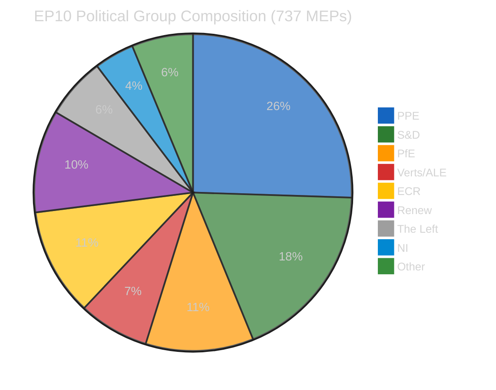
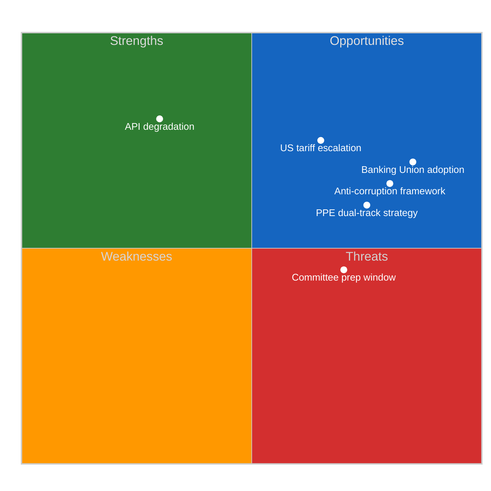

# Political Intelligence Synthesis — Easter Recess Day 12

Analysis Date: 2026-04-07 | Confidence: MEDIUM | Breaking News: NONE | Recess Day: 12/18

## Synthesis Context

| Field | Value |
|-------|-------|
| **Synthesis ID** | SYN-2026-04-07-002 |
| **Analysis Date** | 2026-04-07 06:36 UTC |
| **Documents Analyzed** | 18 adopted texts (via one-week fallback) |
| **Analysis Period** | 2026-03-31 to 2026-04-07 |
| **Produced By** | news-breaking workflow |
| **Overall Confidence** | MEDIUM |
| **Breaking News Determination** | No today-dated items — Easter recess Day 12/18 |

---

## Intelligence Dashboard

### EP Data Availability Status

| Feed Endpoint | Status | Last Successful | Fallback Used |
|--------------|--------|-----------------|---------------|
| Adopted Texts | Degraded | one-week fallback | Yes — 18 EP10 items |
| MEPs | Full | Today (737 MEPs) | No |
| Events | Unavailable | 404 (today + one-week) | Failed |
| Procedures | Unavailable | 404 (today + one-week) | Failed |
| Documents | Unavailable | Timeout (120s) | Failed |
| Plenary Documents | Unavailable | Timeout (120s) | Failed |
| Committee Documents | Unavailable | Timeout (120s) | Failed |
| Parliamentary Questions | Unavailable | Timeout (120s) | Failed |

**Data Availability Assessment**: Sparse (2/8 feeds operational). MEDIUM confidence — analysis derived from adopted texts and MEP composition only.

---

## Political Landscape Overview

### Group Power Dynamics

| Political Group | Seats | Share | Bloc | Role |
|----------------|-------|-------|------|------|
| **PPE** | ~188 | 25.5% | Centre-Right | Dominant — dual-track coalition leader |
| **S&D** | ~135 | 18.3% | Centre-Left | Grand coalition partner (governance) |
| **ECR** | ~81 | 11.0% | Right | Right-of-centre bloc partner |
| **PfE** | ~81 | 11.0% | Far-Right | Economic files ally to PPE+ECR |
| **Renew** | ~77 | 10.4% | Centre-Liberal | Grand coalition third partner |
| **Verts/ALE** | ~53 | 7.2% | Green-Left | Opposition on economic files |
| **The Left** | ~46 | 6.2% | Left | Structural opposition |
| **NI** | ~30 | 4.1% | Non-aligned | Variable |

**Key pattern** HIGH confidence: PPE operates a dual-track coalition strategy:
- Economic/regulatory files (SRMR3, DGSD2): PPE + ECR + PfE = ~350 seats (47.5%) — needs additional support
- Governance/anti-corruption: PPE + S&D + Renew = ~400 seats (54.3%) — working majority

---

## Pre-Recess Legislative Output Assessment

The March 26 plenary adopted 18 EP10 texts before Easter recess — a significant legislative sprint.

### Tier 1: High Significance

| ID | Title | Policy Area | Significance |
|----|-------|-------------|--------------|
| TA-10-2026-0092 | SRMR3 — Single Resolution Mechanism Regulation revision | Banking Union | HIGH — Completes Banking Union third pillar |
| TA-10-2026-0090 | DGSD2 — Deposit Guarantee Schemes Directive revision | Banking Union | HIGH — Cross-border depositor protection |
| TA-10-2026-0094 | Anti-Corruption Directive (2023/0135(COD)) | Rule of Law | HIGH — First EU-wide corruption framework |

### Tier 2: Medium Significance

| ID | Title | Policy Area | Significance |
|----|-------|-------------|--------------|
| TA-10-2026-0096 | EU Response to US Tariffs — Resolution I | Trade | MEDIUM — Political signal, non-binding |
| TA-10-2026-0097 | EU Response to US Tariffs — Resolution II | Trade | MEDIUM — Complementary response |

### Tier 3: Routine

| ID Range | Count | Assessment |
|----------|-------|------------|
| TA-10-2026-0087 to -0104 (excluding above) | 13 | Routine legislative business, MEDIUM confidence |

---

## SWOT Analysis — Easter Recess Day 12

### Strengths
1. **Banking Union legislative achievement** (TA-10-2026-0090, TA-10-2026-0092) — ECON committee delivered two landmark texts before recess. Implementation planning expected April 14-17. HIGH confidence.
2. **Anti-corruption breakthrough** (TA-10-2026-0094) — First EU-wide corruption framework establishes new enforcement mechanism. LIBE committee success. HIGH confidence.
3. **Legislative velocity** — EP10 on track for 114 acts in 2026 vs 78 in 2025 (+46%). 2.11 acts per session, above EP10 average. MEDIUM confidence (projected).

### Weaknesses
1. **EP API severe degradation** — 6/8 feed endpoints returning 404 or timeout. Only adopted texts (via fallback) and MEPs operational. Monitoring capacity significantly reduced. HIGH confidence.
2. **Data coverage gaps** — No events, procedures, documents, or questions data available. Intelligence assessment based on partial dataset. HIGH confidence.

### Opportunities
1. **Post-recess committee preparation** — April 14-17 committee week offers implementation planning window for Banking Union texts. ECON rapporteurs expected to table implementation roadmaps. MEDIUM confidence.
2. **ECB rate decision** (17 April) — Could catalyse ECON committee activity and provide external validation for Banking Union reforms. MEDIUM confidence.
3. **US tariff response coordination** — INTA/ECON joint jurisdiction challenge creates opportunity for cross-committee governance innovation. LOW confidence (speculative).

### Threats
1. **US tariff escalation** — Ongoing trade tensions require coordinated EU response. INTA/ECON joint jurisdiction untested. Post-recess urgency expected. MEDIUM confidence.
2. **Recess legislative gap** — 12 days without plenary activity means delayed responses to external events. Informal consultations not visible in EP data. HIGH confidence.

---

## Stakeholder Assessment

### EP Political Groups
- **PPE**: Dominant position consolidated. Dual-track strategy validated by pre-recess output. Shapley power index ~45%. Post-recess test: first Strasbourg plenary April 20-23. HIGH confidence.
- **S&D**: Successfully co-delivered anti-corruption directive (governance track). Banking Union texts reflect grand coalition partnership. MEDIUM confidence.
- **ECR**: Right-of-centre bloc partner on economic files. US tariff position may diverge from PPE mainstream. Watch April plenary. MEDIUM confidence.

### National Governments
- Banking Union texts (SRMR3, DGSD2) require Council agreement and national transposition. Implementation timeline: 2027-2028. Member states with weaker deposit guarantee schemes benefit most. MEDIUM confidence.

### EU Citizens
- Anti-corruption directive directly impacts citizen trust in EU institutions. Cross-border depositor protection (DGSD2) provides tangible consumer benefit. MEDIUM confidence.

### Industry and Business
- Banking sector faces compliance adaptation for SRMR3 and DGSD2. Cross-border banks benefit from harmonised resolution framework. Small national banks face proportionality concerns. MEDIUM confidence.

---

## Forward-Looking Scenarios

### Scenario 1: Smooth Post-Recess Transition (Likely — 65%)
Committee week proceeds normally April 14-17. ECON tables Banking Union implementation roadmap. Strasbourg plenary April 20-23 resumes routine legislative calendar. PPE dual-track holds.

### Scenario 2: Trade-Driven Disruption (Possible — 25%)
US tariff escalation forces emergency INTA/ECON session. Disrupts planned committee agenda. PPE-ECR tension on trade response creates right-of-centre bloc strain.

### Scenario 3: API/Data Crisis Extends (Unlikely — 10%)
EP API degradation persists beyond Easter recess (past April 14). Monitoring capacity remains impaired. Legislative tracking depends on manual data collection.

---

## Monitoring Priorities (Next 7 Days)

| Date | Event | Watch For |
|------|-------|-----------|
| 8-13 April | Easter recess continues | API recovery signals |
| 14-17 April | Committee week | ECON SRMR3/DGSD2 implementation, LIBE anti-corruption |
| 17 April | ECB rate decision | ECON committee activation |
| 20-23 April | Strasbourg plenary | PPE dual-track coalition test, first post-recess votes |

---

## Source Attribution

| Data Source | MCP Tool | Items Retrieved | Confidence |
|-------------|----------|-----------------|------------|
| Adopted texts | get_adopted_texts_feed (one-week) | 18 EP10 texts | MEDIUM |
| MEP records | get_meps_feed (today) | 737 active MEPs | HIGH |
| Early warning | early_warning_system | 3 warnings, stability 84/100 | MEDIUM |
| Political landscape | generate_political_landscape | 8 groups, 23 countries | MEDIUM |
| Coalition dynamics | analyze_coalition_dynamics | Per-MEP voting N/A | LOW |
| Voting anomalies | detect_voting_anomalies | 0 anomalies | LOW |

**Total MCP calls**: 15 (4 primary + 3 retry fallback + 4 advisory + 4 analytical)
**Feed availability**: 2/8 operational (Sparse)
