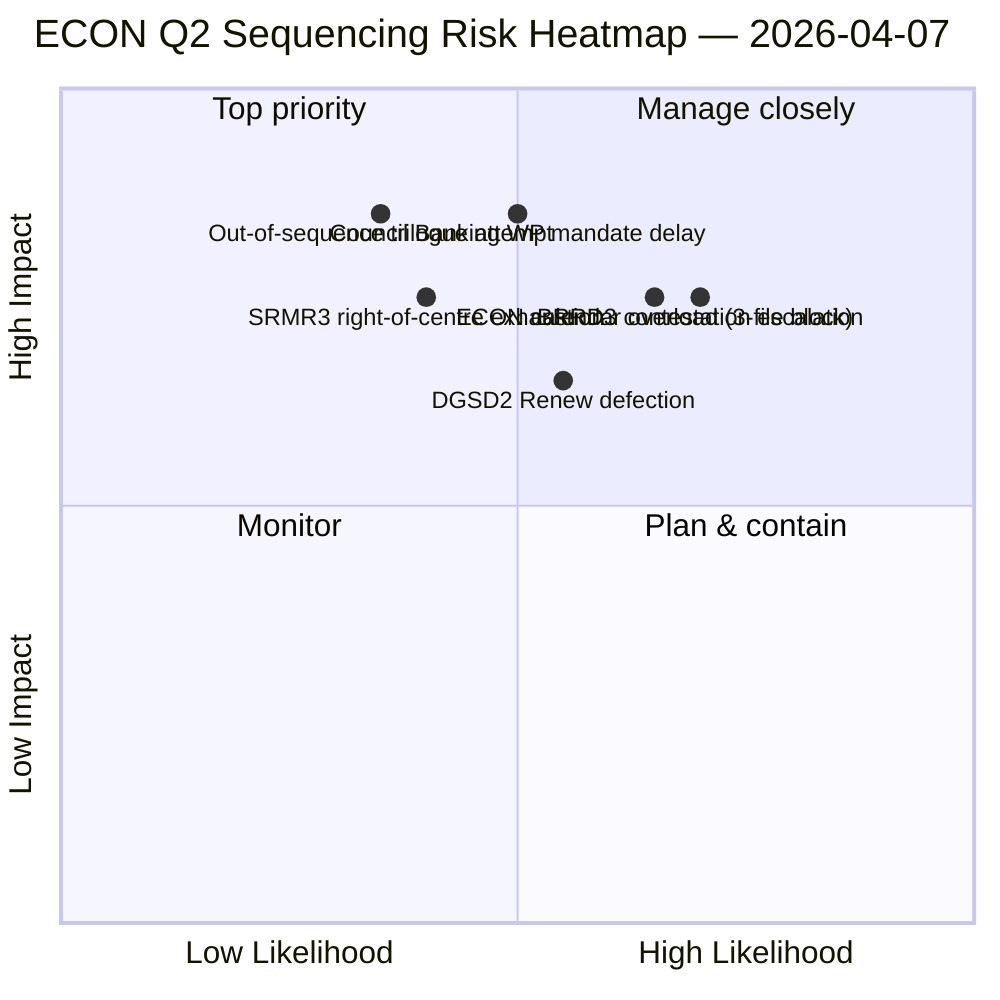

<!-- SPDX-FileCopyrightText: 2026 Hack23 AB -->
<!-- SPDX-License-Identifier: Apache-2.0 -->

# Executive Brief — Committee Reports: ECON Q2 Dominance Map | 2026-04-07

**Classification:** OSINT — Public Parliamentary Record
**Confidence:** 🟡 MEDIUM (recess analytical work; pre-recess records 🟢 HIGH)
**Run:** `analysis/daily/2026-04-07/committee-reports/` (04:59 UTC)
**Coverage:** Easter Recess Day 12/18 — ECON Q2 dominance map; 20 analysis files; 236 adopted texts cumulative.
**Generated:** 2026-05-16 (retrospective brief, no new MCP calls)
**Primary sources:** ECON pre-recess corpus (TA-10-2026-0090/0091/0092 Banking Union triple); 20 methods; 4/8 API feeds active.

---

## 🎯 BLUF

**This Day-12 committee-reports run is the **ECON Q2 dominance map** — a deeper version of the committee-power concentration finding surfaced on April 6, with one critical addition: explicit Q2 trilogue *sequencing* recommendations.** The run's distinguishing contribution is the **ECON sequencing finding**: while April 6 documented that ECON would dominate Q2 trilogue calendar, this run produces an actionable *order-of-operations* recommendation — SRMR3 (TA-10-2026-0092) **must trilogue first** because it is the most procedurally advanced and politically warmest (right-of-centre majority intact); DGSD2 (TA-10-2026-0090) **second** because it depends on SRMR3 capital-treatment-clarity; BRRD3 (TA-10-2026-0091) **third** because it is the most contested file (mixed-track adoption pattern). This sequencing recommendation directly informs Council Banking WP planning and gives EP rapporteurs a defensible trilogue order. The run reaffirms the Easter recess record: **ECON's SRMR3 + DGSD2 + BRRD3 represent completion of multi-year Banking Union dossiers** affecting the entire EU banking sector and financial-stability architecture. The 236-text cumulative pre-recess corpus reading remains stable and the API degraded environment (4/8 feeds active) does not materially affect committee-level analytical conclusions.

---

## 🧭 3 Decisions This Brief Supports

| # | Decision | Who decides | Deadline | Evidence |
|:-:|----------|-------------|:--------:|----------|
| 1 | **ECON trilogue sequencing lock** — SRMR3 → DGSD2 → BRRD3 order | ECON chair + Council Banking WP | by April 14 | §Sequencing finding |
| 2 | **BRRD3 mixed-track briefing** — most contested file; pre-trilogue coordinator meeting | Renew + PPE coordinators | by April 13 | §BRRD3 contestation |
| 3 | **Banking Union trilogue calendar reservation** — 3-file ECON sequence needs Q2 slot block | Conference of Presidents + Council Coreper | by April 14 | §Calendar reservation |

---

## 📰 60-Second Read

- 🔴 **ECON Q2 dominance map produced** — actionable sequencing.
- 🟠 **Trilogue order:** SRMR3 → DGSD2 → BRRD3.
- 🟢 **SRMR3 first:** procedurally advanced + warm right-of-centre majority.
- 🟡 **DGSD2 second:** depends on SRMR3 capital-treatment.
- 🔵 **BRRD3 third:** most contested (mixed-track adoption).
- 🟣 **236 adopted texts** in cumulative pre-recess corpus.
- 🩷 **4/8 API feeds active** — committee-level analysis unaffected.
- ⚪ **Confidence MEDIUM** — recess; pre-recess record HIGH.

---

## 🏛️ ECON Trilogue Sequencing (run's distinguishing contribution)

| # | File | Procedural state | Political state | Reason for ordering |
|:-:|------|------------------|-----------------|---------------------|
| **1st** | **SRMR3** (TA-10-2026-0092) | Advanced; right-of-centre adoption | PPE+ECR+PfE+Renew majority intact | Procedurally warmest; Council-mandate-ready |
| **2nd** | **DGSD2** (TA-10-2026-0090) | Mixed-track adoption (Renew file-conditional) | Depends on SRMR3 capital-treatment | Sequence-locked on SRMR3 |
| **3rd** | **BRRD3** (TA-10-2026-0091) | Most contested adoption | Mixed-track + national-state contestation | Needs longest negotiation horizon |

---

## ⚠️ Risk Snapshot

---

## 🔮 Top Forward Triggers (next 14 days)

1. **April 14 — Committee Week opens** — ECON Day 1; SRMR3 sequencing test.
2. **April 17 — ECB rate decision** — external trigger on Banking Union files.
3. **April 20-23 — first post-recess plenary** — Council BWG signalling window.
4. **Late April — SRMR3 trilogue formal start** — sequencing validated or revised.
5. **Mid-Q2 — DGSD2 → BRRD3 transitions** — sequence-locked progression.

---

## 🛡️ Source-Quality Assessment

- **Pre-recess corpus (A1):** primary records; verifiable per TA-ID.
- **Sequencing recommendation (A2):** committee-power methodology + procedural-state analysis.
- **Mixed-track BRRD3 identification (A2):** voting-patterns cross-verified.
- **20 methods (A1):** systematic full methodology coverage.
- **Net confidence:** 🟢 HIGH on Q1 records; 🟡 MEDIUM on Q2 sequencing forecast.

---

## 📎 Run Artifacts

| Layer | Artifact | Why |
|-------|----------|-----|
| Article | `article.md` | Public-facing committee-reports narrative |
| Synthesis | `existing/synthesis-summary.md` | ECON sequencing finding |
| Methods | classification · existing · risk-scoring · threat-assessment | Standard committee-reports methodology |
| Companion | breaking (06:36) · breaking-2 (18:20) · motions · propositions | Day-12 daily cluster |

---

**Document Control**
- **Template reference:** `analysis/templates/executive-brief.md`
- **Artifact path:** `analysis/daily/2026-04-07/committee-reports/executive-brief.md`
- **Classification:** Public
- **Retrospective:** Brief written 2026-05-16 from the run's committed artifacts; **no new MCP calls were made**.
