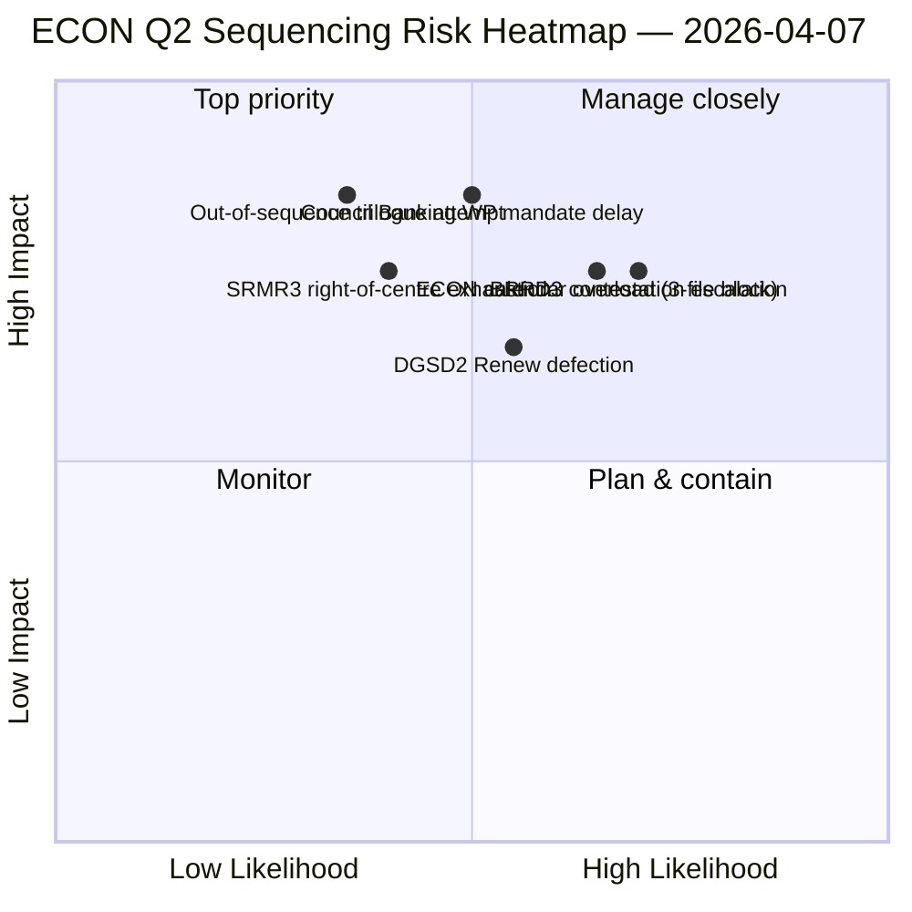

<!-- SPDX-FileCopyrightText: 2026 Hack23 AB -->
<!-- SPDX-License-Identifier: Apache-2.0 -->

# الملخص التنفيذي — تقارير اللجان: خريطة هيمنة ECON للربع الثاني | 2026-04-07

**التصنيف:** OSINT — سجل برلماني عام
**الثقة:** 🟡 متوسط (عمل تحليلي خلال الاستراحة؛ سجلات ما قبل الاستراحة 🟢 عالية)
**التشغيل:** `analysis/daily/2026-04-07/committee-reports/` (04:59 UTC)
**التغطية:** استراحة عيد الفصح اليوم 12/18 — خريطة هيمنة ECON للربع الثاني؛ 20 ملف تحليلي؛ 236 نص معتمد بصورة تراكمية.
**تاريخ الإنشاء:** 2026-05-16 (ملخص استعادي، بدون مكالمات MCP جديدة)
**المصادر الأولية:** مجموعة بيانات ECON قبل الاستراحة (TA-10-2026-0090/0091/0092 ثلاثي الاتحاد المصرفي)؛ 20 منهجية؛ 4/8 تغذيات API نشطة.

---

## 🎯 BLUF

**يُمثّل هذا التشغيل في اليوم 12 لتقارير اللجان خريطة هيمنة ECON للربع الثاني** — نسخة أعمق من نتيجة تركيز القوة في اللجنة التي كُشف عنها في 6 أبريل، مع إضافة حاسمة واحدة: توصيات تسلسل صريحة لثلاثيات الربع الثاني. الإسهام المميز للتشغيل هو **نتيجة التسلسل في ECON**: بينما وثّق 6 أبريل أن ECON ستهيمن على تقويم ثلاثيات الربع الثاني، ينتج هذا التشغيل توصية بترتيب العمليات القابلة للتنفيذ — يجب أن تذهب SRMR3 (TA-10-2026-0092) **إلى الثلاثي أولاً** لأنها الأكثر تقدماً إجرائياً والأدفأ سياسياً (الأغلبية اليمينية الوسطى سليمة)؛ DGSD2 (TA-10-2026-0090) **ثانياً** لأنه يعتمد على وضوح معالجة رأس المال في SRMR3؛ BRRD3 (TA-10-2026-0091) **ثالثاً** لأنه الملف الأكثر إثارة للجدل (نمط اعتماد مختلط). تُبلّغ هذه التوصية التسلسلية مباشرةً تخطيط مجموعة العمل المصرفي للمجلس وتمنح المقررين في البرلمان الأوروبي ترتيباً دفاعياً للثلاثي.

---

## 🧭 3 قرارات يدعمها هذا الملخص

| # | القرار | من يقرر | الموعد النهائي | الدليل |
|:-:|--------|---------|:-------------:|--------|
| 1 | **قفل تسلسل ثلاثي ECON** — ترتيب SRMR3 → DGSD2 → BRRD3 | رئيس ECON + مجموعة العمل المصرفي للمجلس | بحلول 14 أبريل | §نتيجة التسلسل |
| 2 | **إحاطة المسار المختلط BRRD3** — الملف الأكثر إثارة للجدل؛ اجتماع المنسقين قبل الثلاثي | منسقو Renew + PPE | بحلول 13 أبريل | §جدل BRRD3 |
| 3 | **حجز تقويم الثلاثي للاتحاد المصرفي** — تسلسل ECON المكون من 3 ملفات يحتاج إلى كتلة فتحات الربع الثاني | مؤتمر الرؤساء + Coreper المجلس | بحلول 14 أبريل | §حجز التقويم |

---

## 📰 قراءة 60 ثانية

- 🔴 **تم إنتاج خريطة هيمنة ECON للربع الثاني** — تسلسل قابل للتنفيذ.
- 🟠 **ترتيب الثلاثي:** SRMR3 → DGSD2 → BRRD3.
- 🟢 **SRMR3 أولاً:** متقدم إجرائياً + أغلبية يمينية وسطى دافئة.
- 🟡 **DGSD2 ثانياً:** يعتمد على معالجة رأس المال في SRMR3.
- 🔵 **BRRD3 ثالثاً:** الأكثر إثارة للجدل (اعتماد مختلط).
- 🟣 **236 نصاً معتمداً** في مجموعة البيانات التراكمية ما قبل الاستراحة.
- 🩷 **4/8 تغذيات API نشطة** — تحليل مستوى اللجنة غير متأثر.
- ⚪ **الثقة متوسطة** — استراحة؛ سجلات ما قبل الاستراحة عالية.

---

## 🏛️ تسلسل ثلاثي ECON (الإسهام المميز للتشغيل)

| # | الملف | الحالة الإجرائية | الحالة السياسية | سبب الترتيب |
|:-:|-------|-----------------|-----------------|-------------|
| **الأول** | **SRMR3** (TA-10-2026-0092) | متقدم؛ اعتماد يميني وسطى | أغلبية PPE+ECR+PfE+Renew سليمة | الأدفأ إجرائياً؛ جاهز لتفويض المجلس |
| **الثاني** | **DGSD2** (TA-10-2026-0090) | مسار مختلط (مشروط بملف Renew) | يعتمد على معالجة رأس المال SRMR3 | مقفل تسلسلياً على SRMR3 |
| **الثالث** | **BRRD3** (TA-10-2026-0091) | الاعتماد الأكثر إثارة للجدل | مسار مختلط + جدل الدولة القومية | يحتاج إلى أطول أفق للتفاوض |

---

## ⚠️ لقطة المخاطر

---

## 🔮 أهم المحفزات المستقبلية (الـ 14 يوماً القادمة)

1. **14 أبريل — أسبوع اللجنة يبدأ** — ECON اليوم الأول؛ اختبار تسلسل SRMR3.
2. **17 أبريل — قرار سعر الفائدة للبنك المركزي الأوروبي** — محفز خارجي لملفات الاتحاد المصرفي.
3. **20–23 أبريل — أول جلسة عامة بعد الاستراحة** — نافذة الإشارة لمجموعة العمل المصرفي للمجلس.
4. **أواخر أبريل — البدء الرسمي لثلاثي SRMR3** — التسلسل يُتحقق منه أو يُراجَع.
5. **منتصف الربع الثاني — انتقالات DGSD2 → BRRD3** — تقدم مقفل تسلسلياً.

---

## 🛡️ تقييم جودة المصادر

- **مجموعة البيانات ما قبل الاستراحة (A1):** سجلات أولية؛ قابلة للتحقق بمعرف TA-ID.
- **توصية التسلسل (A2):** منهجية قوة اللجنة + تحليل الحالة الإجرائية.
- **تحديد المسار المختلط BRRD3 (A2):** أنماط التصويت مُحققة تبادلياً.
- **20 منهجية (A1):** تغطية منهجية كاملة ومنهجية.
- **الثقة الإجمالية:** 🟢 عالية للسجلات الربع الأول؛ 🟡 متوسطة لتوقع تسلسل الربع الثاني.

---

## 📎 مصنوعات التشغيل

| الطبقة | المصنوع | السبب |
|--------|---------|-------|
| المقال | `article.md` | السرد العام لتقارير اللجان |
| التوليف | `existing/synthesis-summary.md` | نتيجة تسلسل ECON |
| المنهجيات | تصنيف · موجود · تقييم المخاطر · تقييم التهديدات | المنهجية القياسية لتقارير اللجان |
| المرافق | breaking (06:36) · breaking-2 (18:20) · motions · propositions | الكتلة اليومية اليوم 12 |

---

**التحكم في الوثيقة**
- **مرجع القالب:** `analysis/templates/executive-brief.md`
- **مسار المصنوع:** `analysis/daily/2026-04-07/committee-reports/executive-brief.md`
- **التصنيف:** عام
- **استعادي:** الملخص مكتوب في 2026-05-16 من مصنوعات التشغيل المُلتزمة؛ **لم تُجرَ مكالمات MCP جديدة**.
