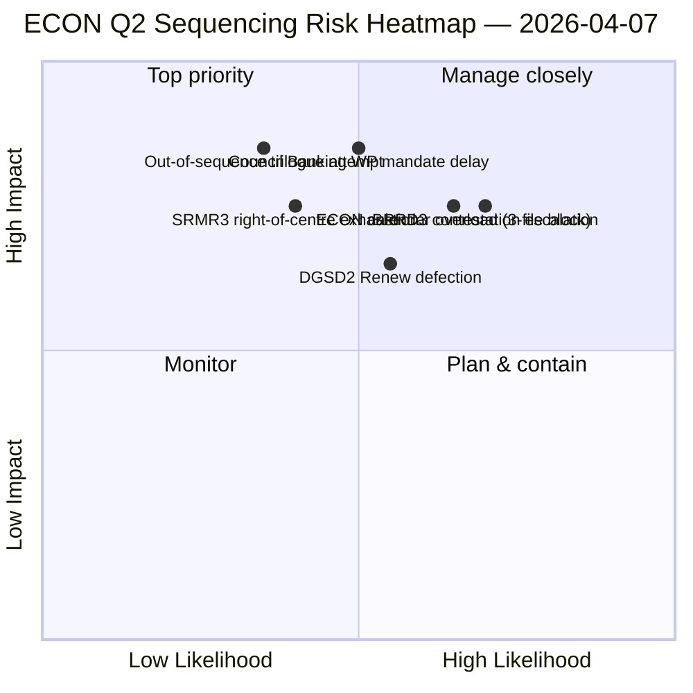

<!-- SPDX-FileCopyrightText: 2026 Hack23 AB -->
<!-- SPDX-License-Identifier: Apache-2.0 -->

# Udøvende sammenfatning — Udvalgsbetænkninger: ECON Q2 dominanskort | 2026-04-07

**Klassificering:** OSINT — Offentlig parlamentarisk optegnelse
**Tillid:** 🟡 MEDIUM (analytisk arbejde under pause; optegnelser før pause 🟢 HØJ)
**Kørsel:** `analysis/daily/2026-04-07/committee-reports/` (04:59 UTC)
**Dækning:** Påskepause dag 12/18 — ECON Q2 dominanskort; 20 analysefiler; 236 vedtagne tekster kumulativt.
**Genereret:** 2026-05-16 (retrospektiv sammenfattning, ingen nye MCP-kald)
**Primære kilder:** ECON-korpus før pause (TA-10-2026-0090/0091/0092 BankuionsTrippel); 20 metoder; 4/8 API-feeds aktive.

---

## 🎯 BLUF

**Denne dag-12-kørsel for udvalgsbetænkninger er ECON Q2 dominanskortet** — en dybere version af koncentrationsfundet i udvalget fra den 6. april, med én kritisk tilføjelse: eksplicitte Q2-trilogsekvenseringsanbefalinger. Kørslens særlige bidrag er **ECON-sekvenseringsmfundet**: mens den 6. april dokumenterede, at ECON ville dominere Q2-trilogkalenderen, producerer denne kørsel en handlingsorienteret rækkefølgeanbefaling — SRMR3 (TA-10-2026-0092) **skal trilogere først** fordi det er det mest procedurelt avancerede og politisk varmeste (højre-centrum-flertal intakt); DGSD2 (TA-10-2026-0090) **anden** fordi det afhænger af SRMR3 kapitalbehandlingsklarhed; BRRD3 (TA-10-2026-0091) **tredje** fordi det er den mest omstridte fil (blandet vedtagelsesmønster). Denne sekvensanbefaling informerer direkte Rådets bankarbeidsgruppeplanlægning og giver EP-ordførere en forsvarlig trilogrækkefølge. Kørslen bekræfter påskepauserekorden: **ECON's SRMR3 + DGSD2 + BRRD3 repræsenterer fuldendelsen af flerårige bankuionssager** der påvirker hele EU's banksektor og arkitektur for finansiel stabilitet.

---

## 🧭 3 beslutninger denne sammenfatning understøtter

| # | Beslutning | Hvem beslutter | Frist | Bevis |
|:-:|------------|----------------|:-----:|-------|
| 1 | **ECON trilogsekvensering** — SRMR3 → DGSD2 → BRRD3 rækkefølge | ECON-formand + Rådets bankarbeidsgruppe | inden 14. april | §Sekvenseringsresultat |
| 2 | **BRRD3 blandet-spor-briefing** — mest omstridede fil; koordinatormøde før trilog | Renew + PPE-koordinatorer | inden 13. april | §BRRD3-omstridighed |
| 3 | **Bankuion trilogkalenderreservation** — 3-fils ECON-sekvens kræver Q2-slotblok | Formandskonferencen + Rådet Coreper | inden 14. april | §Kalenderreservation |

---

## 📰 60-sekunders læsning

- 🔴 **ECON Q2 dominanskort produceret** — handlingsorienteret sekvensiering.
- 🟠 **Trilogrækkefølge:** SRMR3 → DGSD2 → BRRD3.
- 🟢 **SRMR3 først:** procedurelt avanceret + varmt højre-centrum-flertal.
- 🟡 **DGSD2 anden:** afhænger af SRMR3 kapitalbehandling.
- 🔵 **BRRD3 tredje:** mest omstridt (blandet vedtagelse).
- 🟣 **236 vedtagne tekster** i kumulativt korpus før pause.
- 🩷 **4/8 API-feeds aktive** — analyse på udvalgsnniveau upåvirket.
- ⚪ **Tillid MEDIUM** — pause; optegnelser før pause HØJ.

---

## 🏛️ ECON trilogsekvensering (kørslens særlige bidrag)

| # | Fil | Procedurel tilstand | Politisk tilstand | Begrundelse for rækkefølge |
|:-:|-----|---------------------|-------------------|---------------------------|
| **1.** | **SRMR3** (TA-10-2026-0092) | Avanceret; højre-centrum-vedtagelse | PPE+ECR+PfE+Renew-flertal intakt | Procedurelt varmest; rådsmandat-klar |
| **2.** | **DGSD2** (TA-10-2026-0090) | Blandet spor (Renew filbetinget) | Afhænger af SRMR3 kapitalbehandling | Sekvenslåst til SRMR3 |
| **3.** | **BRRD3** (TA-10-2026-0091) | Mest omstridt vedtagelse | Blandet spor + national-statsomstridighed | Behøver længst forhandlingshorisont |

---

## ⚠️ Risikooverblik

---

## 🔮 Top fremadrettede udløsere (næste 14 dage)

1. **14. april — Udvalgsuge åbner** — ECON dag 1; SRMR3 sekvenseringstest.
2. **17. april — ECB rentebeslutning** — ekstern udløser for bankuionsfiler.
3. **20.–23. april — første plenum efter pause** — signaleringsvindue for Rådets bankarbeidsgruppe.
4. **Sen april — SRMR3 trilog formel start** — sekvensiering valideret eller revideret.
5. **Midt-Q2 — DGSD2 → BRRD3 overgange** — sekvenslåst progression.

---

## 🛡️ Kildekvaliitetsvurdering

- **Korpus før pause (A1):** primæroptegnelser; verificerbare per TA-ID.
- **Sekvensanbefaling (A2):** udvalgsmagtmetodik + procedurel tilstandsanalyse.
- **Identifikation af blandet spor BRRD3 (A2):** afstemnings mønstre krydskontrolleret.
- **20 metoder (A1):** systematisk fuld metodedækning.
- **Nettotillid:** 🟢 HØJ for Q1-optegnelser; 🟡 MEDIUM for Q2-sekvensprognose.

---

## 📎 Kørselsuartefakter

| Lag | Artefakt | Hvorfor |
|-----|----------|---------|
| Artikel | `article.md` | Offentlig fortælling om udvalgsbetænkninger |
| Syntese | `existing/synthesis-summary.md` | ECON-sekvenseringsresultat |
| Metoder | klassificering · eksisterende · risikovurdering · trusselsvurdering | Standardmetodik for udvalgsbetænkninger |
| Ledsager | breaking (06:36) · breaking-2 (18:20) · motions · propositions | Daglig klynge dag 12 |

---

**Dokumentkontrol**
- **Skabelonreference:** `analysis/templates/executive-brief.md`
- **Artefaktsti:** `analysis/daily/2026-04-07/committee-reports/executive-brief.md`
- **Klassificering:** Offentlig
- **Retrospektiv:** Sammenfatning skrevet 2026-05-16 fra kørslens committede artefakter; **ingen nye MCP-kald blev foretaget**.
