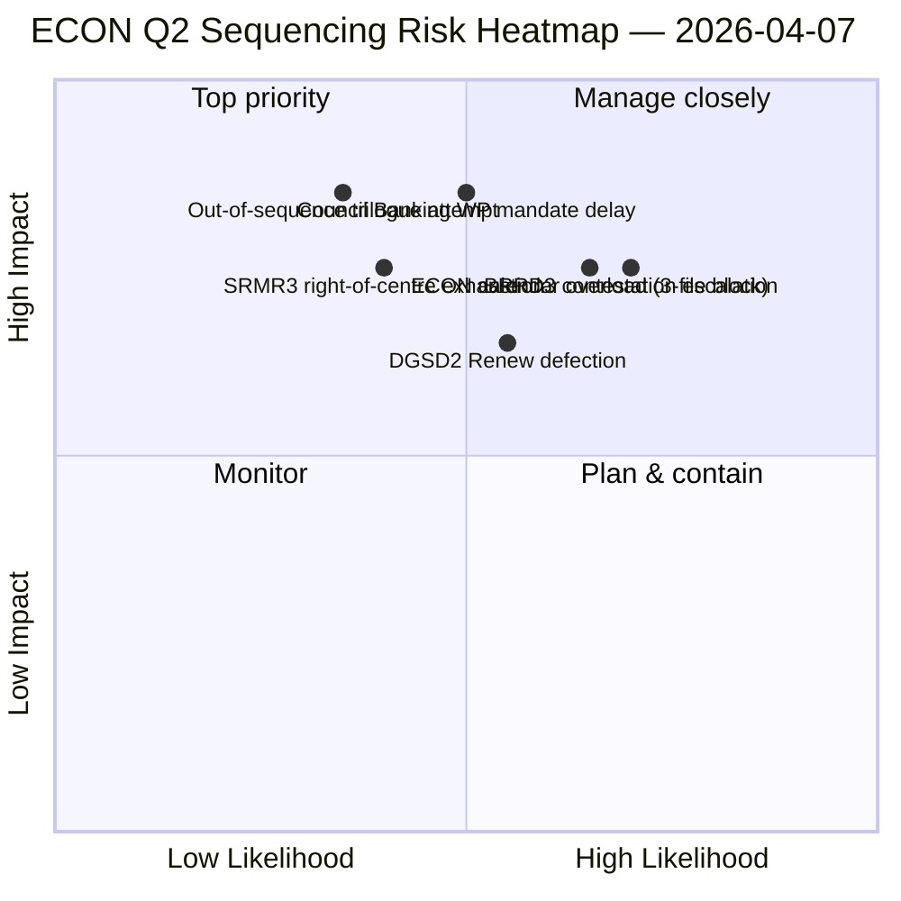

<!-- SPDX-FileCopyrightText: 2026 Hack23 AB -->
<!-- SPDX-License-Identifier: Apache-2.0 -->

# Exekutivzusammenfassung — Ausschussberichte: ECON Q2-Dominanzkarte | 2026-04-07

**Klassifizierung:** OSINT — Öffentliche parlamentarische Aufzeichnung
**Vertrauen:** 🟡 MITTEL (analytische Arbeit während der Pause; Aufzeichnungen vor der Pause 🟢 HOCH)
**Lauf:** `analysis/daily/2026-04-07/committee-reports/` (04:59 UTC)
**Abdeckung:** Osterreichspause Tag 12/18 — ECON Q2-Dominanzkarte; 20 Analysedateien; 236 angenommene Texte kumulativ.
**Erstellt:** 2026-05-16 (retrospektive Zusammenfassung, keine neuen MCP-Aufrufe)
**Primärquellen:** ECON-Corpus vor der Pause (TA-10-2026-0090/0091/0092 Bankunionstripel); 20 Methoden; 4/8 API-Feeds aktiv.

---

## 🎯 BLUF

**Dieser Tag-12-Lauf für Ausschussberichte ist die ECON Q2-Dominanzkarte** — eine tiefergehende Version des am 6. April aufgedeckten Machtkonzentrationsbefundes im Ausschuss, mit einer kritischen Ergänzung: explizite Q2-Trilog-Sequenzierungsempfehlungen. Der besondere Beitrag des Laufs ist der **ECON-Sequenzierungsbefund**: Während der 6. April dokumentierte, dass ECON den Q2-Trilogkalender dominieren würde, produziert dieser Lauf eine handlungsorientierte Reihenfolgeempfehlung — SRMR3 (TA-10-2026-0092) **muss zuerst in den Trilog**, da es am weitesten fortgeschritten und politisch am wärmsten ist (rechtszentristische Mehrheit intakt); DGSD2 (TA-10-2026-0090) **zweitens**, da es von der Kapitalbehandlungsklarheit von SRMR3 abhängt; BRRD3 (TA-10-2026-0091) **drittens**, da es die umstrittenste Datei ist (gemischtes Annahmemusters). Diese Sequenzierungsempfehlung informiert direkt die Planung der Rats-Bankarbeitsgruppe und gibt EP-Berichterstattern eine verteidigbare Trilogreihenfolge. Der Lauf bestätigt den Osterreichspausen-Rekord: **ECONs SRMR3 + DGSD2 + BRRD3 repräsentieren den Abschluss mehrjähriger Bankenunions-Dossiers**, die den gesamten EU-Bankensektor und die Architektur der Finanzstabilität betreffen.

---

## 🧭 3 Entscheidungen, die diese Zusammenfassung unterstützt

| # | Entscheidung | Wer entscheidet | Frist | Nachweis |
|:-:|--------------|-----------------|:-----:|----------|
| 1 | **ECON-Trilogsequenzverriegelung** — SRMR3 → DGSD2 → BRRD3-Reihenfolge | ECON-Vorsitz + Rats-Bankarbeitsgruppe | bis 14. April | §Sequenzierungsbefund |
| 2 | **BRRD3-Mischspurbriefing** — umstrittenste Datei; Koordinatorsitzung vor dem Trilog | Renew + PPE-Koordinatoren | bis 13. April | §BRRD3-Umstrittenheit |
| 3 | **Bankenunions-Trilogkalenderreservierung** — 3-Datei-ECON-Sequenz benötigt Q2-Zeitslot-Block | Konferenz der Präsidenten + Rat Coreper | bis 14. April | §Kalenderreservierung |

---

## 📰 60-Sekunden-Lektüre

- 🔴 **ECON Q2-Dominanzkarte erstellt** — handlungsorientierte Sequenzierung.
- 🟠 **Trilogreihenfolge:** SRMR3 → DGSD2 → BRRD3.
- 🟢 **SRMR3 zuerst:** verfahrenstechnisch fortgeschritten + warme rechtszentristische Mehrheit.
- 🟡 **DGSD2 zweitens:** hängt von SRMR3-Kapitalbehandlung ab.
- 🔵 **BRRD3 drittens:** am umstrittensten (gemischte Annahme).
- 🟣 **236 angenommene Texte** im kumulativen Corpus vor der Pause.
- 🩷 **4/8 API-Feeds aktiv** — Ausschussebenen-Analyse unbeeinträchtigt.
- ⚪ **Vertrauen MITTEL** — Pause; Aufzeichnungen vor der Pause HOCH.

---

## 🏛️ ECON-Trilogsequenzierung (besonderer Beitrag des Laufs)

| # | Datei | Verfahrensstand | Politischer Stand | Begründung für Reihenfolge |
|:-:|-------|-----------------|-------------------|---------------------------|
| **1.** | **SRMR3** (TA-10-2026-0092) | Fortgeschritten; rechtszentristische Annahme | PPE+ECR+PfE+Renew-Mehrheit intakt | Verfahrenstechnisch wärmste; Ratsmandat-bereit |
| **2.** | **DGSD2** (TA-10-2026-0090) | Gemischter Spure (Renew-Dateibedingt) | Hängt von SRMR3-Kapitalbehandlung ab | Sequenz gesperrt auf SRMR3 |
| **3.** | **BRRD3** (TA-10-2026-0091) | Umstrittenste Annahme | Gemischter Spur + nationalstaatliche Umstrittenheit | Braucht längsten Verhandlungshorizont |

---

## ⚠️ Risikoübersicht

---

## 🔮 Top vorausschauende Auslöser (nächste 14 Tage)

1. **14. April — Ausschusswoche öffnet** — ECON Tag 1; SRMR3-Sequenztest.
2. **17. April — EZB-Zinsentscheidung** — externer Auslöser für Bankenunionsdateien.
3. **20.–23. April — erste Plenartagung nach der Pause** — Signalisierungsfenster der Rats-Bankarbeitsgruppe.
4. **Ende April — SRMR3-Trilog formeller Start** — Sequenzierung validiert oder überarbeitet.
5. **Mitte Q2 — DGSD2 → BRRD3-Übergänge** — sequenzgesperrter Fortschritt.

---

## 🛡️ Quellenqualitätsbewertung

- **Corpus vor der Pause (A1):** primäre Aufzeichnungen; überprüfbar per TA-ID.
- **Sequenzierungsempfehlung (A2):** Ausschussmacht-Methodik + verfahrenstechnische Zustandsanalyse.
- **Identifikation gemischter Spur BRRD3 (A2):** Abstimmungsmuster kreuzgeprüft.
- **20 Methoden (A1):** systematische vollständige Methodenabdeckung.
- **Nettovertrauen:** 🟢 HOCH für Q1-Aufzeichnungen; 🟡 MITTEL für Q2-Sequenzprognose.

---

## 📎 Laufartefakte

| Schicht | Artefakt | Warum |
|---------|----------|-------|
| Artikel | `article.md` | Öffentliche Ausschussberichte-Erzählung |
| Synthese | `existing/synthesis-summary.md` | ECON-Sequenzierungsbefund |
| Methoden | Klassifizierung · bestehend · Risikobewertung · Bedrohungsbewertung | Standardmethodik für Ausschussberichte |
| Begleiter | breaking (06:36) · breaking-2 (18:20) · motions · propositions | Täglicher Cluster Tag 12 |

---

**Dokumentenkontrolle**
- **Vorlagenreferenz:** `analysis/templates/executive-brief.md`
- **Artefaktpfad:** `analysis/daily/2026-04-07/committee-reports/executive-brief.md`
- **Klassifizierung:** Öffentlich
- **Retrospektiv:** Zusammenfassung am 2026-05-16 aus den committeten Artefakten des Laufs geschrieben; **es wurden keine neuen MCP-Aufrufe gemacht**.
