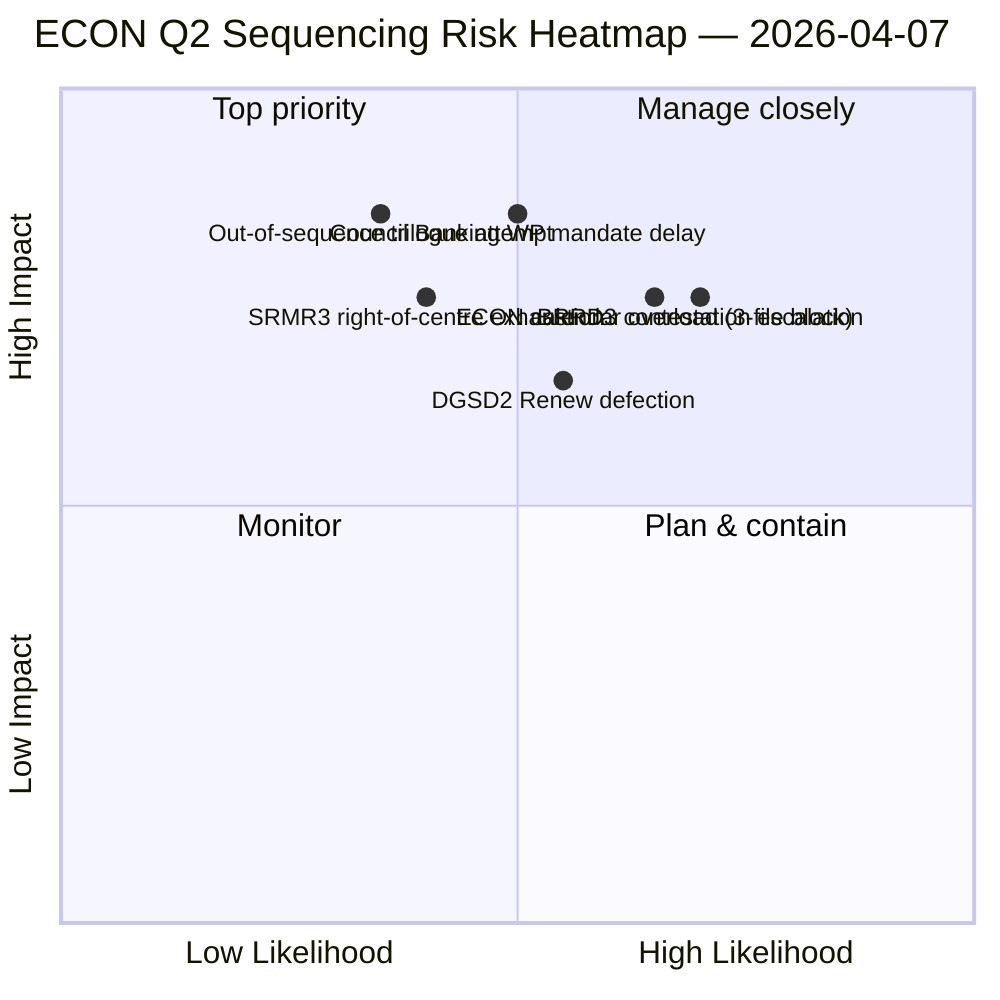

<!-- SPDX-FileCopyrightText: 2026 Hack23 AB -->
<!-- SPDX-License-Identifier: Apache-2.0 -->

# Resumen ejecutivo — Informes de comisión: Mapa de dominancia ECON T2 | 2026-04-07

**Clasificación:** OSINT — Registro parlamentario público
**Confianza:** 🟡 MEDIA (trabajo analítico durante la pausa; registros pre-pausa 🟢 ALTA)
**Ejecución:** `analysis/daily/2026-04-07/committee-reports/` (04:59 UTC)
**Cobertura:** Pausa de Pascua día 12/18 — Mapa de dominancia ECON T2; 20 archivos de análisis; 236 textos adoptados acumulativos.
**Generado:** 2026-05-16 (resumen retrospectivo, sin nuevas llamadas MCP)
**Fuentes primarias:** Corpus ECON pre-pausa (TA-10-2026-0090/0091/0092 triple Unión Bancaria); 20 métodos; 4/8 feeds API activos.

---

## 🎯 BLUF

**Esta ejecución del día 12 para informes de comisión es el mapa de dominancia ECON T2** — una versión más profunda del hallazgo de concentración de poder en la comisión del 6 de abril, con un añadido crítico: recomendaciones explícitas de secuenciación de trílogos T2. La contribución distintiva de la ejecución es el **hallazgo de secuenciación ECON**: mientras que el 6 de abril documentó que ECON dominaría el calendario de trílogos T2, esta ejecución produce una recomendación de orden de operaciones accionable — SRMR3 (TA-10-2026-0092) **debe ir al trílogo primero** porque es el más avanzado procedimentalmente y el más cálido políticamente (mayoría de centro-derecha intacta); DGSD2 (TA-10-2026-0090) **segundo** porque depende de la claridad del tratamiento de capital de SRMR3; BRRD3 (TA-10-2026-0091) **tercero** porque es el archivo más controvertido (patrón de adopción mixto). Esta recomendación de secuenciación informa directamente la planificación del grupo de trabajo bancario del Consejo y proporciona a los ponentes del PE un orden de trílogo defendible. La ejecución reafirma el récord de la pausa de Pascua: **SRMR3 + DGSD2 + BRRD3 de ECON representan la finalización de expedientes plurianuales de la Unión Bancaria** que afectan a todo el sector bancario de la UE y la arquitectura de estabilidad financiera.

---

## 🧭 3 decisiones que respalda este resumen

| # | Decisión | Quién decide | Plazo | Evidencia |
|:-:|----------|--------------|:-----:|-----------|
| 1 | **Bloqueo de secuenciación de trílogo ECON** — orden SRMR3 → DGSD2 → BRRD3 | Presidente ECON + grupo de trabajo bancario del Consejo | hasta el 14 de abril | §Hallazgo de secuenciación |
| 2 | **Briefing de pista mixta BRRD3** — archivo más controvertido; reunión de coordinadores pre-trílogo | Coordinadores Renew + PPE | hasta el 13 de abril | §Controversia BRRD3 |
| 3 | **Reserva de calendario de trílogo de Unión Bancaria** — secuencia ECON de 3 archivos necesita bloque de franjas T2 | Conferencia de presidentes + Consejo Coreper | hasta el 14 de abril | §Reserva de calendario |

---

## 📰 Lectura en 60 segundos

- 🔴 **Mapa de dominancia ECON T2 producido** — secuenciación accionable.
- 🟠 **Orden de trílogo:** SRMR3 → DGSD2 → BRRD3.
- 🟢 **SRMR3 primero:** avanzado procedimentalmente + cálida mayoría de centro-derecha.
- 🟡 **DGSD2 segundo:** depende del tratamiento de capital SRMR3.
- 🔵 **BRRD3 tercero:** más controvertido (adopción mixta).
- 🟣 **236 textos adoptados** en el corpus pre-pausa acumulativo.
- 🩷 **4/8 feeds API activos** — análisis a nivel de comisión no afectado.
- ⚪ **Confianza MEDIA** — pausa; registros pre-pausa ALTA.

---

## 🏛️ Secuenciación de trílogo ECON (contribución distintiva de la ejecución)

| # | Archivo | Estado procesal | Estado político | Razón del orden |
|:-:|---------|-----------------|-----------------|-----------------|
| **1.º** | **SRMR3** (TA-10-2026-0092) | Avanzado; adopción de centro-derecha | Mayoría PPE+ECR+PfE+Renew intacta | El más cálido procedimentalmente; listo para mandato del Consejo |
| **2.º** | **DGSD2** (TA-10-2026-0090) | Pista mixta (Renew condicional de archivo) | Depende del tratamiento de capital SRMR3 | Bloqueado en secuencia a SRMR3 |
| **3.º** | **BRRD3** (TA-10-2026-0091) | Adopción más controvertida | Pista mixta + controversia Estado-nación | Necesita el mayor horizonte de negociación |

---

## ⚠️ Instantánea de riesgos

---

## 🔮 Principales detonantes prospectivos (próximos 14 días)

1. **14 de abril — Semana de comisión abre** — ECON día 1; prueba de secuenciación SRMR3.
2. **17 de abril — Decisión de tipos del BCE** — detonante externo para archivos de la Unión Bancaria.
3. **20–23 de abril — primer pleno tras la pausa** — ventana de señalización del grupo de trabajo bancario del Consejo.
4. **Finales de abril — inicio formal del trílogo SRMR3** — secuenciación validada o revisada.
5. **Mediados de T2 — transiciones DGSD2 → BRRD3** — progresión bloqueada en secuencia.

---

## 🛡️ Evaluación de la calidad de las fuentes

- **Corpus pre-pausa (A1):** registros primarios; verificables por TA-ID.
- **Recomendación de secuenciación (A2):** metodología de poder de comisión + análisis de estado procesal.
- **Identificación de pista mixta BRRD3 (A2):** patrones de votación verificados en cruce.
- **20 métodos (A1):** cobertura metodológica sistemática completa.
- **Confianza neta:** 🟢 ALTA para registros T1; 🟡 MEDIA para pronóstico de secuenciación T2.

---

## 📎 Artefactos de ejecución

| Capa | Artefacto | Por qué |
|------|-----------|---------|
| Artículo | `article.md` | Narrativa pública de informes de comisión |
| Síntesis | `existing/synthesis-summary.md` | Hallazgo de secuenciación ECON |
| Métodos | clasificación · existente · evaluación de riesgos · evaluación de amenazas | Metodología estándar para informes de comisión |
| Compañero | breaking (06:36) · breaking-2 (18:20) · motions · propositions | Clúster diario día 12 |

---

**Control del documento**
- **Referencia de plantilla:** `analysis/templates/executive-brief.md`
- **Ruta del artefacto:** `analysis/daily/2026-04-07/committee-reports/executive-brief.md`
- **Clasificación:** Pública
- **Retrospectivo:** Resumen escrito el 2026-05-16 a partir de los artefactos committed de la ejecución; **no se realizaron nuevas llamadas MCP**.
