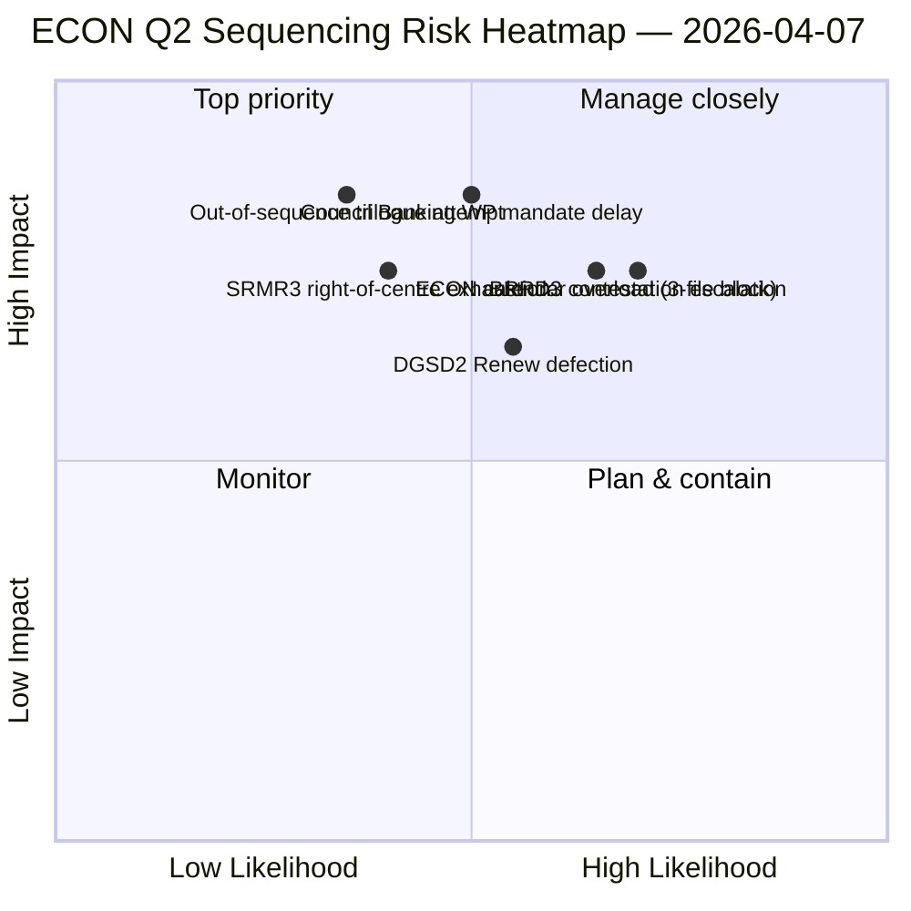

<!-- SPDX-FileCopyrightText: 2026 Hack23 AB -->
<!-- SPDX-License-Identifier: Apache-2.0 -->

# Johtava yhteenveto — Valiokunnan raportit: ECON Q2 -hallintakartta | 2026-04-07

**Luokittelu:** OSINT — Julkinen parlamentaarinen asiakirja
**Luotettavuus:** 🟡 KESKITASO (analyyttinen työ tauon aikana; tauon edeltävät asiakirjat 🟢 KORKEA)
**Ajo:** `analysis/daily/2026-04-07/committee-reports/` (04:59 UTC)
**Kattavuus:** Pääsiäistauon päivä 12/18 — ECON Q2 -hallintakartta; 20 analyysi tiedostoa; 236 hyväksyttyä tekstiä kumulatiivisesti.
**Tuotettu:** 2026-05-16 (takautuva yhteenveto, ei uusia MCP-kutsuja)
**Ensisijaiset lähteet:** ECON-korpus ennen taukoa (TA-10-2026-0090/0091/0092 Pankkiunioitripla); 20 menetelmää; 4/8 API-syötettä aktiivisena.

---

## 🎯 BLUF

**Tämä päivän 12 valiokuntaraporttien ajo on ECON Q2 -hallintakartta** — syvempi versio 6. huhtikuuta esitetystä valiokuntavallan keskittymislöydöksestä, jossa on yksi kriittinen lisäys: eksplisiittiset Q2-trilogisuositusten sekvensointiohjeet. Ajon erityinen panos on **ECON-sekvensointilöydös**: siinä missä 6. huhtikuuta dokumentoi, että ECON hallitsisi Q2-trilogikalenteria, tämä ajo tuottaa toiminnallisen järjestyssuosituksen — SRMR3 (TA-10-2026-0092) **on trilogoitava ensin** koska se on menettely- ja poliittisesti edistynein (oikean keskustan enemmistö eheänä); DGSD2 (TA-10-2026-0090) **toiseksi** koska se riippuu SRMR3:n pääomakäsittelyn selkeydestä; BRRD3 (TA-10-2026-0091) **kolmanneksi** koska se on kiistanalaisin tiedosto (sekaantumismalli). Tämä sekvensointisuositus ohjaa suoraan neuvoston pankkityöryhmän suunnittelua ja antaa EP:n esittelijöille puolustettavan trilogijarjestyksen. Ajo vahvistaa pääsiäistauon ennätyksen: **ECON:n SRMR3 + DGSD2 + BRRD3 edustavat monivuotisten pankkiunionikäsittelyiden päätökseen saattamista** koko EU:n pankkisektorin ja rahoitusvakausarkkitehtuurin kannalta.

---

## 🧭 3 päätöstä, joita tämä yhteenveto tukee

| # | Päätös | Kuka päättää | Määräaika | Todiste |
|:-:|--------|--------------|:---------:|---------|
| 1 | **ECON trilogisekvensointilukitus** — SRMR3 → DGSD2 → BRRD3 järjestys | ECON-puheenjohtaja + neuvoston pankkityöryhmä | 14. huhtikuuta mennessä | §Sekvenssölöydös |
| 2 | **BRRD3 sekavaa raittiista -tiedotus** — kiistanalaisin tiedosto; koordinaattorikokous ennen trilogia | Renew + PPE-koordinaattorit | 13. huhtikuuta mennessä | §BRRD3-kiistanalaisuus |
| 3 | **Pankkiunionitrilogikalenterivaraus** — 3-tiedoston ECON-sekvenssi tarvitsee Q2-aikapaikkablokki | Puheenjohtajakonferenssi + neuvosto Coreper | 14. huhtikuuta mennessä | §Kalenterivaraus |

---

## 📰 60 sekunnin luku

- 🔴 **ECON Q2 -hallintakartta tuotettu** — toiminnallinen sekvenssointi.
- 🟠 **Trilogijärjestys:** SRMR3 → DGSD2 → BRRD3.
- 🟢 **SRMR3 ensin:** menettelyllisesti edistynyt + lämmin oikean keskustan enemmistö.
- 🟡 **DGSD2 toiseksi:** riippuu SRMR3:n pääomakäsittelystä.
- 🔵 **BRRD3 kolmanneksi:** kiistanalaisin (sekaantuminen).
- 🟣 **236 hyväksyttyä tekstiä** kumulatiivisessa tauon edeltävässä korpuksessa.
- 🩷 **4/8 API-syötettä aktiivisena** — valiokuntatasoanalyysi vaikuttamaton.
- ⚪ **Luotettavuus KESKITASO** — tauko; tauon edeltävät asiakirjat KORKEA.

---

## 🏛️ ECON trilogisequensointi (ajon erityinen panos)

| # | Tiedosto | Menettelytila | Poliittinen tila | Perusjärjestyksen syy |
|:-:|---------|---------------|------------------|----------------------|
| **1.** | **SRMR3** (TA-10-2026-0092) | Edistynyt; oikean keskustan hyväksyntä | PPE+ECR+PfE+Renew-enemmistö eheänä | Menettelyllisesti lämpimin; neuvostovarauma-valmis |
| **2.** | **DGSD2** (TA-10-2026-0090) | Sekaantuminen (Renew tiedostoehdollinen) | Riippuu SRMR3:n pääomakäsittelystä | Sekvenssölukkiutunut SRMR3:een |
| **3.** | **BRRD3** (TA-10-2026-0091) | Kiistanalaisin hyväksyntä | Sekaantuminen + kansallisvaltion kiistanalaisuus | Tarvitsee pisimmän neuvotteluhorisontin |

---

## ⚠️ Riskipikaistut

---

## 🔮 Parhaat eteenpäin katsovat laukaisijat (seuraavat 14 päivää)

1. **14. huhtikuuta — Valiokunnaviikko avautuu** — ECON päivä 1; SRMR3 sekvensointitesti.
2. **17. huhtikuuta — EKP:n korkopäätös** — ulkoinen laukaisija pankkiunionitiedostoille.
3. **20.–23. huhtikuuta — ensimmäinen täysistunto tauon jälkeen** — neuvoston pankkityöryhmän signaali-ikkuna.
4. **Myöhään huhtikuuta — SRMR3 trilogin virallinen aloitus** — sekvenssointi vahvistettu tai tarkistettu.
5. **Q2:n puoliväli — DGSD2 → BRRD3 siirtymät** — sekvenssölukkiutunut eteneminen.

---

## 🛡️ Lähteen laadunarviointi

- **Tauon edeltävä korpus (A1):** ensisijaisia asiakirjoja; tarkistettavia TA-ID:n mukaan.
- **Sekvensointisuositus (A2):** valiokuntavallan metodologia + menettelyllinen tilanneanalyysi.
- **Sekaantuneen raidan BRRD3 tunnistus (A2):** äänestysmallit ristiintarkistettu.
- **20 menetelmää (A1):** systemaattinen täyskattavuus metodologia.
- **Nettoluotettavuus:** 🟢 KORKEA Q1-asiakirjoille; 🟡 KESKITASO Q2-sekvenssiennusteelle.

---

## 📎 Ajoartefaktit

| Kerros | Artefakti | Miksi |
|--------|-----------|-------|
| Artikkeli | `article.md` | Julkinen valiokuntarapportti-narratiivi |
| Synteesi | `existing/synthesis-summary.md` | ECON-sekvensointilöydös |
| Menetelmät | luokittelu · olemassa oleva · riskinarviointi · uhka-arviointi | Standardimetodologia valiokuntaraporteille |
| Kumppani | breaking (06:36) · breaking-2 (18:20) · motions · propositions | Päivittäinen klusteri päivä 12 |

---

**Asiakirjan hallinta**
- **Mallisiviite:** `analysis/templates/executive-brief.md`
- **Artefaktopolku:** `analysis/daily/2026-04-07/committee-reports/executive-brief.md`
- **Luokittelu:** Julkinen
- **Takautuva:** Yhteenveto kirjoitettu 2026-05-16 ajon committedista artefakteista; **ei uusia MCP-kutsuja tehty**.
