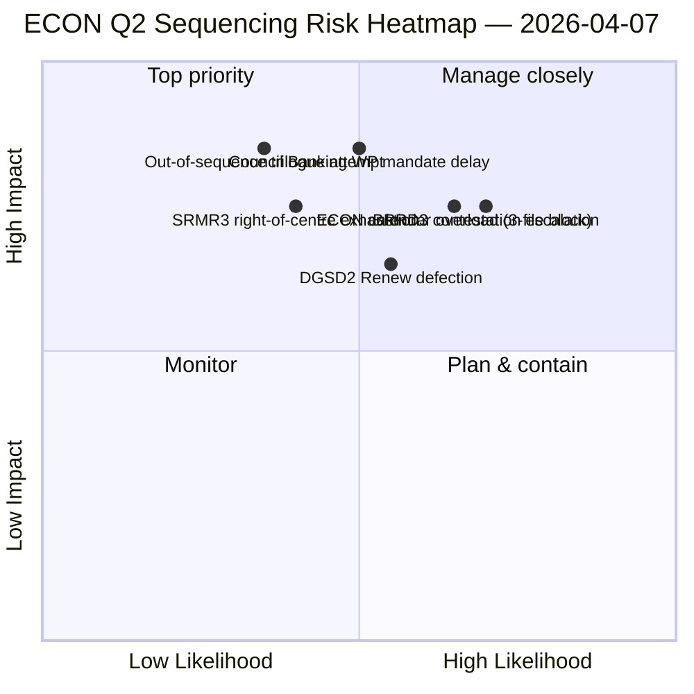

<!-- SPDX-FileCopyrightText: 2026 Hack23 AB -->
<!-- SPDX-License-Identifier: Apache-2.0 -->

# Résumé exécutif — Rapports de commission : Carte de domination ECON T2 | 2026-04-07

**Classification :** OSINT — Archives parlementaires publiques
**Confiance :** 🟡 MOYENNE (travail analytique pendant la pause ; archives pré-pause 🟢 ÉLEVÉE)
**Exécution :** `analysis/daily/2026-04-07/committee-reports/` (04:59 UTC)
**Couverture :** Pause de Pâques jour 12/18 — Carte de domination ECON T2 ; 20 fichiers d'analyse ; 236 textes adoptés en cumulatif.
**Généré :** 2026-05-16 (résumé rétrospectif, aucun nouvel appel MCP)
**Sources primaires :** Corpus ECON pré-pause (TA-10-2026-0090/0091/0092 triple Union bancaire) ; 20 méthodes ; 4/8 flux API actifs.

---

## 🎯 BLUF

**Cette exécution de jour 12 pour les rapports de commission est la carte de domination ECON T2** — une version plus approfondie du constat de concentration des pouvoirs du comité du 6 avril, avec un ajout critique : des recommandations de séquençage explicites pour les trilogues T2. La contribution distinctive de l'exécution est le **constat de séquençage ECON** : alors que le 6 avril documentait que l'ECON dominerait le calendrier des trilogues T2, cette exécution produit une recommandation d'ordre des opérations actionnable — SRMR3 (TA-10-2026-0092) **doit triloguer en premier** car c'est le plus avancé sur le plan procédural et le plus chaud politiquement (majorité de centre-droit intacte) ; DGSD2 (TA-10-2026-0090) **en deuxième** car il dépend de la clarté du traitement du capital de SRMR3 ; BRRD3 (TA-10-2026-0091) **en troisième** car c'est le fichier le plus contesté (schéma d'adoption mixte). Cette recommandation de séquençage informe directement la planification du groupe de travail bancaire du Conseil et donne aux rapporteurs du PE un ordre de trilogue défendable. L'exécution réaffirme le record de pause de Pâques : **SRMR3 + DGSD2 + BRRD3 de l'ECON représentent l'achèvement de dossiers pluriannuels de l'Union bancaire** affectant l'ensemble du secteur bancaire de l'UE et l'architecture de la stabilité financière.

---

## 🧭 3 décisions que ce résumé soutient

| # | Décision | Qui décide | Échéance | Preuve |
|:-:|----------|------------|:--------:|--------|
| 1 | **Verrouillage séquençage trilogue ECON** — ordre SRMR3 → DGSD2 → BRRD3 | Président ECON + groupe de travail bancaire du Conseil | d'ici le 14 avril | §Constat de séquençage |
| 2 | **Briefing piste mixte BRRD3** — fichier le plus contesté ; réunion des coordinateurs pré-trilogue | Coordinateurs Renew + PPE | d'ici le 13 avril | §Contestation BRRD3 |
| 3 | **Réservation calendrier trilogue Union bancaire** — séquence ECON 3 fichiers nécessite un bloc de créneaux T2 | Conférence des présidents + Conseil Coreper | d'ici le 14 avril | §Réservation calendrier |

---

## 📰 Lecture en 60 secondes

- 🔴 **Carte de domination ECON T2 produite** — séquençage actionnable.
- 🟠 **Ordre du trilogue :** SRMR3 → DGSD2 → BRRD3.
- 🟢 **SRMR3 en premier :** avancé sur le plan procédural + majorité de centre-droit chaleureuse.
- 🟡 **DGSD2 en deuxième :** dépend du traitement du capital SRMR3.
- 🔵 **BRRD3 en troisième :** le plus contesté (adoption mixte).
- 🟣 **236 textes adoptés** dans le corpus pré-pause cumulatif.
- 🩷 **4/8 flux API actifs** — analyse au niveau de la commission non affectée.
- ⚪ **Confiance MOYENNE** — pause ; archives pré-pause ÉLEVÉE.

---

## 🏛️ Séquençage trilogue ECON (contribution distinctive de l'exécution)

| # | Fichier | État procédural | État politique | Raison de l'ordre |
|:-:|---------|-----------------|----------------|-------------------|
| **1er** | **SRMR3** (TA-10-2026-0092) | Avancé ; adoption de centre-droit | Majorité PPE+ECR+PfE+Renew intacte | Le plus chaud procéduralement ; prêt pour le mandat du Conseil |
| **2e** | **DGSD2** (TA-10-2026-0090) | Piste mixte (conditionnel au fichier Renew) | Dépend du traitement du capital SRMR3 | Verrouillé en séquence sur SRMR3 |
| **3e** | **BRRD3** (TA-10-2026-0091) | Adoption la plus contestée | Piste mixte + contestation État-nation | A besoin du plus long horizon de négociation |

---

## ⚠️ Aperçu des risques

---

## 🔮 Principaux déclencheurs prospectifs (14 prochains jours)

1. **14 avril — Semaine de commission ouvre** — ECON jour 1 ; test de séquençage SRMR3.
2. **17 avril — Décision de taux BCE** — déclencheur externe pour les fichiers de l'Union bancaire.
3. **20–23 avril — premier plénaire après la pause** — fenêtre de signalisation du groupe de travail bancaire du Conseil.
4. **Fin avril — démarrage formel du trilogue SRMR3** — séquençage validé ou révisé.
5. **Milieu T2 — transitions DGSD2 → BRRD3** — progression verrouillée en séquence.

---

## 🛡️ Évaluation de la qualité des sources

- **Corpus pré-pause (A1) :** archives primaires ; vérifiables par TA-ID.
- **Recommandation de séquençage (A2) :** méthodologie des pouvoirs de commission + analyse de l'état procédural.
- **Identification piste mixte BRRD3 (A2) :** schémas de vote vérifiés en recoupement.
- **20 méthodes (A1) :** couverture systématique complète de la méthodologie.
- **Confiance nette :** 🟢 ÉLEVÉE pour les archives T1 ; 🟡 MOYENNE pour la prévision de séquençage T2.

---

## 📎 Artefacts d'exécution

| Couche | Artefact | Pourquoi |
|--------|----------|----------|
| Article | `article.md` | Récit public des rapports de commission |
| Synthèse | `existing/synthesis-summary.md` | Constat de séquençage ECON |
| Méthodes | classification · existant · évaluation des risques · évaluation des menaces | Méthodologie standard pour les rapports de commission |
| Compagnon | breaking (06:36) · breaking-2 (18:20) · motions · propositions | Cluster quotidien jour 12 |

---

**Contrôle du document**
- **Référence de modèle :** `analysis/templates/executive-brief.md`
- **Chemin d'artefact :** `analysis/daily/2026-04-07/committee-reports/executive-brief.md`
- **Classification :** Publique
- **Rétrospectif :** Résumé rédigé le 2026-05-16 à partir des artefacts committés de l'exécution ; **aucun nouvel appel MCP n'a été effectué**.
