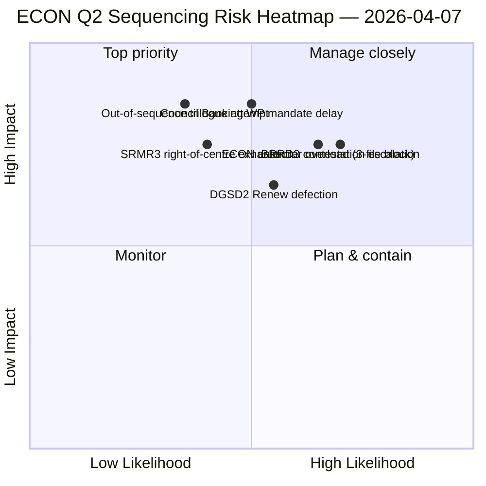

<!-- SPDX-FileCopyrightText: 2026 Hack23 AB -->
<!-- SPDX-License-Identifier: Apache-2.0 -->

# תקציר מנהלים — דוחות ועדות: מפת הדומיננטיות ECON ר"ב שני | 2026-04-07

**סיווג:** OSINT — תיעוד פרלמנטרי ציבורי
**אמינות:** 🟡 בינונית (עבודה אנליטית בהפסקה; רשומות לפני ההפסקה 🟢 גבוהה)
**ריצה:** `analysis/daily/2026-04-07/committee-reports/` (04:59 UTC)
**כיסוי:** הפסקת פסחא יום 12/18 — מפת דומיננטיות ECON ר"ב שני; 20 קבצי ניתוח; 236 טקסטים שאומצו באופן מצטבר.
**נוצר:** 2026-05-16 (סיכום רטרוספקטיבי, ללא קריאות MCP חדשות)
**מקורות ראשוניים:** קורפוס ECON לפני ההפסקה (TA-10-2026-0090/0091/0092 טריפלט האיחוד הבנקאי); 20 מתודולוגיות; 4/8 ממשקי API פעילים.

---

## 🎯 BLUF

**ריצה זו ביום 12 לדוחות ועדות היא מפת הדומיננטיות ECON ר"ב שני** — גרסה עמוקה יותר של ממצא ריכוז הכוח בוועדה שנחשף ב-6 באפריל, עם תוספת קריטית אחת: המלצות רצף מפורשות לדיאלוגים תלת-צדדיים של ר"ב שני. התרומה המייחדת של הריצה היא **ממצא הרצף של ECON**: בעוד ש-6 באפריל תיעד כי ECON תשלוט בלוח הזמנים של הדיאלוגים ר"ב שני, ריצה זו מייצרת המלצת סדר פעולות הניתנת לביצוע — SRMR3 (TA-10-2026-0092) **חייבת להיכנס לדיאלוג ראשונה** כי היא המתקדמת ביותר מבחינה נהלית והחמה ביותר פוליטית (רוב ימני-מרכז שלם); DGSD2 (TA-10-2026-0090) **שנייה** כי תלויה בבהירות הטיפול בהון של SRMR3; BRRD3 (TA-10-2026-0091) **שלישית** כי היא הקובץ השנוי ביותר במחלוקת (דפוס אימוץ מעורב). המלצת הרצף זו מיידעת ישירות את תכנון קבוצת העבודה הבנקאית של המועצה ומעניקה למדווחים בפרלמנט האירופי סדר דיאלוג שניתן להגן עליו.

---

## 🧭 3 החלטות שסיכום זה תומך בהן

| # | החלטה | מי מחליט | מועד אחרון | ראיה |
|:-:|--------|---------|:----------:|------|
| 1 | **נעילת רצף הדיאלוג של ECON** — סדר SRMR3 → DGSD2 → BRRD3 | יו"ר ECON + קבוצת העבודה הבנקאית של המועצה | עד 14 באפריל | §ממצא הרצף |
| 2 | **תדרוך מסלול מעורב BRRD3** — קובץ שנוי ביותר במחלוקת; ישיבת רכזים לפני הדיאלוג | רכזי Renew + PPE | עד 13 באפריל | §מחלוקת BRRD3 |
| 3 | **הזמנת לוח שנה לדיאלוג האיחוד הבנקאי** — רצף ECON של 3 קבצים צריך בלוק חריצי ר"ב שני | ועידת נשיאים + מועצת Coreper | עד 14 באפריל | §הזמנת לוח שנה |

---

## 📰 קריאה של 60 שניות

- 🔴 **מפת דומיננטיות ECON ר"ב שני הופקה** — רצף הניתן לביצוע.
- 🟠 **סדר הדיאלוג:** SRMR3 → DGSD2 → BRRD3.
- 🟢 **SRMR3 ראשונה:** מתקדמת נהלית + רוב ימני-מרכז חם.
- 🟡 **DGSD2 שנייה:** תלויה בטיפול בהון SRMR3.
- 🔵 **BRRD3 שלישית:** שנויה ביותר במחלוקת (אימוץ מעורב).
- 🟣 **236 טקסטים שאומצו** בקורפוס המצטבר לפני ההפסקה.
- 🩷 **4/8 ממשקי API פעילים** — ניתוח ברמת ועדה לא מושפע.
- ⚪ **אמינות בינונית** — הפסקה; רשומות לפני ההפסקה גבוהות.

---

## 🏛️ רצף הדיאלוג של ECON (התרומה המייחדת של הריצה)

| # | קובץ | מצב נהלי | מצב פוליטי | נימוק לסדר |
|:-:|------|---------|------------|------------|
| **ראשון** | **SRMR3** (TA-10-2026-0092) | מתקדם; אימוץ ימני-מרכז | רוב PPE+ECR+PfE+Renew שלם | החם ביותר נהלית; מוכן להמנדט של המועצה |
| **שני** | **DGSD2** (TA-10-2026-0090) | מסלול מעורב (Renew מותנה בקובץ) | תלוי בטיפול בהון SRMR3 | נעול ברצף ל-SRMR3 |
| **שלישי** | **BRRD3** (TA-10-2026-0091) | אימוץ שנוי ביותר במחלוקת | מסלול מעורב + מחלוקת מדינה לאומית | זקוק לאופק משא ומתן ארוך ביותר |

---

## ⚠️ תמונת מצב סיכונים

---

## 🔮 מפעילי העתיד המובילים (14 הימים הקרובים)

1. **14 באפריל — שבוע הוועדה נפתח** — ECON יום 1; מבחן רצף SRMR3.
2. **17 באפריל — החלטת ריבית הבנק המרכזי האירופי** — מפעיל חיצוני לקבצי האיחוד הבנקאי.
3. **20–23 באפריל — מליאה ראשונה אחרי ההפסקה** — חלון איתות של קבוצת העבודה הבנקאית של המועצה.
4. **סוף אפריל — תחילה רשמית של דיאלוג SRMR3** — הרצף מאושר או מעוין.
5. **אמצע ר"ב שני — מעברי DGSD2 → BRRD3** — התקדמות נעולה ברצף.

---

## 🛡️ הערכת איכות מקורות

- **קורפוס לפני ההפסקה (A1):** רשומות ראשוניות; ניתנות לאימות לפי TA-ID.
- **המלצת רצף (A2):** מתודולוגיית כוח ועדה + ניתוח מצב נהלי.
- **זיהוי מסלול מעורב BRRD3 (A2):** דפוסי הצבעה מוצלבים.
- **20 מתודולוגיות (A1):** כיסוי מתודולוגי מלא ושיטתי.
- **אמינות כוללת:** 🟢 גבוהה לרשומות ר"ב ראשון; 🟡 בינונית לתחזית רצף ר"ב שני.

---

## 📎 מלאכות ריצה

| שכבה | מלאכה | מדוע |
|------|-------|------|
| מאמר | `article.md` | נרטיב ציבורי של דוחות ועדות |
| סינתזה | `existing/synthesis-summary.md` | ממצא רצף ECON |
| מתודולוגיות | סיווג · קיים · הערכת סיכונים · הערכת איומים | מתודולוגיה סטנדרטית לדוחות ועדות |
| מלווה | breaking (06:36) · breaking-2 (18:20) · motions · propositions | אשכול יומי יום 12 |

---

**בקרת מסמכים**
- **הפניית תבנית:** `analysis/templates/executive-brief.md`
- **נתיב מלאכה:** `analysis/daily/2026-04-07/committee-reports/executive-brief.md`
- **סיווג:** ציבורי
- **רטרוספקטיבי:** הסיכום נכתב ב-2026-05-16 ממלאכות הריצה המחויבות; **לא בוצעו קריאות MCP חדשות**.
