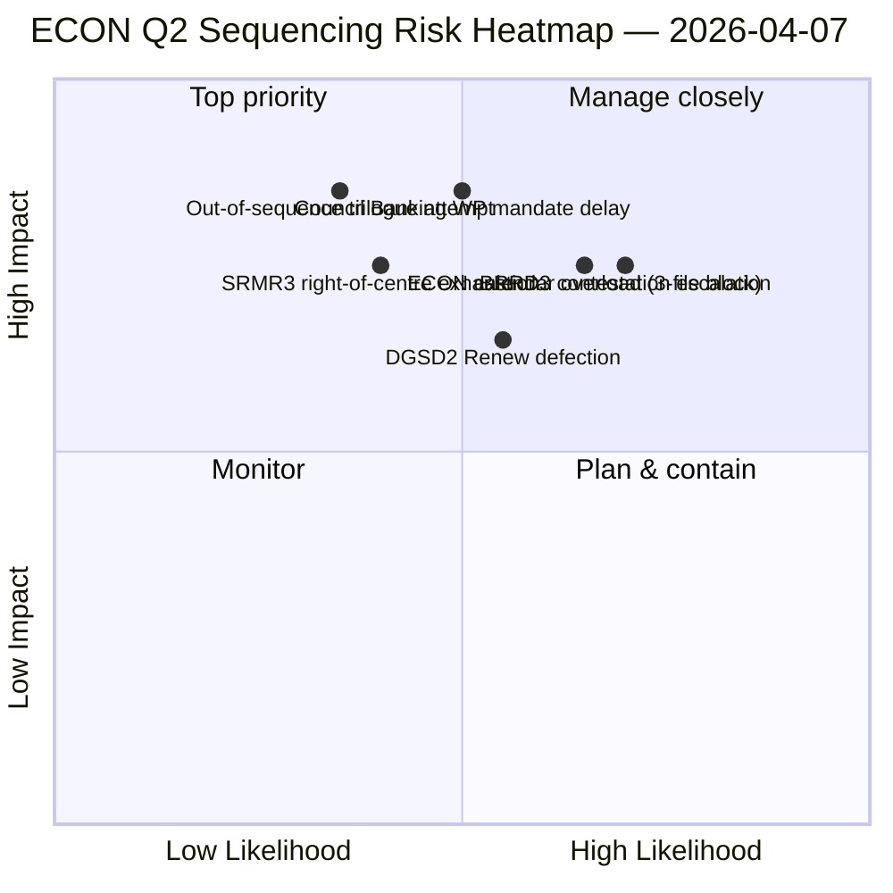

<!-- SPDX-FileCopyrightText: 2026 Hack23 AB -->
<!-- SPDX-License-Identifier: Apache-2.0 -->

# エグゼクティブ・ブリーフ — 委員会報告：ECON第2四半期支配マップ | 2026-04-07

**分類：** OSINT — 公開議会記録
**信頼性：** 🟡 中程度（休会中の分析作業；休会前の記録 🟢 高）
**実行：** `analysis/daily/2026-04-07/committee-reports/` (04:59 UTC)
**対象範囲：** 復活祭休会12日目/18日中 — ECON第2四半期支配マップ；分析ファイル20件；採択テキスト累計236件。
**生成日：** 2026-05-16（遡及的ブリーフ、新規MCPコールなし）
**主要ソース：** 休会前ECONコーパス (TA-10-2026-0090/0091/0092 銀行同盟トリプレット)；20手法；API フィード 4/8 稼働中。

---

## 🎯 BLUF

**委員会報告のこの12日目実行は、ECON第2四半期支配マップである** — 4月6日に浮上した委員会権力集中の発見のより深いバージョンであり、決定的な追加が一つある：第2四半期三者対話の明示的な順序付け勧告。この実行の独自の貢献は**ECON順序付け発見**である：4月6日がECONが第2四半期三者対話カレンダーを支配することを文書化したのに対し、この実行は実行可能な作戦命令勧告を生成する — SRMR3 (TA-10-2026-0092) は手続き的に最も進んでおり政治的に最も温かい（右中道多数派が維持）ため**最初に三者対話を行う必要がある**；DGSD2 (TA-10-2026-0090) はSRMR3の資本処理の明確性に依存するため**2番目**；BRRD3 (TA-10-2026-0091) は最も争議ある文書（混合採択パターン）であるため**3番目**。この順序付け勧告は理事会銀行作業部会の計画を直接情報提供し、欧州議会の報告者に弁護可能な三者対話順序を与える。

---

## 🧭 このブリーフが支援する3つの決定

| # | 決定 | 決定者 | 期限 | 証拠 |
|:-:|------|--------|:----:|------|
| 1 | **ECON三者対話順序ロック** — SRMR3 → DGSD2 → BRRD3順序 | ECON議長 + 理事会銀行作業部会 | 4月14日まで | §順序付け発見 |
| 2 | **BRRD3混合トラックブリーフィング** — 最も争議ある文書；三者対話前コーディネーター会議 | Renew + PPEコーディネーター | 4月13日まで | §BRRD3争議 |
| 3 | **銀行同盟三者対話カレンダー予約** — 3文書ECON順序は第2四半期スロットブロックが必要 | 議長会議 + 理事会Coreper | 4月14日まで | §カレンダー予約 |

---

## 📰 60秒リーディング

- 🔴 **ECON第2四半期支配マップ生成** — 実行可能な順序付け。
- 🟠 **三者対話順序：** SRMR3 → DGSD2 → BRRD3。
- 🟢 **SRMR3が最初：** 手続き的に進んでいる + 温かい右中道多数派。
- 🟡 **DGSD2が2番目：** SRMR3の資本処理に依存。
- 🔵 **BRRD3が3番目：** 最も争議あり（混合採択）。
- 🟣 **採択テキスト236件**が休会前累計コーパスに含まれる。
- 🩷 **API フィード 4/8 稼働中** — 委員会レベルの分析に影響なし。
- ⚪ **信頼性中程度** — 休会中；休会前の記録は高。

---

## 🏛️ ECON三者対話順序付け（実行の独自の貢献）

| # | 文書 | 手続き状態 | 政治状態 | 順序付けの理由 |
|:-:|------|-----------|---------|---------------|
| **1番目** | **SRMR3** (TA-10-2026-0092) | 進んでいる；右中道採択 | PPE+ECR+PfE+Renew多数派維持 | 手続き的に最も温かい；理事会委任準備完了 |
| **2番目** | **DGSD2** (TA-10-2026-0090) | 混合トラック（Renew文書条件付き） | SRMR3資本処理に依存 | SRMR3に順序固定 |
| **3番目** | **BRRD3** (TA-10-2026-0091) | 最も争議ある採択 | 混合トラック + 国家論争 | 最も長い交渉期間が必要 |

---

## ⚠️ リスクスナップショット

---

## 🔮 上位の前向きトリガー（今後14日間）

1. **4月14日 — 委員会週開始** — ECON 1日目；SRMR3順序テスト。
2. **4月17日 — ECB金利決定** — 銀行同盟文書の外部トリガー。
3. **4月20〜23日 — 休会後初の本会議** — 理事会銀行作業部会のシグナリングウィンドウ。
4. **4月末 — SRMR3三者対話正式開始** — 順序付けが検証または改訂。
5. **第2四半期半ば — DGSD2 → BRRD3移行** — 順序固定の進行。

---

## 🛡️ ソース品質評価

- **休会前コーパス (A1)：** 一次記録；TA-IDで検証可能。
- **順序付け勧告 (A2)：** 委員会権力手法 + 手続き状態分析。
- **BRRD3混合トラック識別 (A2)：** 投票パターンのクロス検証。
- **20手法 (A1)：** 系統的な完全手法カバレッジ。
- **正味信頼性：** 🟢 第1四半期記録は高；🟡 第2四半期順序予測は中程度。

---

## 📎 実行アーティファクト

| レイヤー | アーティファクト | 理由 |
|--------|--------------|------|
| 記事 | `article.md` | 委員会報告の公開ナラティブ |
| 統合 | `existing/synthesis-summary.md` | ECON順序付け発見 |
| 手法 | 分類 · 既存 · リスク評価 · 脅威評価 | 委員会報告の標準手法 |
| 関連 | breaking (06:36) · breaking-2 (18:20) · motions · propositions | 12日目の日次クラスター |

---

**文書管理**
- **テンプレート参照：** `analysis/templates/executive-brief.md`
- **アーティファクトパス：** `analysis/daily/2026-04-07/committee-reports/executive-brief.md`
- **分類：** 公開
- **遡及的：** ブリーフは2026-05-16に実行のコミット済みアーティファクトから作成；**新規MCPコールは行われていない**。
