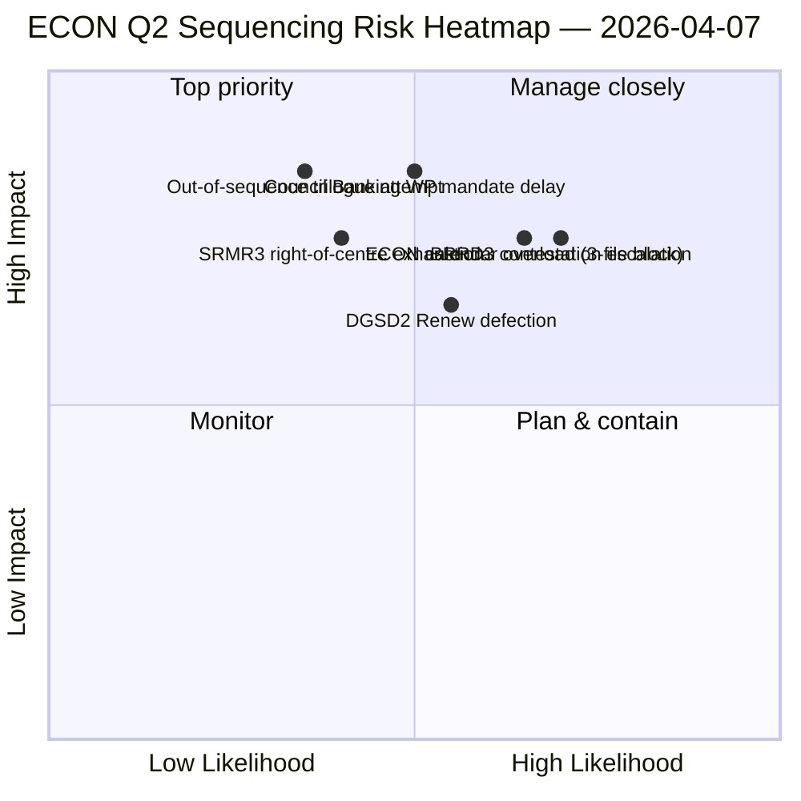

<!-- SPDX-FileCopyrightText: 2026 Hack23 AB -->
<!-- SPDX-License-Identifier: Apache-2.0 -->

# 집행 브리핑 — 위원회 보고서: ECON 2분기 지배 지도 | 2026-04-07

**분류:** OSINT — 공개 의회 기록
**신뢰도:** 🟡 중간 (휴회 중 분석 작업; 휴회 전 기록 🟢 높음)
**실행:** `analysis/daily/2026-04-07/committee-reports/` (04:59 UTC)
**범위:** 부활절 휴회 12일/18일 — ECON 2분기 지배 지도; 분석 파일 20개; 채택 텍스트 누적 236건.
**생성:** 2026-05-16 (소급 브리핑, 새 MCP 호출 없음)
**주요 출처:** 휴회 전 ECON 코퍼스 (TA-10-2026-0090/0091/0092 은행연합 트리플렛); 20개 방법론; API 피드 4/8 활성.

---

## 🎯 BLUF

**위원회 보고서의 이 12일차 실행은 ECON 2분기 지배 지도이다** — 4월 6일 발표된 위원회 권력 집중 발견의 더 심층적인 버전으로, 한 가지 결정적인 추가 사항이 있다: 2분기 삼자대화의 명시적인 순서 지정 권고. 이 실행의 독특한 기여는 **ECON 순서 지정 발견**이다: 4월 6일이 ECON이 2분기 삼자대화 달력을 지배할 것임을 문서화한 반면, 이 실행은 실행 가능한 운영 순서 권고를 생성한다 — SRMR3 (TA-10-2026-0092)는 절차적으로 가장 앞서 있고 정치적으로 가장 온화하기 때문에 (우중도 다수파 유지) **먼저 삼자대화를 거쳐야 한다**; DGSD2 (TA-10-2026-0090)는 SRMR3의 자본 처리 명확성에 의존하므로 **두 번째**; BRRD3 (TA-10-2026-0091)는 가장 논쟁적인 파일(혼합 채택 패턴)이므로 **세 번째**. 이 순서 지정 권고는 이사회 은행 작업반의 계획을 직접적으로 알리고 유럽의회 보고자에게 방어 가능한 삼자대화 순서를 제공한다.

---

## 🧭 이 브리핑이 지원하는 3가지 결정

| # | 결정 | 누가 결정 | 마감일 | 근거 |
|:-:|------|---------|:------:|------|
| 1 | **ECON 삼자대화 순서 잠금** — SRMR3 → DGSD2 → BRRD3 순서 | ECON 의장 + 이사회 은행 작업반 | 4월 14일까지 | §순서 지정 발견 |
| 2 | **BRRD3 혼합 트랙 브리핑** — 가장 논쟁적인 파일; 삼자대화 전 코디네이터 회의 | Renew + PPE 코디네이터 | 4월 13일까지 | §BRRD3 논쟁 |
| 3 | **은행연합 삼자대화 달력 예약** — 3파일 ECON 순서는 2분기 슬롯 블록 필요 | 의장단 회의 + 이사회 Coreper | 4월 14일까지 | §달력 예약 |

---

## 📰 60초 읽기

- 🔴 **ECON 2분기 지배 지도 생성** — 실행 가능한 순서 지정.
- 🟠 **삼자대화 순서:** SRMR3 → DGSD2 → BRRD3.
- 🟢 **SRMR3 첫 번째:** 절차적으로 앞선 + 온화한 우중도 다수파.
- 🟡 **DGSD2 두 번째:** SRMR3 자본 처리에 의존.
- 🔵 **BRRD3 세 번째:** 가장 논쟁적 (혼합 채택).
- 🟣 **채택 텍스트 236건**이 누적 휴회 전 코퍼스에 포함.
- 🩷 **API 피드 4/8 활성** — 위원회 수준 분석 영향 없음.
- ⚪ **신뢰도 중간** — 휴회; 휴회 전 기록 높음.

---

## 🏛️ ECON 삼자대화 순서 지정 (실행의 독특한 기여)

| # | 파일 | 절차적 상태 | 정치적 상태 | 순서 지정 이유 |
|:-:|------|-----------|-----------|--------------|
| **1번째** | **SRMR3** (TA-10-2026-0092) | 진행; 우중도 채택 | PPE+ECR+PfE+Renew 다수파 유지 | 절차적으로 가장 온화; 이사회 위임 준비 완료 |
| **2번째** | **DGSD2** (TA-10-2026-0090) | 혼합 트랙 (Renew 파일 조건부) | SRMR3 자본 처리에 의존 | SRMR3에 순서 고정 |
| **3번째** | **BRRD3** (TA-10-2026-0091) | 가장 논쟁적인 채택 | 혼합 트랙 + 국가 논쟁 | 가장 긴 협상 기간 필요 |

---

## ⚠️ 위험 스냅샷

---

## 🔮 상위 전향적 트리거 (향후 14일)

1. **4월 14일 — 위원회 주간 시작** — ECON 1일차; SRMR3 순서 테스트.
2. **4월 17일 — ECB 금리 결정** — 은행연합 파일의 외부 트리거.
3. **4월 20~23일 — 휴회 후 첫 번째 본회의** — 이사회 은행 작업반 신호 창.
4. **4월 말 — SRMR3 삼자대화 공식 시작** — 순서 지정 검증 또는 수정.
5. **2분기 중반 — DGSD2 → BRRD3 전환** — 순서 고정 진행.

---

## 🛡️ 출처 품질 평가

- **휴회 전 코퍼스 (A1):** 일차 기록; TA-ID별 검증 가능.
- **순서 지정 권고 (A2):** 위원회 권력 방법론 + 절차적 상태 분석.
- **BRRD3 혼합 트랙 식별 (A2):** 투표 패턴 교차 검증.
- **20개 방법론 (A1):** 체계적인 완전한 방법론 커버리지.
- **순 신뢰도:** 🟢 1분기 기록 높음; 🟡 2분기 순서 예측 중간.

---

## 📎 실행 산출물

| 계층 | 산출물 | 이유 |
|------|--------|------|
| 기사 | `article.md` | 위원회 보고서 공개 내러티브 |
| 종합 | `existing/synthesis-summary.md` | ECON 순서 지정 발견 |
| 방법론 | 분류 · 기존 · 위험 평가 · 위협 평가 | 위원회 보고서 표준 방법론 |
| 동반 | breaking (06:36) · breaking-2 (18:20) · motions · propositions | 12일차 일별 클러스터 |

---

**문서 관리**
- **템플릿 참조:** `analysis/templates/executive-brief.md`
- **산출물 경로:** `analysis/daily/2026-04-07/committee-reports/executive-brief.md`
- **분류:** 공개
- **소급:** 브리핑은 2026-05-16에 실행의 커밋된 산출물에서 작성됨; **새 MCP 호출은 이루어지지 않았음**.
