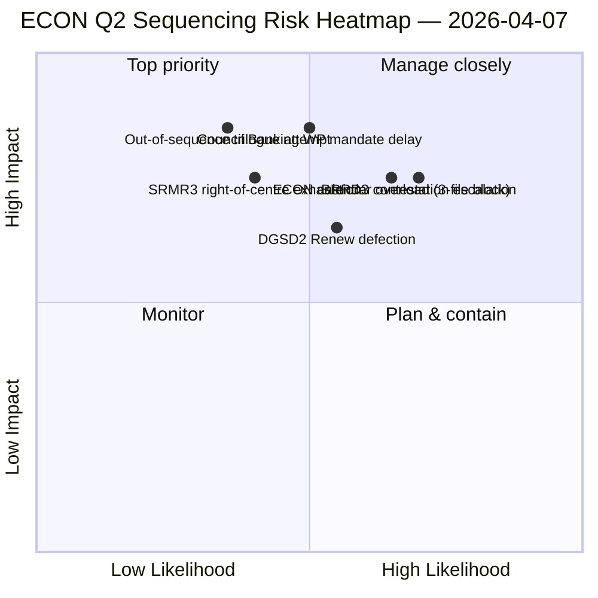

<!-- SPDX-FileCopyrightText: 2026 Hack23 AB -->
<!-- SPDX-License-Identifier: Apache-2.0 -->

# Uitvoerende samenvatting — Commissierapporten: ECON K2-dominantiekaart | 2026-04-07

**Classificatie:** OSINT — Openbaar parlementair archief
**Vertrouwen:** 🟡 GEMIDDELD (analytisch werk tijdens reces; pre-reces archieven 🟢 HOOG)
**Run:** `analysis/daily/2026-04-07/committee-reports/` (04:59 UTC)
**Dekking:** Paasvakantie dag 12/18 — ECON K2-dominantiekaart; 20 analysebestanden; 236 aangenomen teksten cumulatief.
**Gegenereerd:** 2026-05-16 (retrospectieve samenvatting, geen nieuwe MCP-aanroepen)
**Primaire bronnen:** ECON-corpus voor reces (TA-10-2026-0090/0091/0092 Bankunie-triplet); 20 methoden; 4/8 API-feeds actief.

---

## 🎯 BLUF

**Deze dag-12-run voor commissierapporten is de ECON K2-dominantiekaart** — een diepere versie van de op 6 april gevonden concentratie van commissiemacht, met één kritieke toevoeging: expliciete aanbevelingen voor K2-triloogsequentiëring. De onderscheidende bijdrage van de run is de **ECON-sequentiëringsbevinding**: terwijl 6 april documenteerde dat ECON de K2-triloogkalender zou domineren, produceert deze run een actiegerichte volgorderaanbeveling — SRMR3 (TA-10-2026-0092) **moet als eerste trilogen** omdat het procedureel het meest gevorderd en politiek het warmst is (rechtse-centrum-meerderheid intact); DGSD2 (TA-10-2026-0090) **tweede** omdat het afhankelijk is van de helderheid van de kapitaalbehandeling van SRMR3; BRRD3 (TA-10-2026-0091) **derde** omdat het het meest betwiste dossier is (gemengd aannamingspatroon). Deze sequentiëringaanbeveling informeert direct de planning van de bankwerkgroep van de Raad en geeft EP-rapporteurs een verdedigbare triloogvolgorde. De run bevestigt het Paasvakantierecord: **ECON's SRMR3 + DGSD2 + BRRD3 vertegenwoordigen de voltooiing van meerjarige Bankuniedossiers** die de gehele EU-banksector en de financiële-stabiliteitsarchitectuur beïnvloeden.

---

## 🧭 3 beslissingen die deze samenvatting ondersteunt

| # | Beslissing | Wie beslist | Deadline | Bewijs |
|:-:|------------|-------------|:--------:|--------|
| 1 | **ECON-triloogsequentiëringsvergrendeling** — SRMR3 → DGSD2 → BRRD3-volgorde | ECON-voorzitter + bankwerkgroep Raad | voor 14 april | §Sequentiëringsbevinding |
| 2 | **BRRD3-gemengd-spoor-briefing** — meest betwist dossier; coördinatorsbijeenkomst voor triloog | Renew + PPE-coördinatoren | voor 13 april | §BRRD3-betwisting |
| 3 | **Bankunie triloogkalenderreservering** — ECON-3-dossiersequentie heeft K2-tijdslotblok nodig | Conferentie van voorzitters + Raad Coreper | voor 14 april | §Kalenderreservering |

---

## 📰 60-seconden lezing

- 🔴 **ECON K2-dominantiekaart geproduceerd** — actiegerichte sequentiëring.
- 🟠 **Triloogvolgorde:** SRMR3 → DGSD2 → BRRD3.
- 🟢 **SRMR3 eerst:** procedureel gevorderd + warme rechtse-centrum-meerderheid.
- 🟡 **DGSD2 tweede:** afhankelijk van SRMR3 kapitaalbehandeling.
- 🔵 **BRRD3 derde:** meest betwist (gemengde aanname).
- 🟣 **236 aangenomen teksten** in cumulatief pre-reces corpus.
- 🩷 **4/8 API-feeds actief** — commissieniveau-analyse onbeïnvloed.
- ⚪ **Vertrouwen GEMIDDELD** — reces; pre-reces archieven HOOG.

---

## 🏛️ ECON triloogsequentiëring (onderscheidende bijdrage van de run)

| # | Dossier | Procedurele staat | Politieke staat | Reden voor volgorde |
|:-:|---------|-------------------|-----------------|---------------------|
| **1e** | **SRMR3** (TA-10-2026-0092) | Gevorderd; rechtse-centrum-aanname | PPE+ECR+PfE+Renew-meerderheid intact | Procedureel warmst; Raadsmandaat-klaar |
| **2e** | **DGSD2** (TA-10-2026-0090) | Gemengd spoor (Renew-dossierconditie) | Afhankelijk van SRMR3 kapitaalbehandeling | Sequentievergrendeld op SRMR3 |
| **3e** | **BRRD3** (TA-10-2026-0091) | Meest betwiste aanname | Gemengd spoor + nationale-staats-betwisting | Heeft langste onderhandelingshorizon nodig |

---

## ⚠️ Risico-overzicht

---

## 🔮 Top vooruitkijkende triggers (volgende 14 dagen)

1. **14 april — Commissieweek opent** — ECON dag 1; SRMR3-sequentiëringtest.
2. **17 april — ECB-rentebeslissing** — externe trigger voor Bankunie-dossiers.
3. **20–23 april — eerste plenaire vergadering na reces** — signaleringsvenster bankwerkgroep Raad.
4. **Eind april — formele start SRMR3-triloog** — sequentiëring gevalideerd of herzien.
5. **Midden K2 — DGSD2 → BRRD3-overgangen** — sequentievergrendelde voortgang.

---

## 🛡️ Bronkwaliteitsbeoordeling

- **Pre-reces corpus (A1):** primaire archieven; verifieerbaar per TA-ID.
- **Sequentiëringaanbeveling (A2):** commissiemacht-methodologie + procedurele toestandsanalyse.
- **Identificatie gemengd spoor BRRD3 (A2):** stempatronen kruisgecontroleerd.
- **20 methoden (A1):** systematische volledige methodedekking.
- **Nettovertrouwen:** 🟢 HOOG voor K1-archieven; 🟡 GEMIDDELD voor K2-sequentiëringsprognose.

---

## 📎 Run-artefacten

| Laag | Artefact | Waarom |
|------|----------|--------|
| Artikel | `article.md` | Openbaar commissierapporten-narratief |
| Synthese | `existing/synthesis-summary.md` | ECON-sequentiëringsbevinding |
| Methoden | classificatie · bestaand · risicobeoordeling · dreigingsbeoordeling | Standaardmethodologie voor commissierapporten |
| Begeleider | breaking (06:36) · breaking-2 (18:20) · motions · propositions | Dagelijkse cluster dag 12 |

---

**Documentbeheer**
- **Sjabloonreferentie:** `analysis/templates/executive-brief.md`
- **Artefactpad:** `analysis/daily/2026-04-07/committee-reports/executive-brief.md`
- **Classificatie:** Openbaar
- **Retrospectief:** Samenvatting geschreven op 2026-05-16 vanuit de committed artefacten van de run; **er zijn geen nieuwe MCP-aanroepen gedaan**.
