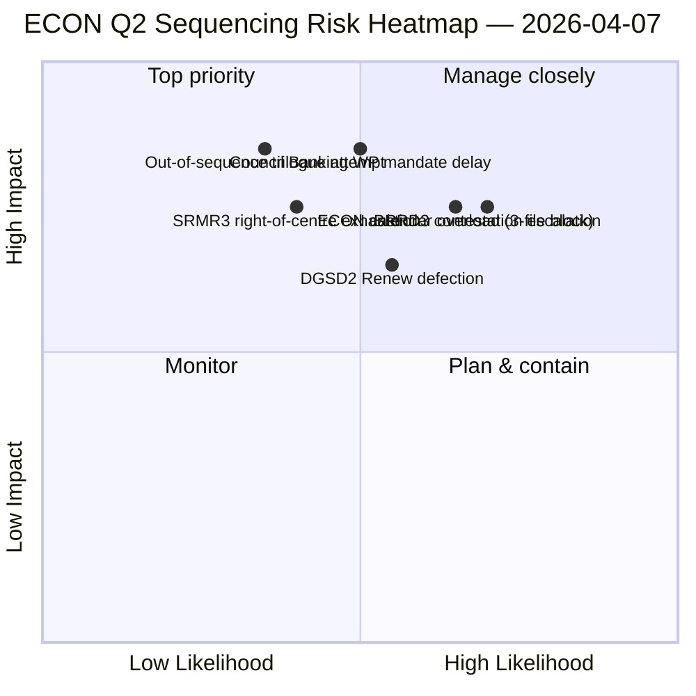

<!-- SPDX-FileCopyrightText: 2026 Hack23 AB -->
<!-- SPDX-License-Identifier: Apache-2.0 -->

# Utøvende sammendrag — Komitérapporter: ECON Q2 dominanskart | 2026-04-07

**Klassifisering:** OSINT — Offentlig parlamentarisk protokoll
**Tillit:** 🟡 MIDDELS (analytisk arbeid under pause; protokoller før pause 🟢 HØY)
**Kjøring:** `analysis/daily/2026-04-07/committee-reports/` (04:59 UTC)
**Dekning:** Påskepause dag 12/18 — ECON Q2 dominanskart; 20 analysefiler; 236 vedtatte tekster kumulativt.
**Generert:** 2026-05-16 (retrospektivt sammendrag, ingen nye MCP-kall)
**Primære kilder:** ECON-korpus før pause (TA-10-2026-0090/0091/0092 Bankunionstriplett); 20 metoder; 4/8 API-feeds aktive.

---

## 🎯 BLUF

**Denne dag-12-kjøringen for komitérapporter er ECON Q2 dominanskartet** — en dypere versjon av funnet om maktkonsentrasjon i komiteen fra 6. april, med én kritisk tillegg: eksplisitte Q2-trilogsekvensanbefalinger. Kjøringens særegne bidrag er **ECON-sekvensfunnet**: mens 6. april dokumenterte at ECON ville dominere Q2-trilogkalenderen, produserer denne kjøringen en handlingsorientert rekkefølgeanbefaling — SRMR3 (TA-10-2026-0092) **må trilogere først** fordi det er det mest prosedyremessig avanserte og politisk varmeste (høyre-sentrum-flertall intakt); DGSD2 (TA-10-2026-0090) **andre** fordi det er avhengig av SRMR3 kapitalbehandlingsklarhet; BRRD3 (TA-10-2026-0091) **tredje** fordi det er den mest omtvistede filen (blandet vedtakelsesmønster). Denne sekvensanbefalingen informerer direkte Rådets bankarbeidsgruppplanlegging og gir EP-ordførere en forsvarlig trilogrekkefølge. Kjøringen bekrefter påskepauserekorden: **ECON's SRMR3 + DGSD2 + BRRD3 representerer fullførelsen av flerårige bankuionssaker** som påvirker hele EUs banksektor og arkitektur for finansiell stabilitet.

---

## 🧭 3 beslutninger dette sammendraget støtter

| # | Beslutning | Hvem bestemmer | Frist | Bevis |
|:-:|------------|----------------|:-----:|-------|
| 1 | **ECON trilogsekvensering** — SRMR3 → DGSD2 → BRRD3 rekkefølge | ECON-leder + Rådets bankarbeidsgruppe | innen 14. april | §Sekvensfunn |
| 2 | **BRRD3 blandet-spor-briefing** — mest omtvistede fil; koordinatormøte før trilog | Renew + PPE-koordinatorer | innen 13. april | §BRRD3-omtvistelse |
| 3 | **Bankuion trilogkalenderreservasjon** — 3-fils ECON-sekvens trenger Q2-slottblokk | Presidentkonferansen + Rådet Coreper | innen 14. april | §Kalenderreservasjon |

---

## 📰 60-sekunders lesing

- 🔴 **ECON Q2 dominanskart produsert** — handlingsorientert sekvensering.
- 🟠 **Trilogrekkefølge:** SRMR3 → DGSD2 → BRRD3.
- 🟢 **SRMR3 først:** prosedyremessig avansert + varmt høyre-sentrum-flertall.
- 🟡 **DGSD2 andre:** avhengig av SRMR3 kapitalbehandling.
- 🔵 **BRRD3 tredje:** mest omtvistet (blandet vedtakelse).
- 🟣 **236 vedtatte tekster** i kumulativt korpus før pause.
- 🩷 **4/8 API-feeds aktive** — analyse på komiténivå upåvirket.
- ⚪ **Tillit MIDDELS** — pause; protokoller før pause HØY.

---

## 🏛️ ECON trilogsekvensering (kjøringens særegne bidrag)

| # | Fil | Prosedyretilstand | Politisk tilstand | Begrunnelse for rekkefølge |
|:-:|-----|-------------------|-------------------|---------------------------|
| **1.** | **SRMR3** (TA-10-2026-0092) | Avansert; høyre-sentrum-vedtakelse | PPE+ECR+PfE+Renew-flertall intakt | Prosedyremessig varmest; rådsmandatklart |
| **2.** | **DGSD2** (TA-10-2026-0090) | Blandet spor (Renew filbetinget) | Avhengig av SRMR3 kapitalbehandling | Sekvensfast til SRMR3 |
| **3.** | **BRRD3** (TA-10-2026-0091) | Mest omtvistede vedtakelse | Blandet spor + nasjonal-statlig omtvistelse | Trenger lengst forhandlingshorisont |

---

## ⚠️ Risikoøyeblikksbilde

---

## 🔮 Topp fremtidsutløsere (neste 14 dager)

1. **14. april — Komitéuke åpner** — ECON dag 1; SRMR3 sekvenstest.
2. **17. april — ECB rentebeslutning** — ekstern utløser for bankuionsfiler.
3. **20.–23. april — første plenum etter pause** — signaliseringsvindu for Rådets bankarbeidsgruppe.
4. **Sen april — SRMR3 trilog formell start** — sekvensering validert eller revidert.
5. **Midt-Q2 — DGSD2 → BRRD3 overganger** — sekvensfast progresjon.

---

## 🛡️ Kildekvalitetsvurdering

- **Korpus før pause (A1):** primærprotokoll; verifiserbare per TA-ID.
- **Sekvensanbefaling (A2):** komitémaktmetodikk + prosedyremessig tilstandsanalyse.
- **Identifikasjon av blandet spor BRRD3 (A2):** stemme mønstre krysskontrollert.
- **20 metoder (A1):** systematisk full metodedekking.
- **Nettotillit:** 🟢 HØY for Q1-protokoller; 🟡 MIDDELS for Q2-sekvensprognose.

---

## 📎 Kjøringsartefakter

| Lag | Artefakt | Hvorfor |
|-----|----------|---------|
| Artikkel | `article.md` | Offentlig fortelling om komitérapporter |
| Syntese | `existing/synthesis-summary.md` | ECON-sekvensfunn |
| Metoder | klassifisering · eksisterende · risikovurdering · trusselsvurdering | Standardmetodikk for komitérapporter |
| Ledsager | breaking (06:36) · breaking-2 (18:20) · motions · propositions | Daglig klynge dag 12 |

---

**Dokumentkontroll**
- **Mallreferanse:** `analysis/templates/executive-brief.md`
- **Artefaktsti:** `analysis/daily/2026-04-07/committee-reports/executive-brief.md`
- **Klassifisering:** Offentlig
- **Retrospektiv:** Sammendrag skrevet 2026-05-16 fra kjøringens committede artefakter; **ingen nye MCP-kall ble gjort**.
