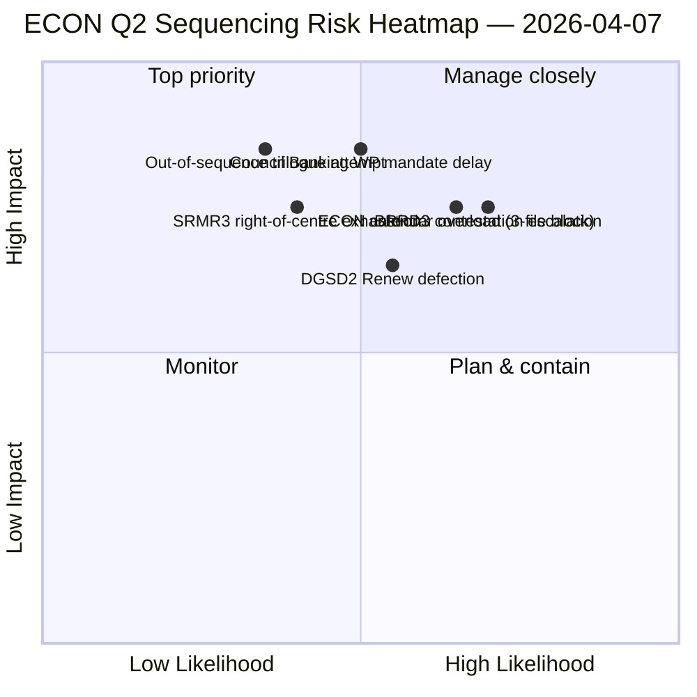

<!-- SPDX-FileCopyrightText: 2026 Hack23 AB -->
<!-- SPDX-License-Identifier: Apache-2.0 -->

# Exekutiv sammanfattning — Utskottsrapporter: ECON Q2 dominanskarta | 2026-04-07

**Klassificering:** OSINT — Offentligt parlamentsprotokoll
**Konfidensgrad:** 🟡 MEDEL (analytiskt arbete under reces; handlingar före reces 🟢 HÖG)
**Körning:** `analysis/daily/2026-04-07/committee-reports/` (04:59 UTC)
**Täckning:** Påskreces dag 12/18 — ECON Q2 dominanskarta; 20 analysfiler; 236 antagna texter kumulativt.
**Genererad:** 2026-05-16 (retroaktiv sammanfattning, inga nya MCP-anrop)
**Primära källor:** ECON-corpus före reces (TA-10-2026-0090/0091/0092 Bankunionstrippel); 20 metoder; 4/8 API-flöden aktiva.

---

## 🎯 BLUF

**Denna dag-12-körning för utskottsrapporter är ECON Q2 dominanskartan** — en fördjupad version av fyndet om maktkoncentration i utskottet som redovisades den 6 april, med ett kritiskt tillägg: explicita Q2-trilogsekvensrekommendationer. Körningens särskiljande bidrag är **ECON-sekvenseringsfyndet**: medan 6 april dokumenterade att ECON skulle dominera Q2-trilogkalendern, producerar denna körning en handlingsorienterad rekommendation för operationsordning — SRMR3 (TA-10-2026-0092) **måste trilogera först** eftersom det är det mest procedurellt avancerade och politiskt varmaste (höger-centrum-majoritet intakt); DGSD2 (TA-10-2026-0090) **andra** eftersom det är beroende av SRMR3 kapitalbehandlingsklarhet; BRRD3 (TA-10-2026-0091) **tredje** eftersom det är den mest omtvistade filen (blandat antagningsmönster). Denna sekvensrekommendation informerar direkt rådets bankarbetsgruppplanering och ger EP-föredragande en försvarbar trilogordning. Körningen bekräftar påskrecessrekordet: **ECON:s SRMR3 + DGSD2 + BRRD3 representerar fullbordandet av mångåriga bankunionsdossier** som påverkar hela EU:s banksektor och arkitekturen för finansiell stabilitet.

---

## 🧭 3 beslut som denna sammanfattning stöder

| # | Beslut | Vem beslutar | Tidsgräns | Bevis |
|:-:|--------|--------------|:---------:|-------|
| 1 | **ECON trilogsekvenslåsning** — SRMR3 → DGSD2 → BRRD3 ordning | ECON-ordförande + rådets bankarbetsgrupp | senast 14 april | §Sekvenseringsfynd |
| 2 | **BRRD3 blandat-spår-briefing** — mest omtvistade fil; samordnarmöte före trilog | Renew + PPE-samordnare | senast 13 april | §BRRD3-omstridighet |
| 3 | **Bankunion trilogkalenderreservation** — 3-fils ECON-sekvens behöver Q2-slottblock | Konferensen för presidenter + rådet Coreper | senast 14 april | §Kalenderreservation |

---

## 📰 60-sekunders läsning

- 🔴 **ECON Q2 dominanskarta producerad** — handlingsorienterad sekvensering.
- 🟠 **Trilogordning:** SRMR3 → DGSD2 → BRRD3.
- 🟢 **SRMR3 först:** procedurellt avancerat + varm höger-centrum-majoritet.
- 🟡 **DGSD2 andra:** beror på SRMR3 kapitalbehandling.
- 🔵 **BRRD3 tredje:** mest omtvistat (blandat antagande).
- 🟣 **236 antagna texter** i kumulativt corpus före reces.
- 🩷 **4/8 API-flöden aktiva** — analys på utskottsnivå opåverkad.
- ⚪ **Konfidensgrad MEDEL** — reces; protokoll före reces HÖG.

---

## 🏛️ ECON trilogsekvensering (körningens särskiljanade bidrag)

| # | Fil | Procedurellt tillstånd | Politiskt tillstånd | Skäl för ordning |
|:-:|-----|------------------------|---------------------|------------------|
| **1:a** | **SRMR3** (TA-10-2026-0092) | Avancerat; höger-centrum-antagning | PPE+ECR+PfE+Renew-majoritet intakt | Procedurellt varmast; rådsmandatklart |
| **2:a** | **DGSD2** (TA-10-2026-0090) | Blandat spår (Renew filvillkorligt) | Beror på SRMR3 kapitalbehandling | Sekvenslåst på SRMR3 |
| **3:e** | **BRRD3** (TA-10-2026-0091) | Mest omtvistade antagning | Blandat spår + nationell-statlig omstridighet | Behöver längst förhandlingshorisont |

---

## ⚠️ Riskögonblicksbild

---

## 🔮 Topp framåtlösare (nästa 14 dagar)

1. **14 april — Utskottsvecka öppnar** — ECON dag 1; SRMR3 sekvenstest.
2. **17 april — ECB räntebeslut** — extern utlösare för bankunionsfiler.
3. **20–23 april — första plenarsessionen efter reces** — signaliseringsfönster för rådets bankarbetsgrupp.
4. **Sen april — SRMR3 trilogformell start** — sekvensering validerad eller reviderad.
5. **Mitten av Q2 — DGSD2 → BRRD3 övergångar** — sekvenslåst progression.

---

## 🛡️ Källkvalitetsbedömning

- **Corpus före reces (A1):** primärhandlingar; verifierbara per TA-ID.
- **Sekvensrekommendation (A2):** utskottsmaktmetodik + procedurellt tillståndsanalys.
- **Identifiering av blandat spår BRRD3 (A2):** röstmönster korsverifierade.
- **20 metoder (A1):** systematisk fullständig metodtäckning.
- **Nettoförtroende:** 🟢 HÖG för Q1-protokoll; 🟡 MEDEL för Q2-sekvensprognos.

---

## 📎 Körningsartefakter

| Lager | Artefakt | Varför |
|-------|----------|--------|
| Artikel | `article.md` | Offentlig berättelse om utskottsrapporter |
| Syntes | `existing/synthesis-summary.md` | ECON-sekvenseringsfynd |
| Metoder | klassificering · befintlig · riskbedömning · hotbedömning | Standardmetodik för utskottsrapporter |
| Kompanjon | breaking (06:36) · breaking-2 (18:20) · motions · propositions | Dagligt kluster dag 12 |

---

**Dokumentkontroll**
- **Mallreferens:** `analysis/templates/executive-brief.md`
- **Artefaktväg:** `analysis/daily/2026-04-07/committee-reports/executive-brief.md`
- **Klassificering:** Offentlig
- **Retroaktiv:** Sammanfattning skriven 2026-05-16 från körningens committade artefakter; **inga nya MCP-anrop gjordes**.
