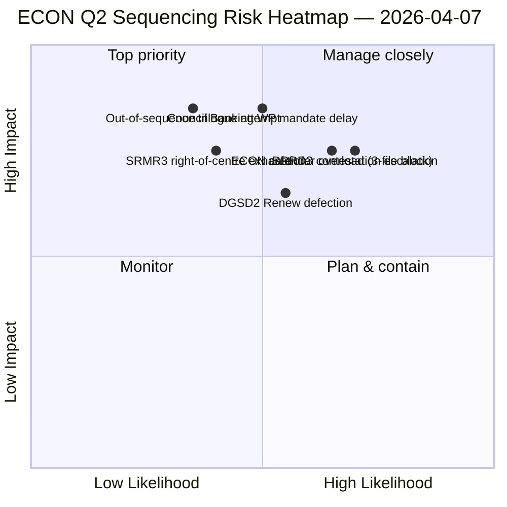

<!-- SPDX-FileCopyrightText: 2026 Hack23 AB -->
<!-- SPDX-License-Identifier: Apache-2.0 -->

# 执行摘要 — 委员会报告：ECON第二季度主导地图 | 2026-04-07

**分类：** OSINT — 公开议会记录
**置信度：** 🟡 中等（休会期间的分析工作；休会前记录 🟢 高）
**运行：** `analysis/daily/2026-04-07/committee-reports/` (04:59 UTC)
**覆盖范围：** 复活节休会第12天/共18天 — ECON第二季度主导地图；20个分析文件；累计236份已采纳文本。
**生成：** 2026-05-16（回溯性摘要，无新MCP调用）
**主要来源：** 休会前ECON语料库 (TA-10-2026-0090/0091/0092 银行联盟三联件)；20种方法；4/8 API源活跃。

---

## 🎯 BLUF

**这次委员会报告第12天运行是ECON第二季度主导地图** — 是4月6日揭示的委员会权力集中发现的更深入版本，附加一个关键内容：第二季度三方对话的明确排序建议。此次运行的独特贡献是**ECON排序发现**：4月6日记录了ECON将主导第二季度三方对话日历，而此次运行产生了可操作的操作顺序建议 — SRMR3 (TA-10-2026-0092) **必须首先进行三方对话**，因为它在程序上最为先进且政治上最为活跃（右翼中间派多数派完整）；DGSD2 (TA-10-2026-0090) **第二**，因为它依赖于SRMR3的资本处理明确性；BRRD3 (TA-10-2026-0091) **第三**，因为它是争议最大的文件（混合采纳模式）。此排序建议直接指导理事会银行工作组规划，并为欧洲议会报告人提供可辩护的三方对话顺序。

---

## 🧭 本摘要支持的3项决定

| # | 决定 | 谁决定 | 截止日期 | 依据 |
|:-:|------|--------|:--------:|------|
| 1 | **ECON三方对话排序锁定** — SRMR3 → DGSD2 → BRRD3顺序 | ECON主席 + 理事会银行工作组 | 4月14日前 | §排序发现 |
| 2 | **BRRD3混合轨道简报** — 争议最大的文件；三方对话前协调员会议 | Renew + PPE协调员 | 4月13日前 | §BRRD3争议 |
| 3 | **银行联盟三方对话日历预订** — ECON3文件序列需要第二季度时段块 | 主席团会议 + 理事会Coreper | 4月14日前 | §日历预订 |

---

## 📰 60秒阅读

- 🔴 **ECON第二季度主导地图已生成** — 可操作的排序。
- 🟠 **三方对话顺序：** SRMR3 → DGSD2 → BRRD3。
- 🟢 **SRMR3首位：** 程序上先进 + 温和的右翼中间派多数派。
- 🟡 **DGSD2第二：** 依赖于SRMR3资本处理。
- 🔵 **BRRD3第三：** 争议最大（混合采纳）。
- 🟣 **236份已采纳文本**在累计休会前语料库中。
- 🩷 **4/8 API源活跃** — 委员会级别分析不受影响。
- ⚪ **置信度中等** — 休会；休会前记录高。

---

## 🏛️ ECON三方对话排序（运行的独特贡献）

| # | 文件 | 程序状态 | 政治状态 | 排序理由 |
|:-:|------|---------|---------|---------|
| **第1** | **SRMR3** (TA-10-2026-0092) | 先进；右翼中间派采纳 | PPE+ECR+PfE+Renew多数派完整 | 程序上最活跃；理事会授权就绪 |
| **第2** | **DGSD2** (TA-10-2026-0090) | 混合轨道（Renew文件条件） | 依赖SRMR3资本处理 | 在序列上锁定至SRMR3 |
| **第3** | **BRRD3** (TA-10-2026-0091) | 争议最大的采纳 | 混合轨道 + 国家争议 | 需要最长谈判期限 |

---

## ⚠️ 风险快照

---

## 🔮 顶级前瞻性触发因素（未来14天）

1. **4月14日 — 委员会周开始** — ECON第1天；SRMR3排序测试。
2. **4月17日 — 欧洲央行利率决定** — 银行联盟文件的外部触发因素。
3. **4月20—23日 — 休会后首次全体会议** — 理事会银行工作组信号窗口。
4. **4月末 — SRMR3三方对话正式启动** — 排序得到验证或修订。
5. **第二季度中期 — DGSD2 → BRRD3过渡** — 序列锁定的进展。

---

## 🛡️ 来源质量评估

- **休会前语料库 (A1)：** 主要记录；可通过TA-ID核实。
- **排序建议 (A2)：** 委员会权力方法论 + 程序状态分析。
- **BRRD3混合轨道识别 (A2)：** 投票模式交叉验证。
- **20种方法 (A1)：** 系统性完整方法论覆盖。
- **净置信度：** 🟢 第一季度记录高；🟡 第二季度排序预测中等。

---

## 📎 运行产物

| 层次 | 产物 | 原因 |
|------|------|------|
| 文章 | `article.md` | 委员会报告公开叙述 |
| 综合 | `existing/synthesis-summary.md` | ECON排序发现 |
| 方法 | 分类 · 现有 · 风险评估 · 威胁评估 | 委员会报告标准方法论 |
| 配套 | breaking (06:36) · breaking-2 (18:20) · motions · propositions | 第12天日常集群 |

---

**文件控制**
- **模板参考：** `analysis/templates/executive-brief.md`
- **产物路径：** `analysis/daily/2026-04-07/committee-reports/executive-brief.md`
- **分类：** 公开
- **回溯性：** 摘要于2026-05-16从运行提交的产物中撰写；**未进行新MCP调用**。
