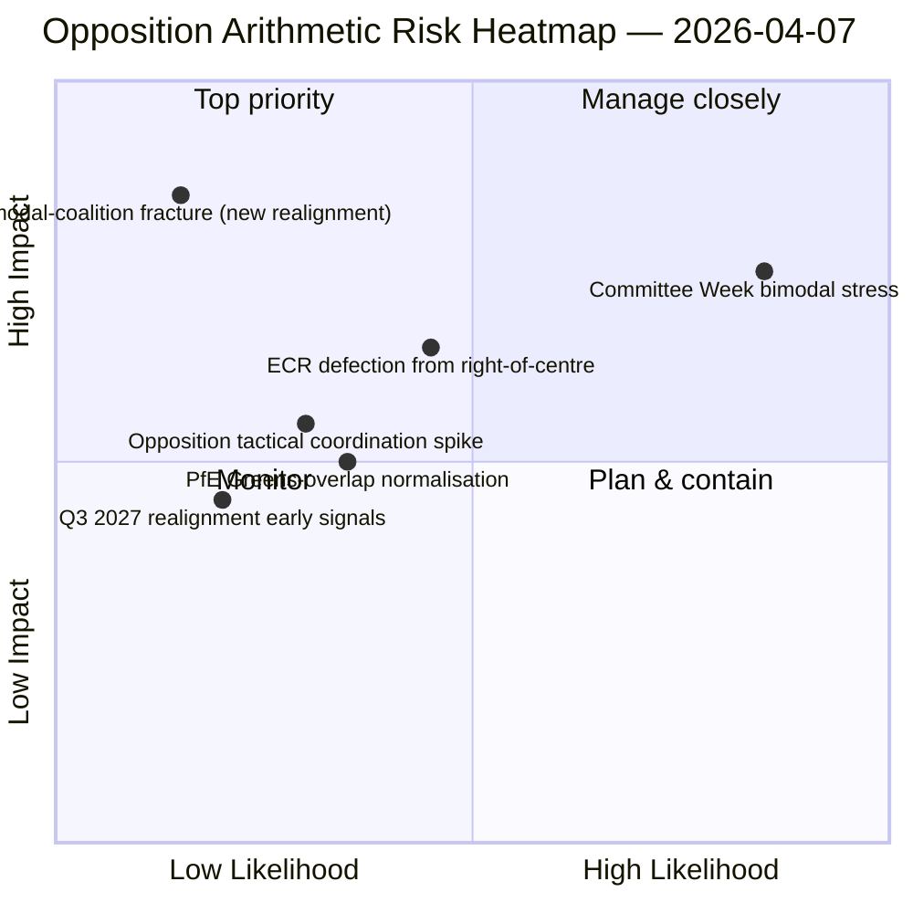

<!-- SPDX-FileCopyrightText: 2026 Hack23 AB -->
<!-- SPDX-License-Identifier: Apache-2.0 -->

# Executive Brief — Motions: Day-12 Voting-Pattern Stress Test | 2026-04-07

**Classification:** OSINT — Public Parliamentary Record
**Confidence:** 🟡 MEDIUM (recess; pre-recess RCV records 🟢 HIGH)
**Run:** `analysis/daily/2026-04-07/motions/` (06:39 UTC)
**Coverage:** Easter Recess Day 12/18 — bimodal-coalition stress test on Day-12 baseline; 19 analysis files.
**Generated:** 2026-05-16 (retrospective brief, no new MCP calls)
**Primary sources:** Pre-recess RCV corpus + Day-11 bimodal finding; 5 High-confidence methods (coalition-dynamics, cross-session-intelligence, deep-analysis, stakeholder-impact, voting-patterns).

---

## 🎯 BLUF

**This Day-12 motions run is the **bimodal-coalition stress test** on the April 6 finding — it asks: does the bimodal coalition system survive a 24-hour holdover under degraded API conditions, and what additional structural insight does the Day-12 reading add?** Answer: yes, bimodality is structurally robust, and the Day-12 run adds the **opposition-coordination diagnostic**: ECR (78 seats) + PfE (84 seats) + Left (46 seats) = 208 max votes, well below the 264 blocking threshold and 360 majority threshold. The opposition's structural inability to coordinate a blocking minority on either bimodal track is now confirmed across two independent run-days. The run's distinguishing contribution beyond Day-11 is the **opposition-cohesion taxonomy**: even when ECR aligns with grand-coalition tracks (Anti-Corruption transposition), and even when PfE peels off from right-of-centre tracks (occasional Renew-Greens overlap on environmental files), the structural opposition arithmetic does not change — **EP10's opposition operates as a permanent structural minority below blocking threshold** until at least Q3 2027 when the next major group realignment becomes possible. This is the Day-12 motions run's most lasting structural contribution: a *closed-form arithmetic statement* about EP10 opposition capacity.

---

## 🧭 3 Decisions This Brief Supports

| # | Decision | Who decides | Deadline | Evidence |
|:-:|----------|-------------|:--------:|----------|
| 1 | **Opposition-coordination assessment** — 208 max vs. 264 blocking; structural minority confirmed | ECR + PfE + Left coordinators | rolling | §Opposition arithmetic |
| 2 | **Bimodal-coalition durability finding** — robust across 2 run-days; institutional planning anchor | Conference of Presidents | rolling | §Bimodal validation |
| 3 | **Q3 2027 realignment watch** — earliest structural opposition-capacity change | Strategic-planning ops | long-horizon | §Realignment forecast |

---

## 📰 60-Second Read

- 🔴 **Bimodal-coalition validated across 2 run-days** — structurally robust.
- 🟠 **Opposition structural minority confirmed** — 208 max vs. 264 blocking.
- 🟢 **ECR 78 + PfE 84 + Left 46 = 208** — verifiable arithmetic.
- 🟡 **Permanent until Q3 2027** — earliest realignment possibility.
- 🔵 **5 High-confidence methods** — coalition + cross-session + deep + stakeholder + voting.
- 🟣 **19 analysis files** — full motions methodology coverage.
- 🩷 **Day 12/18 — recess 67% complete**.
- ⚪ **Confidence MEDIUM** — recess analytical work; arithmetic HIGH.

---

## ➕ Opposition Arithmetic (run's distinguishing contribution)

| Group | Seats | Q1 2026 voting role |
|-------|------:|--------------------|
| ECR | 78 | File-conditional (joins right-of-centre on economic-finance; defects on rule-of-law) |
| PfE | 84 | Right-of-centre track member; occasional Renew-Greens overlap on environmental |
| Left | 46 | Permanent opposition |
| **Sum** | **208** | **Below 264 blocking threshold; below 360 majority threshold** |

---

## ⚠️ Risk Snapshot

---

## 🔮 Top Forward Triggers (next 14 days)

1. **April 14 — Committee Week opens** — bimodal stress test Day 1.
2. **April 15 — US tariff T-0** — opposition-coordination spike potential.
3. **April 17 — ECB rate decision** — economic-finance track external trigger.
4. **April 20-23 — first post-recess plenary** — full bimodal validation.
5. **Long horizon Q3 2027** — earliest structural realignment possibility.

---

## 🛡️ Source-Quality Assessment

- **Opposition arithmetic (A1):** primary EP MEP-seat records; verifiable per group.
- **Bimodal-coalition validation (A2):** coalition-dynamics + voting-patterns cross-verified.
- **Q3 2027 realignment forecast (A3):** electoral-cycle methodology; medium-confidence horizon.
- **5 High-confidence methods (A1):** systematic methodology.
- **Net confidence:** 🟢 HIGH on arithmetic; 🟡 MEDIUM on 2027 realignment forecast.

---

## 📎 Run Artifacts

| Layer | Artifact | Why |
|-------|----------|-----|
| Article | `article.md` | Public-facing motions narrative |
| Synthesis | `existing/synthesis-summary.md` | Opposition-arithmetic + bimodal-validation |
| Methods | classification · existing · risk-scoring · threat-assessment | Standard motions methodology |
| Companion | breaking (06:36) · breaking-2 (18:20) · committee-reports · propositions | Day-12 daily cluster |

---

**Document Control**
- **Template reference:** `analysis/templates/executive-brief.md`
- **Artifact path:** `analysis/daily/2026-04-07/motions/executive-brief.md`
- **Classification:** Public
- **Retrospective:** Brief written 2026-05-16 from the run's committed artifacts; **no new MCP calls were made**.
