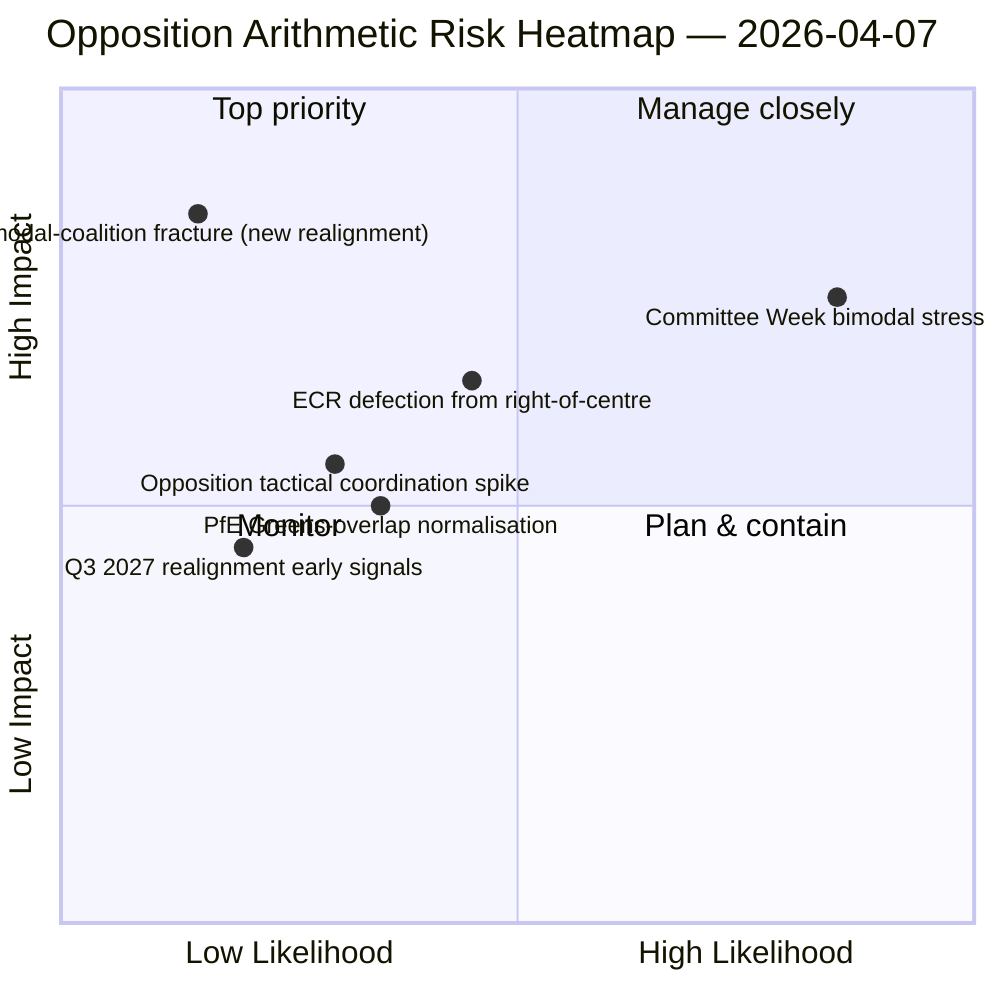

<!-- SPDX-FileCopyrightText: 2026 Hack23 AB -->
<!-- SPDX-License-Identifier: Apache-2.0 -->

# موجز تنفيذي — الاقتراحات: اختبار الإجهاد لنمط التصويت — اليوم 12 | 2026-04-07

**التصنيف:** OSINT — السجل البرلماني العام
**مستوى الثقة:** 🟡 متوسط (إجازة عيد الفصح؛ سجلات التصويت بالنداء الاسمي قبل الإجازة 🟢 مرتفع)
**الجولة:** `analysis/daily/2026-04-07/motions/` (06:39 UTC)
**التغطية:** إجازة عيد الفصح اليوم 12/18 — اختبار إجهاد التحالف ثنائي النمط على أساس اليوم الثاني عشر؛ 19 ملف تحليلي.
**تاريخ الإنشاء:** 2026-05-16 (موجز استرجاعي، لا اتصالات MCP جديدة)
**المصادر الأولية:** مجموعة سجلات التصويت بالنداء الاسمي قبل الإجازة + نتيجة النمط ثنائي التوزيع لليوم 11؛ 5 طرق عالية الثقة (ديناميكيات التحالف، ذكاء الجلسات المتقاطعة، التحليل المعمّق، تأثير أصحاب المصلحة، أنماط التصويت).

---

## 🎯 الخلاصة التنفيذية

**تُشكّل جولة الاقتراحات هذه في اليوم الثاني عشر اختبار الإجهاد لنظام التحالف ثنائي النمط مقابل نتيجة السادس من أبريل — إذ تطرح السؤال: هل يصمد النظام ثنائي النمط خلال 24 ساعة إضافية في ظل ظروف API متدهورة، وما الرؤية الهيكلية الإضافية التي توفرها قراءة اليوم الثاني عشر؟** الإجابة: نعم، ثنائية النمط راسخة هيكلياً، وتُضيف جولة اليوم الثاني عشر **تشخيص تنسيق المعارضة**: ECR (78 مقعداً) + PfE (84 مقعداً) + اليسار (46 مقعداً) = 208 أصوات كحد أقصى، أي أقل بكثير من عتبة الحجب البالغة 264 صوتاً وعتبة الأغلبية البالغة 360 صوتاً. وقد جرى تأكيد عجز المعارضة الهيكلي عن تنسيق أقلية حاجبة على أي من المسارين ثنائيي النمط عبر يومَي جولة مستقلَّين. أما الإسهام المميز لهذه الجولة بما يتخطى اليوم الحادي عشر، فهو **تصنيف تماسك المعارضة**: حتى حين ينضم ECR إلى مسارات التحالف الكبير (نقل قانون مكافحة الفساد)، وحين ينفصل PfE عن مسارات يمين الوسط (تداخل عرضي مع تيار Renew والخضر في الملفات البيئية)، لا تتغير حسابات المعارضة الهيكلية — **تعمل معارضة البرلمان الأوروبي EP10 بوصفها أقلية هيكلية دائمة دون عتبة الحجب** حتى الربع الثالث من عام 2027 على الأقل، حين يصبح ممكناً إعادة التوافق الجماعي الكبرى التالية. هذا هو الإسهام الهيكلي الأكثر ديمومة لجولة اقتراحات اليوم الثاني عشر: *تصريح حسابي مغلق* حول قدرة المعارضة في EP10.

---

## 🧭 ثلاثة قرارات يدعمها هذا الموجز

| # | القرار | من يتخذه | الموعد النهائي | الأدلة |
|:-:|--------|----------|:--------------:|--------|
| 1 | **تقييم تنسيق المعارضة** — 208 كحد أقصى مقابل 264 حجباً؛ الأقلية الهيكلية مؤكدة | منسقو ECR + PfE + اليسار | متجدد | §الحسابات المعارضة |
| 2 | **نتيجة متانة التحالف ثنائي النمط** — صامد عبر يومَي جولة؛ مرساة التخطيط المؤسسي | مؤتمر الرؤساء | متجدد | §التحقق ثنائي النمط |
| 3 | **مراقبة إعادة التوافق في الربع الثالث 2027** — أقرب تغيير هيكلي ممكن في قدرة المعارضة | التخطيط الاستراتيجي | أمد بعيد | §توقعات إعادة التوافق |

---

## 📰 قراءة في 60 ثانية

- 🔴 **التحالف ثنائي النمط مُتحقق منه عبر يومَي جولة** — صامد هيكلياً.
- 🟠 **الأقلية الهيكلية للمعارضة مؤكدة** — 208 كحد أقصى مقابل 264 حجباً.
- 🟢 **ECR 78 + PfE 84 + اليسار 46 = 208** — حسابات قابلة للتحقق.
- 🟡 **دائمة حتى الربع الثالث 2027** — أقرب إمكانية لإعادة التوافق.
- 🔵 **5 طرق عالية الثقة** — تحالف + جلسات متقاطعة + معمّق + أصحاب مصلحة + تصويت.
- 🟣 **19 ملف تحليلي** — تغطية كاملة لمنهجية الاقتراحات.
- 🩷 **اليوم 12/18 — الإجازة مكتملة 67 %**.
- ⚪ **مستوى الثقة: متوسط** — عمل تحليلي خلال الإجازة؛ الحسابات: مرتفعة.

---

## ➕ حسابات المعارضة (الإسهام المميز للجولة)

| المجموعة | المقاعد | دور التصويت في الربع الأول 2026 |
|---------|--------:|---------------------------------|
| ECR | 78 | مشروط بالملف (ينضم إلى يمين الوسط في الاقتصاد والمالية؛ يتباين في سيادة القانون) |
| PfE | 84 | عضو في مسار يمين الوسط؛ تداخل عرضي مع Renew والخضر في البيئة |
| اليسار | 46 | معارضة دائمة |
| **المجموع** | **208** | **دون عتبة الحجب 264؛ دون عتبة الأغلبية 360** |

---

## ⚠️ لمحة عن المخاطر

---

## 🔮 أبرز المحفزات المستقبلية (الأربعة عشر يوماً القادمة)

1. **14 أبريل — افتتاح أسبوع اللجان** — اختبار الإجهاد ثنائي النمط اليوم الأول.
2. **15 أبريل — التعريفات الجمركية الأمريكية T-0** — ارتفاع محتمل في تنسيق المعارضة.
3. **17 أبريل — قرار أسعار الفائدة للبنك المركزي الأوروبي** — محفز خارجي لمسار الاقتصاد والمالية.
4. **20-23 أبريل — أول جلسة عامة بعد الإجازة** — التحقق ثنائي النمط الكامل.
5. **الأمد البعيد: الربع الثالث 2027** — أقرب إمكانية لإعادة التوافق الهيكلي.

---

## 🛡️ تقييم جودة المصادر

- **حسابات المعارضة (A1):** سجلات مقاعد أعضاء البرلمان الأوروبي الأولية؛ قابلة للتحقق لكل مجموعة.
- **التحقق من التحالف ثنائي النمط (A2):** ديناميكيات التحالف + أنماط التصويت مُتحقق منها تقاطعياً.
- **توقعات إعادة التوافق في الربع الثالث 2027 (A3):** منهجية الدورة الانتخابية؛ أفق ثقة متوسط.
- **5 طرق عالية الثقة (A1):** منهجية منظمة.
- **الثقة الصافية:** 🟢 مرتفعة في الحسابات؛ 🟡 متوسطة في توقعات إعادة التوافق لعام 2027.

---

## 📎 مصنوعات الجولة

| الطبقة | المصنوع | السبب |
|-------|---------|-------|
| المقال | `article.md` | سرد الاقتراحات العام |
| التوليف | `existing/synthesis-summary.md` | حسابات المعارضة + التحقق ثنائي النمط |
| الأساليب | classification · existing · risk-scoring · threat-assessment | منهجية الاقتراحات القياسية |
| المصاحب | breaking (06:36) · breaking-2 (18:20) · committee-reports · propositions | مجموعة اليوم 12 اليومية |

---

**مراقبة المستندات**
- **مرجع القالب:** `analysis/templates/executive-brief.md`
- **مسار المصنوع:** `analysis/daily/2026-04-07/motions/executive-brief.md`
- **التصنيف:** عام
- **استرجاعي:** كُتب الموجز في 2026-05-16 من مصنوعات الجولة الملتزمة؛ **لم تُجرَ اتصالات MCP جديدة**.
