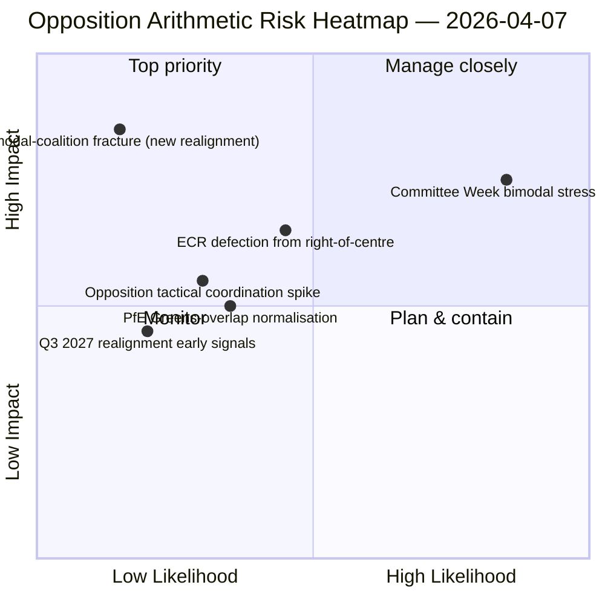

<!-- SPDX-FileCopyrightText: 2026 Hack23 AB -->
<!-- SPDX-License-Identifier: Apache-2.0 -->

# Eksekutiv briefing — Beslutningsforslag: Dag-12 stresstest af afstemnings­mønster | 2026-04-07

**Klassifikation:** OSINT — Offentlig parlamentarisk registrering
**Konfidens:** 🟡 MEDIUM (påskeferie; RCV-registre fra før ferien 🟢 HØJ)
**Kørsel:** `analysis/daily/2026-04-07/motions/` (06:39 UTC)
**Dækning:** Påskeferie dag 12/18 — bimodalt koalitionsstresstest mod dag-12-baseline; 19 analysefiler.
**Genereret:** 2026-05-16 (retrospektiv briefing, ingen nye MCP-kald)
**Primære kilder:** RCV-korpus fra før ferien + dag-11 bimodalt fund; 5 metoder med høj konfidens (coalition-dynamics, cross-session-intelligence, deep-analysis, stakeholder-impact, voting-patterns).

---

## 🎯 BLUF

**Denne dag-12 beslutningsforslagskørsel er stresstesten af det bimodale koalitionssystem mod fund fra den 6. april — den stiller spørgsmålet: overlever det bimodale koalitionssystem et 24-timers holdover under nedgraderede API-forhold, og hvilken yderligere strukturel indsigt tilføjer dag-12-aflæsningen?** Svar: ja, bimodalitet er strukturelt robust, og dag-12-kørslen tilføjer **oppositionskoordineringsdiagnostikken**: ECR (78 pladser) + PfE (84 pladser) + Venstre (46 pladser) = 208 maksimale stemmer, langt under blokkeringstærsklen på 264 og flertalstærsklen på 360. Oppositionens strukturelle manglende evne til at koordinere et blokerende mindretal på begge bimodale spor er nu bekræftet over to uafhængige kørsels­dage. Kørslens sonderende bidrag ud over dag-11 er **oppositionskohesionstaksonomien**: selv når ECR tilslutter sig storkoalitionsspor (antikorruptions transposition), og selv når PfE afviger fra højrecentrale spor (lejlighedsvis Renew-Grønne overlap på miljøfiler), ændres den strukturelle oppositionsaritmtetik ikke — **EP10's opposition opererer som et permanent strukturelt mindretal under blokkeringstærsklen** frem til mindst kvartal 3 2027, hvor den næste større gruppeomstilling bliver mulig. Dette er dag-12 beslutningsforslags­kørslens mest varige strukturelle bidrag: et *aritmetisk lukket udsagn* om EP10's oppositionskapacitet.

---

## 🧭 3 Beslutninger dette brev understøtter

| # | Beslutning | Hvem beslutter | Frist | Bevis |
|:-:|------------|----------------|:-----:|-------|
| 1 | **Vurdering af oppositionskoordinering** — 208 maks. vs. 264 blokerende; strukturelt mindretal bekræftet | ECR + PfE + Venstre koordinatorer | løbende | §Oppositionsaritmetik |
| 2 | **Fund om bimodal koalitionsholdbarhed** — robust over 2 kørsels­dage; institutionelt planlægningsanker | Formandskonferencen | løbende | §Bimodal validering |
| 3 | **Overvågning af kvartal 3 2027-omstilling** — tidligste strukturelle ændring i oppositionskapacitet | Strategisk planlægning | langsigtet | §Omstillingsprognose |

---

## 📰 60-sekunders læsning

- 🔴 **Bimodal koalition valideret over 2 kørsels­dage** — strukturelt robust.
- 🟠 **Oppositionens strukturelle mindretal bekræftet** — 208 maks. vs. 264 blokerende.
- 🟢 **ECR 78 + PfE 84 + Venstre 46 = 208** — verificerbar aritmetik.
- 🟡 **Permanent til kvartal 3 2027** — tidligste omstillingsmulighed.
- 🔵 **5 metoder med høj konfidens** — koalition + kryds­session + dyb + interessenter + afstemning.
- 🟣 **19 analysefiler** — fuld dækning af beslutningsforslags­metodik.
- 🩷 **Dag 12/18 — ferie 67% gennemført**.
- ⚪ **Konfidens MEDIUM** — analytisk arbejde under ferien; aritmetik HØJ.

---

## ➕ Oppositionsaritmetik (kørslens sonderende bidrag)

| Gruppe | Pladser | Afstemningsrolle kvartal 1 2026 |
|--------|--------:|--------------------------------|
| ECR | 78 | Filbetinget (tilslutter sig højrecentrum i økonomi-finans; afviger ved retsstat) |
| PfE | 84 | Højrecentrum-spormedlem; lejlighedsvis Renew-Grønne overlap på miljø |
| Venstre | 46 | Permanent opposition |
| **Sum** | **208** | **Under blokkeringstærskel 264; under flertalstærskel 360** |

---

## ⚠️ Risikooversigt

---

## 🔮 Top fremadrettede udløsere (næste 14 dage)

1. **14. april — Udvalgsugen åbner** — bimodalt stresstest dag 1.
2. **15. april — Amerikanske told T-0** — potentiel koordineringsspids for opposition.
3. **17. april — ECB rentebeslutning** — ekstern udløser for økonomi-finanssporet.
4. **20.–23. april — Første plenarmøde efter ferien** — fuld bimodal validering.
5. **Lang horisont kvartal 3 2027** — tidligste strukturelle omstillingsmulighed.

---

## 🛡️ Vurdering af kildekvalitet

- **Oppositionsaritmetik (A1):** primære EP MEP-pladsregistreringer; verificerbare pr. gruppe.
- **Bimodal koalitionsvalidering (A2):** coalition-dynamics + voting-patterns krydskontrolleret.
- **Kvartal 3 2027 omstillingsprognose (A3):** valgcyklus­metodik; mellemhøj konfidenshorisont.
- **5 metoder med høj konfidens (A1):** systematisk metodik.
- **Nettokonfidens:** 🟢 HØJ på aritmetik; 🟡 MEDIUM på 2027 omstillingsprognose.

---

## 📎 Kørselsartefakter

| Lag | Artefakt | Hvorfor |
|-----|----------|---------|
| Artikel | `article.md` | Offentlig beslutningsforslags­fortælling |
| Syntese | `existing/synthesis-summary.md` | Oppositionsaritmetik + bimodal validering |
| Metoder | classification · existing · risk-scoring · threat-assessment | Standard beslutningsforslags­metodik |
| Ledsager | breaking (06:36) · breaking-2 (18:20) · committee-reports · propositions | Dag-12 daglig klynge |

---

**Dokumentkontrol**
- **Skabelonreference:** `analysis/templates/executive-brief.md`
- **Artefaktsti:** `analysis/daily/2026-04-07/motions/executive-brief.md`
- **Klassifikation:** Offentlig
- **Retrospektiv:** Briefing skrevet 2026-05-16 fra kørslens committede artefakter; **ingen nye MCP-kald blev foretaget**.
