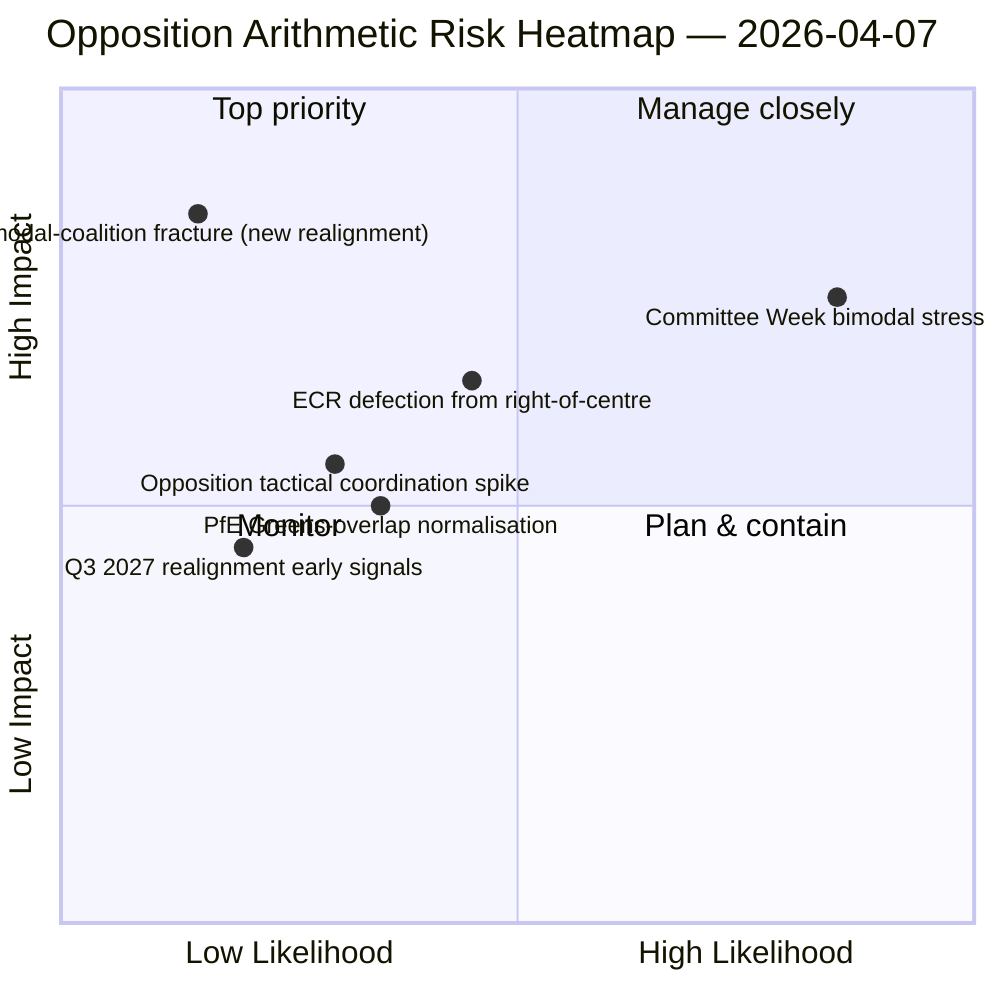

<!-- SPDX-FileCopyrightText: 2026 Hack23 AB -->
<!-- SPDX-License-Identifier: Apache-2.0 -->

# Exekutivbriefing — Entschließungsanträge: Tag-12-Stresstest der Abstimmungsmuster | 2026-04-07

**Klassifizierung:** OSINT — Öffentliches parlamentarisches Register
**Konfidenz:** 🟡 MITTEL (Osterferien; RCV-Aufzeichnungen vor der Pause 🟢 HOCH)
**Durchlauf:** `analysis/daily/2026-04-07/motions/` (06:39 UTC)
**Abdeckung:** Osterferien Tag 12/18 — bimodaler Koalitionsstresstest gegen die Tag-12-Basislinie; 19 Analysedateien.
**Erstellt:** 2026-05-16 (retrospektive Briefing, keine neuen MCP-Aufrufe)
**Primärquellen:** RCV-Korpus vor der Pause + Tag-11-bimodaler Befund; 5 Methoden mit hoher Konfidenz (coalition-dynamics, cross-session-intelligence, deep-analysis, stakeholder-impact, voting-patterns).

---

## 🎯 BLUF

**Dieser Tag-12-Entschließungsantragslauf ist der Stresstest des bimodalen Koalitionssystems gegenüber dem Befund vom 6. April — er stellt die Frage: Überlebt das bimodale Koalitionssystem einen 24-stündigen Fortbestand unter verschlechterten API-Bedingungen, und welche zusätzliche strukturelle Erkenntnis liefert die Tag-12-Ablesung?** Antwort: Ja, Bimodalität ist strukturell robust, und der Tag-12-Lauf ergänzt die **Oppositionskoordinierungsdiagnostik**: ECR (78 Sitze) + PfE (84 Sitze) + Linke (46 Sitze) = 208 Maximalstimmen, deutlich unter der Blockierungsschwelle von 264 und der Mehrheitsschwelle von 360. Die strukturelle Unfähigkeit der Opposition, eine blockierende Minderheit auf einem der beiden bimodalen Gleise zu koordinieren, ist nun über zwei unabhängige Lauftage hinweg bestätigt. Der unverwechselbare Beitrag des Laufs über Tag 11 hinaus ist die **Oppositionskohäsionstaxonomie**: Selbst wenn ECR Großkoalitionsgleisen (Anti-Korruptions-Transposition) beitritt, und selbst wenn PfE von rechtszentrischen Gleisen abweicht (gelegentliche Renew-Grünen-Überschneidung bei Umweltdateien), verändert sich die strukturelle Oppositionsarithmetik nicht — **EP10s Opposition agiert als permanente strukturelle Minderheit unter der Blockierungsschwelle** bis mindestens Q3 2027, wenn die nächste größere Gruppenneuausrichtung möglich wird. Dies ist der dauerhafteste strukturelle Beitrag des Tag-12-Entschließungsantragslaufs: eine *geschlossene arithmetische Aussage* über EP10s Oppositionskapazität.

---

## 🧭 3 Entscheidungen, die dieses Briefing unterstützt

| # | Entscheidung | Wer entscheidet | Frist | Beweise |
|:-:|--------------|-----------------|:-----:|---------|
| 1 | **Bewertung der Oppositionskoordinierung** — 208 max. vs. 264 blockierend; strukturelle Minderheit bestätigt | ECR + PfE + Linke Koordinatoren | fortlaufend | §Oppositionsarithmetik |
| 2 | **Befund zur bimodalen Koalitionsbeständigkeit** — robust über 2 Lauftage; institutioneller Planungsanker | Konferenz der Präsidenten | fortlaufend | §Bimodale Validierung |
| 3 | **Q3 2027-Neuausrichtungsbeobachtung** — frühestmögliche strukturelle Änderung der Oppositionskapazität | Strategische Planung | Langzeithorizont | §Neuausrichtungsprognose |

---

## 📰 60-Sekunden-Lektüre

- 🔴 **Bimodale Koalition über 2 Lauftage validiert** — strukturell robust.
- 🟠 **Strukturelle Minderheit der Opposition bestätigt** — 208 max. vs. 264 blockierend.
- 🟢 **ECR 78 + PfE 84 + Linke 46 = 208** — nachprüfbare Arithmetik.
- 🟡 **Dauerhaft bis Q3 2027** — frühestmögliche Neuausrichtung.
- 🔵 **5 Methoden mit hoher Konfidenz** — Koalition + Kreuz­sitzung + Tiefe + Stakeholder + Abstimmung.
- 🟣 **19 Analysedateien** — vollständige Methodologieabdeckung der Entschließungsanträge.
- 🩷 **Tag 12/18 — Pause 67 % absolviert**.
- ⚪ **Konfidenz MITTEL** — Analysearbeit während der Pause; Arithmetik HOCH.

---

## ➕ Oppositionsarithmetik (unverwechselbarer Beitrag des Laufs)

| Gruppe | Sitze | Abstimmungsrolle Q1 2026 |
|--------|------:|--------------------------|
| ECR | 78 | Dateibedingt (schließt sich Rechtszentrum bei Wirtschaft-Finanzen an; weicht bei Rechtsstaat ab) |
| PfE | 84 | Rechtszentrum-Gleismitglied; gelegentliche Renew-Grünen-Überschneidung bei Umwelt |
| Linke | 46 | Permanente Opposition |
| **Summe** | **208** | **Unter Blockierungsschwelle 264; unter Mehrheitsschwelle 360** |

---

## ⚠️ Risikoübersicht

---

## 🔮 Top-Vorwärtsauslöser (nächste 14 Tage)

1. **14. April — Ausschusswoche beginnt** — bimodaler Stresstest Tag 1.
2. **15. April — US-Zölle T-0** — potenzieller Koordinierungsanstieg für die Opposition.
3. **17. April — EZB-Zinsentscheid** — externer Auslöser für das Wirtschafts-Finanzgleis.
4. **20.–23. April — Erstes Plenum nach der Pause** — vollständige bimodale Validierung.
5. **Langer Horizont Q3 2027** — frühestmögliche strukturelle Neuausrichtung.

---

## 🛡️ Bewertung der Quellenqualität

- **Oppositionsarithmetik (A1):** primäre EP-MEP-Sitzaufzeichnungen; pro Gruppe nachprüfbar.
- **Bimodale Koalitionsvalidierung (A2):** coalition-dynamics + voting-patterns kreuzverifiziert.
- **Q3 2027-Neuausrichtungsprognose (A3):** Wahlzyklus-Methodik; mittlerer Konfidenz­horizont.
- **5 Methoden mit hoher Konfidenz (A1):** systematische Methodik.
- **Nettokonfidenz:** 🟢 HOCH für Arithmetik; 🟡 MITTEL für die 2027-Neuausrichtungsprognose.

---

## 📎 Laufartefakte

| Schicht | Artefakt | Warum |
|---------|----------|-------|
| Artikel | `article.md` | Öffentliche Entschließungsantragsnarration |
| Synthese | `existing/synthesis-summary.md` | Oppositionsarithmetik + bimodale Validierung |
| Methoden | classification · existing · risk-scoring · threat-assessment | Standard-Entschließungsantragsmethodik |
| Begleiter | breaking (06:36) · breaking-2 (18:20) · committee-reports · propositions | Tag-12-Tagescluster |

---

**Dokumentenkontrolle**
- **Vorlagenreferenz:** `analysis/templates/executive-brief.md`
- **Artefaktpfad:** `analysis/daily/2026-04-07/motions/executive-brief.md`
- **Klassifizierung:** Öffentlich
- **Retrospektiv:** Briefing am 2026-05-16 aus den committen Artefakten des Laufs erstellt; **es wurden keine neuen MCP-Aufrufe gemacht**.
