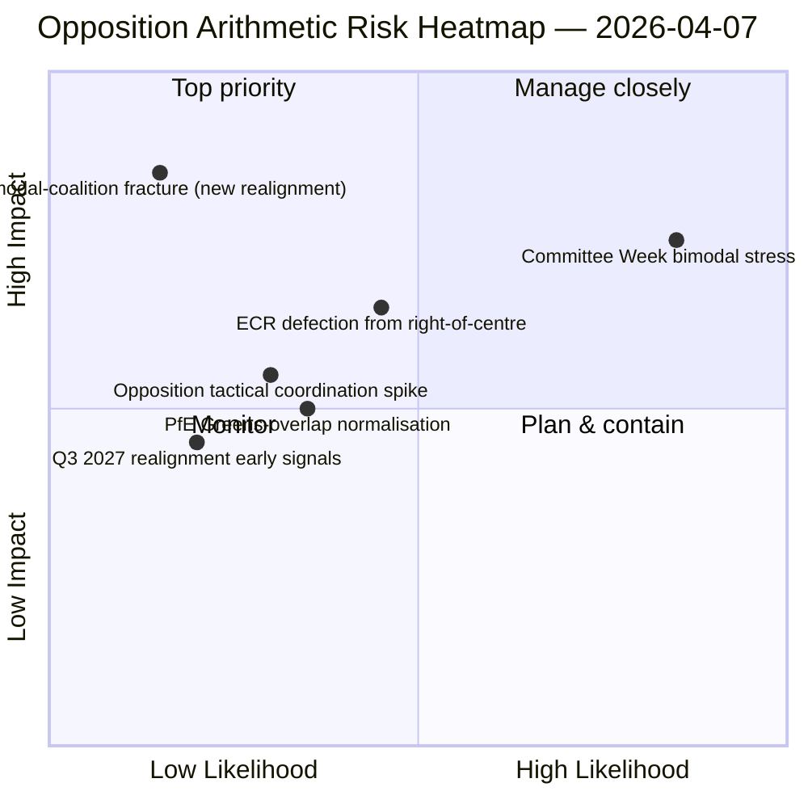

<!-- SPDX-FileCopyrightText: 2026 Hack23 AB -->
<!-- SPDX-License-Identifier: Apache-2.0 -->

# Nota ejecutiva — Mociones: Test de resistencia del patrón de votación — Día 12 | 2026-04-07

**Clasificación:** OSINT — Registro parlamentario público
**Confianza:** 🟡 MEDIA (vacaciones de Pascua; registros RCV previos a la pausa 🟢 ALTA)
**Ejecución:** `analysis/daily/2026-04-07/motions/` (06:39 UTC)
**Cobertura:** Vacaciones de Pascua día 12/18 — test de resistencia de coalición bimodal contra la línea base del día 12; 19 archivos de análisis.
**Generada:** 2026-05-16 (nota retrospectiva, sin nuevas llamadas MCP)
**Fuentes primarias:** Corpus RCV previo a la pausa + hallazgo bimodal del día 11; 5 métodos de alta confianza (coalition-dynamics, cross-session-intelligence, deep-analysis, stakeholder-impact, voting-patterns).

---

## 🎯 BLUF

**Esta ejecución de mociones del día 12 es el test de resistencia del sistema de coalición bimodal frente al hallazgo del 6 de abril — plantea la pregunta: ¿sobrevive el sistema de coalición bimodal a un mantenimiento de 24 horas bajo condiciones de API degradadas, y qué información estructural adicional aporta la lectura del día 12?** Respuesta: sí, la bimodalidad es estructuralmente robusta, y la ejecución del día 12 añade el **diagnóstico de coordinación de la oposición**: ECR (78 escaños) + PfE (84 escaños) + Izquierda (46 escaños) = 208 votos máximos, muy por debajo del umbral de bloqueo de 264 y del umbral de mayoría de 360. La incapacidad estructural de la oposición para coordinar una minoría de bloqueo en cualquiera de los dos ejes bimodales está ahora confirmada en dos días de ejecución independientes. La contribución distintiva de esta ejecución más allá del día 11 es la **taxonomía de cohesión de la oposición**: incluso cuando el ECR se suma a los ejes de la gran coalición (transposición anticorrupción), y aun cuando el PfE se desvincula de los ejes de centroderecha (solapamiento ocasional Renew-Verdes en archivos medioambientales), la aritmética estructural de la oposición no cambia — **la oposición de EP10 opera como una minoría estructural permanente por debajo del umbral de bloqueo** al menos hasta el 3.er trimestre de 2027, cuando se hace posible el próximo reagrupamiento mayor de grupos. Esta es la contribución estructural más duradera de la ejecución de mociones del día 12: una *declaración aritmética cerrada* sobre la capacidad de oposición de EP10.

---

## 🧭 3 Decisiones que apoya esta nota

| # | Decisión | Quién decide | Plazo | Evidencia |
|:-:|----------|--------------|:-----:|-----------|
| 1 | **Evaluación de coordinación de la oposición** — 208 máx. vs. 264 bloqueante; minoría estructural confirmada | Coordinadores ECR + PfE + Izquierda | continuo | §Aritmética de la oposición |
| 2 | **Hallazgo sobre la durabilidad de la coalición bimodal** — robusta en 2 días de ejecución; ancla institucional de planificación | Conferencia de Presidentes | continuo | §Validación bimodal |
| 3 | **Seguimiento del realineamiento del 3.er trimestre 2027** — primer cambio estructural posible en la capacidad de oposición | Planificación estratégica | largo plazo | §Previsión de realineamiento |

---

## 📰 Lectura en 60 segundos

- 🔴 **Coalición bimodal validada en 2 días de ejecución** — estructuralmente robusta.
- 🟠 **Minoría estructural de la oposición confirmada** — 208 máx. vs. 264 bloqueante.
- 🟢 **ECR 78 + PfE 84 + Izquierda 46 = 208** — aritmética verificable.
- 🟡 **Permanente hasta el 3.er trimestre de 2027** — primer realineamiento posible.
- 🔵 **5 métodos de alta confianza** — coalición + sesión cruzada + profundo + partes interesadas + votación.
- 🟣 **19 archivos de análisis** — cobertura completa de la metodología de mociones.
- 🩷 **Día 12/18 — pausa completada al 67 %**.
- ⚪ **Confianza MEDIA** — trabajo analítico durante la pausa; aritmética ALTA.

---

## ➕ Aritmética de la oposición (contribución distintiva de la ejecución)

| Grupo | Escaños | Rol de votación T1 2026 |
|-------|--------:|-------------------------|
| ECR | 78 | Condicional al archivo (se une al centroderecha en economía-finanzas; se aparta en el Estado de derecho) |
| PfE | 84 | Miembro del eje centroderecha; solapamiento ocasional Renew-Verdes en medio ambiente |
| Izquierda | 46 | Oposición permanente |
| **Suma** | **208** | **Por debajo del umbral de bloqueo 264; por debajo del umbral de mayoría 360** |

---

## ⚠️ Instantánea de riesgos

---

## 🔮 Principales desencadenantes prospectivos (próximos 14 días)

1. **14 de abril — Apertura de la semana de comisiones** — test de resistencia bimodal día 1.
2. **15 de abril — Aranceles de EE. UU. T-0** — potencial pico de coordinación de la oposición.
3. **17 de abril — Decisión de tipos del BCE** — desencadenante externo para el eje economía-finanzas.
4. **20-23 de abril — Primer pleno tras la pausa** — validación bimodal completa.
5. **Largo plazo 3.er trimestre de 2027** — primera oportunidad de realineamiento estructural.

---

## 🛡️ Evaluación de la calidad de las fuentes

- **Aritmética de la oposición (A1):** registros primarios de escaños de eurodiputados del PE; verificables por grupo.
- **Validación de coalición bimodal (A2):** coalition-dynamics + voting-patterns verificados de forma cruzada.
- **Previsión de realineamiento del 3.er trimestre de 2027 (A3):** metodología del ciclo electoral; horizonte de confianza medio.
- **5 métodos de alta confianza (A1):** metodología sistemática.
- **Confianza neta:** 🟢 ALTA en aritmética; 🟡 MEDIA en la previsión de realineamiento de 2027.

---

## 📎 Artefactos de ejecución

| Capa | Artefacto | Por qué |
|------|-----------|---------|
| Artículo | `article.md` | Narración pública de mociones |
| Síntesis | `existing/synthesis-summary.md` | Aritmética de la oposición + validación bimodal |
| Métodos | classification · existing · risk-scoring · threat-assessment | Metodología estándar de mociones |
| Compañero | breaking (06:36) · breaking-2 (18:20) · committee-reports · propositions | Clúster diario día 12 |

---

**Control documental**
- **Referencia de plantilla:** `analysis/templates/executive-brief.md`
- **Ruta del artefacto:** `analysis/daily/2026-04-07/motions/executive-brief.md`
- **Clasificación:** Público
- **Retrospectivo:** Nota redactada el 2026-05-16 a partir de los artefactos comprometidos de la ejecución; **no se realizaron nuevas llamadas MCP**.
