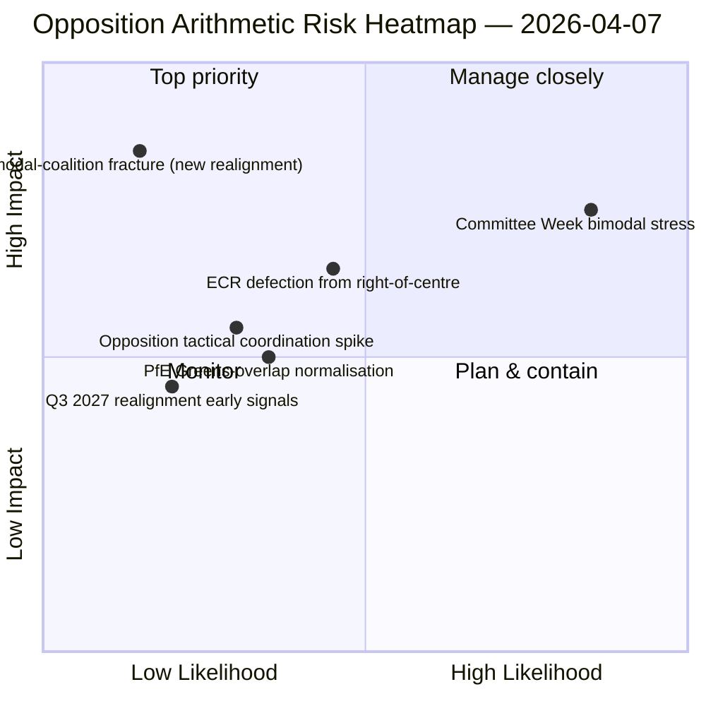

<!-- SPDX-FileCopyrightText: 2026 Hack23 AB -->
<!-- SPDX-License-Identifier: Apache-2.0 -->

# Johdon tiivistelmä — Päätöslauselmat: Päivä 12 äänestysmallin stressitesti | 2026-04-07

**Luokitus:** OSINT — Julkinen parlamentaarinen rekisteri
**Luottamus:** 🟡 KESKITASO (pääsiäisloma; ennen lomaa kerätyt RCV-tiedot 🟢 KORKEA)
**Ajo:** `analysis/daily/2026-04-07/motions/` (06:39 UTC)
**Kattavuus:** Pääsiäisloma päivä 12/18 — bimodaalinen koalition stressitesti päivän 12 lähtötilanteessa; 19 analyysi­tiedostoa.
**Luotu:** 2026-05-16 (retrospektiivinen tiivistelmä, ei uusia MCP-kutsuja)
**Ensisijaiset lähteet:** Ennen lomaa kerätty RCV-korpus + päivän 11 bimodaalinen löydös; 5 korkean luottamuksen menetelmää (coalition-dynamics, cross-session-intelligence, deep-analysis, stakeholder-impact, voting-patterns).

---

## 🎯 BLUF

**Tämä päivän 12 päätöslauselma-ajo on bimodaalisen koalition stressitesti huhtikuun 6. päivän löydöstä vastaan — se kysyy: selviääkö bimodaalinen koalitio­järjestelmä 24 tunnin pituisesta jatkoajasta heikennetyissä API-olosuhteissa, ja mitä lisärakenteellista näkemystä päivän 12 lukema tuo?** Vastaus: kyllä, bimodaalisuus on rakenteellisesti kestävä, ja päivän 12 ajo lisää **oppositio­koordinaatio­diagnostiikan**: ECR (78 paikkaa) + PfE (84 paikkaa) + Vasemmisto (46 paikkaa) = 208 enimmäisääntä, selvästi alle 264 estämiskynnyksen ja 360 enemmistökynnyksen. Opposition rakenteellinen kykenemättömyys koordinoida estävää vähemmistöä kummallakaan bimodaalisella radalla on nyt vahvistettu kahden riippumattoman ajopäivän perusteella. Ajon erottava panos päivän 11 lisäksi on **oppositiokohesio­taksonomia**: vaikka ECR liittyy suurkoalitioratoihin (korruption­vastaiseen transposition), ja vaikka PfE irtoaa oikeistokeskus­radoista (satunnainen Renew–Vihreät-päällekkäisyys ympäristö­tiedostoissa), rakenteellinen oppositio­aritmetiikka ei muutu — **EP10:n oppositio toimii pysyvänä rakenteellisena vähemmistönä estämiskynnyksen alapuolella** vähintään kolmanteen vuosineljännekseen 2027 saakka, kun seuraava suuri ryhmäjärjestely tulee mahdolliseksi. Tämä on päivän 12 päätöslauselma-ajon kestävin rakenteellinen panos: *suljettu aritmeettinen lausunto* EP10:n oppositiokapasiteetista.

---

## 🧭 3 Päätöstä, joita tämä tiedote tukee

| # | Päätös | Kuka päättää | Määräaika | Todisteet |
|:-:|--------|--------------|:---------:|-----------|
| 1 | **Oppositio­koordinaation arviointi** — 208 enintään vs. 264 estävä; rakenteellinen vähemmistö vahvistettu | ECR + PfE + Vasemmisto koordinaattorit | juokseva | §Oppositio­aritmetiikka |
| 2 | **Bimodaalisen koalition kestävyys­löydös** — kestävä 2 ajopäivän ajan; institutionaalinen suunnittelun kiintopiste | Puheenjohtajakokous | juokseva | §Bimodaalinen validointi |
| 3 | **Q3 2027 uudelleen­järjestelyn seuranta** — varhaisin rakenteellinen muutos oppositio­kapasiteetissa | Strateginen suunnittelu | pitkä tähtäin | §Uudelleen­järjestely­ennuste |

---

## 📰 60 sekunnin lukema

- 🔴 **Bimodaalinen koalitio vahvistettu 2 ajopäivän ajan** — rakenteellisesti kestävä.
- 🟠 **Opposition rakenteellinen vähemmistö vahvistettu** — 208 enintään vs. 264 estävä.
- 🟢 **ECR 78 + PfE 84 + Vasemmisto 46 = 208** — todennettava aritmetiikka.
- 🟡 **Pysyvä Q3 2027 saakka** — varhaisin uudelleen­järjestely­mahdollisuus.
- 🔵 **5 korkean luottamuksen menetelmää** — koalitio + ristissessiota + syvä + sidosryhmät + äänestys.
- 🟣 **19 analyysi­tiedostoa** — täysi päätöslauselma­metodologian kattavuus.
- 🩷 **Päivä 12/18 — loma 67 % suoritettu**.
- ⚪ **Luottamus KESKITASO** — loman aikainen analyyttinen työ; aritmetiikka KORKEA.

---

## ➕ Oppositio­aritmetiikka (ajon erottava panos)

| Ryhmä | Paikat | Äänestysrooli Q1 2026 |
|-------|-------:|----------------------|
| ECR | 78 | Tiedosto­ehdollinen (liittyy oikeistokeskustaan talous-rahoituksessa; poikkeaa oikeusvaltiossa) |
| PfE | 84 | Oikeistokeskus­ratojen jäsen; satunnainen Renew–Vihreät-päällekkäisyys ympäristössä |
| Vasemmisto | 46 | Pysyvä oppositio |
| **Summa** | **208** | **Alle estämiskynnyksen 264; alle enemmistökynnyksen 360** |

---

## ⚠️ Riskikatsaus

---

## 🔮 Parhaat eteenpäin­suuntautuvat laukaisijat (seuraavat 14 päivää)

1. **14. huhtikuuta — Valioviikko avautuu** — bimodaalinen stressitesti päivä 1.
2. **15. huhtikuuta — Yhdysvaltain tullimaksut T-0** — potentiaalinen koordinaatio­piikki oppositiolle.
3. **17. huhtikuuta — EKP:n korkopäätös** — ulkoinen laukaisija talous-rahoitusradalle.
4. **20.–23. huhtikuuta — Ensimmäinen täysistunto loman jälkeen** — täydellinen bimodaalinen validointi.
5. **Pitkä tähtäin Q3 2027** — varhaisin rakenteellinen uudelleen­järjestely­mahdollisuus.

---

## 🛡️ Lähdekvaliteetin arviointi

- **Oppositio­aritmetiikka (A1):** ensisijaiset EP MEP -paikkamerkinnät; todennettavissa ryhmäkohtaisesti.
- **Bimodaalinen koalition validointi (A2):** coalition-dynamics + voting-patterns ristiintarkastettu.
- **Q3 2027 uudelleen­järjestely­ennuste (A3):** vaali­sykli­metodologia; keskitasoinen luottamushorisontti.
- **5 korkean luottamuksen menetelmää (A1):** systemaattinen metodologia.
- **Nettoluottamus:** 🟢 KORKEA aritmetiikalle; 🟡 KESKITASO 2027 uudelleen­järjestely­ennusteelle.

---

## 📎 Ajoartefaktit

| Kerros | Artefakti | Miksi |
|--------|-----------|-------|
| Artikkeli | `article.md` | Julkinen päätöslauselma­narratiivi |
| Synteesi | `existing/synthesis-summary.md` | Oppositio­aritmetiikka + bimodaalinen validointi |
| Menetelmät | classification · existing · risk-scoring · threat-assessment | Standardi päätöslauselma­metodologia |
| Kumppani | breaking (06:36) · breaking-2 (18:20) · committee-reports · propositions | Päivän 12 päivittäinen klusteri |

---

**Asiakirja­hallinta**
- **Malli­viite:** `analysis/templates/executive-brief.md`
- **Artefakti­polku:** `analysis/daily/2026-04-07/motions/executive-brief.md`
- **Luokitus:** Julkinen
- **Retrospektiivinen:** Tiivistelmä kirjoitettu 2026-05-16 ajon sitoutuneista artefakteista; **uusia MCP-kutsuja ei tehty**.
