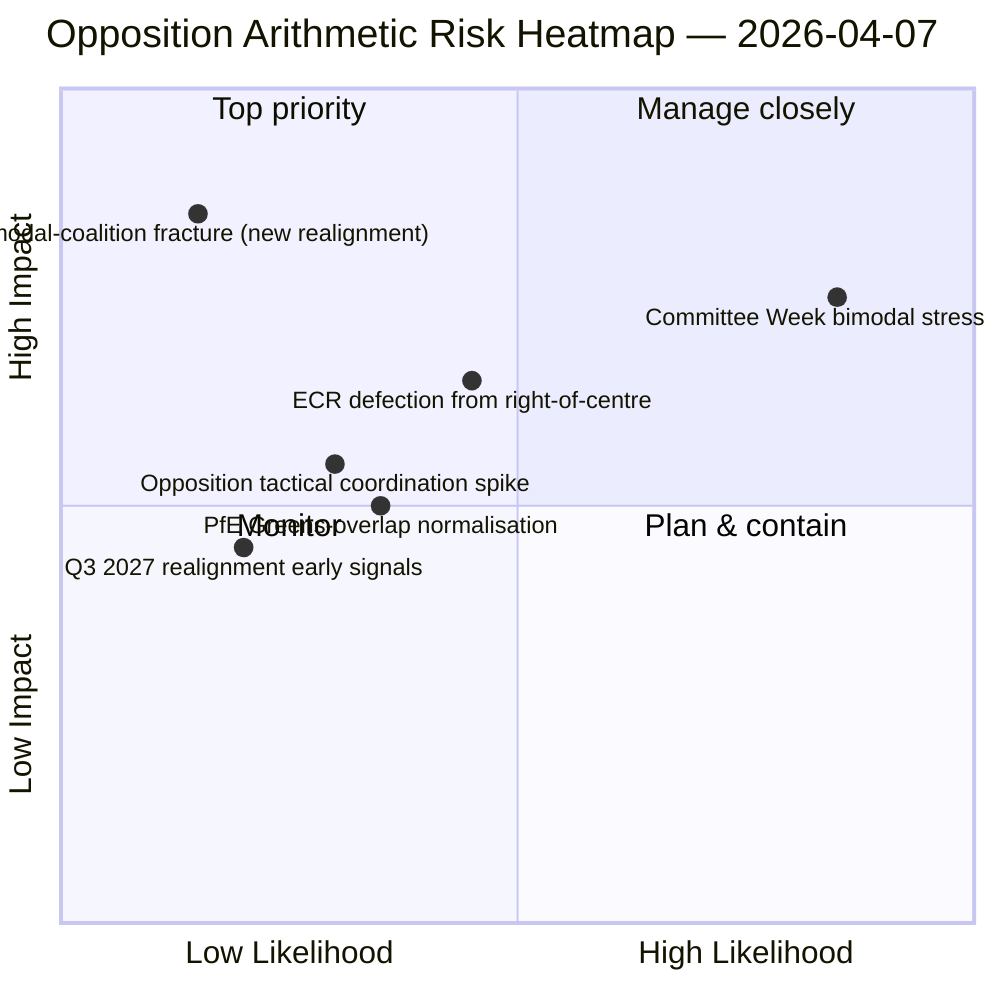

<!-- SPDX-FileCopyrightText: 2026 Hack23 AB -->
<!-- SPDX-License-Identifier: Apache-2.0 -->

# Note de synthèse exécutive — Motions : test de résistance du schéma de vote — Jour 12 | 2026-04-07

**Classification :** OSINT — Registre parlementaire public
**Confiance :** 🟡 MOYENNE (vacances de Pâques ; enregistrements RCV d'avant la pause 🟢 ÉLEVÉE)
**Exécution :** `analysis/daily/2026-04-07/motions/` (06:39 UTC)
**Couverture :** Vacances de Pâques jour 12/18 — test de résistance de la coalition bimodale sur la base du jour 12 ; 19 fichiers d'analyse.
**Générée :** 2026-05-16 (note rétrospective, aucun nouvel appel MCP)
**Sources primaires :** Corpus RCV d'avant la pause + constat bimodal du jour 11 ; 5 méthodes à haute confiance (coalition-dynamics, cross-session-intelligence, deep-analysis, stakeholder-impact, voting-patterns).

---

## 🎯 BLUF

**Cette exécution de motions du jour 12 est le test de résistance du système de coalition bimodale face au constat du 6 avril — elle pose la question : le système de coalition bimodale survit-il à un maintien de 24 heures dans des conditions d'API dégradées, et quelle information structurelle supplémentaire apporte la lecture du jour 12 ?** Réponse : oui, la bimodalité est structurellement robuste, et l'exécution du jour 12 apporte le **diagnostic de coordination de l'opposition** : ECR (78 sièges) + PfE (84 sièges) + Gauche (46 sièges) = 208 votes maximum, bien en deçà du seuil de blocage de 264 et du seuil de majorité de 360. L'incapacité structurelle de l'opposition à coordonner une minorité de blocage sur l'un ou l'autre des axes bimodaux est désormais confirmée sur deux jours d'exécution indépendants. La contribution distinctive de cette exécution au-delà du jour 11 est la **taxonomie de cohésion de l'opposition** : même lorsque l'ECR rejoint les axes de la grande coalition (transposition anti-corruption), et même lorsque le PfE se dissocie des axes de centre-droit (chevauchement occasionnel Renew-Verts sur les dossiers environnementaux), l'arithmétique structurelle de l'opposition ne change pas — **l'opposition d'EP10 opère comme une minorité structurelle permanente en deçà du seuil de blocage** au moins jusqu'au 3e trimestre 2027, lorsque le prochain réalignement majeur de groupes devient possible. C'est la contribution structurelle la plus durable de l'exécution de motions du jour 12 : un *énoncé arithmétique clos* sur la capacité d'opposition d'EP10.

---

## 🧭 3 Décisions que cette note soutient

| # | Décision | Qui décide | Échéance | Preuves |
|:-:|----------|------------|:--------:|---------|
| 1 | **Évaluation de la coordination de l'opposition** — 208 max. vs. 264 bloquant ; minorité structurelle confirmée | Coordinateurs ECR + PfE + Gauche | en continu | §Arithmétique de l'opposition |
| 2 | **Constat sur la durabilité de la coalition bimodale** — robuste sur 2 jours d'exécution ; ancre institutionnelle de planification | Conférence des présidents | en continu | §Validation bimodale |
| 3 | **Veille sur le réalignement du 3e trimestre 2027** — premier changement structurel possible de la capacité d'opposition | Planification stratégique | long terme | §Prévision de réalignement |

---

## 📰 Lecture en 60 secondes

- 🔴 **Coalition bimodale validée sur 2 jours d'exécution** — structurellement robuste.
- 🟠 **Minorité structurelle de l'opposition confirmée** — 208 max. vs. 264 bloquant.
- 🟢 **ECR 78 + PfE 84 + Gauche 46 = 208** — arithmétique vérifiable.
- 🟡 **Permanent jusqu'au 3e trimestre 2027** — premier réalignement possible.
- 🔵 **5 méthodes à haute confiance** — coalition + cross-session + approfondie + parties prenantes + vote.
- 🟣 **19 fichiers d'analyse** — couverture complète de la méthodologie des motions.
- 🩷 **Jour 12/18 — pause achevée à 67 %**.
- ⚪ **Confiance MOYENNE** — travail analytique pendant la pause ; arithmétique ÉLEVÉE.

---

## ➕ Arithmétique de l'opposition (contribution distinctive de l'exécution)

| Groupe | Sièges | Rôle de vote T1 2026 |
|--------|-------:|----------------------|
| ECR | 78 | Conditionnel au dossier (rejoint le centre-droit sur économie-finances ; s'écarte sur l'État de droit) |
| PfE | 84 | Membre de l'axe centre-droit ; chevauchement occasionnel Renew-Verts sur l'environnement |
| Gauche | 46 | Opposition permanente |
| **Total** | **208** | **En deçà du seuil de blocage 264 ; en deçà du seuil de majorité 360** |

---

## ⚠️ Instantané des risques

---

## 🔮 Principaux déclencheurs prospectifs (14 prochains jours)

1. **14 avril — Ouverture de la semaine des commissions** — test de résistance bimodal jour 1.
2. **15 avril — Droits de douane américains T-0** — pic potentiel de coordination de l'opposition.
3. **17 avril — Décision de taux de la BCE** — déclencheur externe pour l'axe économie-finances.
4. **20-23 avril — Première plénière après la pause** — validation bimodale complète.
5. **Long terme 3e trimestre 2027** — première possibilité de réalignement structurel.

---

## 🛡️ Évaluation de la qualité des sources

- **Arithmétique de l'opposition (A1) :** enregistrements primaires de sièges de MEP du PE ; vérifiables par groupe.
- **Validation de la coalition bimodale (A2) :** coalition-dynamics + voting-patterns vérifiés croisés.
- **Prévision de réalignement du 3e trimestre 2027 (A3) :** méthodologie du cycle électoral ; horizon de confiance moyen.
- **5 méthodes à haute confiance (A1) :** méthodologie systématique.
- **Confiance nette :** 🟢 ÉLEVÉE sur l'arithmétique ; 🟡 MOYENNE sur la prévision de réalignement 2027.

---

## 📎 Artefacts d'exécution

| Couche | Artefact | Pourquoi |
|--------|----------|----------|
| Article | `article.md` | Narration publique des motions |
| Synthèse | `existing/synthesis-summary.md` | Arithmétique de l'opposition + validation bimodale |
| Méthodes | classification · existing · risk-scoring · threat-assessment | Méthodologie standard des motions |
| Accompagnement | breaking (06:36) · breaking-2 (18:20) · committee-reports · propositions | Cluster quotidien jour 12 |

---

**Contrôle documentaire**
- **Référence de modèle :** `analysis/templates/executive-brief.md`
- **Chemin d'artefact :** `analysis/daily/2026-04-07/motions/executive-brief.md`
- **Classification :** Public
- **Rétrospectif :** Note rédigée le 2026-05-16 à partir des artefacts engagés de l'exécution ; **aucun nouvel appel MCP n'a été effectué**.
