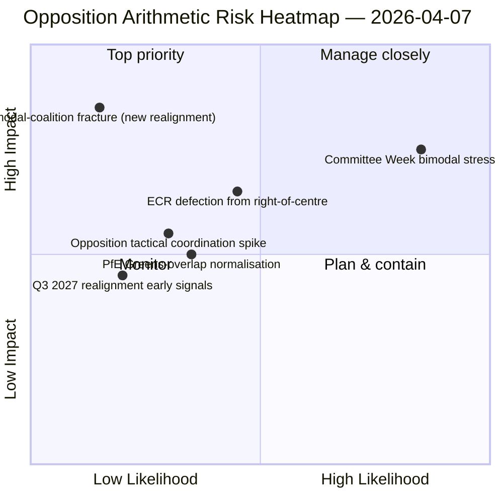

<!-- SPDX-FileCopyrightText: 2026 Hack23 AB -->
<!-- SPDX-License-Identifier: Apache-2.0 -->

# סיכום מנהלים — הצעות החלטה: מבחן עמידות דפוס ההצבעה — יום 12 | 2026-04-07

**סיווג:** OSINT — רשומה פרלמנטרית ציבורית
**רמת אמינות:** 🟡 בינוני (חופשת פסחא; רישומי RCV מלפני ההפסקה 🟢 גבוה)
**ריצה:** `analysis/daily/2026-04-07/motions/` (06:39 UTC)
**כיסוי:** חופשת פסחא יום 12/18 — מבחן עמידות קואליציה דו-מודלית מול בסיס יום 12; 19 קבצי ניתוח.
**נוצר:** 2026-05-16 (סיכום רטרוספקטיבי, ללא קריאות MCP חדשות)
**מקורות ראשיים:** מאגר RCV מלפני ההפסקה + ממצא דו-מודלי מיום 11; 5 שיטות באמינות גבוהה (coalition-dynamics, cross-session-intelligence, deep-analysis, stakeholder-impact, voting-patterns).

---

## 🎯 סיכום תחתית

**ריצת הצעות ההחלטה של יום 12 זו היא מבחן העמידות של מערכת הקואליציה הדו-מודלית מול הממצא מ-6 באפריל — היא שואלת: האם מערכת הקואליציה הדו-מודלית שורדת שמירה של 24 שעות בתנאי API מוגרעים, ומה התובנה המבנית הנוספת שמוסיפה קריאת יום 12?** תשובה: כן, הדו-מודליות חזקה מבנית, וריצת יום 12 מוסיפה את **אבחנת תיאום האופוזיציה**: ECR (78 מנדטים) + PfE (84 מנדטים) + שמאל (46 מנדטים) = 208 קולות מרביים, הרחק מתחת לסף החסימה של 264 וסף הרוב של 360. חוסר היכולת המבני של האופוזיציה לתאם מיעוט חוסם בכל אחד ממסלולי הדו-מודליות אושר כעת על פני שני ימי ריצה עצמאיים. התרומה הייחודית של ריצה זו מעבר ליום 11 היא **טקסונומיית לכידות האופוזיציה**: אפילו כאשר ECR מצטרף למסלולי הקואליציה הגדולה (שיעבוד חוק מאבק בשחיתות), ואפילו כאשר PfE מתנתק ממסלולי מרכז-ימין (חפיפה אקראית עם Renew-ירוקים בקבצי סביבה), האריתמטיקה המבנית של האופוזיציה לא משתנה — **האופוזיציה ב-EP10 פועלת כמיעוט מבני קבוע מתחת לסף החסימה** לפחות עד הרבעון השלישי של 2027 כאשר מתאפשר יישור הקבוצות המרכזי הגדול הבא. זוהי תרומתה המבנית המתמשכת ביותר של ריצת הצעות ההחלטה ביום 12: *הצהרה אריתמטית סגורה* על יכולת האופוזיציה ב-EP10.

---

## 🧭 3 החלטות שהסיכום תומך בהן

| # | החלטה | מי מחליט | מועד אחרון | ראיות |
|:-:|-------|----------|:----------:|-------|
| 1 | **הערכת תיאום האופוזיציה** — 208 מרבי מול 264 חוסמים; מיעוט מבני מאושר | רכזי ECR + PfE + שמאל | שוטף | §אריתמטיקת האופוזיציה |
| 2 | **ממצא עמידות הקואליציה הדו-מודלית** — חזקה על פני 2 ימי ריצה; עוגן תכנון מוסדי | ועידת הנשיאים | שוטף | §אימות דו-מודלי |
| 3 | **מעקב יישור מחדש של הרבעון השלישי 2027** — שינוי מבני מוקדם ביותר אפשרי בכושר האופוזיציה | תכנון אסטרטגי | אופק ארוך | §תחזית יישור מחדש |

---

## 📰 קריאה של 60 שניות

- 🔴 **קואליציה דו-מודלית מאומתת על פני 2 ימי ריצה** — חזקה מבנית.
- 🟠 **מיעוט מבני של האופוזיציה מאושר** — 208 מרבי מול 264 חוסמים.
- 🟢 **ECR 78 + PfE 84 + שמאל 46 = 208** — אריתמטיקה הניתנת לאימות.
- 🟡 **קבועה עד הרבעון השלישי 2027** — הזדמנות יישור מחדש מוקדמת ביותר.
- 🔵 **5 שיטות באמינות גבוהה** — קואליציה + מושב צולב + מעמיק + בעלי עניין + הצבעה.
- 🟣 **19 קבצי ניתוח** — כיסוי מלא של מתודולוגיית הצעות ההחלטה.
- 🩷 **יום 12/18 — הפסקה 67 % הושלמה**.
- ⚪ **אמינות בינוני** — עבודה אנליטית בזמן ההפסקה; אריתמטיקה גבוהה.

---

## ➕ אריתמטיקת האופוזיציה (תרומה ייחודית של הריצה)

| קבוצה | מנדטים | תפקיד הצבעה ברבעון הראשון 2026 |
|-------|--------:|--------------------------------|
| ECR | 78 | מותנה בקובץ (מצטרף למרכז-ימין בכלכלה-פיננסים; סוטה בשלטון החוק) |
| PfE | 84 | חבר מסלול מרכז-ימין; חפיפה אקראית עם Renew-ירוקים בסביבה |
| שמאל | 46 | אופוזיציה קבועה |
| **סה״כ** | **208** | **מתחת לסף חסימה 264; מתחת לסף רוב 360** |

---

## ⚠️ תמונת מצב סיכונים

---

## 🔮 מפעילי עתיד מובילים (14 ימים הבאים)

1. **14 באפריל — שבוע הוועדות נפתח** — מבחן עמידות דו-מודלי יום 1.
2. **15 באפריל — מכסי ארה״ב T-0** — עלייה פוטנציאלית בתיאום האופוזיציה.
3. **17 באפריל — החלטת ריבית ה-ECB** — מפעיל חיצוני למסלול הכלכלה-פיננסים.
4. **20-23 באפריל — מליאה ראשונה לאחר ההפסקה** — אימות דו-מודלי מלא.
5. **אופק ארוך: הרבעון השלישי 2027** — הזדמנות יישור מחדש מבני מוקדמת ביותר.

---

## 🛡️ הערכת איכות מקורות

- **אריתמטיקת האופוזיציה (A1):** רשומות מנדטים ראשיות של חברי הפרלמנט האירופי; ניתנות לאימות לפי קבוצה.
- **אימות קואליציה דו-מודלית (A2):** ديناميكيات الائتلاف + أنماط التصويت מאומתות הצלבה.
- **תחזית יישור מחדש של הרבעון השלישי 2027 (A3):** מתודולוגיית מחזור בחירות; אופק אמינות בינוני.
- **5 שיטות באמינות גבוהה (A1):** מתודולוגיה שיטתית.
- **אמינות נטו:** 🟢 גבוהה לאריתמטיקה; 🟡 בינוני לתחזית יישור מחדש 2027.

---

## 📎 מסנוע הריצה

| שכבה | מסנוע | מדוע |
|------|-------|------|
| מאמר | `article.md` | נרטיב ציבורי של הצעות ההחלטה |
| סינתזה | `existing/synthesis-summary.md` | אריתמטיקת האופוזיציה + אימות דו-מודלי |
| שיטות | classification · existing · risk-scoring · threat-assessment | מתודולוגיית הצעות ההחלטה הסטנדרטית |
| מלווה | breaking (06:36) · breaking-2 (18:20) · committee-reports · propositions | אשכול יומי יום 12 |

---

**בקרת מסמכים**
- **הפניית תבנית:** `analysis/templates/executive-brief.md`
- **נתיב מסנוע:** `analysis/daily/2026-04-07/motions/executive-brief.md`
- **סיווג:** ציבורי
- **רטרוספקטיבי:** הסיכום נכתב ב-2026-05-16 ממסנועי הריצה המחויבים; **לא בוצעו קריאות MCP חדשות**.
