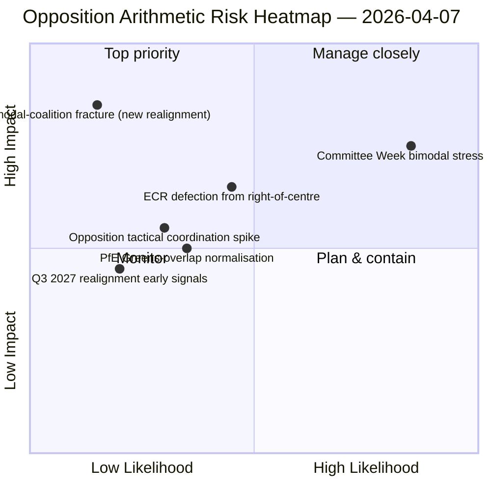

<!-- SPDX-FileCopyrightText: 2026 Hack23 AB -->
<!-- SPDX-License-Identifier: Apache-2.0 -->

# エグゼクティブ・ブリーフィング — 動議：投票パターンのストレステスト — 第12日 | 2026-04-07

**分類：** OSINT — 公開議会記録
**信頼度：** 🟡 中程度（復活祭休暇中；休暇前のRCV記録 🟢 高）
**実行：** `analysis/daily/2026-04-07/motions/` (06:39 UTC)
**カバー範囲：** 復活祭休暇第12日/18日 — 第12日ベースラインに対する二峰性連立のストレステスト；分析ファイル19本。
**生成日：** 2026-05-16（回顧的ブリーフィング、新規MCPコールなし）
**主要情報源：** 休暇前RCPコーパス＋第11日二峰性知見；高信頼度5手法（coalition-dynamics、cross-session-intelligence、deep-analysis、stakeholder-impact、voting-patterns）。

---

## 🎯 BLUF（結論先行）

**本第12日動議実行は、4月6日の知見に対する二峰性連立システムのストレステストである — 問いは次の通り：劣化したAPI条件下で24時間保持が続いても二峰性連立システムは生存できるか、そして第12日読み取りはどのような追加的構造的洞察をもたらすか？** 答え：はい、二峰性は構造的に堅牢である。第12日実行は**野党調整診断**を追加する：ECR（78議席）＋PfE（84議席）＋左派（46議席）＝最大208票 — 阻止閾値264、多数決閾値360を大幅に下回る。いずれの二峰性トラックにおいても野党が阻止少数派を形成できないという構造的無能は、2つの独立した実行日を通じて確認された。第11日を超えるこの実行の特徴的貢献は**野党凝集分類法**である：ECRが大連立トラック（汚職防止移行）に参加する場合も、PfEが中道右派トラックから離脱する場合（環境ファイルでのRenew＝緑の偶発的重複）も、構造的野党算術は変わらない — **EP10の野党は少なくとも2027年第3四半期まで阻止閾値以下の永続的構造的少数派として機能する**。これが第12日動議実行の最も永続的な構造的貢献である：EP10の野党能力に関する*閉じた算術的命題*。

---

## 🧭 このブリーフィングが支援する3つの決定

| # | 決定 | 決定者 | 期限 | 証拠 |
|:-:|------|--------|:----:|------|
| 1 | **野党調整評価** — 最大208対阻止264；構造的少数派確認 | ECR＋PfE＋左派調整担当者 | 継続中 | §野党算術 |
| 2 | **二峰性連立耐久性知見** — 2実行日にわたって堅牢；制度的計画アンカー | 議長会議 | 継続中 | §二峰性検証 |
| 3 | **2027年第3四半期再編観察** — 野党能力における最も早い構造的変化 | 戦略計画部門 | 長期 | §再編予測 |

---

## 📰 60秒要約

- 🔴 **二峰性連立を2実行日にわたり検証** — 構造的に堅牢。
- 🟠 **野党の構造的少数派を確認** — 最大208対阻止264。
- 🟢 **ECR 78＋PfE 84＋左派 46＝208** — 検証可能な算術。
- 🟡 **2027年第3四半期まで永続** — 最も早い再編可能性。
- 🔵 **高信頼度5手法** — 連立＋クロスセッション＋深層＋ステークホルダー＋投票。
- 🟣 **19分析ファイル** — 動議方法論の完全カバー。
- 🩷 **第12日/18日 — 休暇67%完了**。
- ⚪ **信頼度：中程度** — 休暇中の分析作業；算術は高。

---

## ➕ 野党算術（実行の特徴的貢献）

| グループ | 議席 | 2026年第1四半期投票役割 |
|---------|-----:|----------------------|
| ECR | 78 | ファイル条件付き（経済・金融では中道右派に合流；法の支配では離脱） |
| PfE | 84 | 中道右派トラック参加；環境ではRenew＝緑と偶発的重複 |
| 左派 | 46 | 永続的野党 |
| **合計** | **208** | **阻止閾値264以下；多数決閾値360以下** |

---

## ⚠️ リスクスナップショット

---

## 🔮 トップ先行トリガー（今後14日間）

1. **4月14日 — 委員会週開幕** — 二峰性ストレステスト第1日。
2. **4月15日 — 米国関税T-0** — 野党調整急上昇の可能性。
3. **4月17日 — ECB金利決定** — 経済・金融トラックへの外部トリガー。
4. **4月20〜23日 — 休暇後初の本会議** — 完全二峰性検証。
5. **長期ホライズン2027年第3四半期** — 最も早い構造的再編機会。

---

## 🛡️ 情報源品質評価

- **野党算術（A1）：** 欧州議会MEP議席の一次記録；グループ別に検証可能。
- **二峰性連立検証（A2）：** coalition-dynamics＋voting-patternsをクロス検証。
- **2027年第3四半期再編予測（A3）：** 選挙サイクル方法論；中程度の信頼度ホライズン。
- **高信頼度5手法（A1）：** 体系的方法論。
- **正味信頼度：** 🟢 算術に関して高；🟡 2027年再編予測に関して中程度。

---

## 📎 実行成果物

| レイヤー | 成果物 | 理由 |
|---------|--------|------|
| 記事 | `article.md` | 公開動議ナラティブ |
| 統合 | `existing/synthesis-summary.md` | 野党算術＋二峰性検証 |
| 手法 | classification · existing · risk-scoring · threat-assessment | 標準動議方法論 |
| 付随 | breaking (06:36) · breaking-2 (18:20) · committee-reports · propositions | 第12日日次クラスター |

---

**文書管理**
- **テンプレート参照：** `analysis/templates/executive-brief.md`
- **成果物パス：** `analysis/daily/2026-04-07/motions/executive-brief.md`
- **分類：** 公開
- **回顧的：** ブリーフィングは実行のコミット済み成果物から2026-05-16に作成；**新規MCPコールは行われていない**。
