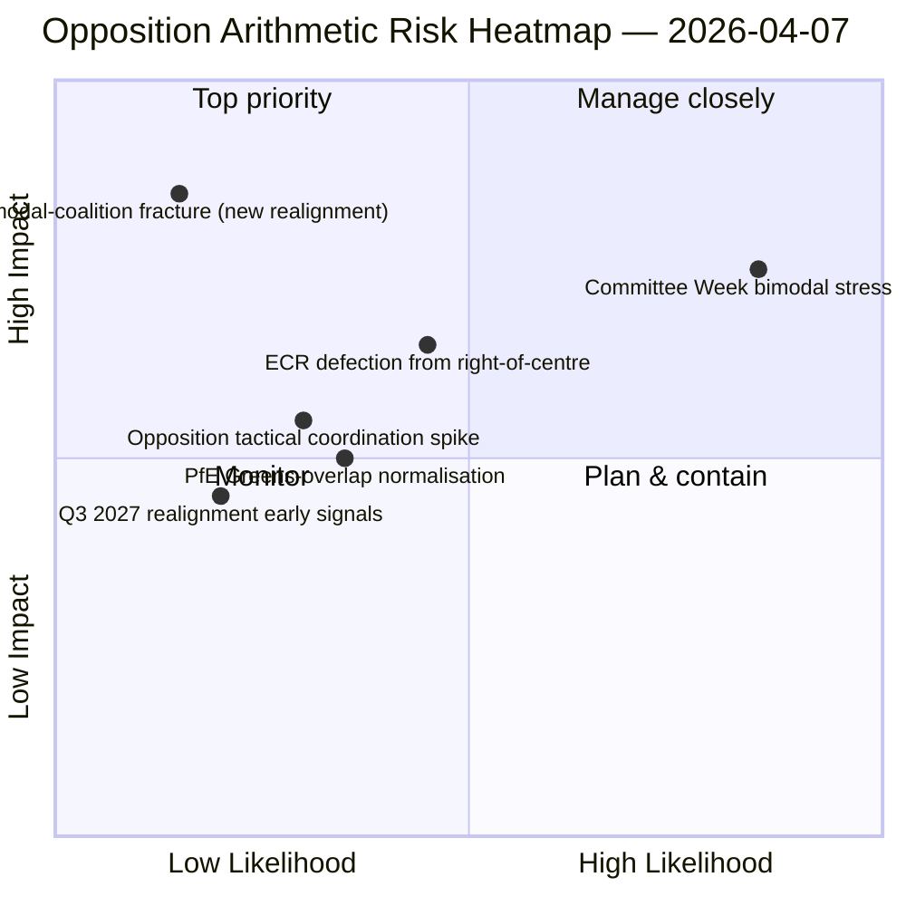

<!-- SPDX-FileCopyrightText: 2026 Hack23 AB -->
<!-- SPDX-License-Identifier: Apache-2.0 -->

# 경영진 브리핑 — 동의안: 투표 패턴 스트레스 테스트 — 12일 차 | 2026-04-07

**분류:** OSINT — 공개 의회 기록
**신뢰도:** 🟡 중간（부활절 휴회；휴회 전 기명 투표 기록 🟢 높음）
**실행:** `analysis/daily/2026-04-07/motions/` (06:39 UTC)
**범위:** 부활절 휴회 12일/18일 — 12일 차 기준선에 대한 이중 양식 연립 스트레스 테스트；분석 파일 19개。
**생성일:** 2026-05-16（회고적 브리핑、신규 MCP 호출 없음）
**주요 출처:** 휴회 전 기명투표 코퍼스 + 11일 차 이중 양식 발견；고신뢰도 5가지 방법（coalition-dynamics、cross-session-intelligence、deep-analysis、stakeholder-impact、voting-patterns）。

---

## 🎯 BLUF（결론 선행）

**이번 12일 차 동의안 실행은 4월 6일 발견에 대한 이중 양식 연립 시스템의 스트레스 테스트이다 — 다음 질문을 제기한다: 이중 양식 연립 시스템이 저하된 API 조건에서 24시간 연속 운영에서도 생존할 수 있는가, 그리고 12일 차 판독이 추가적으로 제공하는 구조적 통찰은 무엇인가?** 답변: 예, 이중 양식성은 구조적으로 견고하며, 12일 차 실행은 **반대파 조정 진단**을 추가한다: ECR（78석）+ PfE（84석）+ 좌파（46석）= 최대 208표 — 봉쇄 임계값 264표와 다수결 임계값 360표를 크게 하회한다. 어느 이중 양식 트랙에서도 반대파가 봉쇄 소수파를 조직할 수 없다는 구조적 무능력이 2개의 독립적인 실행일을 통해 확인되었다. 11일 차를 넘어서는 이번 실행의 특징적 기여는 **반대파 결집 분류체계**이다: ECR이 대연립 트랙（부패 방지 전치）에 합류할 때도, PfE가 중도우파 트랙에서 이탈할 때（환경 파일에서 Renew-녹색당과 우발적 중첩）도 구조적 반대파 산술은 변하지 않는다 — **EP10의 반대파는 적어도 2027년 3분기까지 봉쇄 임계값 이하의 영구적인 구조적 소수파로 기능한다**. 이것이 12일 차 동의안 실행의 가장 지속적인 구조적 기여다: EP10 반대파 역량에 관한 *폐쇄된 산술적 명제*.

---

## 🧭 이 브리핑이 지원하는 3가지 결정

| # | 결정 | 결정권자 | 기한 | 근거 |
|:-:|------|---------|:----:|------|
| 1 | **반대파 조정 평가** — 최대 208 대 봉쇄 264；구조적 소수파 확인 | ECR + PfE + 좌파 조정관 | 지속 | §반대파 산술 |
| 2 | **이중 양식 연립 내구성 발견** — 2개 실행일에 걸쳐 견고；제도적 기획 앵커 | 의장 회의 | 지속 | §이중 양식 검증 |
| 3 | **2027년 3분기 재편 감시** — 반대파 역량의 가장 빠른 구조적 변화 | 전략 기획 | 장기 | §재편 전망 |

---

## 📰 60초 요약

- 🔴 **이중 양식 연립을 2개 실행일에 걸쳐 검증** — 구조적으로 견고.
- 🟠 **반대파의 구조적 소수파 확인** — 최대 208 대 봉쇄 264.
- 🟢 **ECR 78 + PfE 84 + 좌파 46 = 208** — 검증 가능한 산술.
- 🟡 **2027년 3분기까지 영구적** — 가장 빠른 재편 가능성.
- 🔵 **고신뢰도 5가지 방법** — 연립 + 교차 회기 + 심층 + 이해관계자 + 투표.
- 🟣 **19개 분석 파일** — 동의안 방법론 완전 커버.
- 🩷 **12일/18일 — 휴회 67% 완료**.
- ⚪ **신뢰도 중간** — 휴회 중 분석 작업；산술은 높음.

---

## ➕ 반대파 산술（실행의 특징적 기여）

| 그룹 | 의석 | 2026년 1분기 투표 역할 |
|------|-----:|----------------------|
| ECR | 78 | 파일 조건부（경제·금융에서 중도우파에 합류；법치주의에서 이탈） |
| PfE | 84 | 중도우파 트랙 참여；환경에서 Renew-녹색당과 우발적 중첩 |
| 좌파 | 46 | 영구적 반대파 |
| **합계** | **208** | **봉쇄 임계값 264 미만；다수결 임계값 360 미만** |

---

## ⚠️ 리스크 스냅샷

---

## 🔮 주요 선행 트리거（향후 14일）

1. **4월 14일 — 위원회 주간 개막** — 이중 양식 스트레스 테스트 1일 차.
2. **4월 15일 — 미국 관세 T-0** — 잠재적 반대파 조정 급증.
3. **4월 17일 — ECB 금리 결정** — 경제·금융 트랙에 대한 외부 트리거.
4. **4월 20~23일 — 휴회 후 첫 본회의** — 완전한 이중 양식 검증.
5. **장기 지평 2027년 3분기** — 가장 빠른 구조적 재편 기회.

---

## 🛡️ 출처 품질 평가

- **반대파 산술（A1）:** 유럽의회 MEP 의석의 1차 기록；그룹별 검증 가능.
- **이중 양식 연립 검증（A2）:** coalition-dynamics + voting-patterns 교차 검증.
- **2027년 3분기 재편 전망（A3）:** 선거 주기 방법론；중간 신뢰도 지평.
- **고신뢰도 5가지 방법（A1）:** 체계적 방법론.
- **순 신뢰도:** 🟢 산술에 대해 높음；🟡 2027년 재편 전망에 대해 중간.

---

## 📎 실행 산출물

| 레이어 | 산출물 | 이유 |
|--------|--------|------|
| 기사 | `article.md` | 공개 동의안 내러티브 |
| 종합 | `existing/synthesis-summary.md` | 반대파 산술 + 이중 양식 검증 |
| 방법 | classification · existing · risk-scoring · threat-assessment | 표준 동의안 방법론 |
| 동반 | breaking (06:36) · breaking-2 (18:20) · committee-reports · propositions | 12일 차 일일 클러스터 |

---

**문서 관리**
- **템플릿 참조:** `analysis/templates/executive-brief.md`
- **산출물 경로:** `analysis/daily/2026-04-07/motions/executive-brief.md`
- **분류:** 공개
- **회고적:** 브리핑은 실행의 커밋된 산출물에서 2026-05-16에 작성됨；**새로운 MCP 호출은 없었음**.
