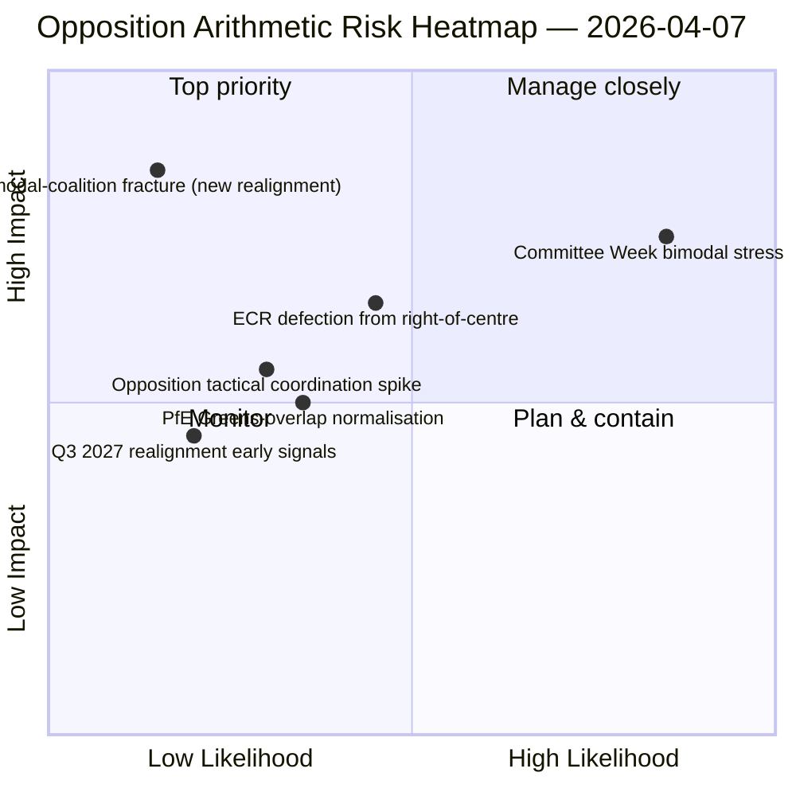

<!-- SPDX-FileCopyrightText: 2026 Hack23 AB -->
<!-- SPDX-License-Identifier: Apache-2.0 -->

# Uitvoerende briefing — Moties: Dag-12 stresstest van stempatroon | 2026-04-07

**Classificatie:** OSINT — Openbaar parlementair register
**Betrouwbaarheid:** 🟡 GEMIDDELD (paasvakantie; RCV-registraties van voor het reces 🟢 HOOG)
**Uitvoering:** `analysis/daily/2026-04-07/motions/` (06:39 UTC)
**Dekking:** Paasvakantie dag 12/18 — bimodale coalitie stresstest op de dag-12-basislijn; 19 analysebestanden.
**Gegenereerd:** 2026-05-16 (retrospectieve briefing, geen nieuwe MCP-aanroepen)
**Primaire bronnen:** RCV-corpus van voor het reces + dag-11 bimodaal bevinding; 5 methoden met hoge betrouwbaarheid (coalition-dynamics, cross-session-intelligence, deep-analysis, stakeholder-impact, voting-patterns).

---

## 🎯 BLUF

**Deze dag-12 motieuitvoering is de stresstest van het bimodale coalitiesysteem ten opzichte van de bevinding van 6 april — zij stelt de vraag: overleeft het bimodale coalitiesysteem een 24-uurse voortgang onder verslechterde API-omstandigheden, en welke aanvullende structurele inzichten levert de dag-12-aflezing op?** Antwoord: ja, bimodaliteit is structureel robuust, en de dag-12-uitvoering voegt de **diagnose van oppositiecoördinatie** toe: ECR (78 zetels) + PfE (84 zetels) + Links (46 zetels) = 208 maximale stemmen, ruimschoots onder de blokkeringsdrempel van 264 en de meerderheidsdrempel van 360. Het structurele onvermogen van de oppositie om een blokkerende minderheid op een van beide bimodale sporen te coördineren is nu bevestigd over twee onafhankelijke uitvoeringsdagen. De onderscheidende bijdrage van deze uitvoering voorbij dag 11 is de **oppositiecohesietaxonomie**: zelfs wanneer ECR zich aansluit bij grootcoalitiesporen (antikorruptie transposita), en zelfs wanneer PfE zich losmaakt van rechtscentrumsporen (incidentele Renew-Groenen overlap op milieubestanden), verandert de structurele oppositiearithmetiek niet — **de oppositie van EP10 functioneert als een permanente structurele minderheid onder de blokkeringsdrempel** tot ten minste het derde kwartaal van 2027, wanneer de volgende grote groepsherindeling mogelijk wordt. Dit is de meest blijvende structurele bijdrage van de dag-12 motiesluitvoering: een *gesloten rekenkundig uitspraak* over de oppositiecapaciteit van EP10.

---

## 🧭 3 Beslissingen die deze briefing ondersteunt

| # | Beslissing | Wie beslist | Deadline | Bewijs |
|:-:|------------|-------------|:--------:|--------|
| 1 | **Beoordeling van oppositiecoördinatie** — 208 max. vs. 264 blokkerend; structurele minderheid bevestigd | ECR + PfE + Links coordinatoren | doorlopend | §Oppositiearithmetiek |
| 2 | **Bevinding over de duurzaamheid van de bimodale coalitie** — robuust over 2 uitvoeringsdagen; institutioneel planningsanker | Conferentie van voorzitters | doorlopend | §Bimodale validatie |
| 3 | **Bewaking van de herindeling in het derde kwartaal van 2027** — vroegste mogelijke structurele verandering in oppositiecapaciteit | Strategische planning | lange termijn | §Herindelingsprognose |

---

## 📰 60-secondenlezing

- 🔴 **Bimodale coalitie gevalideerd over 2 uitvoeringsdagen** — structureel robuust.
- 🟠 **Structurele minderheid van de oppositie bevestigd** — 208 max. vs. 264 blokkerend.
- 🟢 **ECR 78 + PfE 84 + Links 46 = 208** — verifieerbare rekenkunde.
- 🟡 **Permanent tot het derde kwartaal van 2027** — vroegste herindelingsmogelijkheid.
- 🔵 **5 methoden met hoge betrouwbaarheid** — coalitie + kruissessie + diepgaand + stakeholders + stemming.
- 🟣 **19 analysebestanden** — volledige methodologiedekking van moties.
- 🩷 **Dag 12/18 — reces 67 % voltooid**.
- ⚪ **Betrouwbaarheid GEMIDDELD** — analytisch werk tijdens het reces; rekenkunde HOOG.

---

## ➕ Oppositiearithmetiek (onderscheidende bijdrage van de uitvoering)

| Groep | Zetels | Stemrol K1 2026 |
|-------|-------:|-----------------|
| ECR | 78 | Bestandsafhankelijk (sluit aan bij rechtscentrum in economie-financiën; wijkt af bij rechtsstaat) |
| PfE | 84 | Lid van rechtscentrumspoor; incidentele Renew-Groenen overlap op milieu |
| Links | 46 | Permanente oppositie |
| **Totaal** | **208** | **Onder blokkeringsdrempel 264; onder meerderheidsdrempel 360** |

---

## ⚠️ Risicooverzicht

---

## 🔮 Top vooruitblikkende triggers (volgende 14 dagen)

1. **14 april — Commissieweek opent** — bimodale stresstest dag 1.
2. **15 april — Amerikaanse invoerheffingen T-0** — potentiële coördinatiepiek voor oppositie.
3. **17 april — ECB rentebesluit** — externe trigger voor het economie-financiënspoor.
4. **20-23 april — Eerste plenaire vergadering na het reces** — volledige bimodale validatie.
5. **Lange termijn derde kwartaal 2027** — vroegste mogelijke structurele herindeling.

---

## 🛡️ Beoordeling bronkwaliteit

- **Oppositiearithmetiek (A1):** primaire EP MEP-zetelregistraties; per groep verifieerbaar.
- **Bimodale coalitievalidatie (A2):** coalition-dynamics + voting-patterns kruisgevalideerd.
- **Herindelingsprognose derde kwartaal 2027 (A3):** methodologie verkiezingscyclus; middelhoge betrouwbaarheidshorizon.
- **5 methoden met hoge betrouwbaarheid (A1):** systematische methodologie.
- **Netto betrouwbaarheid:** 🟢 HOOG voor rekenkunde; 🟡 GEMIDDELD voor de herindelingsprognose 2027.

---

## 📎 Uitvoeringsartefacten

| Laag | Artefact | Waarom |
|------|----------|--------|
| Artikel | `article.md` | Openbaar motiesnarratief |
| Synthese | `existing/synthesis-summary.md` | Oppositiearithmetiek + bimodale validatie |
| Methoden | classification · existing · risk-scoring · threat-assessment | Standaard motiesmethodologie |
| Begeleider | breaking (06:36) · breaking-2 (18:20) · committee-reports · propositions | Dag-12 dagelijks cluster |

---

**Documentbeheer**
- **Sjabloonreferentie:** `analysis/templates/executive-brief.md`
- **Artefactpad:** `analysis/daily/2026-04-07/motions/executive-brief.md`
- **Classificatie:** Openbaar
- **Retrospectief:** Briefing geschreven op 2026-05-16 uit de vastgelegde artefacten van de uitvoering; **er werden geen nieuwe MCP-aanroepen gedaan**.
