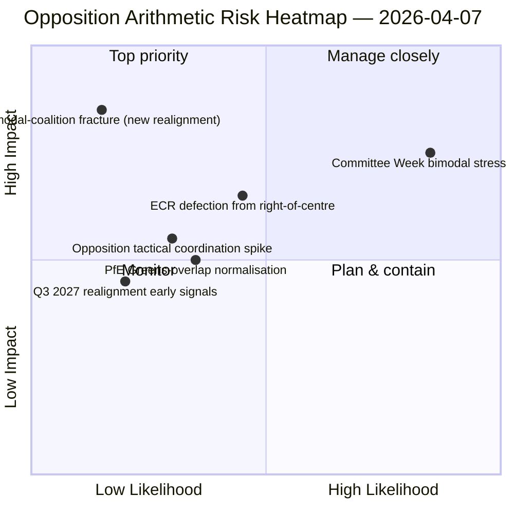

<!-- SPDX-FileCopyrightText: 2026 Hack23 AB -->
<!-- SPDX-License-Identifier: Apache-2.0 -->

# Eksekutiv orientering — Beslutningsforslag: Dag-12 stresstest av avstemnings­mønster | 2026-04-07

**Klassifisering:** OSINT — Offentlig parlamentarisk registrering
**Konfidens:** 🟡 MIDDELS (påskeferie; RCV-registre fra før ferien 🟢 HØY)
**Kjøring:** `analysis/daily/2026-04-07/motions/` (06:39 UTC)
**Dekning:** Påskeferie dag 12/18 — bimodalt koalisjons­stresstest mot dag-12-basislinjen; 19 analysefiler.
**Generert:** 2026-05-16 (retrospektiv orientering, ingen nye MCP-kall)
**Primære kilder:** RCV-korpus fra før ferien + dag-11 bimodalt funn; 5 metoder med høy konfidens (coalition-dynamics, cross-session-intelligence, deep-analysis, stakeholder-impact, voting-patterns).

---

## 🎯 BLUF

**Denne dag-12 beslutningsforslagskjøringen er stresstesten av det bimodale koalisjons­systemet mot funnet fra 6. april — den stiller spørsmålet: overlever det bimodale koalisjons­systemet en 24-timers videreføring under degraderte API-forhold, og hvilken ytterligere strukturell innsikt tilfører dag-12-avlesningen?** Svar: ja, bimodalitet er strukturelt robust, og dag-12-kjøringen tilfører **opposisjonskoordineringsdiagnostikken**: ECR (78 seter) + PfE (84 seter) + Venstre (46 seter) = 208 maksstemmer, godt under blokkeringsterskelen på 264 og flertallsterskelen på 360. Opposisjonens strukturelle manglende evne til å koordinere et blokkerende mindretall på begge bimodale spor er nå bekreftet over to uavhengige kjøringsdager. Kjøringens sonderende bidrag utover dag-11 er **opposisjonskohesionstaksonomien**: selv når ECR slutter seg til storekoalisjons­spor (antikorrupsjons transposisjon), og selv når PfE løsriver seg fra høyresentrale spor (sporadisk Renew-Grønne overlapp på miljøfiler), endres ikke den strukturelle opposisjons­aritmetikken — **EP10s opposisjon opererer som et permanent strukturelt mindretall under blokkeringsterskelen** frem til minst kvartal 3 2027 når neste store gruppe­omstilling muliggjøres. Dette er dag-12 beslutningsforslags­kjøringens mest varige strukturelle bidrag: et *lukket aritmetisk utsagn* om EP10s opposisjonskapasitet.

---

## 🧭 3 Beslutninger dette brevet støtter

| # | Beslutning | Hvem bestemmer | Frist | Bevis |
|:-:|------------|----------------|:-----:|-------|
| 1 | **Vurdering av opposisjonskoordinering** — 208 maks. vs. 264 blokkerende; strukturelt mindretall bekreftet | ECR + PfE + Venstre koordinatorer | løpende | §Opposisjons­aritmetikk |
| 2 | **Funn om bimodal koalisjons­holdbarhet** — robust over 2 kjøringsdager; institusjonelt planleggings­anker | Formannskapskonferansen | løpende | §Bimodal validering |
| 3 | **Overvåking av kvartal 3 2027-omstilling** — tidligste strukturelle endring i opposisjonskapasitet | Strategisk planlegging | lang sikt | §Omstillings­prognose |

---

## 📰 60-sekunders lesning

- 🔴 **Bimodal koalisjon validert over 2 kjøringsdager** — strukturelt robust.
- 🟠 **Opposisjonens strukturelle mindretall bekreftet** — 208 maks. vs. 264 blokkerende.
- 🟢 **ECR 78 + PfE 84 + Venstre 46 = 208** — verifiserbar aritmetikk.
- 🟡 **Permanent til kvartal 3 2027** — tidligste omstillingsmulighet.
- 🔵 **5 metoder med høy konfidens** — koalisjon + kryssesjon + dyp + interessenter + avstemning.
- 🟣 **19 analysefiler** — full dekning av beslutningsforslags­metodikk.
- 🩷 **Dag 12/18 — ferie 67 % gjennomført**.
- ⚪ **Konfidens MIDDELS** — analytisk arbeid under ferien; aritmetikk HØY.

---

## ➕ Opposisjons­aritmetikk (kjøringens sonderende bidrag)

| Gruppe | Seter | Avstemningsrolle kvartal 1 2026 |
|--------|------:|--------------------------------|
| ECR | 78 | Filbetinget (slutter seg til høyresentrum i økonomi-finans; avviker ved rettsstaten) |
| PfE | 84 | Høyresentrum-spormedlem; sporadisk Renew-Grønne overlapp på miljø |
| Venstre | 46 | Permanent opposisjon |
| **Sum** | **208** | **Under blokkeringsterskel 264; under flertallsterskel 360** |

---

## ⚠️ Risikooversikt

---

## 🔮 Topp fremadrettede utløsere (neste 14 dager)

1. **14. april — Komitéuken åpner** — bimodalt stresstest dag 1.
2. **15. april — Amerikanske toll T-0** — potensiell koordineringsspiss for opposisjonen.
3. **17. april — ECB rentebeslutning** — ekstern utløser for økonomi-finanssporet.
4. **20.–23. april — Første plenarmøte etter ferien** — fullstendig bimodal validering.
5. **Lang horisont kvartal 3 2027** — tidligste strukturelle omstillingsmulighet.

---

## 🛡️ Vurdering av kildekvalitet

- **Opposisjons­aritmetikk (A1):** primære EP MEP-setesregistreringer; verifiserbare per gruppe.
- **Bimodal koalisjons­validering (A2):** coalition-dynamics + voting-patterns kryss­verifisert.
- **Kvartal 3 2027 omstillings­prognose (A3):** valgssyklus­metodikk; mellomhøy konfidens­horisont.
- **5 metoder med høy konfidens (A1):** systematisk metodikk.
- **Netto konfidens:** 🟢 HØY på aritmetikk; 🟡 MIDDELS på 2027 omstillings­prognose.

---

## 📎 Kjørings­artefakter

| Lag | Artefakt | Hvorfor |
|-----|----------|---------|
| Artikkel | `article.md` | Offentlig beslutningsforslags­narrativ |
| Syntese | `existing/synthesis-summary.md` | Opposisjons­aritmetikk + bimodal validering |
| Metoder | classification · existing · risk-scoring · threat-assessment | Standard beslutningsforslags­metodikk |
| Ledsager | breaking (06:36) · breaking-2 (18:20) · committee-reports · propositions | Dag-12 daglig klynge |

---

**Dokumentkontroll**
- **Malreferanse:** `analysis/templates/executive-brief.md`
- **Artefaktsti:** `analysis/daily/2026-04-07/motions/executive-brief.md`
- **Klassifisering:** Offentlig
- **Retrospektiv:** Orientering skrevet 2026-05-16 fra kjøringens committede artefakter; **ingen nye MCP-kall ble foretatt**.
