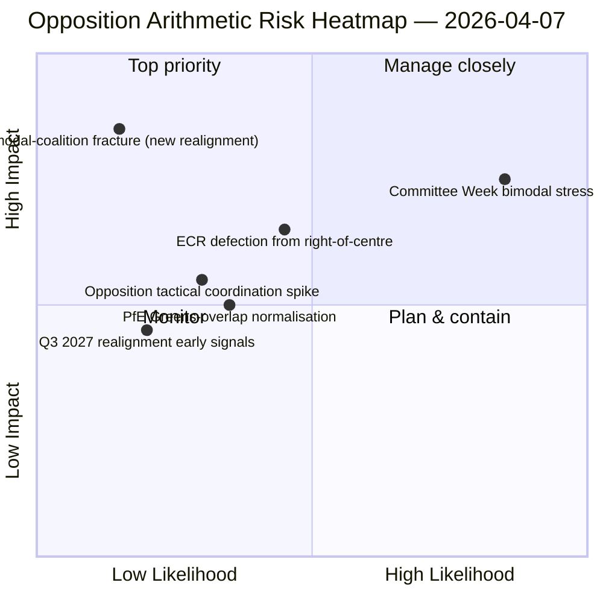

<!-- SPDX-FileCopyrightText: 2026 Hack23 AB -->
<!-- SPDX-License-Identifier: Apache-2.0 -->

# Exekutiv sammanfattning — Motioner: Dag-12 stresstest av röstmönster | 2026-04-07

**Klassificering:** OSINT — Offentligt parlamentariskt register
**Konfidensgrad:** 🟡 MEDEL (påskuppehåll; RCV-register före uppehållet 🟢 HÖG)
**Körning:** `analysis/daily/2026-04-07/motions/` (06:39 UTC)
**Täckning:** Påskuppehåll dag 12/18 — bimodalt koalitionsstresstest mot dag-12-baslinjen; 19 analysfiler.
**Genererad:** 2026-05-16 (retroaktiv sammanfattning, inga nya MCP-anrop)
**Primära källor:** RCV-korpus före uppehållet + dag-11 bimodalt fynd; 5 metoder med hög konfidensgrad (coalition-dynamics, cross-session-intelligence, deep-analysis, stakeholder-impact, voting-patterns).

---

## 🎯 BLUF

**Denna dag-12 motionskörning är stresstestet av bimodal koalition mot aprilmånadens 6:e-fynd — den ställer frågan: överlever det bimodala koalitionssystemet ett 24-timmars kvarstående under degraderade API-förhållanden, och vilken ytterligare strukturell insikt tillfogar dag-12-avläsningen?** Svar: ja, bimodaliteten är strukturellt robust, och dag-12-körningen tillfogar **oppositionskoordineringsdiagnostiken**: ECR (78 platser) + PfE (84 platser) + Vänster (46 platser) = 208 max röster, väl under blockeringsgränsen på 264 och majoritetsgränsen på 360. Oppositionens strukturella oförmåga att koordinera en blockeringsminoritet på något av de bimodala spåren är nu bekräftad över två oberoende körningsdagar. Körningens utmärkande bidrag bortom dag-11 är **oppositionskohesionstaxonomin**: även när ECR ansluter sig till storskoalitionsspår (korruptionsbekämpning transposition), och även när PfE lossar från högercentrade spår (enstaka Renew-Gröna överlapp på miljöfiler), förändras inte den strukturella oppositionsaritmetiken — **EP10:s opposition agerar som en permanent strukturell minoritet under blockeringsgränsen** fram till åtminstone kvartal 3 2027 när nästa stora grupprinjustering möjliggörs. Detta är dag-12 motionskörningens mest bestående strukturella bidrag: ett *slutet aritmetiskt uttalande* om EP10:s oppositionskapacitet.

---

## 🧭 3 Beslut som detta brev stödjer

| # | Beslut | Vem beslutar | Deadline | Bevis |
|:-:|--------|--------------|:--------:|-------|
| 1 | **Oppositionskoordineringsbedömning** — 208 max vs. 264 blockerande; strukturell minoritet bekräftad | ECR + PfE + Vänsterkoordinatorer | löpande | §Oppositionsaritmetik |
| 2 | **Bimodal koalitionshållbarhetsfynd** — robust över 2 körningsdagar; institutionellt planeringsankare | Talmanskonferensen | löpande | §Bimodal validering |
| 3 | **Kvartal 3 2027 omjusteringsbevakning** — tidigaste strukturella förändring av oppositionskapacitet | Strategisk planering | lång sikt | §Omjusteringsprognos |

---

## 📰 60-sekunders läsning

- 🔴 **Bimodal koalition validerad över 2 körningsdagar** — strukturellt robust.
- 🟠 **Strukturell minoritet för oppositionen bekräftad** — 208 max vs. 264 blockerande.
- 🟢 **ECR 78 + PfE 84 + Vänster 46 = 208** — verifierbar aritmetik.
- 🟡 **Permanent till kvartal 3 2027** — tidigaste omjusteringsmöjlighet.
- 🔵 **5 metoder med hög konfidensgrad** — koalition + korsession + djup + intressenter + röstning.
- 🟣 **19 analysfiler** — full motionsmetodologitäckning.
- 🩷 **Dag 12/18 — uppehåll 67% genomfört**.
- ⚪ **Konfidensgrad MEDEL** — analytiskt arbete under uppehållet; aritmetik HÖG.

---

## ➕ Oppositionsaritmetik (körningens utmärkande bidrag)

| Grupp | Platser | Röstningsroll kvartal 1 2026 |
|-------|--------:|-----------------------------|
| ECR | 78 | Filbetingad (ansluter till högercentrum i ekonomi-finans; avviker i rättsstaten) |
| PfE | 84 | Högercentrumspårmedlem; enstaka Renew-Gröna överlapp på miljö |
| Vänster | 46 | Permanent opposition |
| **Summa** | **208** | **Under blockeringsgränsen 264; under majoritetsgränsen 360** |

---

## ⚠️ Riskögonblicksbild

---

## 🔮 Topputlösande framåtblickande faktorer (nästa 14 dagar)

1. **14 april — Kommittévecka öppnar** — bimodalt stresstest dag 1.
2. **15 april — Amerikanska tullar T-0** — potentiell koordineringspik för opposition.
3. **17 april — ECB räntebeslut** — extern utlösare för ekonomi-finansspåret.
4. **20–23 april — Första plenarsessionen efter uppehållet** — fullständig bimodal validering.
5. **Lång horisont kvartal 3 2027** — tidigaste strukturella omjusteringsmöjlighet.

---

## 🛡️ Källkvalitetsbedömning

- **Oppositionsaritmetik (A1):** primära EP MEP-platsposter; verifierbar per grupp.
- **Bimodal koalitionsvalidering (A2):** coalition-dynamics + voting-patterns korsverifierade.
- **Kvartal 3 2027 omjusteringsprognos (A3):** valcykelmetodologi; medelhög konfidenshorisont.
- **5 metoder med hög konfidensgrad (A1):** systematisk metodologi.
- **Nettokonfidensgrad:** 🟢 HÖG på aritmetik; 🟡 MEDEL på 2027 omjusteringsprognos.

---

## 📎 Körningsartefakter

| Lager | Artefakt | Varför |
|-------|----------|--------|
| Artikel | `article.md` | Offentlig motionsberättelse |
| Syntes | `existing/synthesis-summary.md` | Oppositionsaritmetik + bimodal validering |
| Metoder | classification · existing · risk-scoring · threat-assessment | Standard motionsmetodologi |
| Kompanjoner | breaking (06:36) · breaking-2 (18:20) · committee-reports · propositions | Dag-12 dagligt kluster |

---

**Dokumentkontroll**
- **Mallreferens:** `analysis/templates/executive-brief.md`
- **Artefaktsökväg:** `analysis/daily/2026-04-07/motions/executive-brief.md`
- **Klassificering:** Offentlig
- **Retroaktiv:** Sammanfattning skriven 2026-05-16 från körningens engagerade artefakter; **inga nya MCP-anrop gjordes**.
