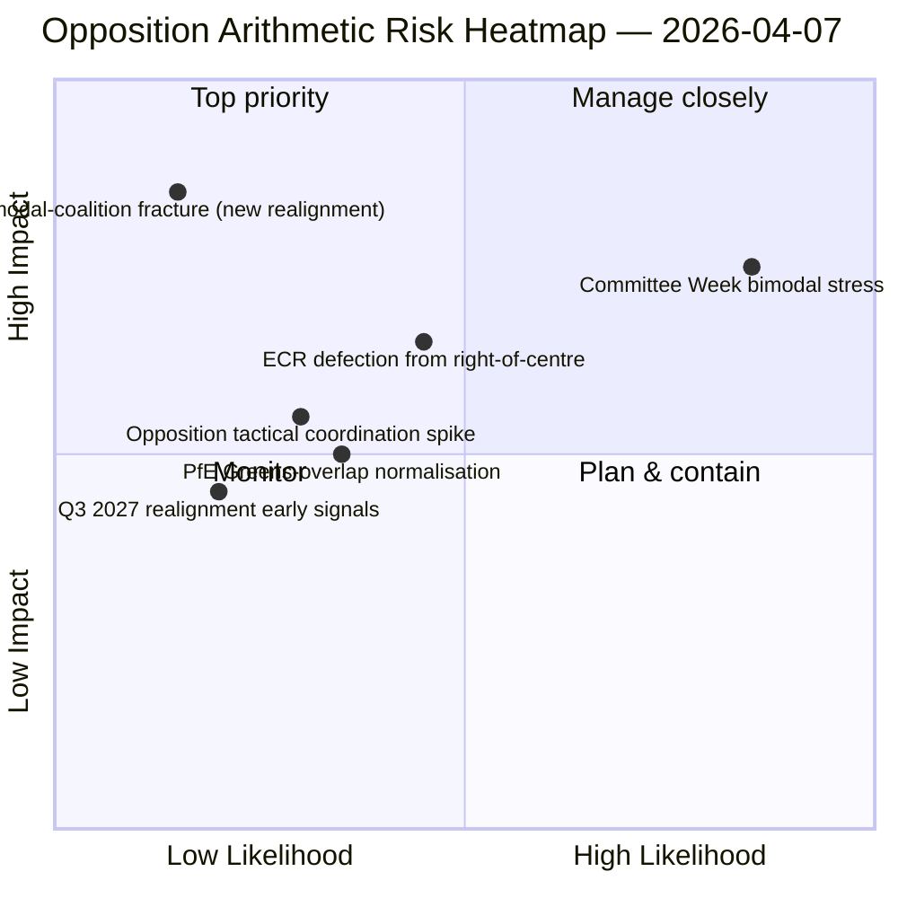

<!-- SPDX-FileCopyrightText: 2026 Hack23 AB -->
<!-- SPDX-License-Identifier: Apache-2.0 -->

# 执行简报 — 动议：投票模式压力测试第12日 | 2026-04-07

**分类：** OSINT — 公开议会记录
**置信度：** 🟡 中等（复活节休会；休会前记名投票记录 🟢 高）
**运行：** `analysis/daily/2026-04-07/motions/` (06:39 UTC)
**覆盖范围：** 复活节休会第12日/共18日 — 针对第12日基线的双峰联合压力测试；19个分析文件。
**生成日期：** 2026-05-16（回顾性简报，无新MCP调用）
**主要来源：** 休会前记名投票语料库 + 第11日双峰发现；5种高置信度方法（联合动态、跨会议情报、深度分析、利益相关者影响、投票模式）。

---

## 🎯 底线摘要

**本第12日动议运行是双峰联合系统针对4月6日发现的压力测试 — 提出问题：在API条件降级的情况下，双峰联合系统能否维持24小时延续，第12日读取新增了哪些结构性洞察？** 答案：是的，双峰性具备结构性稳健。第12日运行增添**反对派协调诊断**：ECR（78席）＋PfE（84席）＋左派（46席）＝最多208票，远低于264票的封锁门槛和360票的多数门槛。反对派在两条双峰轨道上均无法协调封锁少数派的结构性无能，现已通过两个独立运行日予以确认。本次运行超越第11日的独特贡献是**反对派凝聚力分类学**：即便ECR加入大联合轨道（反腐败转置），即便PfE脱离中右轨道（在环境文件上与Renew-绿色党偶发重叠），结构性反对派算术不变 — **EP10的反对派至少在2027年第三季度前以永久性结构少数派的身份运作，低于封锁门槛**，届时下一次重大团体重组方可成为可能。这是第12日动议运行最持久的结构性贡献：关于EP10反对派能力的*封闭算术命题*。

---

## 🧭 本简报支持的3项决策

| # | 决策 | 决策者 | 截止日期 | 依据 |
|:-:|------|--------|:--------:|------|
| 1 | **反对派协调评估** — 最多208对封锁264；结构少数派已确认 | ECR + PfE + 左派协调人 | 滚动 | §反对派算术 |
| 2 | **双峰联合耐久性发现** — 跨2个运行日稳健；机构规划锚点 | 主席团会议 | 滚动 | §双峰验证 |
| 3 | **2027年第三季度重组监测** — 反对派能力最早可能的结构性变化 | 战略规划部门 | 长远 | §重组预测 |

---

## 📰 60秒摘要

- 🔴 **双峰联合经2个运行日验证** — 结构性稳健。
- 🟠 **反对派结构少数派已确认** — 最多208对封锁264。
- 🟢 **ECR 78 ＋ PfE 84 ＋ 左派 46 ＝ 208** — 可核实的算术。
- 🟡 **持续至2027年第三季度** — 最早重组可能性。
- 🔵 **5种高置信度方法** — 联合 + 跨会议 + 深度 + 利益相关者 + 投票。
- 🟣 **19个分析文件** — 动议方法论完整覆盖。
- 🩷 **第12日/18日 — 休会67%完成**。
- ⚪ **置信度：中等** — 休会期间的分析工作；算术高。

---

## ➕ 反对派算术（运行的独特贡献）

| 集团 | 席位 | 2026年第一季度投票角色 |
|------|-----:|----------------------|
| ECR | 78 | 文件条件性（经济金融领域加入中右；法治领域脱离） |
| PfE | 84 | 中右轨道成员；环境领域与Renew-绿色党偶发重叠 |
| 左派 | 46 | 永久反对派 |
| **合计** | **208** | **低于封锁门槛264；低于多数门槛360** |

---

## ⚠️ 风险快照

---

## 🔮 主要前瞻触发因素（未来14天）

1. **4月14日 — 委员会周开幕** — 双峰压力测试第1天。
2. **4月15日 — 美国关税T-0** — 反对派协调潜在峰值。
3. **4月17日 — 欧洲央行利率决定** — 经济金融轨道外部触发。
4. **4月20-23日 — 休会后首次全会** — 完整双峰验证。
5. **长远2027年第三季度** — 最早可能的结构性重组时机。

---

## 🛡️ 信息来源质量评估

- **反对派算术（A1）：** 欧洲议会议员席位一手记录；可按集团核实。
- **双峰联合验证（A2）：** 联合动态 + 投票模式交叉验证。
- **2027年第三季度重组预测（A3）：** 选举周期方法论；中等置信度视野。
- **5种高置信度方法（A1）：** 系统性方法论。
- **净置信度：** 🟢 算术方面高；🟡 2027年重组预测方面中等。

---

## 📎 运行产出物

| 层级 | 产出物 | 原因 |
|------|--------|------|
| 文章 | `article.md` | 公开动议叙事 |
| 综合 | `existing/synthesis-summary.md` | 反对派算术 + 双峰验证 |
| 方法 | classification · existing · risk-scoring · threat-assessment | 标准动议方法论 |
| 配套 | breaking (06:36) · breaking-2 (18:20) · committee-reports · propositions | 第12日每日集群 |

---

**文档管理**
- **模板参考：** `analysis/templates/executive-brief.md`
- **产出物路径：** `analysis/daily/2026-04-07/motions/executive-brief.md`
- **分类：** 公开
- **回顾性：** 简报于2026-05-16根据运行的已提交产出物撰写；**未进行新的MCP调用**。
