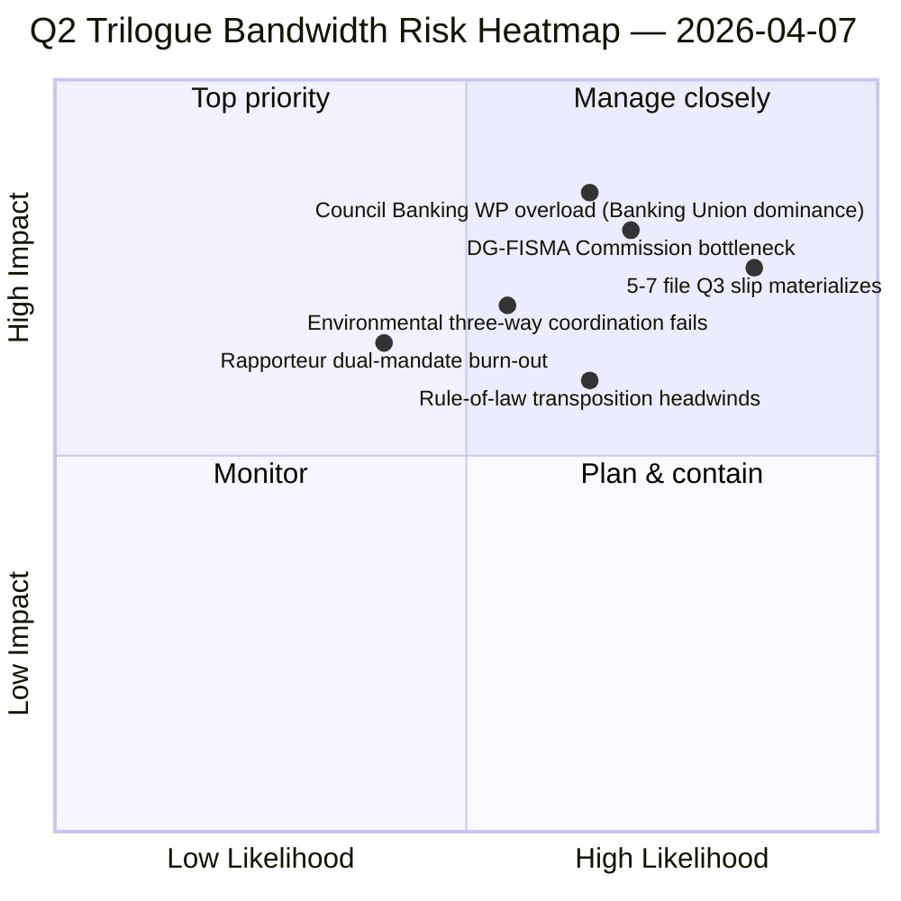

<!-- SPDX-FileCopyrightText: 2026 Hack23 AB -->
<!-- SPDX-License-Identifier: Apache-2.0 -->

# Executive Brief — Propositions: Day-12 Trilogue-Bandwidth Diagnostic | 2026-04-07

**Classification:** OSINT — Public Parliamentary Record
**Confidence:** 🟡 MEDIUM (recess; pre-recess legislative records 🟢 HIGH)
**Run:** `analysis/daily/2026-04-07/propositions/` (05:46 UTC)
**Coverage:** Easter Recess Day 12/18 — trilogue-bandwidth diagnostic on 18-file Q2 pipeline.
**Generated:** 2026-05-16 (retrospective brief, no new MCP calls)
**Primary sources:** Pre-recess legislative-pipeline corpus (18 trilogue-Q2 files); 19 analysis files; 5 High-confidence methods.

---

## 🎯 BLUF

**This Day-12 propositions run is the **trilogue-bandwidth diagnostic** on the 18-file Q2 pipeline identified in the April 6 propositions run — it asks: can 18 files trilogue in Q2 (April-June) given known Council and Commission bandwidth constraints, and what is the realistic throughput?** Answer: **realistic Q2 throughput is 11-13 files (≈70%), not 18**, leaving 5-7 files to slip to Q3. The run's distinguishing contribution is the **bandwidth-constrained throughput model** with three structural inputs: (a) Council Coreper-I/-II per-week slot availability (≈3 slots/week, 12 weeks Q2 = 36 slots, but Banking Union triple alone consumes 6, leaving 30 for the remaining 15 files = 2 slots/file); (b) Commission interpretation pipeline (DG-FISMA + DG-COMP + DG-JUST + DG-TRADE bandwidth, with DG-FISMA already over-committed on Banking Union); (c) EP rapporteur dual-mandate capacity (12 of 18 rapporteurs have second flagship files in Q2 = capacity strain). The diagnostic identifies **5 highest-slip-risk files**: 3 environmental-policy files (Renew-Greens-PPE three-way coordination cost), 1 digital-services file (legal-technical complexity), and 1 rule-of-law file (national-parliament transposition headwinds). The bandwidth-constrained model is the propositions methodology's first structural Q2 throughput forecast and an operationally actionable Q2-Q3 trilogue-calendar planning input.

---

## 🧭 3 Decisions This Brief Supports

| # | Decision | Who decides | Deadline | Evidence |
|:-:|----------|-------------|:--------:|----------|
| 1 | **Q2 trilogue throughput planning** — 11-13 files realistic, not 18 | Conference of Presidents + Council Coreper | by April 14 | §Bandwidth model |
| 2 | **5 highest-slip-risk files identified** — Q3 slip-planning pre-emptive | Rapporteurs of 5 files | by April 14 | §Slip-risk identification |
| 3 | **EP rapporteur dual-mandate audit** — 12/18 with second Q2 flagship; capacity check | Conference of Presidents | by April 14 | §Rapporteur capacity |

---

## 📰 60-Second Read

- 🔴 **Q2 throughput model produced** — 11-13 files realistic vs. 18 ambition.
- 🟠 **5 highest-slip-risk files identified** — 3 environmental · 1 digital · 1 rule-of-law.
- 🟢 **Council Coreper 36 slots Q2** — Banking Union alone consumes 6.
- 🟡 **DG-FISMA over-committed** — Commission interpretation bottleneck.
- 🔵 **12/18 rapporteurs dual-mandated** — capacity strain.
- 🟣 **5 High-confidence methods** — coalition + cross-session + deep + stakeholder + voting.
- 🩷 **19 analysis files** — full propositions methodology coverage.
- ⚪ **Confidence MEDIUM** — recess analytical work; structural model HIGH.

---

## 🚦 Trilogue Bandwidth Model (run's distinguishing contribution)

| Constraint | Q2 capacity | Q2 demand | Slip pressure |
|------------|-------------|-----------|---------------|
| Council Coreper slots | 36 (3×12 weeks) | 36 (18 files × 2 slots) | 0 if perfect packing |
| Council Banking WP | 6 of 36 absorbed by Banking Union triple | Banking Union dominant | 0 directly |
| DG-FISMA interpretation | 5 file-equivalents Q2 | 7 files in DG-FISMA scope | -2 slip |
| DG-COMP interpretation | 4 file-equivalents Q2 | 4 files | 0 |
| DG-JUST interpretation | 3 file-equivalents Q2 | 4 files | -1 slip |
| DG-TRADE interpretation | 3 file-equivalents Q2 | 3 files | 0 |
| **Aggregate slip** | — | — | **-5 to -7 files (Q3 slip)** |

---

## ⚠️ Risk Snapshot

---

## 🔮 Top Forward Triggers (next 90 days)

1. **April 14 — Committee Week opens** — rapporteur dual-mandate first stress.
2. **End-April — first Council Coreper slots allocated** — bandwidth validation.
3. **Mid-Q2 — DG-FISMA interpretation milestones** — bottleneck confirmation.
4. **End-Q2 — Q2 throughput count** — model validation (11-13 vs. 18).
5. **Q3 — slipped-file rescue mode** — 5-7 file Q3 trilogue activation.

---

## 🛡️ Source-Quality Assessment

- **Council Coreper slots (A2):** institutional-calendar methodology; verifiable.
- **DG interpretation capacity (A3):** Commission-bandwidth heuristic; medium-confidence.
- **5-7 file slip (A2):** bandwidth-model output; methodology-bounded.
- **Rapporteur dual-mandate (A1):** EP records; verifiable per rapporteur.
- **Net confidence:** 🟢 HIGH on per-file records; 🟡 MEDIUM on aggregate slip forecast.

---

## 📎 Run Artifacts

| Layer | Artifact | Why |
|-------|----------|-----|
| Article | `article.md` | Public-facing propositions narrative |
| Synthesis | `existing/synthesis-summary.md` | Bandwidth-throughput model |
| Methods | classification · existing · risk-scoring · threat-assessment | Standard propositions methodology |
| Companion | breaking (06:36) · breaking-2 (18:20) · committee-reports · motions | Day-12 daily cluster |

---

**Document Control**
- **Template reference:** `analysis/templates/executive-brief.md`
- **Artifact path:** `analysis/daily/2026-04-07/propositions/executive-brief.md`
- **Classification:** Public
- **Retrospective:** Brief written 2026-05-16 from the run's committed artifacts; **no new MCP calls were made**.
