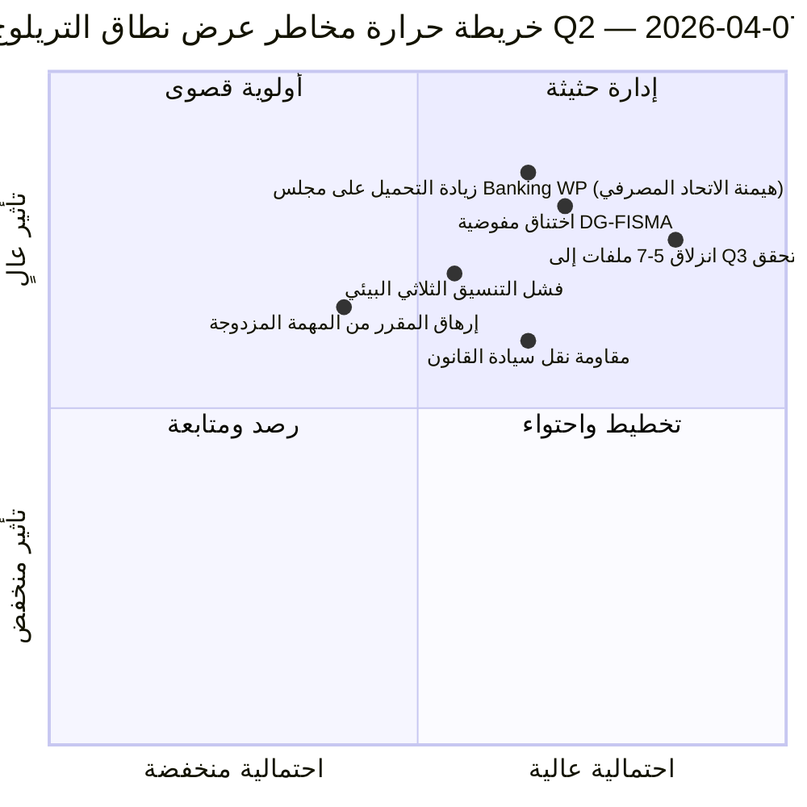

<!-- SPDX-FileCopyrightText: 2026 Hack23 AB -->
<!-- SPDX-License-Identifier: Apache-2.0 -->

# ملخص تنفيذي — المقترحات: اليوم الثاني عشر - تشخيص عرض نطاق التريلوج | 2026-04-07

**التصنيف:** معلومات مصدر مفتوح — سجل برلماني عام  
**مستوى الثقة:** 🟡 متوسط (فترة استراحة؛ السجلات التشريعية قبل الاستراحة 🟢 مرتفع)  
**التشغيل:** `analysis/daily/2026-04-07/propositions/` (05:46 بتوقيت UTC)  
**التغطية:** استراحة عيد الفصح اليوم 12/18 — تشخيص عرض نطاق التريلوج على خط أنابيب Q2 المؤلف من 18 ملفاً.  
**تاريخ الإنشاء:** 2026-05-16 (ملخص استعادي، لا استدعاءات MCP جديدة)  
**المصادر الرئيسية:** مجموعة خط أنابيب التشريعات قبل الاستراحة (18 ملف تريلوج-Q2)؛ 19 ملف تحليل؛ 5 منهجيات عالية الثقة.

---

## 🎯 الخلاصة المبتسرة

**تعمل جولة اليوم الثاني عشر للمقترحات بوصفها **تشخيص عرض نطاق التريلوج** على خط أنابيب Q2 المؤلف من 18 ملفاً والمُحدَّد في جولة المقترحات بتاريخ 6 أبريل — تطرح السؤال: هل يمكن لـ18 ملفاً إجراء مفاوضات التريلوج في Q2 (أبريل-يونيو) في ضوء قيود عرض النطاق المعروفة للمجلس والمفوضية، وما هو الإنتاجية الواقعية؟** الإجابة: **الإنتاجية الواقعية لـQ2 هي 11-13 ملفاً (≈70%)، ليست 18**، مما يترك 5-7 ملفات تنزلق إلى Q3. المساهمة المميزة لهذه الجولة هي **نموذج الإنتاجية المقيَّد بعرض النطاق** بثلاثة مدخلات هيكلية: (أ) توافر خانات المجلس Coreper-I/-II أسبوعياً (≈3 خانات/أسبوع، 12 أسبوعاً في Q2 = 36 خانة، لكن ثلاثي الاتحاد المصرفي وحده يستهلك 6، تاركاً 30 لـ15 ملفاً متبقياً = 2 خانة/ملف)؛ (ب) خط أنابيب التفسير لدى المفوضية (عرض نطاق DG-FISMA + DG-COMP + DG-JUST + DG-TRADE، مع إرهاق DG-FISMA مسبقاً بسبب الاتحاد المصرفي)؛ (ج) طاقة المقررين ذوي المهمتين المزدوجتين في البرلمان الأوروبي (12 من أصل 18 مقرراً لديهم ملفات رائدة ثانية في Q2 = ضغط على الطاقة). يُحدِّد التشخيص **5 ملفات الأعلى خطر انزلاق**: 3 ملفات سياسة بيئية (تكلفة التنسيق الثلاثي بين Renew-Greens-PPE)، وملف واحد للخدمات الرقمية (تعقيد قانوني-تقني)، وملف واحد لسيادة القانون (مقاومة البرلمانات الوطنية للنقل). يُعدُّ النموذج المقيَّد بعرض النطاق أول توقع هيكلي لإنتاجية Q2 في منهجية المقترحات ومدخلاً عملياً قابلاً للتنفيذ لتخطيط تقويم التريلوج Q2-Q3.

---

## 🧭 3 قرارات يدعمها هذا الملخص

| # | القرار | من يقرر | الموعد النهائي | الأدلة |
|:-:|--------|---------|:-------------:|--------|
| 1 | **تخطيط إنتاجية تريلوج Q2** — 11-13 ملفاً واقعياً، ليس 18 | مؤتمر الرؤساء + مجلس Coreper | بحلول 14 أبريل | §نموذج عرض النطاق |
| 2 | **تحديد 5 ملفات الأعلى خطر انزلاق** — تخطيط وقائي لانزلاق Q3 | مقررو الملفات الخمسة | بحلول 14 أبريل | §تحديد خطر الانزلاق |
| 3 | **تدقيق المهمة المزدوجة لمقرري البرلمان الأوروبي** — 12/18 لديهم ملف رائد ثانٍ في Q2؛ فحص الطاقة | مؤتمر الرؤساء | بحلول 14 أبريل | §طاقة المقررين |

---

## 📰 قراءة 60 ثانية

- 🔴 **نموذج إنتاجية Q2 منجز** — 11-13 ملفاً واقعياً مقابل طموح 18.
- 🟠 **5 ملفات الأعلى خطر انزلاق مُحدَّدة** — 3 بيئية · 1 رقمية · 1 سيادة قانون.
- 🟢 **مجلس Coreper 36 خانة في Q2** — الاتحاد المصرفي وحده يستهلك 6.
- 🟡 **DG-FISMA مُثقَلة بالتزامات** — اختناق التفسير في المفوضية.
- 🔵 **12/18 مقرراً ذوو مهمة مزدوجة** — ضغط على الطاقة.
- 🟣 **5 منهجيات عالية الثقة** — ائتلاف + عبر الجلسات + عميق + أصحاب المصلحة + التصويت.
- 🩷 **19 ملف تحليل** — تغطية كاملة لمنهجية المقترحات.
- ⚪ **مستوى الثقة متوسط** — عمل تحليلي خلال فترة الاستراحة؛ النموذج الهيكلي مرتفع.

---

## 🚦 نموذج عرض نطاق التريلوج (المساهمة المميزة للجولة)

| القيد | طاقة Q2 | الطلب في Q2 | ضغط الانزلاق |
|-------|---------|------------|--------------|
| خانات مجلس Coreper | 36 (3×12 أسبوعاً) | 36 (18 ملفاً × 2 خانة) | 0 مع التحزيم المثالي |
| مجلس Banking WP | 6 من 36 يمتصها ثلاثي الاتحاد المصرفي | الاتحاد المصرفي مهيمن | 0 مباشرة |
| تفسير DG-FISMA | 5 مكافئات ملف في Q2 | 7 ملفات ضمن نطاق DG-FISMA | انزلاق -2 |
| تفسير DG-COMP | 4 مكافئات ملف في Q2 | 4 ملفات | 0 |
| تفسير DG-JUST | 3 مكافئات ملف في Q2 | 4 ملفات | انزلاق -1 |
| تفسير DG-TRADE | 3 مكافئات ملف في Q2 | 3 ملفات | 0 |
| **الانزلاق الإجمالي** | — | — | **من -5 إلى -7 ملفات (انزلاق Q3)** |

---

## ⚠️ لقطة المخاطر

---

## 🔮 أبرز المحفزات المستقبلية (90 يوماً القادمة)

1. **14 أبريل — انطلاق أسبوع اللجان** — أول ضغط على الأعضاء ذوي المهمتين المزدوجتين.
2. **نهاية أبريل — أولى خانات مجلس Coreper مُخصَّصة** — التحقق من عرض النطاق.
3. **منتصف Q2 — معالم تفسير DG-FISMA** — تأكيد الاختناق.
4. **نهاية Q2 — إحصاء إنتاجية Q2** — التحقق من النموذج (11-13 مقابل 18).
5. **Q3 — وضع الإنقاذ للملفات المنزلقة** — تفعيل تريلوج Q3 لـ5-7 ملفات.

---

## 🛡️ تقييم جودة المصادر

- **خانات مجلس Coreper (A2):** منهجية التقويم المؤسسي؛ قابلة للتحقق.
- **طاقة التفسير في DG (A3):** مجموعة استدلالية لعرض نطاق المفوضية؛ ثقة متوسطة.
- **انزلاق 5-7 ملفات (A2):** ناتج نموذج عرض النطاق؛ محدود بالمنهجية.
- **المهمة المزدوجة للمقرر (A1):** سجلات البرلمان الأوروبي؛ قابلة للتحقق لكل مقرر.
- **صافي مستوى الثقة:** 🟢 مرتفع على السجلات الملفية الفردية؛ 🟡 متوسط على توقع الانزلاق الإجمالي.

---

## 📎 مخرجات الجولة

| الطبقة | المخرج | السبب |
|--------|--------|-------|
| المقالة | `article.md` | الرواية العامة للمقترحات |
| التوليف | `existing/synthesis-summary.md` | نموذج إنتاجية عرض النطاق |
| المنهجيات | التصنيف · القائم · تقييم المخاطر · تقييم التهديدات | منهجية المقترحات القياسية |
| المرافق | breaking (06:36) · breaking-2 (18:20) · committee-reports · motions | العنقود اليومي لليوم الثاني عشر |

---

**ضبط الوثيقة**
- **مرجع النموذج:** `analysis/templates/executive-brief.md`
- **مسار المخرج:** `analysis/daily/2026-04-07/propositions/executive-brief.md`
- **التصنيف:** عام
- **استعادي:** الملخص كُتب في 2026-05-16 من مخرجات الجولة الملتزمة؛ **لم يُجرَ أي استدعاء MCP جديد**.
