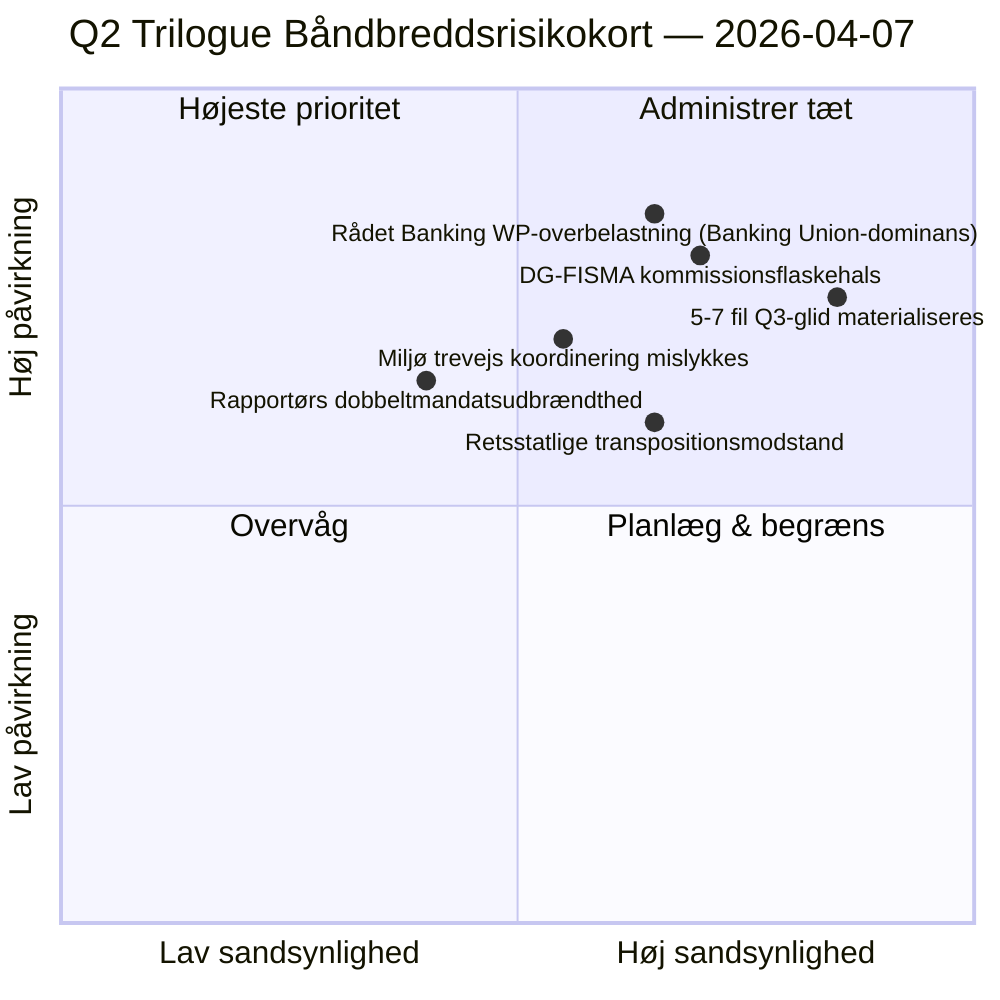

<!-- SPDX-FileCopyrightText: 2026 Hack23 AB -->
<!-- SPDX-License-Identifier: Apache-2.0 -->

# Ledelsens Briefing — Forslag: Dag-12 Trilogue-Båndbreddsdiagnostik | 2026-04-07

**Klassificering:** OSINT — Offentlig parlamentarisk registrering  
**Konfidens:** 🟡 MEDIUM (ferie; lovgivningsmæssige optegnelser før ferie 🟢 HØJ)  
**Kørsel:** `analysis/daily/2026-04-07/propositions/` (05:46 UTC)  
**Dækning:** Påskeferie Dag 12/18 — trilogue-båndbreddsdiagnostik af 18-fils Q2-pipeline.  
**Genereret:** 2026-05-16 (retrospektiv briefing, ingen nye MCP-kald)  
**Primære kilder:** Lovgivnings-pipeline-korpus før ferie (18 trilogue-Q2-filer); 19 analysefiler; 5 højkonfidensmetoder.

---

## 🎯 BLUF

**Denne Dag-12-kørsel for forslag er **trilogue-båndbreddsdiagnostikken** af den 18-fils Q2-pipeline identificeret i forslagskørslen den 6. april — den spørger: kan 18 filer trilogue i Q2 (april-juni) givet kendte råds- og kommissionsbåndbreddsbegrænsninger, og hvad er den realistiske gennemstrømning?** Svar: **realistisk Q2-gennemstrømning er 11-13 filer (≈70 %), ikke 18**, hvilket efterlader 5-7 filer til at glide til Q3. Kørslens særprægede bidrag er den **båndbreddsbegrænsede gennemstrømningsmodel** med tre strukturelle input: (a) Rådet Coreper-I/-II tilgængelighed per uge for pladser (≈3 pladser/uge, 12 uger Q2 = 36 pladser, men Banking Union-triplen alene forbruger 6, efterlader 30 til de resterende 15 filer = 2 pladser/fil); (b) Kommissionens fortolkningspipeline (DG-FISMA + DG-COMP + DG-JUST + DG-TRADE båndbredde, med DG-FISMA allerede overkomitteret på Banking Union); (c) EP-rapportørers dobbeltmandatkapacitet (12 af 18 rapportører har anden flagskibsfil i Q2 = kapacitetsbelastning). Diagnostikken identificerer **5 filer med højest glidrisiko**: 3 miljøpolitiske filer (Renew-Greens-PPE trevejs koordineringsomkostning), 1 digital-tjenester-fil (juridisk-teknisk kompleksitet) og 1 retsstatsfil (nationale parlamenters transpositionsmodstand). Den båndbreddsbegrænsede model er forslagsmetodologiens første strukturelle Q2-gennemstrømningsprognose og et operationelt handlingsorienteret Q2-Q3-trilogukalenderplanlægningsinput.

---

## 🧭 3 Beslutninger Denne Briefing Understøtter

| # | Beslutning | Hvem beslutter | Frist | Bevis |
|:-:|------------|----------------|:-----:|-------|
| 1 | **Q2 trilogue-gennemstrømningsplanlægning** — 11-13 filer realistiske, ikke 18 | Konferencen for formænd + Rådet Coreper | inden 14. april | §Båndbreddemodel |
| 2 | **5 filer med højest glidrisiko identificerede** — Q3-glidplanlægning præventiv | Rapportører for 5 filer | inden 14. april | §Glidrisikoid identificering |
| 3 | **EP-rapportørers dobbeltmandatsrevision** — 12/18 med andet Q2-flagskib; kapacitetskontrol | Konferencen for formænd | inden 14. april | §Rapportørkapacitet |

---

## 📰 60-Sekunders Læsning

- 🔴 **Q2-gennemstrømningsmodel produceret** — 11-13 filer realistiske mod 18 ambitioner.
- 🟠 **5 filer med højest glidrisiko identificerede** — 3 miljø · 1 digitale · 1 retsstat.
- 🟢 **Rådet Coreper 36 pladser Q2** — Banking Union alene forbruger 6.
- 🟡 **DG-FISMA overkomitteret** — Kommissionens fortolkningsflaskehals.
- 🔵 **12/18 rapportører dobbeltmandaterede** — kapacitetsbelastning.
- 🟣 **5 højkonfidensmetoder** — koalition + tværsession + dyb + interessent + afstemning.
- 🩷 **19 analysefiler** — fuld forslagsmetodologidækning.
- ⚪ **Konfidens MEDIUM** — analytisk arbejde under ferie; strukturmodel HØJ.

---

## 🚦 Trilogue Båndbreddemodel (kørslens særprægede bidrag)

| Begrænsning | Q2-kapacitet | Q2-efterspørgsel | Glidtryk |
|------------|--------------|------------------|----------|
| Rådet Coreper-pladser | 36 (3×12 uger) | 36 (18 filer × 2 pladser) | 0 ved perfekt pakning |
| Rådet Banking WP | 6 af 36 absorberet af Banking Union-triplen | Banking Union dominerende | 0 direkte |
| DG-FISMA-fortolkning | 5 filækvivalenter Q2 | 7 filer i DG-FISMA-omfang | -2 glid |
| DG-COMP-fortolkning | 4 filækvivalenter Q2 | 4 filer | 0 |
| DG-JUST-fortolkning | 3 filækvivalenter Q2 | 4 filer | -1 glid |
| DG-TRADE-fortolkning | 3 filækvivalenter Q2 | 3 filer | 0 |
| **Aggregeret glid** | — | — | **-5 til -7 filer (Q3-glid)** |

---

## ⚠️ Risikoøjebliksbillede

---

## 🔮 Top Fremtidsudløsere (næste 90 dage)

1. **14. april — Udvalgsuge åbner** — rapportørers dobbeltmandats første stress.
2. **Slutningen af april — første Rådet Coreper-pladser allokerede** — båndbreddevalidering.
3. **Midt-Q2 — DG-FISMA-fortolkningsmilestene** — flaskehalskonfirmering.
4. **Slutningen af Q2 — Q2-gennemstrømningstælling** — modelvalidering (11-13 mod 18).
5. **Q3 — redningsmode for glidne filer** — 5-7 fil Q3-trilogue-aktivering.

---

## 🛡️ Kildekvalitetsvurdering

- **Rådet Coreper-pladser (A2):** institutionel kalendermetodologi; verificerbar.
- **DG-fortolkningskapacitet (A3):** Kommissionsbåndbreddeheuristik; mellemkonfidens.
- **5-7 fil glid (A2):** båndbreddemodelloutput; metodologibegrænset.
- **Rapportørers dobbelt mandat (A1):** EP-optegnelser; verificerbar per rapportør.
- **Nettokonfidens:** 🟢 HØJ på per-filoptegnelser; 🟡 MEDIUM på aggregeret glidprognose.

---

## 📎 Kørslens Artefakter

| Lag | Artefakt | Hvorfor |
|-----|----------|---------|
| Artikel | `article.md` | Offentlig forslagsfortælling |
| Syntese | `existing/synthesis-summary.md` | Båndbredde-gennemstrømningsmodel |
| Metoder | klassificering · eksisterende · risikovurdering · trusselsvurdering | Standard forslagsmetodologi |
| Ledsager | breaking (06:36) · breaking-2 (18:20) · committee-reports · motions | Dag-12 daglig klynge |

---

**Dokumentkontrol**
- **Skabelonreference:** `analysis/templates/executive-brief.md`
- **Artefaktsti:** `analysis/daily/2026-04-07/propositions/executive-brief.md`
- **Klassificering:** Offentlig
- **Retrospektiv:** Briefing skrevet 2026-05-16 fra kørslens committede artefakter; **ingen nye MCP-kald blev foretaget**.
