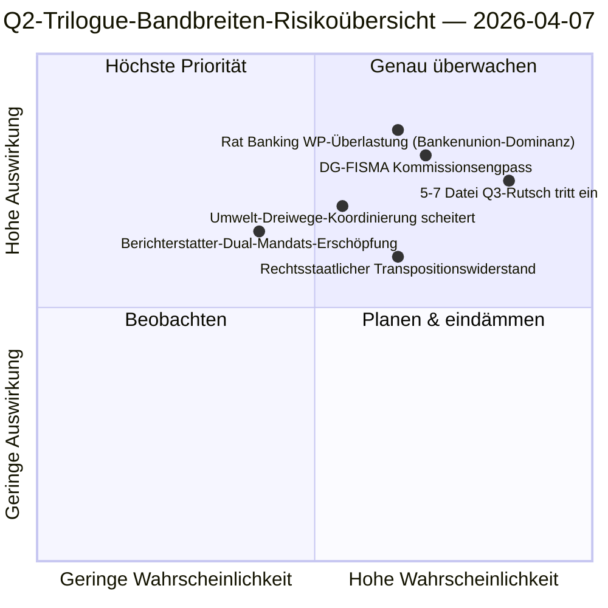

<!-- SPDX-FileCopyrightText: 2026 Hack23 AB -->
<!-- SPDX-License-Identifier: Apache-2.0 -->

# Führungsbriefing — Vorschläge: Tag-12 Trilogue-Bandbreitendiagnostik | 2026-04-07

**Klassifizierung:** OSINT — Öffentlicher parlamentarischer Datensatz  
**Konfidenzniveau:** 🟡 MEDIUM (Ferienpause; Gesetzgebungsunterlagen vor der Pause 🟢 HOCH)  
**Durchlauf:** `analysis/daily/2026-04-07/propositions/` (05:46 UTC)  
**Abdeckung:** Osterferien Tag 12/18 — Trilogue-Bandbreitendiagnostik der 18-Datei-Q2-Pipeline.  
**Erstellt:** 2026-05-16 (retrospektiver Bericht, keine neuen MCP-Aufrufe)  
**Primäre Quellen:** Gesetzgebungs-Pipeline-Korpus vor der Pause (18 Trilogue-Q2-Dateien); 19 Analysedateien; 5 hochkonfidenz-Methoden.

---

## 🎯 BLUF

**Dieser Tag-12-Durchlauf für Vorschläge ist die **Trilogue-Bandbreitendiagnostik** der 18-Datei-Q2-Pipeline aus dem Vorschlagsdurchlauf vom 6. April — er fragt: Können 18 Dateien in Q2 (April-Juni) Trilogue-Verfahren durchlaufen angesichts bekannter Bandbreitenbeschränkungen des Rates und der Kommission, und was ist der realistische Durchsatz?** Antwort: **Der realistische Q2-Durchsatz beträgt 11-13 Dateien (≈70 %), nicht 18**, was 5-7 Dateien in Q3 rutschen lässt. Der auszeichnende Beitrag des Durchlaufs ist das **bandbreitenbeschränkte Durchsatzmodell** mit drei strukturellen Eingaben: (a) Verfügbarkeit von Slots des Rates Coreper-I/-II pro Woche (≈3 Slots/Woche, 12 Wochen Q2 = 36 Slots, aber das Banking-Union-Trio allein verbraucht 6, was 30 für die verbleibenden 15 Dateien lässt = 2 Slots/Datei); (b) Interpretationspipeline der Kommission (DG-FISMA + DG-COMP + DG-JUST + DG-TRADE Bandbreite, wobei DG-FISMA bereits bei der Bankenunion überbeansprucht ist); (c) Dual-Mandats-Kapazität der EP-Berichterstatter (12 von 18 Berichterstattern haben zweite Flaggschiff-Dateien in Q2 = Kapazitätsbelastung). Die Diagnostik identifiziert **5 höchst-Rutschrisiko-Dateien**: 3 umweltpolitische Dateien (Renew-Greens-PPE Dreiwege-Koordinierungskosten), 1 Digitaldienstleistungs-Datei (juristisch-technische Komplexität) und 1 Rechtsstaats-Datei (nationale Parlamente Transpositionswiderstand). Das bandbreitenbeschränkte Modell ist die erste strukturelle Q2-Durchsatzprognose der Vorschlagsmethodik und ein operativ handlungsorientierter Q2-Q3-Trilogue-Kalenderplanungs-Input.

---

## 🧭 3 Entscheidungen Die Dieses Briefing Unterstützt

| # | Entscheidung | Wer entscheidet | Frist | Beweise |
|:-:|--------------|-----------------|:-----:|---------|
| 1 | **Q2-Trilogue-Durchsatzplanung** — 11-13 Dateien realistisch, nicht 18 | Konferenz der Präsidenten + Rat Coreper | bis 14. April | §Bandbreitenmodell |
| 2 | **5 höchst-Rutschrisiko-Dateien identifiziert** — Q3-Rutschplanung präventiv | Berichterstatter der 5 Dateien | bis 14. April | §Risikoidentifizierung |
| 3 | **EP-Berichterstatter-Dual-Mandats-Prüfung** — 12/18 mit zweitem Q2-Flaggschiff; Kapazitätsprüfung | Konferenz der Präsidenten | bis 14. April | §Berichterstatterkapazität |

---

## 📰 60-Sekunden-Lektüre

- 🔴 **Q2-Durchsatzmodell erstellt** — 11-13 Dateien realistisch gegenüber 18 Ambition.
- 🟠 **5 höchst-Rutschrisiko-Dateien identifiziert** — 3 Umwelt · 1 Digital · 1 Rechtsstaat.
- 🟢 **Rat Coreper 36 Slots Q2** — Bankenunion allein verbraucht 6.
- 🟡 **DG-FISMA überbeansprucht** — Interpretationsengpass der Kommission.
- 🔵 **12/18 Berichterstatter dual-mandatiert** — Kapazitätsbelastung.
- 🟣 **5 Hochkonfidenz-Methoden** — Koalition + Sitzungsübergreifend + Tiefe + Stakeholder + Abstimmung.
- 🩷 **19 Analysedateien** — vollständige Vorschlags-Methodik-Abdeckung.
- ⚪ **Konfidenzniveau MEDIUM** — Analytische Arbeit während der Pause; Strukturmodell HOCH.

---

## 🚦 Trilogue-Bandbreitenmodell (auszeichnender Beitrag des Durchlaufs)

| Einschränkung | Q2-Kapazität | Q2-Nachfrage | Rutschdruck |
|--------------|-------------|-------------|-------------|
| Rat-Coreper-Slots | 36 (3×12 Wochen) | 36 (18 Dateien × 2 Slots) | 0 bei perfekter Auslastung |
| Rat Banking WP | 6 von 36 absorbiert von Bankenunion-Trio | Bankenunion dominierend | 0 direkt |
| DG-FISMA-Interpretation | 5 Dateiäquivalente Q2 | 7 Dateien im DG-FISMA-Bereich | -2 Rutsch |
| DG-COMP-Interpretation | 4 Dateiäquivalente Q2 | 4 Dateien | 0 |
| DG-JUST-Interpretation | 3 Dateiäquivalente Q2 | 4 Dateien | -1 Rutsch |
| DG-TRADE-Interpretation | 3 Dateiäquivalente Q2 | 3 Dateien | 0 |
| **Aggregierter Rutsch** | — | — | **-5 bis -7 Dateien (Q3-Rutsch)** |

---

## ⚠️ Risikoüberblick

---

## 🔮 Top-Zukunftsauslöser (nächste 90 Tage)

1. **14. April — Ausschusswoche öffnet** — erster Stress der Berichterstatter-Dual-Mandate.
2. **Ende April — erste Rat-Coreper-Slots zugeteilt** — Bandbreitenvalidierung.
3. **Mitte Q2 — DG-FISMA-Interpretationsmeilensteine** — Engpassbestätigung.
4. **Ende Q2 — Q2-Durchsatzzählung** — Modellvalidierung (11-13 vs. 18).
5. **Q3 — Rettungsmodus für gerutschte Dateien** — 5-7 Datei Q3-Trilogue-Aktivierung.

---

## 🛡️ Quellenqualitätsbewertung

- **Rat-Coreper-Slots (A2):** institutionelle Kalendermethodik; verifizierbar.
- **DG-Interpretationskapazität (A3):** Kommissions-Bandbreiten-Heuristik; mittleres Konfidenz.
- **5-7 Datei Rutsch (A2):** Bandbreitenmodell-Output; methodologiebegrenzt.
- **Berichterstatter-Doppelmandat (A1):** EP-Unterlagen; je Berichterstatter verifizierbar.
- **Netto-Konfidenz:** 🟢 HOCH bei dateibasierten Unterlagen; 🟡 MEDIUM bei aggregierter Rutschprognose.

---

## 📎 Durchlaufsartefakte

| Schicht | Artefakt | Warum |
|---------|----------|-------|
| Artikel | `article.md` | Öffentliche Vorschlagserzählung |
| Synthese | `existing/synthesis-summary.md` | Bandbreite-Durchsatz-Modell |
| Methoden | Klassifizierung · Bestehend · Risikobewertung · Bedrohungsanalyse | Standard Vorschlagsmethodik |
| Begleitung | breaking (06:36) · breaking-2 (18:20) · committee-reports · motions | Tag-12 tägliches Cluster |

---

**Dokumentenkontrolle**
- **Vorlagereferenz:** `analysis/templates/executive-brief.md`
- **Artefaktpfad:** `analysis/daily/2026-04-07/propositions/executive-brief.md`
- **Klassifizierung:** Öffentlich
- **Retrospektiv:** Briefing erstellt am 2026-05-16 aus den committeten Artefakten des Durchlaufs; **keine neuen MCP-Aufrufe wurden durchgeführt**.
