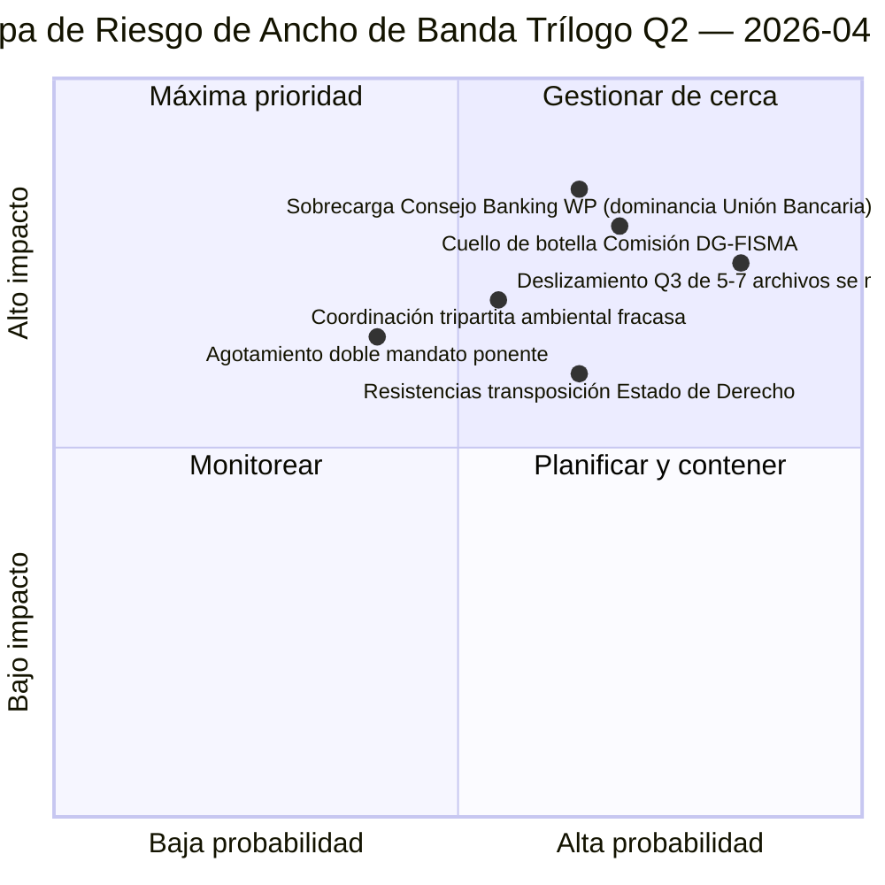

<!-- SPDX-FileCopyrightText: 2026 Hack23 AB -->
<!-- SPDX-License-Identifier: Apache-2.0 -->

# Resumen Ejecutivo — Propuestas: Día-12 Diagnóstico de Ancho de Banda del Trílogo | 2026-04-07

**Clasificación:** OSINT — Registro parlamentario público  
**Confianza:** 🟡 MEDIUM (receso; registros legislativos antes del receso 🟢 ALTA)  
**Ejecución:** `analysis/daily/2026-04-07/propositions/` (05:46 UTC)  
**Cobertura:** Receso de Semana Santa Día 12/18 — diagnóstico de ancho de banda del trílogo en el pipeline Q2 de 18 archivos.  
**Generado:** 2026-05-16 (resumen retrospectivo, sin nuevas llamadas MCP)  
**Fuentes primarias:** Corpus del pipeline legislativo antes del receso (18 archivos trílogo-Q2); 19 archivos de análisis; 5 métodos de alta confianza.

---

## 🎯 BLUF

**Esta ejecución del Día-12 para propuestas es el **diagnóstico de ancho de banda del trílogo** del pipeline Q2 de 18 archivos identificado en la ejecución de propuestas del 6 de abril — pregunta: ¿pueden 18 archivos completar el trílogo en Q2 (abril-junio) dados los conocidos límites de ancho de banda del Consejo y la Comisión, y cuál es el rendimiento realista?** Respuesta: **el rendimiento Q2 realista es de 11-13 archivos (≈70 %), no 18**, dejando 5-7 archivos para deslizarse a Q3. La contribución distintiva de la ejecución es el **modelo de rendimiento restringido por ancho de banda** con tres entradas estructurales: (a) disponibilidad de ranuras semanales del Consejo Coreper-I/-II (≈3 ranuras/semana, 12 semanas Q2 = 36 ranuras, pero el trío Unión Bancaria solo consume 6, dejando 30 para los 15 archivos restantes = 2 ranuras/archivo); (b) pipeline de interpretación de la Comisión (ancho de banda DG-FISMA + DG-COMP + DG-JUST + DG-TRADE, con DG-FISMA ya sobrecomprometida en la Unión Bancaria); (c) capacidad de doble mandato de los ponentes del PE (12 de 18 ponentes tienen segundos archivos insignia en Q2 = tensión de capacidad). El diagnóstico identifica **5 archivos con mayor riesgo de deslizamiento**: 3 archivos de política ambiental (costo de coordinación tripartita Renew-Greens-PPE), 1 archivo de servicios digitales (complejidad jurídico-técnica) y 1 archivo de Estado de Derecho (resistencias a la transposición de parlamentos nacionales). El modelo restringido por ancho de banda es la primera previsión estructural de rendimiento Q2 de la metodología de propuestas y una contribución operativamente accionable para la planificación del calendario de trílogo Q2-Q3.

---

## 🧭 3 Decisiones Que Este Resumen Apoya

| # | Decisión | Quién decide | Plazo | Evidencia |
|:-:|----------|--------------|:-----:|-----------|
| 1 | **Planificación del rendimiento del trílogo Q2** — 11-13 archivos realistas, no 18 | Conferencia de Presidentes + Consejo Coreper | antes del 14 de abril | §Modelo de ancho de banda |
| 2 | **5 archivos con mayor riesgo de deslizamiento identificados** — planificación preventiva del deslizamiento Q3 | Ponentes de los 5 archivos | antes del 14 de abril | §Identificación del riesgo de deslizamiento |
| 3 | **Auditoría del doble mandato de ponentes del PE** — 12/18 con segundo insignia Q2; verificación de capacidad | Conferencia de Presidentes | antes del 14 de abril | §Capacidad de ponentes |

---

## 📰 Lectura de 60 Segundos

- 🔴 **Modelo de rendimiento Q2 producido** — 11-13 archivos realistas frente a 18 de ambición.
- 🟠 **5 archivos con mayor riesgo de deslizamiento identificados** — 3 medioambiente · 1 digitales · 1 Estado de Derecho.
- 🟢 **Consejo Coreper 36 ranuras Q2** — la Unión Bancaria sola consume 6.
- 🟡 **DG-FISMA sobrecomprometida** — cuello de botella de interpretación de la Comisión.
- 🔵 **12/18 ponentes con doble mandato** — tensión de capacidad.
- 🟣 **5 métodos de alta confianza** — coalición + intersesión + profundo + partes interesadas + votación.
- 🩷 **19 archivos de análisis** — cobertura completa de la metodología de propuestas.
- ⚪ **Confianza MEDIUM** — trabajo analítico durante el receso; modelo estructural ALTA.

---

## 🚦 Modelo de Ancho de Banda del Trílogo (contribución distintiva de la ejecución)

| Restricción | Capacidad Q2 | Demanda Q2 | Presión de deslizamiento |
|------------|-------------|-----------|--------------------------|
| Ranuras Consejo Coreper | 36 (3×12 semanas) | 36 (18 archivos × 2 ranuras) | 0 con empaquetado perfecto |
| Consejo Banking WP | 6 de 36 absorbidas por el trío Unión Bancaria | Unión Bancaria dominante | 0 directamente |
| Interpretación DG-FISMA | 5 equivalentes-archivo Q2 | 7 archivos en ámbito DG-FISMA | -2 deslizamientos |
| Interpretación DG-COMP | 4 equivalentes-archivo Q2 | 4 archivos | 0 |
| Interpretación DG-JUST | 3 equivalentes-archivo Q2 | 4 archivos | -1 deslizamiento |
| Interpretación DG-TRADE | 3 equivalentes-archivo Q2 | 3 archivos | 0 |
| **Deslizamiento agregado** | — | — | **-5 a -7 archivos (deslizamiento Q3)** |

---

## ⚠️ Instantánea de Riesgos

---

## 🔮 Principales Desencadenantes Futuros (próximos 90 días)

1. **14 de abril — Semana de comisiones se abre** — primer estrés de los dobles mandatos de ponentes.
2. **Finales de abril — primeras ranuras Coreper del Consejo asignadas** — validación de ancho de banda.
3. **Mediados de Q2 — hitos de interpretación DG-FISMA** — confirmación del cuello de botella.
4. **Finales de Q2 — recuento de rendimiento Q2** — validación del modelo (11-13 frente a 18).
5. **Q3 — modo rescate para archivos deslizados** — activación del trílogo Q3 de 5-7 archivos.

---

## 🛡️ Evaluación de la Calidad de las Fuentes

- **Ranuras Consejo Coreper (A2):** metodología del calendario institucional; verificable.
- **Capacidad de interpretación DG (A3):** heurística de ancho de banda de la Comisión; confianza media.
- **Deslizamiento de 5-7 archivos (A2):** salida del modelo de ancho de banda; limitado por metodología.
- **Doble mandato de ponente (A1):** registros del PE; verificable por ponente.
- **Confianza neta:** 🟢 ALTA en registros por archivo; 🟡 MEDIUM en previsión agregada de deslizamiento.

---

## 📎 Artefactos de la Ejecución

| Capa | Artefacto | Por qué |
|------|-----------|---------|
| Artículo | `article.md` | Narrativa pública de propuestas |
| Síntesis | `existing/synthesis-summary.md` | Modelo de rendimiento de ancho de banda |
| Métodos | clasificación · existente · puntuación de riesgos · evaluación de amenazas | Metodología estándar de propuestas |
| Acompañante | breaking (06:36) · breaking-2 (18:20) · committee-reports · motions | Clúster diario Día-12 |

---

**Control documental**
- **Referencia de plantilla:** `analysis/templates/executive-brief.md`
- **Ruta del artefacto:** `analysis/daily/2026-04-07/propositions/executive-brief.md`
- **Clasificación:** Público
- **Retrospectivo:** Resumen redactado el 2026-05-16 a partir de los artefactos comprometidos de la ejecución; **no se realizaron nuevas llamadas MCP**.
