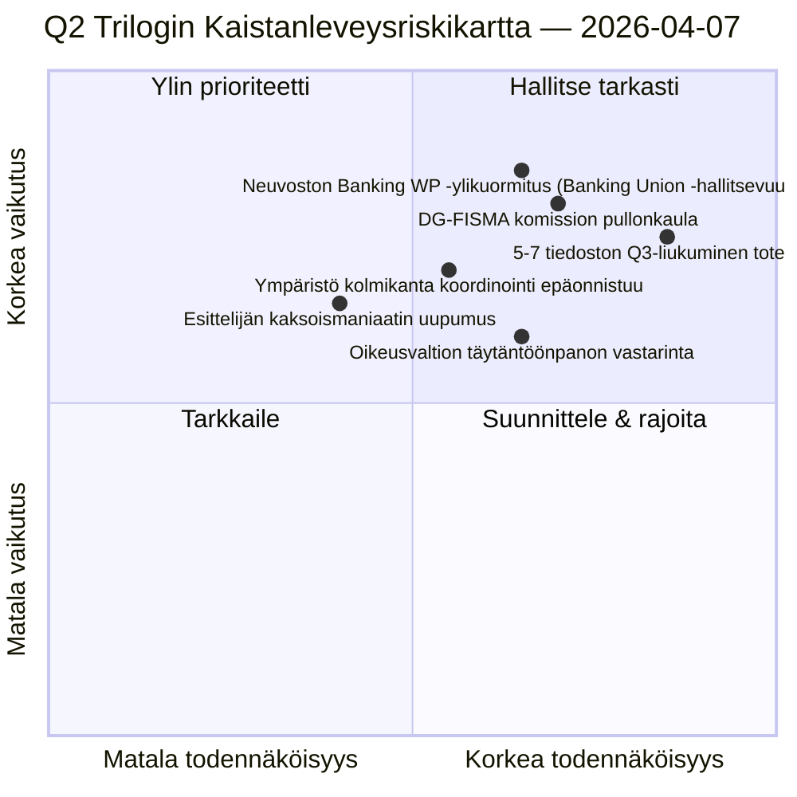

<!-- SPDX-FileCopyrightText: 2026 Hack23 AB -->
<!-- SPDX-License-Identifier: Apache-2.0 -->

# Johtoryhmän Tietokooste — Ehdotukset: Päivä-12 Trilogin Kaistanleveysdiagnostiikka | 2026-04-07

**Luokitus:** OSINT — Julkinen parlamentaarinen asiakirja  
**Luottamus:** 🟡 MEDIUM (loma; ennen lomaa tehdyt lainsäädäntöasiakirjat 🟢 KORKEA)  
**Ajo:** `analysis/daily/2026-04-07/propositions/` (05:46 UTC)  
**Kattavuus:** Pääsiäisloma Päivä 12/18 — trilogin kaistanleveysdiagnostiikka 18 tiedoston Q2-putkilinjasta.  
**Luotu:** 2026-05-16 (retrospektiivinen kooste, ei uusia MCP-kutsuja)  
**Ensisijaiset lähteet:** Ennen lomaa tehty lainsäädäntöputkilinjan korpus (18 trilogi-Q2-tiedostoa); 19 analyysitiedostoa; 5 korkean luottamuksen menetelmää.

---

## 🎯 BLUF

**Tämä ehdotusten Päivä-12-ajo on 6. huhtikuun ehdotusajossa tunnistetun **trilogin kaistanleveysdiagnostiikka** 18 tiedoston Q2-putkilinjasta — se kysyy: voivatko 18 tiedostoa käydä trilogin Q2:ssa (huhtikuu-kesäkuu) ottaen huomioon tunnetut neuvoston ja komission kaistanleveysrajoitukset, ja mikä on realistinen läpimenoaste?** Vastaus: **realistinen Q2-läpimenoaste on 11-13 tiedostoa (≈70 %), ei 18**, jättäen 5-7 tiedostoa liukumaan Q3:een. Ajon erottuva panos on **kaistanleveysrajoitettu läpimenonosmalli** kolmella rakenteellisella syötteellä: (a) Neuvoston Coreper-I/-II viikkokohtainen paikkojen saatavuus (≈3 paikkaa/viikko, 12 viikkoa Q2 = 36 paikkaa, mutta Banking Union -kolmikko yksinään kuluttaa 6, jättäen 30 loppujen 15 tiedoston käyttöön = 2 paikkaa/tiedosto); (b) Komission tulkintaputkilinja (DG-FISMA + DG-COMP + DG-JUST + DG-TRADE kaistanleveys, DG-FISMA jo ylikuormittuneena Banking Unionissa); (c) EP-esittelijöiden kaksoismaniaattikapasiteetti (12/18 esittelijällä on toinen lippulaivatiedosto Q2:ssa = kapasiteettipaine). Diagnostiikka tunnistaa **5 korkeimman liukumisriskin tiedostoa**: 3 ympäristöpoliittista tiedostoa (Renew-Greens-PPE kolmikannan koordinointikustannus), 1 digitaalisten palvelujen tiedosto (oikeudellinen-tekninen monimutkaisuus) ja 1 oikeusvaltiota koskeva tiedosto (kansallisten parlamenttien täytäntöönpanon vastarinta). Kaistanleveysrajoitettu malli on ehdotusten metodologian ensimmäinen rakenteellinen Q2-läpimenoennuste ja operatiivisesti toimintakelpoinen Q2-Q3-trilogikaaviosuunnittelusyöte.

---

## 🧭 3 Päätöstä Joita Tämä Kooste Tukee

| # | Päätös | Kuka päättää | Määräaika | Näyttö |
|:-:|--------|--------------|:---------:|--------|
| 1 | **Q2 trilogin läpimenosuunnittelu** — 11-13 tiedostoa realistista, ei 18 | Puheenjohtajien konferenssi + Neuvoston Coreper | 14. huhtikuuta mennessä | §Kaistanleveysnosmalli |
| 2 | **5 korkeimman liukumisriskin tiedostoa tunnistettu** — Q3-liukumissuunnittelu ennakolta | 5 tiedoston esittelijät | 14. huhtikuuta mennessä | §Liukumisriskin tunnistus |
| 3 | **EP-esittelijöiden kaksoismaandaatin auditointi** — 12/18:lla toinen Q2-lippulaiva; kapasiteettitarkistus | Puheenjohtajien konferenssi | 14. huhtikuuta mennessä | §Esittelijäkapasiteetti |

---

## 📰 60-Sekunnin Lukeminen

- 🔴 **Q2-läpimenonosmalli tuotettu** — 11-13 tiedostoa realistista vs. 18 tavoitteessa.
- 🟠 **5 korkeimman liukumisriskin tiedostoa tunnistettu** — 3 ympäristö · 1 digitaaliset · 1 oikeusvaltio.
- 🟢 **Neuvoston Coreper 36 paikkaa Q2** — Banking Union yksin kuluttaa 6.
- 🟡 **DG-FISMA ylikuormittunut** — Komission tulkintapullonkaula.
- 🔵 **12/18 esittelijää kaksoismaniaateilla** — kapasiteettipaine.
- 🟣 **5 korkean luottamuksen menetelmää** — koalitio + ristisessio + syvä + sidosryhmä + äänestys.
- 🩷 **19 analyysitiedostoa** — täysi ehdotusmenetelmäkattavuus.
- ⚪ **Luottamus MEDIUM** — analyyttinen työ loman aikana; rakennemalli KORKEA.

---

## 🚦 Trilogin Kaistanleveysnosmalli (ajon erottuva panos)

| Rajoitus | Q2-kapasiteetti | Q2-kysyntä | Liukumispaine |
|---------|----------------|------------|---------------|
| Neuvoston Coreper-paikat | 36 (3×12 viikkoa) | 36 (18 tiedostoa × 2 paikkaa) | 0 täydellisellä pakkauksella |
| Neuvoston Banking WP | 6/36 absorboitu Banking Union -kolmikolla | Banking Union hallitseva | 0 suoraan |
| DG-FISMA-tulkinta | 5 tiedostoekvivalenttia Q2 | 7 tiedostoa DG-FISMA-laajuudessa | -2 liukuminen |
| DG-COMP-tulkinta | 4 tiedostoekvivalenttia Q2 | 4 tiedostoa | 0 |
| DG-JUST-tulkinta | 3 tiedostoekvivalenttia Q2 | 4 tiedostoa | -1 liukuminen |
| DG-TRADE-tulkinta | 3 tiedostoekvivalenttia Q2 | 3 tiedostoa | 0 |
| **Aggregoitu liukuminen** | — | — | **-5 - -7 tiedostoa (Q3-liukuminen)** |

---

## ⚠️ Riskitilannevedos

---

## 🔮 Tärkeimmät Tulevaisuuden Laukaisimet (seuraavat 90 päivää)

1. **14. huhtikuuta — Valiokuntaviikko avautuu** — esittelijöiden kaksoismaniaatin ensimmäinen stressi.
2. **Huhtikuun loppu — ensimmäiset Neuvoston Coreper-paikat allokoidaan** — kaistanleveysvalidointi.
3. **Q2:n puoliväli — DG-FISMA-tulkintavirstanpylväät** — pullonkaulavahvistus.
4. **Q2:n loppu — Q2-läpimeno laskenta** — mallin validointi (11-13 vs. 18).
5. **Q3 — liukuvien tiedostojen pelastustila** — 5-7 tiedoston Q3-trilogi-aktivointi.

---

## 🛡️ Lähteen Laadun Arviointi

- **Neuvoston Coreper-paikat (A2):** institutionaalinen kalenterimenetelmä; tarkistettavissa.
- **DG-tulkintakapasiteetti (A3):** Komission kaistanleveysenheuristiikka; keskitason luottamus.
- **5-7 tiedoston liukuminen (A2):** kaistanleveysmallin tuotos; menetelmärajoitettu.
- **Esittelijöiden kaksoismaniaatti (A1):** EP-asiakirjat; tarkistettavissa esittelijäkohtaisesti.
- **Nettokonfidenss:** 🟢 KORKEA tiedostokohtaisissa asiakirjoissa; 🟡 MEDIUM aggregoidussa liukumisennusteessa.

---

## 📎 Ajon Artefaktit

| Kerros | Artefakti | Miksi |
|--------|-----------|-------|
| Artikkeli | `article.md` | Julkinen ehdostuskertomus |
| Synteesi | `existing/synthesis-summary.md` | Kaistanleveyden läpimenonosmalli |
| Menetelmät | luokittelu · olemassa oleva · riskipisteytys · uhka-arviointi | Standardi ehdotusmenetelmä |
| Kumppani | breaking (06:36) · breaking-2 (18:20) · committee-reports · motions | Päivä-12 päivittäinen klusteri |

---

**Asiakirjanhallinta**
- **Malliviite:** `analysis/templates/executive-brief.md`
- **Artefaktipolku:** `analysis/daily/2026-04-07/propositions/executive-brief.md`
- **Luokitus:** Julkinen
- **Retrospektiivinen:** Kooste kirjoitettu 2026-05-16 ajon committedista artefakteista; **uusia MCP-kutsuja ei tehty**.
