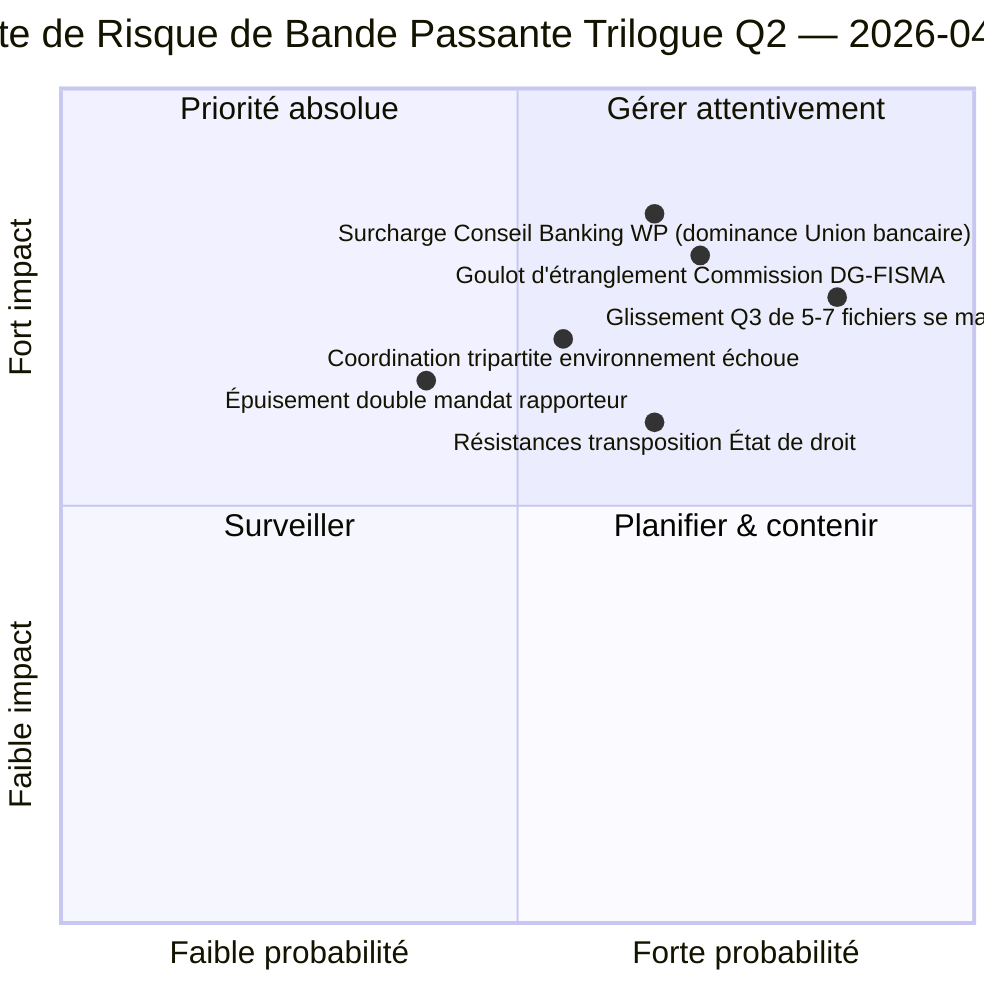

<!-- SPDX-FileCopyrightText: 2026 Hack23 AB -->
<!-- SPDX-License-Identifier: Apache-2.0 -->

# Note de Synthèse pour la Direction — Propositions : Jour-12 Diagnostic de Bande Passante Trilogue | 2026-04-07

**Classification :** OSINT — Dossier parlementaire public  
**Confiance :** 🟡 MEDIUM (période de vacances ; dossiers législatifs avant les vacances 🟢 ÉLEVÉ)  
**Exécution :** `analysis/daily/2026-04-07/propositions/` (05:46 UTC)  
**Couverture :** Vacances de Pâques Jour 12/18 — diagnostic de bande passante trilogue sur le pipeline Q2 de 18 fichiers.  
**Générée :** 2026-05-16 (note rétrospective, aucun nouvel appel MCP)  
**Sources primaires :** Corpus du pipeline législatif avant les vacances (18 fichiers trilogue-Q2) ; 19 fichiers d'analyse ; 5 méthodes à haute confiance.

---

## 🎯 BLUF

**Cette exécution de Jour-12 pour les propositions est le **diagnostic de bande passante trilogue** sur le pipeline Q2 de 18 fichiers identifié dans l'exécution des propositions du 6 avril — elle pose la question : 18 fichiers peuvent-ils faire l'objet d'un trilogue en Q2 (avril-juin) compte tenu des contraintes de bande passante connues du Conseil et de la Commission, et quel est le débit réaliste ?** Réponse : **le débit Q2 réaliste est de 11 à 13 fichiers (≈70 %), pas 18**, laissant 5 à 7 fichiers glisser vers Q3. La contribution distinctive de l'exécution est le **modèle de débit contraint par la bande passante** avec trois entrées structurelles : (a) disponibilité des créneaux hebdomadaires du Conseil Coreper-I/-II (≈3 créneaux/semaine, 12 semaines Q2 = 36 créneaux, mais le trio Union bancaire consomme à lui seul 6, laissant 30 pour les 15 fichiers restants = 2 créneaux/fichier) ; (b) pipeline d'interprétation de la Commission (bande passante DG-FISMA + DG-COMP + DG-JUST + DG-TRADE, DG-FISMA étant déjà sur-engagée sur l'Union bancaire) ; (c) capacité double-mandat des rapporteurs PE (12 des 18 rapporteurs ont des deuxièmes fichiers phares en Q2 = tension de capacité). Le diagnostic identifie **5 fichiers à risque de glissement le plus élevé** : 3 fichiers de politique environnementale (coût de coordination tripartite Renew-Greens-PPE), 1 fichier de services numériques (complexité juridico-technique) et 1 fichier d'État de droit (résistances à la transposition des parlements nationaux). Le modèle contraint par la bande passante constitue la première prévision structurelle de débit Q2 de la méthodologie des propositions et une contribution opérationnellement exploitable pour la planification du calendrier de trilogue Q2-Q3.

---

## 🧭 3 Décisions Que Cette Note Soutient

| # | Décision | Qui décide | Délai | Preuves |
|:-:|----------|------------|:-----:|---------|
| 1 | **Planification du débit trilogue Q2** — 11-13 fichiers réalistes, pas 18 | Conférence des présidents + Conseil Coreper | avant le 14 avril | §Modèle de bande passante |
| 2 | **5 fichiers à risque de glissement le plus élevé identifiés** — planification préventive du glissement Q3 | Rapporteurs des 5 fichiers | avant le 14 avril | §Identification des risques de glissement |
| 3 | **Audit du double mandat des rapporteurs PE** — 12/18 avec un deuxième phare Q2 ; vérification de capacité | Conférence des présidents | avant le 14 avril | §Capacité des rapporteurs |

---

## 📰 Lecture en 60 Secondes

- 🔴 **Modèle de débit Q2 produit** — 11-13 fichiers réalistes contre 18 ambitions.
- 🟠 **5 fichiers à risque de glissement le plus élevé identifiés** — 3 environnement · 1 numérique · 1 État de droit.
- 🟢 **Conseil Coreper 36 créneaux Q2** — l'Union bancaire seule consomme 6.
- 🟡 **DG-FISMA sur-engagée** — goulot d'étranglement d'interprétation de la Commission.
- 🔵 **12/18 rapporteurs à double mandat** — tension de capacité.
- 🟣 **5 méthodes à haute confiance** — coalition + intersession + approfondie + parties prenantes + vote.
- 🩷 **19 fichiers d'analyse** — couverture complète de la méthodologie des propositions.
- ⚪ **Confiance MEDIUM** — travail analytique pendant les vacances ; modèle structurel ÉLEVÉ.

---

## 🚦 Modèle de Bande Passante Trilogue (contribution distinctive de l'exécution)

| Contrainte | Capacité Q2 | Demande Q2 | Pression de glissement |
|-----------|------------|-----------|------------------------|
| Créneaux Conseil Coreper | 36 (3×12 semaines) | 36 (18 fichiers × 2 créneaux) | 0 en cas de packaging parfait |
| Conseil Banking WP | 6 des 36 absorbés par le trio Union bancaire | Union bancaire dominante | 0 directement |
| Interprétation DG-FISMA | 5 équivalents-fichier Q2 | 7 fichiers dans le périmètre DG-FISMA | -2 glissements |
| Interprétation DG-COMP | 4 équivalents-fichier Q2 | 4 fichiers | 0 |
| Interprétation DG-JUST | 3 équivalents-fichier Q2 | 4 fichiers | -1 glissement |
| Interprétation DG-TRADE | 3 équivalents-fichier Q2 | 3 fichiers | 0 |
| **Glissement agrégé** | — | — | **-5 à -7 fichiers (glissement Q3)** |

---

## ⚠️ Instantané des Risques

---

## 🔮 Principaux Déclencheurs Futurs (90 prochains jours)

1. **14 avril — La semaine des commissions s'ouvre** — premier stress des doubles mandats des rapporteurs.
2. **Fin avril — premiers créneaux Coreper du Conseil alloués** — validation de bande passante.
3. **Milieu Q2 — jalons d'interprétation DG-FISMA** — confirmation du goulot d'étranglement.
4. **Fin Q2 — décompte du débit Q2** — validation du modèle (11-13 contre 18).
5. **Q3 — mode sauvetage pour fichiers glissés** — activation du trilogue Q3 pour 5-7 fichiers.

---

## 🛡️ Évaluation de la Qualité des Sources

- **Créneaux Conseil Coreper (A2) :** méthodologie du calendrier institutionnel ; vérifiable.
- **Capacité d'interprétation DG (A3) :** heuristique de bande passante de la Commission ; confiance moyenne.
- **Glissement de 5-7 fichiers (A2) :** sortie du modèle de bande passante ; limité par la méthodologie.
- **Double mandat rapporteur (A1) :** dossiers PE ; vérifiable par rapporteur.
- **Confiance nette :** 🟢 ÉLEVÉE sur les dossiers par fichier ; 🟡 MEDIUM sur la prévision agrégée de glissement.

---

## 📎 Artefacts de l'Exécution

| Couche | Artefact | Pourquoi |
|--------|----------|----------|
| Article | `article.md` | Récit public des propositions |
| Synthèse | `existing/synthesis-summary.md` | Modèle de débit de bande passante |
| Méthodes | classification · existant · scoring des risques · évaluation des menaces | Méthodologie standard des propositions |
| Accompagnement | breaking (06:36) · breaking-2 (18:20) · committee-reports · motions | Grappe quotidienne Jour-12 |

---

**Contrôle documentaire**
- **Référence modèle :** `analysis/templates/executive-brief.md`
- **Chemin de l'artefact :** `analysis/daily/2026-04-07/propositions/executive-brief.md`
- **Classification :** Public
- **Rétrospectif :** Note rédigée le 2026-05-16 à partir des artefacts commités de l'exécution ; **aucun nouvel appel MCP n'a été effectué**.
